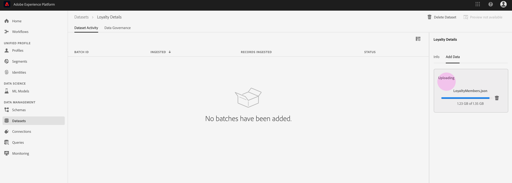

# Ingestar datos en Adobe Experience Platform

Adobe Experience Platform le permite importar fácilmente datos en Platform como archivos por lotes. Algunos ejemplos de datos que se van a ingerir pueden incluir datos de perfil de un archivo plano en un sistema CRM (como un archivo parquet) o datos que se ajustan a un esquema conocido del Modelo de datos de experiencia (XDM) en el Registro de Esquemas.

## Primeros pasos

Para completar este tutorial, debe tener acceso a la plataforma de experiencias. Si no tiene acceso a una organización de IMS en la plataforma de experiencia, póngase en contacto con el administrador del sistema antes de continuar.

Si prefiere ingerir datos mediante las API de inserción de datos, lea la guía [para desarrolladores de](../batch-ingestion/api-overview.md)Ingesta de datos.

## Espacio de trabajo de conjuntos de datos

El espacio de trabajo Conjuntos de datos de la plataforma de experiencia le permite realizar vistas y administrar todos los conjuntos de datos que ha realizado su organización de IMS, así como crear otros nuevos.

Haga clic en **Conjuntos** de datos en el panel de navegación izquierdo para Vista del espacio de trabajo Conjuntos de datos. El espacio de trabajo Conjuntos de datos contiene una lista de conjuntos de datos, que incluye columnas con _Nombre_, _Creado_ (fecha y hora), _Origen_, _Esquema_ y Estado ____ del último lote, así como la fecha y hora en que el conjunto de datos fue la Última actualización.

>[!NOTE] Haga clic en el icono de filtro situado junto a la barra de búsqueda para utilizar las funciones de filtrado con el fin de vista solo de los conjuntos de datos habilitados para el Perfil.

## Crear un conjunto de datos

Para crear un conjunto de datos, haga clic en **Crear conjunto** de datos en la esquina superior derecha del espacio de trabajo Conjunto de datos.

En la pantalla **Crear conjunto de datos** , seleccione si desea &quot;Crear conjunto de datos a partir de Esquema&quot; o &quot;Crear conjunto de datos a partir de archivo CSV&quot;.

Para este tutorial, se utilizará un esquema para crear el conjunto de datos. Haga clic en **Crear conjunto de datos desde Esquema** para continuar.

## Seleccionar esquema de conjunto de datos

En la pantalla **Seleccionar Esquema** , elija un esquema haciendo clic en el botón de opción situado junto al esquema que desee utilizar. Para este tutorial, el conjunto de datos se realizará mediante el esquema Miembros de lealtad. Usar la barra de búsqueda para filtrar esquemas es una manera útil de encontrar el esquema exacto que está buscando.

Una vez que haya seleccionado el botón de radio junto al esquema que desea utilizar, haga clic en **Siguiente**.

## Configurar conjunto de datos

En la pantalla **Configurar conjunto de datos** , se le pedirá que asigne un **nombre** al conjunto de datos y también puede proporcionar una **descripción** del conjunto de datos.

**Notas sobre los nombres de conjuntos de datos:**

- Los nombres de los conjuntos de datos deben ser cortos y descriptivos para que el conjunto de datos pueda encontrarse fácilmente en la biblioteca más adelante.
- Los nombres de los conjuntos de datos deben ser únicos, lo que significa que también deben ser lo suficientemente específicos como para que no se vuelvan a utilizar en el futuro.
- Se recomienda proporcionar información adicional sobre el conjunto de datos mediante el campo de descripción, ya que puede ayudar a otros usuarios a diferenciar entre conjuntos de datos en el futuro.

Una vez que el conjunto de datos tenga un nombre y una descripción, haga clic en **Finalizar**.

## actividad de conjunto de datos

Ahora se ha creado un conjunto de datos vacío y se le ha devuelto a la ficha Actividad **del** conjunto de datos en el espacio de trabajo Conjunto de datos. Debe ver el nombre del conjunto de datos en la esquina superior izquierda del espacio de trabajo, junto con una notificación de que &quot;No se han agregado lotes&quot;. Esto es de esperar, ya que todavía no ha agregado ningún lote a este conjunto de datos.

En la parte derecha del espacio de trabajo Conjunto de datos, verá la ficha **Información** que contiene información relacionada con el nuevo conjunto de datos, como ID _de_ conjunto de datos, _Nombre_, _Descripción_, Nombre _de_______ tabla,de datos, Streaming, OrigenDeDatos y OrigenFuente. La ficha Información también incluye información sobre cuándo se _creó_ el conjunto de datos y su fecha de _última modificación_ .

También en la ficha Información hay una opción de _Perfil_ que se utiliza para habilitar el conjunto de datos para su uso con el Perfil del cliente en tiempo real. El uso de esta opción y el Perfil del cliente en tiempo real se explicarán con más detalle en la sección siguiente.

## Habilitar conjunto de datos para el Perfil del cliente en tiempo real

Los conjuntos de datos se utilizan para la ingesta de datos en la plataforma de experiencia y, en última instancia, se utilizan para identificar a personas y unir información procedente de múltiples fuentes. Esa información unida se denomina Perfil del cliente en tiempo real. Para que Platform sepa qué información debe incluirse en el Perfil en tiempo real, los conjuntos de datos se pueden marcar para su inclusión mediante la opción de alternancia de **Perfil** .

De forma predeterminada, esta opción está desactivada. Si elige alternar en el Perfil, todos los datos ingestados en el conjunto de datos se utilizarán para identificar a un individuo y unir su Perfil en tiempo real.

Para obtener más información sobre el Perfil del cliente en tiempo real y el trabajo con identidades, consulte la documentación de [Identity Service](../../identity-service/home.md) .

Para habilitar el conjunto de datos para el Perfil del cliente en tiempo real, haga clic en el botón de alternancia de **Perfil** de la ficha **Información** .

Aparecerá un cuadro de diálogo en el que se le pedirá que confirme que desea habilitar el conjunto de datos para el Perfil del cliente en tiempo real.

Haga clic en **Habilitar** y la opción cambiará a azul, indicando que está activada.

## Añadir datos en un conjunto de datos

Los datos se pueden agregar a un conjunto de datos de diferentes maneras. Puede elegir entre usar las API de inserción de datos o un socio de ETL como Unifi o Informatica. En este tutorial, se agregarán datos al conjunto de datos mediante la ficha **Añadir datos** de la interfaz de usuario.

Para empezar a agregar datos al conjunto de datos, haga clic en la ficha **Añadir datos** . Ahora puede arrastrar y soltar archivos o buscar en el equipo los archivos que desee agregar.

>[!NOTE] La plataforma admite dos tipos de archivos para la ingestión de datos, el parqué o JSON. Puede agregar hasta cinco archivos a la vez, con un tamaño máximo de 10 GB para cada archivo.

## Cargar un archivo

Una vez que arrastre y suelte (o examine y seleccione) un archivo de parqué o JSON que desee cargar, Platform comenzará a procesar el archivo inmediatamente y aparecerá un cuadro de diálogo de **carga** en la ficha **Añadir datos** que muestra el progreso de la carga del archivo.

## Métricas de conjunto de datos

Una vez que el archivo haya terminado de cargarse, la ficha **Actividad** del conjunto de datos ya no muestra que &quot;No se han agregado lotes&quot;. En su lugar, la ficha Actividad de conjunto de datos ahora muestra las métricas de conjunto de datos. Todas las métricas mostrarán &quot;0&quot; en esta etapa, ya que el lote aún no se ha cargado.

En la parte inferior de la ficha hay una lista que muestra el ID _de_ lote de los datos que se acaban de ingerir mediante el proceso [&quot;Añadir datos en un conjunto de datos&quot;](#add-data-to-dataset) . También se incluye información relacionada con el lote, incluida la fecha de _ingesta_ , el número de _registros ingestados_ y el _estado_ del lote actual.

## Detalles de lote

Haga clic en el ID _de_ lote para vista de la información general **de un** lote, mostrando detalles adicionales sobre el lote. Una vez que el lote haya terminado de cargarse, la información sobre el lote se actualizará para mostrar el número de _registros ingestados_ y el tamaño _de archivo_. El _estado_ también cambiará a &quot;Éxito&quot; o &quot;Fallado&quot;. Si se produce un error en el lote, la sección Código _de_ error contendrá detalles sobre cualquier error durante la ingestión.

Para obtener más información y las preguntas más frecuentes sobre la ingestión de lotes, consulte la guía de solución de problemas de la ingestión de [lotes](../batch-ingestion/troubleshooting.md).

Para volver a la pantalla de Actividad **del** conjunto de datos, haga clic en el nombre del conjunto de datos (Detalles de _lealtad_) en la ruta de exploración.

## Conjunto de datos de Previsualización

Una vez que el conjunto de datos esté listo, aparecerá una opción para **Previsualización del conjunto** de datos en la parte superior de la ficha Actividad **del** conjunto de datos.

Haga clic en **Previsualización de conjunto de datos** para abrir un cuadro de diálogo que muestre datos de ejemplo desde dentro del conjunto de datos. Si el conjunto de datos se creó con un esquema, los detalles del esquema del conjunto de datos aparecerán en el lado izquierdo de la previsualización. Puede expandir el esquema con las flechas para ver la estructura del esquema. Cada encabezado de columna en los datos de previsualización representa un campo en el conjunto de datos.

## Pasos siguientes

Ahora que ha creado un conjunto de datos y ha ingerido datos correctamente en la plataforma de experiencia, puede repetir estos pasos para crear un nuevo conjunto de datos o para ingerir más datos en el conjunto de datos existente.

Para obtener más información sobre la ingestión por lotes, lea la información general [sobre la ingestión de](../batch-ingestion/overview.md)lotes.
