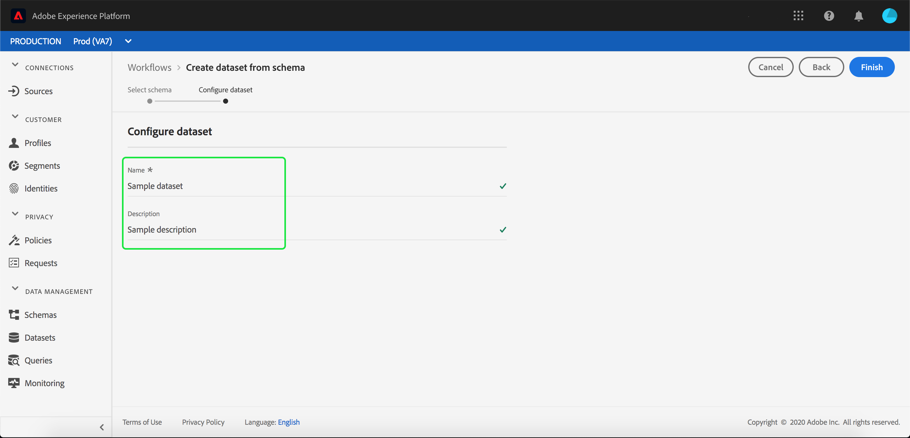

# Ingesta de datos en Adobe Experience Platform

Adobe Experience Platform le permite importar fácilmente datos en [!DNL Platform] como archivos por lotes. Algunos ejemplos de datos que se van a introducir pueden ser los datos de perfil de un archivo plano en un sistema CRM (como un archivo Parquet) o los datos que se ajustan a un [!DNL Experience Data Model] (XDM) en el Registro de esquemas.

## Primeros pasos

Para completar este tutorial, debe tener acceso a [!DNL Experience Platform]. Si no tiene acceso a una organización de IMS en [!DNL Experience Platform], póngase en contacto con el administrador del sistema antes de continuar.

Si prefiere ingerir datos mediante las API de ingesta de datos, comience por leer la [Guía para desarrolladores de ingesta de lotes](../batch-ingestion/api-overview.md).

## Espacio de trabajo de conjuntos de datos

El espacio de trabajo Conjuntos de datos dentro de [!DNL Experience Platform] le permite ver y administrar todos los conjuntos de datos que ha realizado su organización de IMS, así como crear otros nuevos.

Para ver el espacio de trabajo de conjuntos de datos, haga clic en **[!UICONTROL Conjuntos de datos]** en el panel de navegación izquierdo. El espacio de trabajo de conjuntos de datos contiene una lista de conjuntos de datos, que incluye columnas que muestran el nombre, la fecha y la hora creadas, el origen, el esquema y el estado del último lote, así como la fecha y la hora de la última actualización del conjunto de datos.

>[!NOTE]
>
>Haga clic en el icono de filtro situado junto a la barra de búsqueda para utilizar las funcionalidades de filtrado y ver solo los conjuntos de datos activados para [!DNL Profile].

## Crear un conjunto de datos

Para crear un conjunto de datos, haga clic en **[!UICONTROL Crear conjunto de datos]** en la esquina superior derecha del espacio de trabajo de conjuntos de datos .

En el **[!UICONTROL Crear conjunto de datos]** , seleccione si desea &quot;[!UICONTROL Crear conjunto de datos a partir del esquema]&quot; o &quot;[!UICONTROL Crear conjunto de datos a partir de un archivo CSV]&quot;.

Para este tutorial, se utilizará un esquema para crear el conjunto de datos. Haga clic en **[!UICONTROL Crear conjunto de datos a partir del esquema]** para continuar.

## Seleccionar esquema del conjunto de datos

En el **[!UICONTROL Seleccionar esquema]** , seleccione un esquema haciendo clic en el botón de opción situado junto al esquema que desea utilizar. Para este tutorial, el conjunto de datos se realiza con el esquema miembros de lealtad . Usar la barra de búsqueda para filtrar esquemas es una forma útil de encontrar el esquema exacto que está buscando.

Una vez que haya seleccionado el botón de opción situado junto al esquema que desea utilizar, haga clic en **[!UICONTROL Siguiente]**.

## Configurar el conjunto de datos

En el **[!UICONTROL Configurar conjunto de datos]** , se le pedirá que asigne un nombre al conjunto de datos y que proporcione también una descripción del conjunto de datos.

**Notas sobre los nombres de conjuntos de datos:**

- Los nombres de los conjuntos de datos deben ser cortos y descriptivos para que el conjunto de datos se pueda encontrar fácilmente en la biblioteca más adelante.
- Los nombres de los conjuntos de datos deben ser únicos, lo que significa que también deben ser lo suficientemente específicos como para que no se vuelvan a utilizar en el futuro.
- Se recomienda proporcionar información adicional sobre el conjunto de datos mediante el campo de descripción, ya que podría ayudar a otros usuarios a diferenciar entre conjuntos de datos en el futuro.

Una vez que el conjunto de datos tiene un nombre y una descripción, haga clic en **[!UICONTROL Finalizar]**.

## Actividad del conjunto de datos

Se ha creado un conjunto de datos vacío y se le ha devuelto a la variable **[!UICONTROL Actividad de conjunto de datos]** en el espacio de trabajo Conjuntos de datos. Debería ver el nombre del conjunto de datos en la esquina superior izquierda del espacio de trabajo, junto con una notificación de que &quot;No se han agregado lotes&quot;. Esto es de esperar, ya que aún no ha agregado ningún lote a este conjunto de datos.

A la derecha del espacio de trabajo de Conjuntos de datos puede ver el **[!UICONTROL Información]** que contiene información relacionada con su nuevo conjunto de datos, como ID del conjunto de datos, nombre, descripción, nombre de tabla, esquema, flujo continuo y origen. La pestaña Información también incluye información sobre cuándo se creó el conjunto de datos y su fecha de última modificación.

También en la ficha Información hay una  **[!UICONTROL Perfil]** alternancia que se utiliza para habilitar su conjunto de datos para su uso con [!DNL Real-Time Customer Profile]. Uso de este botón de alternancia y [!DNL Real-Time Customer Profile], se explicarán con más detalle en la sección siguiente.

## Habilitar conjunto de datos para [!DNL Real-Time Customer Profile]

Los conjuntos de datos se utilizan para introducir datos en [!DNL Experience Platform]y que, en última instancia, se utilizan para identificar individuos y unir información proveniente de múltiples fuentes. Esa información unida se denomina [!DNL Real-Time Customer Profile]. Para [!DNL Platform] para saber qué información debe incluirse en el [!DNL Real-Time Profile], los conjuntos de datos se pueden marcar para su inclusión mediante la variable **[!UICONTROL Perfil]** alternar.

De forma predeterminada, esta opción está desactivada. Si elige activar [!DNL Profile], todos los datos incorporados en el conjunto de datos se utilizarán para ayudar a identificar a un individuo y unir sus [!DNL Real-Time Profile].

Para obtener más información sobre [!DNL Real-Time Customer Profile] y trabajando con identidades, revise la [Servicio de identidad](../../identity-service/home.md) documentación.

Para habilitar el conjunto de datos para [!DNL Real-Time Customer Profile], haga clic en **[!UICONTROL Perfil]** alternar en la **[!UICONTROL Información]** pestaña .

Aparecerá un cuadro de diálogo que le pedirá que confirme que desea habilitar el conjunto de datos para [!DNL Real-Time Customer Profile].

Haga clic en **[!UICONTROL Habilitar]** y la opción cambiará a azul, indicando que está activada.

## Añadir datos al conjunto de datos

Los datos se pueden agregar a un conjunto de datos de varias formas diferentes. Puede elegir usar [!DNL Data Ingestion] API o un socio de ETL como [!DNL Unifi] o [!DNL Informatica]. Para este tutorial, se agregarán datos al conjunto de datos mediante la variable **[!UICONTROL Agregar datos]** en la interfaz de usuario.

Para empezar a agregar datos al conjunto de datos, haga clic en el **[!UICONTROL Agregar datos]** pestaña . Ahora puede arrastrar y soltar archivos o buscar en el equipo los archivos que desee agregar.

>[!NOTE]
>
>Platform admite dos tipos de archivos para la ingesta de datos, Parquet o JSON. Puede agregar hasta cinco archivos a la vez, con un tamaño máximo de 1 GB para cada archivo.

## Cargar un archivo

Una vez que arrastre y suelte (o examine y seleccione) un archivo Parquet o JSON que desee cargar, [!DNL Platform] empezará inmediatamente a procesar el archivo y un **[!UICONTROL Carga]** aparecerá en el **[!UICONTROL Agregar datos]** que muestra el progreso de la carga del archivo.

## Métricas de conjunto de datos

Una vez que el archivo haya terminado de cargarse, la variable **[!UICONTROL Actividad de conjunto de datos]** ya no muestra que &quot;no se han agregado lotes&quot;. En su lugar, la variable **[!UICONTROL Actividad de conjunto de datos]** ahora muestra las métricas del conjunto de datos. Todas las métricas mostrarán &quot;0&quot; en esta fase, ya que el lote aún no se ha cargado.

En la parte inferior de la pestaña hay una lista que muestra la variable **[!UICONTROL ID de lote]** de los datos que se acaban de introducir a través de la variable [&quot;Agregar datos al conjunto de datos&quot;](#add-data-to-dataset) proceso. También se incluye información relacionada con el lote, incluida la fecha de ingesta, el número de registros ingeridos y el estado actual del lote.

## Detalles de lotes

Haga clic en el **[!UICONTROL ID de lote]** para ver una **[!UICONTROL Información general de lotes]**, mostrando detalles adicionales sobre el lote. Una vez que el lote haya terminado de cargarse, la información sobre el lote se actualizará para mostrar el número de registros introducidos y el tamaño del archivo. El estado también cambiará a &quot;Correcto&quot; o &quot;Fallido&quot;. Si el lote falla, la variable **[!UICONTROL Código de error]** contiene detalles sobre cualquier error durante la ingesta.

Para obtener más información y las preguntas más frecuentes sobre la ingesta de lotes, consulte la [Guía de solución de problemas de ingesta de lotes](../batch-ingestion/troubleshooting.md).

Para volver a la **[!UICONTROL Actividad de conjunto de datos]** , haga clic en el nombre del conjunto de datos (**[!UICONTROL Detalles de fidelidad]**) en la ruta.

## Vista previa del conjunto de datos

Una vez que el conjunto de datos esté listo, una opción para **[!UICONTROL Vista previa del conjunto de datos]** aparece en la parte superior del **[!UICONTROL Actividad de conjunto de datos]** pestaña .

Haga clic en **[!UICONTROL Vista previa del conjunto de datos]** para abrir un cuadro de diálogo que muestre datos de ejemplo desde dentro del conjunto de datos. Si el conjunto de datos se creó con un esquema, los detalles del esquema del conjunto de datos aparecerán en el lado izquierdo de la vista previa. Puede expandir el esquema con las flechas para ver la estructura del esquema. Cada encabezado de columna en los datos de vista previa representa un campo en el conjunto de datos.

## Pasos siguientes y recursos adicionales

Ahora que ha creado un conjunto de datos y ha introducido datos correctamente en [!DNL Experience Platform], puede repetir estos pasos para crear un nuevo conjunto de datos o introducir más datos en el conjunto de datos existente.

Para obtener más información sobre la ingesta de lotes, lea la [Información general sobre la ingesta de lotes](../batch-ingestion/overview.md) y complemente su aprendizaje viendo el siguiente vídeo.

>[!WARNING]
>
>La variable [!DNL Platform] La interfaz de usuario que se muestra en el siguiente vídeo no está actualizada. Consulte la documentación anterior para obtener las últimas capturas de pantalla y funciones de la interfaz de usuario.

>[!VIDEO](https://video.tv.adobe.com/v/27269?quality=12&learn=on)
