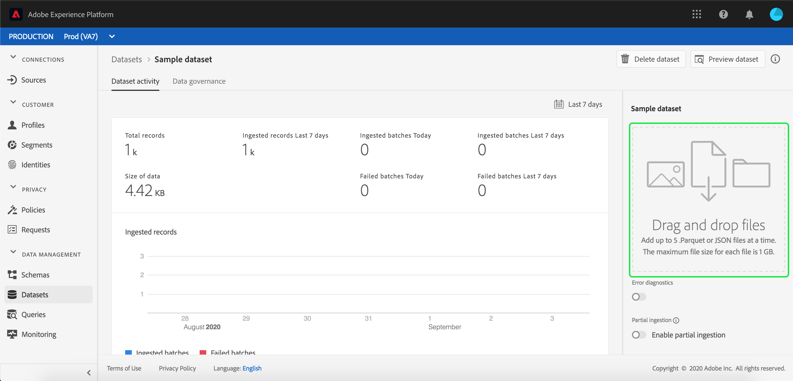
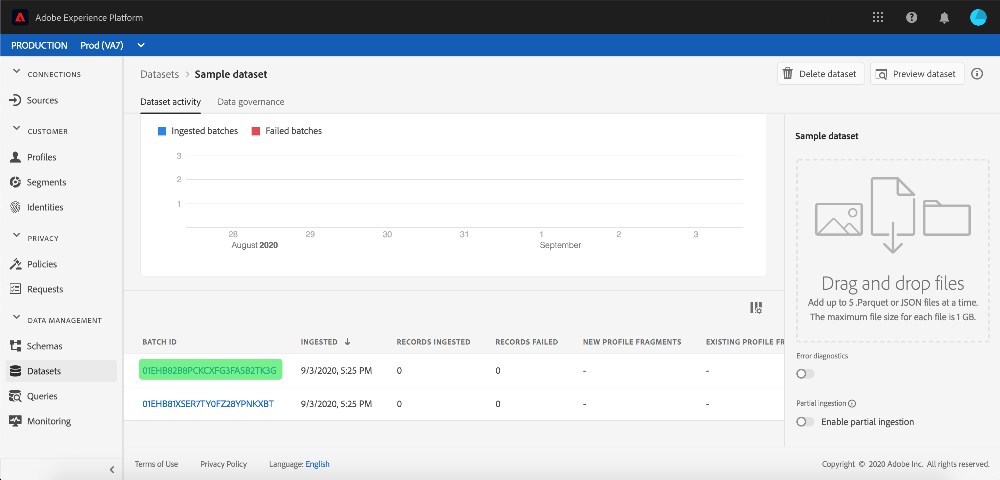

# Ingestar datos en Adobe Experience Platform

Adobe Experience Platform permite importar fácilmente datos en [!DNL Platform] archivos por lotes. Algunos ejemplos de datos que se van a ingerir pueden incluir datos de perfil de un archivo plano en un sistema CRM (como un archivo parquet) o datos que se ajustan a un esquema conocido [!DNL Experience Data Model] (XDM) en el Registro de Esquemas.

## Primeros pasos

Para completar este tutorial, debe tener acceso a [!DNL Experience Platform]. Si no tiene acceso a una organización de IMS en [!DNL Experience Platform], póngase en contacto con el administrador del sistema antes de continuar.

Si prefiere ingerir datos mediante las API de inserción de datos, lea la guía [para desarrolladores de](../batch-ingestion/api-overview.md)Ingesta de datos.

## Espacio de trabajo de conjuntos de datos

El espacio de trabajo Conjuntos de datos de [!DNL Experience Platform] permite realizar vistas y administrar todos los conjuntos de datos que ha realizado su organización de IMS, así como crear otros nuevos.

Haga clic en **[!UICONTROL Conjuntos]** de datos en el panel de navegación izquierdo para vista del espacio de trabajo Conjuntos de datos. El espacio de trabajo Conjuntos de datos contiene una lista de conjuntos de datos, que incluye columnas con el nombre, la fecha y la hora de creación, el origen, el esquema y el estado del último lote, así como la fecha y la hora de la última actualización del conjunto de datos.

>[!NOTE]
>
>Haga clic en el icono de filtro situado junto a la barra de búsqueda para utilizar las capacidades de filtrado con el fin de vista solo de los conjuntos de datos habilitados para [!DNL Profile].

## Crear un conjunto de datos

Para crear un conjunto de datos, haga clic en **[!UICONTROL Crear conjunto]** de datos en la esquina superior derecha del espacio de trabajo Conjunto de datos.

En la pantalla **[!UICONTROL Crear conjunto de datos]** , seleccione si desea &quot;[!UICONTROL Crear conjunto de datos a partir de Esquema]&quot; o &quot;[!UICONTROL Crear conjunto de datos a partir de archivo]CSV&quot;.

Para este tutorial, se utilizará un esquema para crear el conjunto de datos. Haga clic en **[!UICONTROL Crear conjunto de datos desde Esquema]** para continuar.

## Seleccionar esquema de conjunto de datos

En la pantalla **[!UICONTROL Seleccionar Esquema]** , elija un esquema haciendo clic en el botón de opción situado junto al esquema que desee utilizar. Para este tutorial, el conjunto de datos se realizará mediante el esquema Miembros de lealtad. Usar la barra de búsqueda para filtrar esquemas es una manera útil de encontrar el esquema exacto que está buscando.

Una vez que haya seleccionado el botón de radio junto al esquema que desea utilizar, haga clic en **[!UICONTROL Siguiente]**.

## Configurar el conjunto de datos

En la pantalla **[!UICONTROL Configurar conjunto de datos]** , se le pedirá que asigne un nombre al conjunto de datos y que también proporcione una descripción del conjunto de datos.

**Notas sobre los nombres de conjuntos de datos:**

- Los nombres de los conjuntos de datos deben ser cortos y descriptivos para que el conjunto de datos pueda encontrarse fácilmente en la biblioteca más adelante.
- Los nombres de los conjuntos de datos deben ser únicos, lo que significa que también deben ser lo suficientemente específicos como para que no se vuelvan a utilizar en el futuro.
- Se recomienda proporcionar información adicional sobre el conjunto de datos mediante el campo de descripción, ya que puede ayudar a otros usuarios a diferenciar entre conjuntos de datos en el futuro.

Una vez que el conjunto de datos tenga un nombre y una descripción, haga clic en **[!UICONTROL Finalizar]**.

## Actividad de conjunto de datos

Ahora se ha creado un conjunto de datos vacío y se le ha devuelto a la ficha Actividad **[!UICONTROL del]** conjunto de datos en el espacio de trabajo Conjunto de datos. Debe ver el nombre del conjunto de datos en la esquina superior izquierda del espacio de trabajo, junto con una notificación de que &quot;No se han agregado lotes&quot;. Esto es de esperar, ya que todavía no ha agregado ningún lote a este conjunto de datos.

A la derecha del espacio de trabajo Conjunto de datos, verá la ficha **[!UICONTROL Información]** que contiene información relacionada con el nuevo conjunto de datos, como ID de conjunto de datos, nombre, descripción, nombre de tabla, esquema, flujo continuo y origen. La ficha Información también incluye información sobre cuándo se creó el conjunto de datos y su fecha de última modificación.

También en la ficha Información hay una opción de **[!UICONTROL Perfil]** que se utiliza para habilitar el conjunto de datos para su uso con [!DNL Real-time Customer Profile]. El uso de esta opción, y [!DNL Real-time Customer Profile], se explicará con más detalle en la siguiente sección.

## Habilitar conjunto de datos para [!DNL Real-time Customer Profile]

Los conjuntos de datos se utilizan para la ingesta de datos en [!DNL Experience Platform]y, en última instancia, se utilizan para identificar a personas y unir la información proveniente de múltiples fuentes. Esa información unida se denomina [!DNL Real-Time Customer Profile]. Para [!DNL Platform] saber qué información debe incluirse en el [!DNL Real-Time Profile], los conjuntos de datos se pueden marcar para su inclusión mediante la opción de alternancia de **[!UICONTROL Perfil]** .

De forma predeterminada, esta opción está desactivada. Si decide activarse [!DNL Profile], todos los datos ingestados en el conjunto de datos se utilizarán para identificar a un individuo y unir sus datos [!DNL Real-Time Profile].

Para obtener más información sobre [!DNL Real-time Customer Profile] y trabajar con identidades, consulte la documentación del servicio [de](../../identity-service/home.md) identidad.

Para habilitar el conjunto de datos para [!DNL Real-time Customer Profile], haga clic en el botón de alternancia de **[!UICONTROL Perfil]** de la ficha **[!UICONTROL Información]** .

Aparecerá un cuadro de diálogo en el que se le pedirá que confirme que desea habilitar el conjunto de datos para [!DNL Real-time Customer Profile].

Haga clic en **[!UICONTROL Habilitar]** y la opción cambiará a azul, indicando que está activada.

## Añadir datos en un conjunto de datos

Los datos se pueden agregar a un conjunto de datos de diferentes maneras. Puede elegir usar [!DNL Data Ingestion] API o un socio de ETL como [!DNL Unifi] o [!DNL Informatica]. En este tutorial, se agregarán datos al conjunto de datos mediante la ficha **[!UICONTROL Añadir datos]** de la interfaz de usuario.

Para empezar a agregar datos al conjunto de datos, haga clic en la ficha **[!UICONTROL Añadir datos]** . Ahora puede arrastrar y soltar archivos o buscar en el equipo los archivos que desee agregar.

>[!NOTE]
>
>La plataforma admite dos tipos de archivos para la ingestión de datos, el parqué o JSON. Puede agregar hasta cinco archivos a la vez, con un tamaño máximo de 10 GB para cada archivo.

## Cargar un archivo

Una vez que arrastre y suelte (o examine y seleccione) un archivo de parqué o JSON que desee cargar, [!DNL Platform] comenzará a procesar el archivo inmediatamente y aparecerá un cuadro de diálogo de **[!UICONTROL carga]** en la ficha **[!UICONTROL Añadir datos]** que muestra el progreso de la carga del archivo.

## Métricas de conjunto de datos

Una vez que el archivo haya terminado de cargarse, la ficha **[!UICONTROL Actividad]** del conjunto de datos ya no muestra que &quot;No se han agregado lotes&quot;. En su lugar, la ficha Actividad **[!UICONTROL de]** conjuntos de datos ahora muestra las métricas de conjuntos de datos. Todas las métricas mostrarán &quot;0&quot; en esta etapa, ya que el lote aún no se ha cargado.

En la parte inferior de la ficha hay una lista que muestra el ID **[!UICONTROL de]** lote de los datos que se acaban de ingerir mediante el proceso [&quot;Añadir datos en un conjunto de datos&quot;](#add-data-to-dataset) . También se incluye información relacionada con el lote, incluida la fecha de ingesta, el número de registros ingestados y el estado actual del lote.

## Detalles de lote

Haga clic en el ID **[!UICONTROL de]** lote para vista de la información general **[!UICONTROL de un]** lote, mostrando detalles adicionales sobre el lote. Una vez que el lote haya terminado de cargarse, la información sobre el lote se actualizará para mostrar el número de registros ingeridos y el tamaño del archivo. El estado también cambiará a &quot;Correcto&quot; o &quot;Fallido&quot;. Si se produce un error en el lote, la sección Código **[!UICONTROL de]** error contendrá detalles sobre cualquier error durante la ingestión.

Para obtener más información y las preguntas más frecuentes sobre la ingestión de lotes, consulte la guía de solución de problemas de la ingestión de [lotes](../batch-ingestion/troubleshooting.md).

Para volver a la pantalla de Actividad **[!UICONTROL del]** conjunto de datos, haga clic en el nombre del conjunto de datos (Detalles de **[!UICONTROL lealtad]**) en la ruta de exploración.

## Conjunto de datos de previsualización

Una vez que el conjunto de datos esté listo, aparecerá una opción para **[!UICONTROL Previsualización del conjunto]** de datos en la parte superior de la ficha Actividad **[!UICONTROL del]** conjunto de datos.

Haga clic en **[!UICONTROL Previsualización de conjunto de datos]** para abrir un cuadro de diálogo que muestre datos de ejemplo desde dentro del conjunto de datos. Si el conjunto de datos se creó con un esquema, los detalles del esquema del conjunto de datos aparecerán en el lado izquierdo de la previsualización. Puede expandir el esquema con las flechas para ver la estructura del esquema. Cada encabezado de columna en los datos de previsualización representa un campo en el conjunto de datos.

## Próximos pasos y recursos adicionales

Ahora que ha creado un conjunto de datos y ha ingestado datos correctamente en [!DNL Experience Platform], puede repetir estos pasos para crear un nuevo conjunto de datos o ingerir más datos en el conjunto de datos existente.

Para obtener más información sobre la ingestión por lotes, lea la información general [sobre la ingestión de](../batch-ingestion/overview.md) lotes y complemente su aprendizaje en el siguiente vídeo.

>[!WARNING]
>
>La interfaz de usuario que [!DNL Platform] se muestra en el siguiente vídeo no está actualizada. Consulte la documentación anterior para obtener las capturas de pantalla y la funcionalidad más recientes de la interfaz de usuario.

>[!VIDEO](https://video.tv.adobe.com/v/27269?quality=12&learn=on)