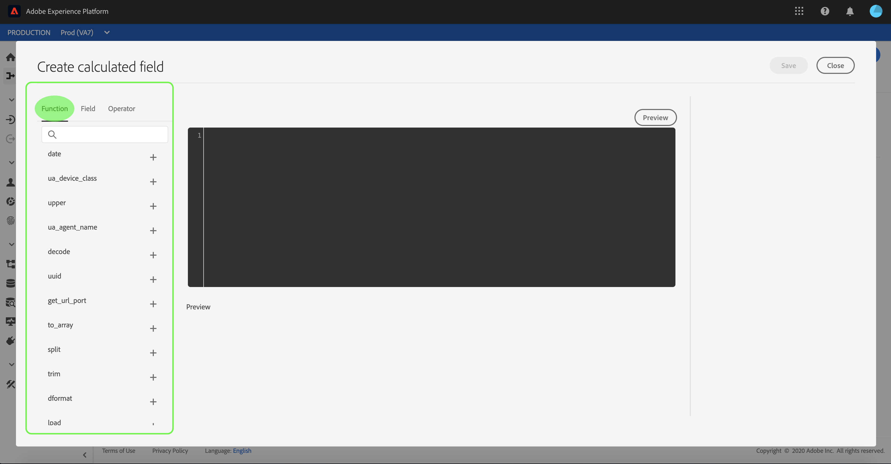

# Asignación de un archivo CSV a un esquema XDM

Para poder ingerir datos CSV en [!DNL Adobe Experience Platform], los datos deben asignarse a un esquema [!DNL Experience Data Model] (XDM). Este tutorial explica cómo asignar un archivo CSV a un esquema XDM mediante la interfaz de usuario [!DNL Platform] .

Además, en el apéndice de este tutorial se proporciona más información sobre el uso de funciones [de](#mapping-functions)asignación.

## Primeros pasos

Este tutorial requiere un conocimiento práctico de los siguientes componentes de [!DNL Platform]:

- [[!Modelo de datos de experiencia DNL (sistema XDM)]](../../xdm/home.md): El marco normalizado por el cual [!DNL Platform] organiza los datos de experiencia del cliente.
- [[!DNL Ingesta por lotes]](../batch-ingestion/overview.md): El método mediante el cual [!DNL Platform] ingesta datos de archivos de datos proporcionados por el usuario.

Este tutorial también requiere que ya haya creado un conjunto de datos para ingestar los datos de CSV. Para ver los pasos para crear un conjunto de datos en la interfaz de usuario, consulte el tutorial [de ingesta de](./ingest-batch-data.md)datos.

## Elegir un destino

Inicie sesión en [[!DNL Adobe Experience Platform]](https://platform.adobe.com) y, a continuación, seleccione **[!UICONTROL Flujos de trabajo]** en la barra de navegación izquierda para acceder al espacio de trabajo de **[!UICONTROL Flujos de trabajo]** .

En la pantalla **[!UICONTROL Flujos de trabajo]** , seleccione **[!UICONTROL Asignar CSV al esquema]** XDM en la sección **[!UICONTROL de ingesta]** de datos y, a continuación, seleccione **[!UICONTROL Iniciar]**.

Aparece el flujo de trabajo **[!UICONTROL Asignar CSV al esquema]** XDM, comenzando en el paso **[!UICONTROL Destino]** . Elija un conjunto de datos para los datos de entrada en los que se van a ingerir. Puede usar un conjunto de datos existente o crear uno nuevo.

**Usar un conjunto de datos existente**

Para ingerir los datos CSV en un conjunto de datos existente, seleccione **[!UICONTROL Usar conjunto de datos]** existente. Puede recuperar un conjunto de datos existente mediante la función de búsqueda o desplazándose por la lista de conjuntos de datos existentes en el panel.

Para ingestar los datos CSV en un nuevo conjunto de datos, seleccione **[!UICONTROL Crear nuevo conjunto de datos]** e introduzca un nombre y una descripción para el conjunto de datos en los campos proporcionados. Seleccione un esquema utilizando la función de búsqueda o desplazándose por la lista de esquemas proporcionada. Seleccione **[!UICONTROL Siguiente]** para continuar.

## Añadir datos

Aparece el paso **[!UICONTROL Añadir datos]** . Arrastre y suelte el archivo CSV en el espacio proporcionado o seleccione **[!UICONTROL Elegir archivos]** para introducir manualmente el archivo CSV.

La sección Datos **[!UICONTROL de]** ejemplo aparece una vez cargado el archivo, mostrando las primeras diez filas de datos. Una vez que confirme que los datos se han cargado según lo esperado, seleccione **[!UICONTROL Siguiente]**.

## Asignar campos CSV a campos de esquema XDM

Aparece el paso **[!UICONTROL Asignación]** . Las columnas del archivo CSV se muestran en Campo **** de origen, con sus correspondientes campos de esquema XDM en Campo **[!UICONTROL de]** Destinatario. Los campos de destinatario no seleccionados están delineados en rojo. Puede utilizar la opción de campos de filtro para reducir la lista de los campos de origen disponibles.

>[!TIP]
>
>[!DNL Platform] proporciona recomendaciones inteligentes para campos asignados automáticamente en función del esquema de destinatario o del conjunto de datos que haya seleccionado. Puede ajustar manualmente las reglas de asignación para adaptarlas a sus casos de uso.

Para asignar una columna CSV a un campo XDM, seleccione el icono de esquema junto al campo de destinatario correspondiente de la columna.

Aparece la ventana **[!UICONTROL Seleccionar esquema]** . Aquí puede desplazarse por la estructura del esquema XDM y localizar el campo al que desea asignar la columna CSV. Haga clic en un campo XDM para seleccionarlo y, a continuación, haga clic en **[!UICONTROL Seleccionar]**.

Después de completar los pasos para los campos de origen sin asignar restantes, la pantalla **[!UICONTROL Asignación]** vuelve a aparecer con el campo XDM seleccionado que aparece ahora en Campo **[!UICONTROL de]** Destinatario.

Al asignar campos, también puede incluir funciones para calcular valores en función de los campos de origen de entrada. Consulte la sección de funciones [de](#mapping-functions) asignación del apéndice para obtener más información.

### Añadir campo calculado

Los campos calculados permiten crear valores en función de los atributos del esquema de entrada. Estos valores se pueden asignar a atributos en el esquema de destinatario y se les puede proporcionar un nombre y una descripción para facilitar la referencia.

Seleccione el botón **[!UICONTROL Añadir campo]** calculado para continuar.

Aparece el panel **[!UICONTROL Crear campo]** calculado. El cuadro de diálogo izquierdo contiene los campos, las funciones y los operadores admitidos en los campos calculados. Seleccione una de las fichas para agregar funciones, campos o operadores al editor de expresiones en inicio.

| Tabulación | Descripción |
| --------- | ----------- |
| Campos | La ficha Campos lista campos y atributos disponibles en el esquema de origen. |
| Funciones | La ficha Funciones lista las funciones disponibles para transformar los datos. |
| Operadores | La ficha Operadores lista los operadores disponibles para transformar los datos. |

Puede agregar manualmente campos, funciones y operadores mediante el editor de expresiones del centro. Seleccione el editor para crear una expresión en inicio.

Seleccione **[!UICONTROL Guardar]** para continuar.

La pantalla de asignación vuelve a aparecer con el campo de origen recién creado. Aplique el campo de destinatario correspondiente y seleccione **[!UICONTROL Finalizar]** para completar la asignación.

## Monitorear el flujo de datos

Una vez asignado y creado el archivo CSV, puede supervisar los datos que se están ingeriendo a través de él. Para obtener más información sobre la supervisión de flujos de datos, consulte el tutorial sobre la [supervisión de flujos de datos](../../ingestion/quality/monitor-data-flows.md)de flujo continuo.

## Pasos siguientes

Siguiendo este tutorial, ha asignado correctamente un archivo CSV plano a un esquema XDM y lo ha ingerido en [!DNL Platform]. Estos datos ahora pueden ser utilizados por servicios [!DNL Platform] de flujo descendente como [!DNL Real-time Customer Profile]. Consulte la descripción general de [[!DNL Perfil del cliente en tiempo real]](../../profile/home.md) para obtener más información.

## Apéndice

La siguiente sección proporciona información adicional para asignar columnas CSV a campos XDM.

### Funciones de asignación

Determinadas funciones de asignación se pueden utilizar para calcular y calcular valores en función de lo que se introduzca en los campos de origen. Para utilizar una función, escríbala en Campo **** de origen con la sintaxis y las entradas adecuadas.

Por ejemplo, para concatenar campos CSV de **ciudad** y **país** y asignarlos al campo XDM de **ciudad** , establezca el campo de origen como `concat(city, ", ", county)`.

La siguiente tabla lista todas las funciones de asignación admitidas, incluidas las expresiones de muestra y sus resultados.

| Función | Descripción | Expresión de muestra | Salida de muestra |
| -------- | ----------- | ----------------- | ------------- |
| concat | Concatena cadenas determinadas. | concat(&quot;Hi, &quot;, &quot;there&quot;, &quot;!&quot;) | `"Hi, there!"` |
| explosionar | Divide la cadena según un regex y devuelve una matriz de partes. | explode(&quot;Hi, there!&quot;, &quot; &quot;) | `["Hi,", "there"]` |
| instr | Devuelve la ubicación/índice de una subcadena. | instr(&quot;adobe.com&quot;, &quot;com&quot;) | 6 |
| sustitutor | Reemplaza la cadena de búsqueda si está presente en la cadena original. | replacestr(&quot;Esto es una cadena re test&quot;, &quot;re&quot;, &quot;replace&quot;) | &quot;Ésta es una prueba de reemplazo de cadena&quot; |
| substr | Devuelve una subcadena de una longitud determinada. | substr(&quot;Esta es una prueba de subcadena&quot;, 7, 8) | &quot; a subst&quot; |
| lower / lcase | Convierte una cadena en minúsculas. | lower(&quot;HeLLo&quot;) lcase(&quot;HeLLo&quot;) | &quot;hello&quot; |
| superior / ucase | Convierte una cadena en mayúsculas. | top(&quot;HeLLo&quot;) ucase(&quot;HeLLo&quot;) | &quot;HOLA&quot; |
| split | Divide una cadena de entrada en un separador. | split(&quot;Hello world&quot;, &quot; &quot;) | `["Hello", "world"]` |
| join | Une una lista de objetos mediante el separador. | `join(" ", ["Hello", "world"]`) | &quot;Hola mundo&quot; |
| fusionarse | Devuelve el primer objeto no nulo de una lista determinada. | coalesce(null, null, null, null, &quot;first&quot;, null, &quot;second&quot;) | &quot;first&quot; |
| decode | Dada una clave y una lista de pares de valor clave acoplados como una matriz, la función devuelve el valor si se encuentra la clave o devuelve un valor predeterminado si está presente en la matriz. | decode(&quot;k2&quot;, &quot;k1&quot;, &quot;v1&quot;, &quot;k2&quot;, &quot;v2&quot;, &quot;default&quot;) | &quot;Versión 2&quot; |
| iif | Evalúa una determinada expresión booleana y devuelve el valor especificado en función del resultado. | iif(&quot;s&quot;.equalsIgnoreCase(&quot;S&quot;), &quot;True&quot;, &quot;False&quot;) | &quot;True&quot; |
| min | Devuelve el mínimo de los argumentos dados. Utiliza ordenación natural. | min(3, 1, 4) | 1 |
| max | Devuelve el máximo de los argumentos dados. Utiliza ordenación natural. | max(3, 1, 4) | 4 |
| first | Recupera el primer argumento dado. | first(&quot;1&quot;, &quot;2&quot;, &quot;3&quot;) | &quot;1&quot; |
| last | Recupera el último argumento dado. | last(&quot;1&quot;, &quot;2&quot;, &quot;3&quot;) | &quot;3&quot; |
| uuid / guid | Genera un ID seudoaleatorio. | uuid() guid() | {UNIQUE_ID} |
| now | Recupera la hora actual. | now() | `2019-10-23T10:10:24.556-07:00[America/Los_Angeles]` |
| timestamp | Recupera la hora Unix actual. | timestamp() | 1571850624571 |
| format | Da formato a la fecha de entrada según un formato especificado. | format({DATE}, &quot;aaaa-MM-dd HH:mm:ss&quot;) | &quot;2019-10-23 11:24:35&quot; |
| dformat | Convierte una marca de hora en una cadena de fecha según un formato especificado. | dformat(1571829875, &quot;dd-MMM-yyyy hh:mm&quot;) | &quot;23-Oct-2019 11:24&quot; |
| date | Convierte una cadena de fecha en un objeto ZonianDateTime (formato ISO 8601). | date(&quot;23-Oct-2019 11:24&quot;) | &quot;2019-10-23T11:24:00+00:00&quot; |
| date_part | Recupera las partes de la fecha. Se admiten los siguientes valores de componente:   &quot;year&quot; &quot;aaaaaa&quot; &quot;yy&quot;  &quot;trimestre&quot; &quot;qq&quot; &quot;q&quot;  &quot;mes&quot; &quot;mm&quot; &quot;m&quot;  &quot;día del año&quot;                              &quot;dy&quot;y&quot;&quot;día&quot;d&quot;d&quot;semana&quot;ww&quot;w&quot;w&quot;día de la semana&quot;día de la semana&quot;dw&quot;w&quot;ea&quot;hh&quot;h&quot;h&quot;hh&quot;h&quot;h&quot;h&quot;h&quot;h&quot;h&quot;h&quot;h&quot;h&quot;h&quot;h&quot;h&quot;h&quot;h&quot;h&quot;h&quot; &quot;hh24&quot;&quot;hh12&quot;&quot;minuto&quot;&quot;mi&quot;&quot;n&quot;&quot;segundo&quot;&quot;ss&quot;&quot;s&quot;&quot;milisegundo&quot;&quot;ms&quot;&quot; | date_part(date(&quot;2019-10-17 11:55:12&quot;), &quot;MM&quot;) | 10 |
| set_date_part | Reemplaza un componente en una fecha determinada. Se aceptan los siguientes componentes:   &quot;year&quot; &quot;yyyy&quot; &quot;yy&quot;  &quot;month&quot; &quot;mm&quot; &quot;m&quot;  &quot;day&quot; &quot;dd&quot; &quot;d&quot;  &quot;hour&quot;         &quot;hh&quot;minuto&quot;&quot;mi&quot;&quot;s&quot;ss&quot;s&quot;&quot;&quot; | set_date_part(&quot;m&quot;, 4, date(&quot;2016-11-09T11:44:44.797&quot;) | &quot;2016-04-09T11:44:44.797&quot; |
| make_date_time / make_timestamp | Crea una fecha a partir de partes. | make_date_time(2019, 10, 17, 11, 55, 12, 999, &quot;América/Los Ángeles&quot;) | `2019-10-17T11:55:12.0&#x200B;00000999-07:00[America/Los_Angeles]` |
| current_timestamp | Devuelve la marca de tiempo actual. | current_timestamp() | 1571850624571 |
| current_date | Devuelve la fecha actual sin un componente de tiempo. | current_date() | &quot;18 de noviembre de 2019&quot; |