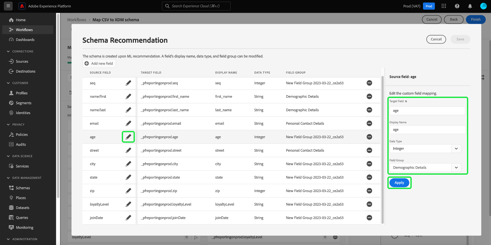

# Asignar un archivo CSV a un esquema XDM mediante recomendaciones generadas por IA

>[!NOTE]
>
>Para obtener información sobre las funciones de asignación de CSV generalmente disponibles en Experience Platform, consulte el documento sobre [asignación de un archivo CSV a un esquema existente](./existing-schema.md).

Para ingerir datos CSV en [!DNL Adobe Experience Platform], los datos deben asignarse a un esquema [!DNL Experience Data Model] (XDM). Puede elegir asignar a [un esquema existente](./existing-schema.md), pero si no sabe exactamente qué esquema utilizar o cómo debe estructurarse, puede utilizar recomendaciones dinámicas basadas en modelos de aprendizaje automático (ML) en la interfaz de usuario de Experience Platform.

## Introducción

Este tutorial requiere una comprensión práctica de los siguientes componentes de [!DNL Experience Platform]:

* [[!DNL Experience Data Model (XDM System)]](../../../xdm/home.md): El marco estandarizado mediante el cual [!DNL Experience Platform] organiza los datos de experiencia del cliente.
   * Como mínimo, debe comprender el concepto de [comportamientos en XDM](../../../xdm/home.md#data-behaviors), para que pueda decidir si asignar los datos a una clase [!UICONTROL Profile] (comportamiento de registro) o a una clase [!UICONTROL ExperienceEvent] (comportamiento de serie temporal).
* [Ingesta por lotes](../../batch-ingestion/overview.md): Método mediante el cual [!DNL Experience Platform] ingiere datos de archivos de datos proporcionados por el usuario.
* [Preparación de datos de Adobe Experience Platform](../../batch-ingestion/overview.md): Un conjunto de funcionalidades que le permiten asignar y transformar datos ingeridos para que se ajusten a esquemas XDM. La documentación sobre [funciones de preparación de datos](../../../data-prep/functions.md) es específicamente relevante para la asignación de esquemas.

## Proporcionar detalles del flujo de datos

En la interfaz de usuario de Experience Platform, seleccione **[!UICONTROL Fuentes]** en el panel de navegación izquierdo. En la vista **[!UICONTROL Catálogo]**, vaya a la categoría **[!UICONTROL Sistema local]**. En **[!UICONTROL Cargar archivo local]**, seleccione **[!UICONTROL Agregar datos]**.

![El catálogo [!UICONTROL Sources] en la interfaz de usuario de Experience Platform, con [!UICONTROL Agregar datos] en [!UICONTROL Carga de archivo local] seleccionado.](../../images/tutorials/map-csv-recommendations/local-file-upload.png)

Aparece el flujo de trabajo **[!UICONTROL Asignar esquema XDM CSV]**, a partir del paso **[!UICONTROL Detalle del flujo de datos]**.

Seleccione **[!UICONTROL Crear un nuevo esquema con recomendaciones XML]**, lo que hará que aparezcan nuevos controles. Elija la clase adecuada para los datos CSV que desea asignar ([!UICONTROL Perfil] o [!UICONTROL ExperienceEvent]). Si lo desea, puede utilizar el menú desplegable para seleccionar el sector relevante para su negocio o dejarlo en blanco si no le corresponden las categorías proporcionadas. Si su organización opera bajo un modelo [empresa a empresa (B2B)](../../../xdm/tutorials/relationship-b2b.md), active la casilla de verificación **[!UICONTROL datos B2B]**.

![El paso [!UICONTROL Detalle del flujo de datos] con la opción de recomendación ML seleccionada. Se ha seleccionado [!UICONTROL Perfil] para la clase y [!UICONTROL Telecomunicaciones] para la industria](../../images/tutorials/map-csv-recommendations/select-class-and-industry.png)

Desde aquí, proporcione un nombre para el esquema que se creará a partir de los datos CSV y un nombre para el conjunto de datos de salida que contendrá los datos introducidos en ese esquema.

Opcionalmente, puede configurar las siguientes funciones adicionales para el flujo de datos antes de continuar:

| Nombre de entrada | Descripción |
| --- | --- |
| [!UICONTROL Descripción] | Descripción del flujo de datos. |
| [!UICONTROL Diagnóstico de errores] | Cuando está habilitada, se generan mensajes de error para los lotes recién ingeridos, que se pueden ver al recuperar el lote correspondiente en la [API](../../batch-ingestion/api-overview.md). |
| [!UICONTROL Ingesta parcial] | Cuando se habilita, se incorporan registros válidos para nuevos datos por lotes dentro de un umbral de error especificado. Este umbral le permite configurar el porcentaje de errores aceptables antes de que falle todo el lote. |
| [!UICONTROL Detalles de flujo de datos] | Proporcione un nombre y una descripción opcional para el flujo de datos que llevará los datos CSV a Experience Platform. Al iniciar este flujo de trabajo, se asigna automáticamente un nombre predeterminado al flujo de datos. Cambiar el nombre es opcional. |
| [!UICONTROL Alertas] | Seleccione de una lista de [alertas internas del producto](../../../observability/alerts/overview.md) que desee recibir con respecto al estado del flujo de datos una vez que se haya iniciado. |

{style="table-layout:auto"}

Cuando termine de configurar el flujo de datos, seleccione **[!UICONTROL Siguiente]**.

![Se completó la sección [!UICONTROL Detalles del flujo de datos].](../../images/tutorials/map-csv-recommendations/dataflow-detail-complete.png)

## Seleccionar datos

En el paso **[!UICONTROL Seleccionar datos]**, use la columna izquierda para cargar el archivo CSV. Puede seleccionar **[!UICONTROL Elegir archivos]** para abrir un cuadro de diálogo del explorador de archivos para seleccionar el archivo, o bien puede arrastrar y soltar el archivo directamente en la columna.

![El botón [!UICONTROL Elegir archivos] y el área de arrastrar y soltar resaltados dentro del paso [!UICONTROL Seleccionar datos].](../../images/tutorials/map-csv-recommendations/upload-files.png)

Después de cargar el archivo, aparece una sección de datos de ejemplo que muestra las primeras diez filas de los datos recibidos para que pueda comprobar que se han cargado correctamente. Haga clic en **[!UICONTROL Siguiente]** para continuar.

## Configurar asignaciones de esquema

Los modelos XML se ejecutan para generar un nuevo esquema basado en la configuración del flujo de datos y en el archivo CSV cargado. Una vez completado el proceso, el paso [!UICONTROL Mapping] se completa para mostrar las asignaciones de cada campo individual junto con la vista totalmente navegable de la estructura de esquema generada.

![El paso [!UICONTROL Asignación] en la interfaz de usuario, que muestra todos los campos CSV asignados y la estructura de esquema resultante.](../../images/tutorials/map-csv-recommendations/schema-generated.png)

>[!NOTE]
>
>Puede filtrar todos los campos del esquema en función de diversos criterios durante el flujo de trabajo de asignación de campos de origen a destino. El comportamiento predeterminado es mostrar todos los campos asignados. Para cambiar los campos mostrados, seleccione el icono de filtro junto al campo de entrada de búsqueda y elija entre las opciones desplegables.  {width="100" zoomable="yes"}

Desde aquí, puede [editar las asignaciones de campos](#edit-mappings) o [modificar los grupos de campos con los que están asociados](#edit-schema) según sus necesidades. Cuando esté satisfecho, seleccione **[!UICONTROL Finalizar]** para completar la asignación e iniciar el flujo de datos que configuró anteriormente. Los datos CSV se incorporan al sistema y rellenan un conjunto de datos basado en la estructura de esquema generada, listo para ser consumido por los servicios de Experience Platform descendentes.

![Se está seleccionando el botón [!UICONTROL Finalizar], con lo que se completa el proceso de asignación de CSV.](../../images/tutorials/map-csv-recommendations/finish-mapping.png)

### Editar asignaciones de campo {#edit-mappings}

Utilice la vista previa de asignación de campos para editar asignaciones existentes o eliminarlas por completo. Para obtener más información sobre cómo administrar un conjunto de asignaciones en la interfaz de usuario, consulte la [guía de IU para la asignación de la preparación de datos](../../../data-prep/ui/mapping.md#mapping-interface).

### Editar grupos de campos {#edit-field-groups}

Los campos CSV se asignan automáticamente a grupos de campos XDM existentes mediante modelos XML. Si desea cambiar el grupo de campos de cualquier campo CSV en particular, seleccione **[!UICONTROL Editar]** junto al árbol de esquema.

![Se está seleccionando el botón [!UICONTROL Editar] junto al árbol de esquema.](../../images/tutorials/map-csv-recommendations/edit-schema-structure.png)

Aparece un cuadro de diálogo que le permite editar el nombre para mostrar, el tipo de datos y el grupo de campos de cualquier campo de la asignación. Seleccione el icono de edición () junto a un campo de origen para editar sus detalles en la columna derecha antes de seleccionar **[!UICONTROL Aplicar]**.

Cuando termine de ajustar las recomendaciones del esquema para los campos de origen, seleccione **[!UICONTROL Guardar]** para aplicar los cambios.

## Pasos siguientes

En esta guía se explica cómo asignar un archivo CSV a un esquema XDM mediante recomendaciones generadas por IA, lo que le permite introducir esos datos en Experience Platform mediante la ingesta por lotes.

Para ver los pasos de asignación de un archivo CSV a un esquema existente, consulte el [flujo de trabajo de asignación de esquemas existente](./existing-schema.md). Para obtener información sobre la transmisión de datos a Experience Platform en tiempo real a través de conexiones de origen precompiladas, consulte [descripción general de las fuentes](../../../sources/home.md).

También puede usar algoritmos de aprendizaje automático (ML) para **generar un esquema a partir de datos CSV de ejemplo**. Este flujo de trabajo crea automáticamente un nuevo esquema basado en la estructura y el contenido del archivo CSV. Este esquema recién creado coincide con el formato de los datos para ahorrarle tiempo y aumentar la precisión al definir la estructura, los campos y los tipos de datos para conjuntos de datos complejos y grandes. Consulte la [guía de creación de esquemas asistidos por ML](../../../xdm/ui/ml-assisted-schema-creation.md) para obtener más información sobre este flujo de trabajo.
