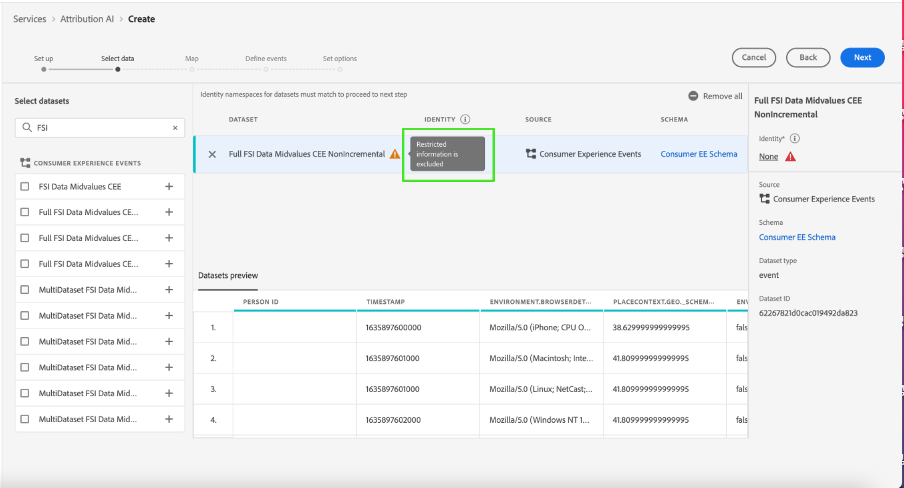

# Control de acceso en Attribution AI

El control de acceso para la inteligencia artificial aplicada a la atribución se proporciona mediante Adobe Experience Platform en [Adobe Admin Console](https://adminconsole.adobe.com/). Esta funcionalidad aprovecha los perfiles de producto en Admin Console, que vinculan a los usuarios con permisos y entornos limitados.

Para obtener más información sobre el control de acceso, vea la [descripción general del control de acceso](../../../access-control/home.md).

## Control de acceso basado en atributos

>[!IMPORTANT]
>
>Actualmente, el control de acceso basado en atributos solo está disponible en una versión limitada.

[El control de acceso basado en atributos](../../../access-control/abac/overview.md) es una funcionalidad de Adobe Experience Platform que permite a los administradores controlar el acceso a objetos específicos o a funcionalidades basadas en atributos. Los atributos pueden ser metadatos añadidos a un objeto, como una etiqueta añadida a un campo o segmento de esquema. Un administrador define directivas de acceso que incluyen atributos para administrar permisos de acceso de usuarios.

Esta funcionalidad le permite etiquetar campos de esquema del Modelo de datos de experiencia (XDM) con etiquetas que definen ámbitos organizativos o de uso de datos. En paralelo, los administradores pueden utilizar la interfaz de administración de usuarios y funciones para definir políticas de acceso alrededor de los campos de esquema XDM y administrar mejor el acceso dado a usuarios o grupos de usuarios (usuarios internos, externos o de terceros). Además, el control de acceso basado en atributos permite a los administradores gestionar el acceso a segmentos específicos.

Mediante el control de acceso basado en atributos, los administradores pueden controlar el acceso de los usuarios a los datos personales confidenciales (SPD) y a la información de identificación personal (PII) en todos los flujos de trabajo y recursos de Experience Platform. Los administradores pueden definir funciones de usuario que solo tengan acceso a campos y datos específicos que correspondan a esos campos.

Debido al control de acceso basado en atributos, algunos campos y funcionalidades pueden tener acceso restringido y no estar disponibles para determinados modelos de servicio de Attribution AI. Algunos ejemplos son &quot;Identidad&quot;, &quot;Definición de puntuación&quot; y &quot;Clonar&quot;.

En la parte superior de la página **perspectivas** del espacio de trabajo de inteligencia artificial aplicada a la atribución, los detalles que se muestran en la barra lateral tienen acceso restringido.

Si selecciona conjuntos de datos con esquemas restringidos en la página **[!UICONTROL Crear flujo de trabajo de modelo]**, aparecerá un signo de advertencia junto al nombre del conjunto de datos con el mensaje: [!UICONTROL Se excluye la información restringida].

Al obtener una vista previa de conjuntos de datos con esquema restringido en la página **[!UICONTROL Crear flujo de trabajo de modelo]**, aparece una advertencia que indica que [!UICONTROL Debido a restricciones de acceso, cierta información no se muestra en la vista previa del conjunto de datos.]

Después de crear un modelo con información restringida y continuar con el paso **[!UICONTROL Definir objetivo]**, se muestra una advertencia en la parte superior: [!UICONTROL Debido a restricciones de acceso, cierta información no se muestra en la configuración.]

## Pasos siguientes

Al leer esta guía, se le han presentado los principios principales del control de acceso en [!DNL Experience Platform]. Ahora puede continuar con la [guía del usuario de control de acceso](../overview.md) para ver los pasos detallados sobre cómo usar [!DNL Admin Console] para crear perfiles de producto y asignar permisos para [!DNL Experience Platform].
