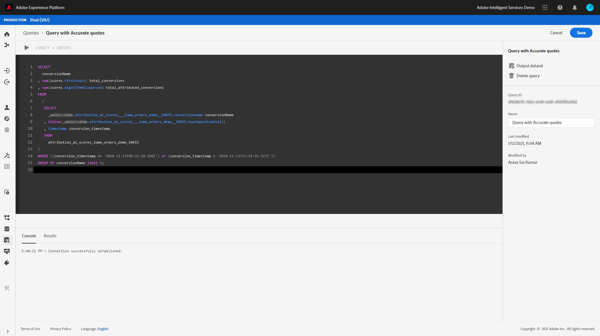

# Guía de inicio rápido del servicio de Consulta de Adobe Experience Platform para analizar puntuaciones de atribución

Cada fila de los datos representa una conversión, en la que la información de los puntos de contacto relacionados se almacena como una matriz de estructuras debajo de la columna `touchpointsDetail`.

| Información de Touchpoint | Columna |
| ---------------------- | ------ |
| Nombre del punto de contacto | `touchpointsDetail. touchpointName` |
| Canal de Touchpoint | `touchpointsDetail.touchPoint.mediaChannel` |
| Puntuaciones algorítmicas de Touchpoint AAI | <li>`touchpointsDetail.scores.algorithmicSourced`</li> <li> `touchpointsDetail.scores.algorithmicInfluenced` </li> |

## Búsqueda de rutas de datos

En la interfaz de usuario de Adobe Experience Platform, seleccione **[!UICONTROL Conjuntos de datos]** en el panel de navegación izquierdo. Aparece la página **[!UICONTROL Datasets]**. A continuación, seleccione la ficha **[!UICONTROL Examinar]** y busque el conjunto de datos de salida para las puntuaciones de Attribution AI.


Seleccione el conjunto de datos de salida. Aparece la página de actividad del conjunto de datos.


Dentro de la página de actividad del conjunto de datos, seleccione **[!UICONTROL conjunto de datos de Previsualización]** en la esquina superior derecha para realizar la previsualización de los datos y asegurarse de que se ingirió según lo esperado.


Después de obtener una vista previa de los datos, seleccione el esquema en el carril derecho. Aparece una ventana emergente con el nombre y la descripción del esquema. Seleccione el hipervínculo del nombre del esquema para redireccionar al esquema de puntuación.


Con el esquema de puntuación, puede seleccionar o buscar un valor. Una vez seleccionada, se abre la barra lateral **[!UICONTROL Propiedades del campo]**, lo que le permite copiar la ruta para utilizarla en la creación de consultas.


## Acceso al servicio de Consulta

Para acceder al servicio de Consulta desde la interfaz de usuario de la plataforma, seleccione el inicio **[!UICONTROL Consultas]** en el menú de navegación izquierdo y, a continuación, seleccione la ficha **[!UICONTROL Examinar]**. Se carga una lista de las consultas guardadas anteriormente.


A continuación, seleccione **[!UICONTROL Crear consulta]** en la esquina superior derecha. Se carga el Editor de Consultas. Con el Editor de Consultas puede empezar a crear consultas utilizando los datos de puntuación.



Para obtener más información sobre el Editor de Consultas, visite la [guía del usuario del Editor de Consultas](../../query-service/ui/user-guide.md).

## Plantillas de consulta para análisis de puntuación de atribución

Las consultas siguientes pueden utilizarse como plantilla para distintos escenarios de análisis de puntuaciones. Debe reemplazar los valores `_tenantId` y `your_score_output_dataset` por los valores adecuados que se encuentran en el esquema de resultados de puntuación.

>[!NOTE]
>
> Según cómo se hayan ingerido los datos, los valores que se utilizan a continuación, como `timestamp`, pueden tener un formato diferente.

### Ejemplos de validación

**Número total de conversiones por evento de conversión (dentro de una ventana de conversión)**

```sql
    SELECT conversionName,
           SUM(scores.firstTouch) as total_conversions,
           SUM(scores.algorithmicSourced) as total_attributed_conversions
    FROM
        (SELECT
                _tenantId.your_score_output_dataset.conversionName
                    as conversionName,
                inline(_tenantId.your_score_output_dataset.touchpointsDetail),
                timestamp as conversion_timestamp
         FROM
                your_score_output_dataset
        )
    WHERE
        conversion_timestamp >= '2020-07-16'
      AND
        conversion_timestamp <  '2020-10-14'
    GROUP BY
        conversionName
```

**Número total de eventos de solo conversión (dentro de una ventana de conversión)**

```sql
    SELECT
        _tenantId.your_score_output_dataset.conversionName as conversionName,
        COUNT(1) as convOnly_cnt
    FROM
        your_score_output_dataset
    WHERE
        _tenantId.your_score_output_dataset.touchpointsDetail.touchpointName[0] IS NULL AND
        timestamp >= '2020-07-16' AND
        timestamp <  '2020-10-14'
    GROUP BY
        conversionName
```

### Ejemplos de análisis de tendencias

**Número de conversiones por día**

```sql
    SELECT conversionName,
           DATE(conversion_timestamp) as conversion_date,
           SUM(scores.firstTouch) as convertion_cnt
    FROM
        (SELECT
                _tenantId.your_score_output_dataset.conversionName as conversionName,
                inline(_tenantId.your_score_output_dataset.touchpointsDetail),
                timestamp as conversion_timestamp
         FROM
                your_score_output_dataset
        )
    GROUP BY
        conversionName, DATE(conversion_timestamp)
    ORDER BY
        conversionName, DATE(conversion_timestamp)
    LIMIT 20
```

### Ejemplos de análisis de distribución

**Cantidad de puntos de contacto en rutas de conversión por tipo definido (dentro de una ventana de conversión)**

```sql
    SELECT conversionName,
           touchpointName,
           COUNT(1) as tp_count
    FROM
        (SELECT
                _tenantId.your_score_output_dataset.conversionName as conversionName,
                inline(_tenantId.your_score_output_dataset.touchpointsDetail),
                timestamp as conversion_timestamp
         FROM
                your_score_output_dataset
        )
    WHERE
        conversion_timestamp >= '2020-07-16' AND
        conversion_timestamp < '2020-10-14' AND
        touchpointName IS NOT NULL
    GROUP BY
        conversionName, touchpointName
    ORDER BY
        conversionName, tp_count DESC
```

### Ejemplos de generación de perspectivas

**Desglose de unidades incrementales por punto de contacto y fecha de conversión (dentro de una ventana de conversión)**

```sql
    SELECT conversionName,
           touchpointName,
           DATE(conversion_timestamp) as conversion_date,
           SUM(scores.algorithmicSourced) as incremental_units
    FROM
        (SELECT
                _tenantId.your_score_output_dataset.conversionName as conversionName,
                inline(_tenantId.your_score_output_dataset.touchpointsDetail),
                timestamp as conversion_timestamp
         FROM
                your_score_output_dataset
        )
    WHERE
        conversion_timestamp >= '2020-07-16' AND
        conversion_timestamp < '2020-10-14'  AND
        touchpointName IS NOT NULL
    GROUP BY
        conversionName, touchpointName, DATE(conversion_timestamp)
    ORDER BY
        conversionName, touchpointName, DATE(conversion_timestamp)
```

**Desglose de unidades incrementales por punto de contacto y fecha de punto de contacto (dentro de una ventana de conversión)**

```sql
    SELECT conversionName,
           touchpointName,
           DATE(touchpoint.timestamp) as touchpoint_date,
           SUM(scores.algorithmicSourced) as incremental_units
    FROM
        (SELECT
                _tenantId.your_score_output_dataset.conversionName as conversionName,
                inline(_tenantId.your_score_output_dataset.touchpointsDetail),
                timestamp as conversion_timestamp
         FROM
                your_score_output_dataset
        )
    WHERE
        conversion_timestamp >= '2020-07-16' AND
        conversion_timestamp < '2020-10-14'  AND
        touchpointName IS NOT NULL
    GROUP BY
        conversionName, touchpointName, DATE(touchpoint.timestamp)
    ORDER BY
        conversionName, touchpointName, DATE(touchpoint.timestamp)
    LIMIT 20
```

**Puntuaciones agregadas para un determinado tipo de punto de contacto para todos los modelos de puntuación (dentro de una ventana de conversión)**

```sql
    SELECT
           conversionName,
           touchpointName,
           SUM(scores.algorithmicSourced) as total_incremental_units,
           SUM(scores.algorithmicInfluenced) as total_influenced_units,
           SUM(scores.uShape) as total_uShape_units,
           SUM(scores.decayUnits) as total_decay_units,
           SUM(scores.linear) as total_linear_units,
           SUM(scores.lastTouch) as total_lastTouch_units,
           SUM(scores.firstTouch) as total_firstTouch_units
    FROM
        (SELECT
                _tenantId.your_score_output_dataset.conversionName as conversionName,
                inline(_tenantId.your_score_output_dataset.touchpointsDetail),
                timestamp as conversion_timestamp
         FROM
                your_score_output_dataset
        )
    WHERE
        conversion_timestamp >= '2020-07-16' AND
        conversion_timestamp < '2020-10-14'  AND
        touchpointName = 'display'
    GROUP BY
        conversionName, touchpointName
    ORDER BY
        conversionName, touchpointName
```

**Avanzado: análisis de longitud de ruta**

Obtenga una distribución de la longitud de ruta para cada tipo de evento de conversión:

```sql
    WITH agg_path AS (
          SELECT
            _tenantId.your_score_output_dataset.conversionName as conversionName,
            sum(size(_tenantId.your_score_output_dataset.touchpointsDetail)) as path_length
          FROM
            your_score_output_dataset
          WHERE
            _tenantId.your_score_output_dataset.touchpointsDetail.touchpointName[0] IS NOT NULL AND
            timestamp >= '2020-07-16' AND
            timestamp <  '2020-10-14'
          GROUP BY
            _tenantId.your_score_output_dataset.conversionName,
            eventMergeId
    )
    SELECT
        conversionName,
        path_length,
        count(1) as conversionPath_count
    FROM
        agg_path
    GROUP BY
        conversionName, path_length
    ORDER BY
        conversionName, path_length
```

**Avanzado: número distinto de puntos de contacto en la análisis de rutas de conversión**

Obtenga la distribución del número de puntos de contacto distintos en una ruta de conversión para cada tipo de evento de conversión:

```sql
    WITH agg_path AS (
      SELECT
        _tenantId.your_score_output_dataset.conversionName as conversionName,
        size(array_distinct(flatten(collect_list(_tenantId.your_score_output_dataset.touchpointsDetail.touchpointName)))) as num_dist_tp
      FROM
        your_score_output_dataset
      WHERE
        _tenantId.your_score_output_dataset.touchpointsDetail.touchpointName[0] IS NOT NULL AND
        timestamp >= '2020-07-16' AND
        timestamp <  '2020-10-14'
      GROUP BY
        _tenantId.your_score_output_dataset.conversionName,
        eventMergeId
    )
    SELECT
        conversionName,
        num_dist_tp,
        count(1) as conversionPath_count
    FROM
     agg_path
    GROUP BY
        conversionName, num_dist_tp
    ORDER BY
        conversionName, num_dist_tp
```
