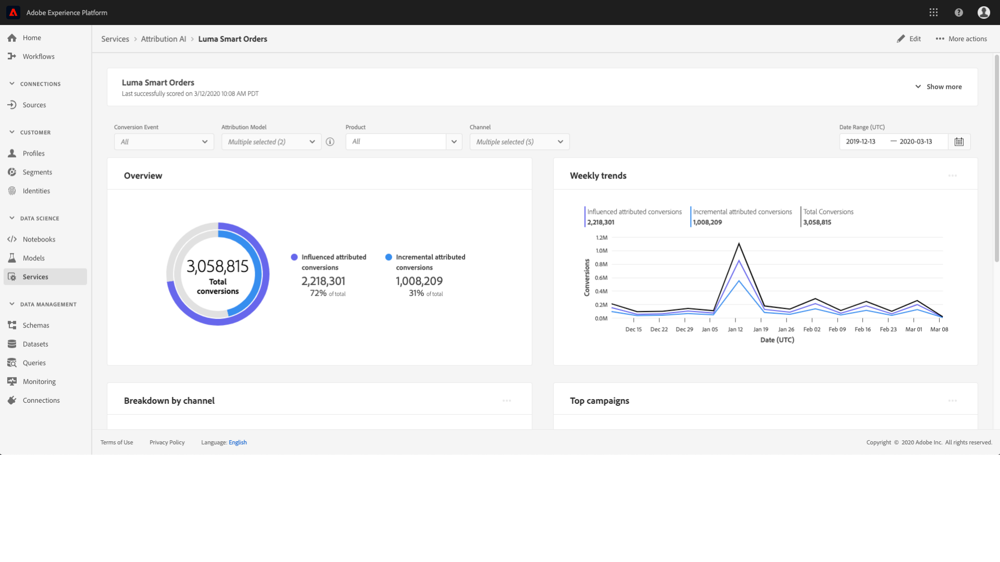

# Descubrimiento de perspectivas en Attribution AI

Las instancias de servicio de Attribution AI proporcionan perspectivas que pueden utilizarse para ayudar a tomar y medir las decisiones de marketing relacionadas con el rendimiento de marketing y el retorno de la inversión. La selección de una instancia de servicio proporciona visualizaciones y filtros para ayudarle a comprender el impacto de cada interacción con los clientes en cada fase del viaje del cliente.

Este documento sirve como guía para interactuar con perspectivas de instancias de servicio en la interfaz de usuario de Adobe Intelligent Services.

## Primeros pasos

Para utilizar perspectivas para Attribution AI, debe tener disponible una instancia de servicio con un estado de ejecución correcto. Para crear una nueva instancia de servicio, visite la guía [de la interfaz de usuario de](./user-guide.md)Attribution AI. Si ha creado recientemente una instancia de servicio y aún está en formación y puntaje, espere 24 horas para que termine de ejecutarse.

## Información general sobre perspectivas de instancias de servicio

En la [!DNL Adobe Experience Platform] interfaz de usuario, haga clic en **[!UICONTROL Servicios]** en el panel de navegación izquierdo. Aparece el navegador **[!UICONTROL Servicios]** y muestra los servicios inteligentes de Adobe disponibles. En el contenedor de Attribution AI, haga clic en **[!UICONTROL Abrir]**.

Aparece la página de servicio de Attribution AI. Esta página lista las instancias de servicio de Attribution AI y muestra información sobre ellas, incluido el nombre de la instancia, los eventos de conversión, la frecuencia con la que se ejecuta la instancia y el estado de la última actualización. Haga clic en el nombre de una instancia de servicio para comenzar.

>[!NOTE]
>
>Solo se pueden seleccionar las instancias de servicio que hayan completado correctamente las ejecuciones de puntuación.

A continuación, se abre la página de perspectivas de esa instancia de servicio, donde se le proporcionan visualizaciones y una serie de filtros para interactuar con sus datos. Las visualizaciones y filtros se explican con más detalle en esta guía.

### Detalles de instancia de servicio

Para vista de detalles adicionales para una instancia de servicio, haga clic en **[!UICONTROL Mostrar más]** en la parte superior derecha.

Aparece una lista detallada. Para obtener más información sobre cualquiera de las propiedades enumeradas, visite la guía del usuario de [Attribution AI](./user-guide.md).

### Editar una instancia

Para editar una instancia, haga clic en **[!UICONTROL Editar]** en la navegación superior derecha.

Aparece el cuadro de diálogo de edición, que le permite editar la descripción y la frecuencia de puntuación de la instancia. Para confirmar los cambios y cerrar el cuadro de diálogo, haga clic en **[!UICONTROL Editar]** en la esquina inferior derecha.

### Más acciones {#more-actions}

El botón **[!UICONTROL Más acciones]** se encuentra en la navegación superior derecha junto a *Editar*. Al hacer clic en **[!UICONTROL Más acciones]** se abre una lista desplegable que le permite seleccionar una de las siguientes operaciones:

- **Eliminar**: Elimina la instancia.
- **Descargar datos** de resumen: Descarga un archivo CSV que contiene los datos de resumen.
- **Puntuaciones** de acceso: Al hacer clic en **Access score** , se le redirige a las puntuaciones de [acceso para el tutorial](./download-scores.md)de Attribution AI.
- **Historial** de ejecución de vistas: Aparece una ventana emergente que contiene una lista de todas las ejecuciones de puntuación asociadas con la instancia de servicio.

## Filtrado de datos

Las perspectivas de Attribution AI le permiten filtrar los datos y actualizar automáticamente los elementos visuales de la interfaz de usuario en función de los filtros seleccionados.

>[!NOTE]
>
>De forma predeterminada, cada filtro se establece en &quot;Todo&quot; excepto el filtro &quot;Modelo[!UICONTROL de]atribución&quot;, que se establece en &quot;Conversiones atribuidas incrementales e influenciadas&quot;.

### Evento de conversión

Cuando se crea una nueva instancia en Attribution AI, uno de los campos obligatorios es &quot;eventos de conversión&quot;. Los eventos de conversión son objetivos comerciales que identifican el impacto de las actividades de mercadotecnia, como los pedidos de comercio electrónico, las compras en el almacén y las visitas al sitio web.

Desde la instancia, la lista desplegable eventos **[!UICONTROL de]** conversión permite seleccionar cualquiera de los eventos definidos para la instancia a fin de filtrar los datos. Al seleccionar eventos específicos, se cambian las visualizaciones de la interfaz de usuario para rellenar solo las conversiones que pertenecen a esos eventos.

### Modelo de atribución

Al hacer clic en Modelo **[!UICONTROL de]** atribución se abre una lista desplegable con todos los modelos de atribución disponibles. Puede seleccionar varios modelos para comparar los resultados. Para obtener más información sobre los distintos modelos de atribución y cómo funcionan, visite la información general de [Attribution AI](./overview.md) que contiene una tabla con información sobre cada modelo.

### Producto

El filtro **[!UICONTROL Producto]** permite seleccionar entre los productos que se ingirieron inicialmente en la creación de la instancia. Haga clic en la lista desplegable y utilice la función de búsqueda para seleccionar rápidamente todos los productos que desee comparar.

### Geografía

El filtro **[!UICONTROL Geografía]** rellena los códigos de país en función de los modelos de región. Dependiendo de sus datos, este filtro puede o no estar presente.

>[!NOTE]
>
>Los códigos de país tienen dos caracteres. Puede encontrar una lista completa aquí [ISO 3166-1 alpha-2](https://datahub.io/core/country-list).

### Región

>[!NOTE]
>
>Este filtro solo está presente si ha realizado el modelado [opcional basado en](./user-guide.md#region-based-modeling-optional) región de pasos en la guía de interfaz de usuario de Attribution AI al crear la instancia de servicio.

Este filtro le permite seleccionar cualquier región que configure en el proceso de creación de instancias.

### Channel

Al hacer clic en el filtro de **[!UICONTROL Canal]** se muestra una lista desplegable con todos los canales de mercadotecnia disponibles. Puede seleccionar varios canales para compararlos.

### Date Range

Haga clic en el icono de calendario para abrir la ventana emergente de intervalo de fechas. Las fechas de evento de conversión inicial y final determinan la cantidad de datos rellenados en la interfaz de usuario. Puede elegir reducir o ampliar el intervalo de fechas para enfocar o expandir la cantidad de datos rellenados.

## Información general sobre sus datos

La tarjeta **[!UICONTROL Información general]** muestra las conversiones totales según el modelo de atribución. El número total cambia en función de la cantidad específica que realice la búsqueda mediante los filtros descritos anteriormente en este documento. Al seleccionar más modelos, se agregan círculos adicionales a la Información general, cada uno con su propio color correspondiente a la leyenda.

## Tendencias semanales

La tarjeta de tendencias **** semanales desglosa la conversión total según el intervalo de fechas definido durante el proceso de filtrado.

Al hacer clic en las elipses en la parte superior derecha de la tarjeta de tendencias ** semanales se muestra un menú desplegable que permite seleccionar las tendencias diarias, semanales o mensuales.

Al pasar el ratón sobre la línea de datos de un modelo de atribución específico, se crea una ventana emergente que muestra el número total de conversiones para esa fecha.

## Desglose por canal

El **[!UICONTROL desglose por tarjeta de canal]** se utiliza para determinar el número total de conversiones en relación con cada canal. Esta tarjeta puede utilizarse para ayudar a tomar decisiones sobre la efectividad de cada canal y el rendimiento de la inversión.

Al hacer clic en las elipses en la parte superior derecha de la tarjeta **[!UICONTROL Desglosar por canal]** , se abre una lista desplegable que permite rellenar datos en función de los puntos de contacto.

## Campañas principales

La tarjeta campañas **** principales muestra información general sobre sus campañas y el rendimiento de la campaña en cada canal. Esta tarjeta puede ayudar a informar a su equipo de la efectividad de una campaña específica para un canal determinado y proporcionar una perspectiva de dónde realizar más inversiones.

## Pasos siguientes

Una vez que haya terminado de filtrar los datos y pueda mostrar la información adecuada, tiene la opción de acceder a las puntuaciones. Para obtener una guía detallada sobre cómo acceder a las puntuaciones, visite las puntuaciones de [acceso en el tutorial de Attribution AI](./download-scores.md) . Además, también puede descargar los datos de resumen como se indica en [más acciones](#more-actions). Al seleccionar &quot;Descargar datos de resumen&quot; se descargan los datos de resumen agregados por fechas.

## Recursos adicionales

El siguiente vídeo está diseñado para ayudarle en el aprendizaje de cómo utilizar la página de perspectivas de Attribution AI para comprender el ROI de los canales y campañas de mercadotecnia.

>[!VIDEO](https://video.tv.adobe.com/v/32669?learn=on&quality=12)