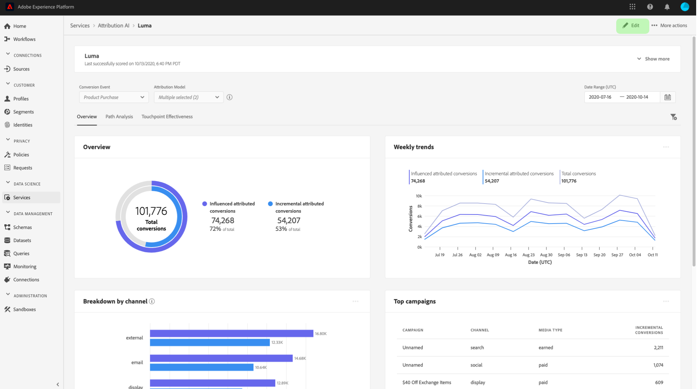

# Descubra perspectivas en Attribution AI

Las instancias de servicio de Attribution AI proporcionan perspectivas que pueden utilizarse para ayudar a tomar y medir decisiones de marketing relacionadas con el rendimiento de marketing y el retorno de la inversión. Al seleccionar una instancia de servicio, se proporcionan visualizaciones y filtros que le ayudan a comprender el impacto de cada interacción con el cliente en cada fase del recorrido con el cliente.

Este documento sirve como guía para interactuar con las perspectivas de la instancia de servicio en la interfaz de usuario de Adobe Intelligent Services.

## Introducción

Para utilizar las perspectivas para la Attribution AI de, necesita tener disponible una instancia de servicio con un estado de ejecución correcto. Para crear una nueva instancia de servicio, visite la [guía de la interfaz de usuario de Attribution AI](./user-guide.md). Si ha creado recientemente una instancia de servicio que aún se está entrenando y puntuando, espere 24 horas para que finalice la ejecución.

## Resumen de perspectivas de instancia de servicio

En la interfaz de usuario [!DNL Adobe Experience Platform], seleccione **[!UICONTROL Servicios]** en el panel de navegación izquierdo. Aparecerá el explorador **[!UICONTROL Services]** y se mostrarán los servicios inteligentes de Adobe disponibles. En el contenedor de Attribution AI, seleccione **[!UICONTROL Abrir]**.

Aparecerá la página de servicio de Attribution AI. En esta página se enumeran las instancias de servicio de Attribution AI y se muestra información sobre ellas, incluido el nombre de la instancia, los eventos de conversión, la frecuencia con la que se ejecuta y el estado de la última actualización. Seleccione el nombre de una instancia de servicio para empezar.

>[!NOTE]
>
>Solo se pueden seleccionar las instancias de servicio que hayan completado ejecuciones de puntuación correctas.

A continuación, aparecerá la página de perspectivas para esa instancia de servicio, donde se le proporcionarán visualizaciones y una serie de filtros para interactuar con los datos. Las visualizaciones y filtros se explican con más detalle en esta guía.

### Detalles de instancia del servicio

Para ver detalles adicionales de una instancia de servicio, seleccione **[!UICONTROL Mostrar más]** en la parte superior derecha.

Aparecerá una lista detallada. Para obtener más información sobre cualquiera de las propiedades enumeradas, visite la [guía del usuario de Attribution AI](./user-guide.md).

### Edición de una instancia

Para editar una instancia, seleccione **[!UICONTROL Editar]** en la barra de navegación superior derecha.

Aparecerá el cuadro de diálogo de edición, que le permitirá editar el nombre, la descripción y la frecuencia de puntuación de la instancia. Si el estado de la instancia está desactivado, no se puede editar la frecuencia de puntuación. Para confirmar los cambios y cerrar el cuadro de diálogo, selecciona **[!UICONTROL Guardar]** en la esquina inferior derecha.

### Más acciones {#more-actions}

El botón **[!UICONTROL Más acciones]** se encuentra en la barra de navegación superior derecha, junto a **[!UICONTROL Editar]**. Al seleccionar **[!UICONTROL Más acciones]**, se abre una lista desplegable que le permite seleccionar una de las siguientes operaciones:

- **[!UICONTROL Clonar]**: Clona la instancia.
- **[!UICONTROL Eliminar]**: elimina la instancia.
- **[!UICONTROL Descargar datos de resumen]**: descarga un archivo CSV que contiene los datos de resumen.
- **[!UICONTROL Puntuaciones de acceso]**: al seleccionar **[!UICONTROL Puntuaciones de acceso]**, se le redirigirá a las [puntuaciones de acceso para el tutorial de Attribution AI](./download-scores.md).
- **[!UICONTROL Ver historial de ejecución]**: Aparece una ventana emergente que contiene una lista de todas las ejecuciones de puntuación asociadas con la instancia de servicio.

## Filtrado de datos

Las perspectivas de Attribution AI le permiten filtrar los datos y actualizar automáticamente los elementos visuales de la interfaz de usuario en función de los filtros seleccionados.

### Evento de conversión

Al crear una nueva instancia en Attribution AI, uno de los campos obligatorios es &quot;Eventos de conversión&quot;. Los eventos de conversión son objetivos comerciales que identifican el impacto de las actividades de marketing, como los pedidos de comercio electrónico, las compras en la tienda y las visitas a sitios web.

Desde la instancia, la lista desplegable **[!UICONTROL Eventos de conversión]** le permite seleccionar cualquiera de los eventos definidos para su instancia a fin de filtrar los datos. Si se seleccionan eventos específicos, las visualizaciones de la interfaz de usuario se cambian para rellenar únicamente las conversiones que pertenecen a esos eventos.

### Modelo de atribución

Al seleccionar **[!UICONTROL Modelo de atribución]**, se abrirá una lista desplegable con todos los modelos de atribución disponibles. Puede seleccionar varios modelos para comparar los resultados. Para obtener más información sobre los diferentes modelos de atribución y cómo funcionan, visite la descripción general de [Attribution AI](./overview.md), que contiene una tabla con información sobre cada modelo.

### Región

>[!NOTE]
>
>Este filtro solo está presente si realizó el paso opcional [modelado basado en regiones](./user-guide.md#region-based-modeling-optional) en la guía de la interfaz de usuario de Attribution AI al crear su instancia de servicio.

Este filtro permite seleccionar cualquier región configurada en el proceso de creación de instancias.

### Añadir filtros

Puede agregar filtros adicionales seleccionando el icono **filter** para abrir la ventana emergente **[!UICONTROL Agregar filtros]**. La ventana emergente **[!UICONTROL Agregar filtros]** le permite filtrar por canal, geografía, tipo de medio y producto. La ventana emergente solo rellena los filtros aplicables para una instancia de servicio. Por ejemplo, si no ha proporcionado datos geográficos o un tipo de medios, esos atributos de filtro no van a estar disponibles para su instancia.

- **[!UICONTROL Canal]:** Si selecciona el atributo de canal, podrá filtrar cualquiera de los canales de marketing disponibles. Puede seleccionar varios canales para compararlos.
- **[!UICONTROL Geografía]:** Si selecciona el atributo de geografía, podrá filtrar los códigos de país según los modelos basados en regiones. En función de los datos, este filtro puede estar presente o no. Los códigos de país tienen dos caracteres. Consulte la lista completa de códigos de país [aquí](https://datahub.io/core/country-list).
- **[!UICONTROL Tipo de medio]:** Si selecciona el atributo de tipo de medio, podrá filtrar cualquiera de los tipos de medios definidos.
- **[!UICONTROL Producto]:** Si selecciona el atributo de producto, podrá filtrar cualquier producto que se haya ingerido inicialmente en la creación de su instancia.

### Date Range

Seleccione el icono de calendario para abrir la ventana emergente de intervalo de fechas. Las fechas de los eventos de conversión inicial y final determinan la cantidad de datos que se rellenan en la interfaz de usuario. Puede elegir reducir o ampliar el intervalo de fechas para enfocar o expandir la cantidad de datos rellenados.

## Información general sobre los datos

La tarjeta **[!UICONTROL Información general]** muestra el total de conversiones por modelo de atribución. El número total cambia en función de lo específico que realice la búsqueda con los filtros descritos anteriormente en este documento. Al seleccionar más modelos, se añaden círculos adicionales a la Información general, cada uno con su propio color correspondiente a la leyenda.

Información general del 

## Tendencias semanales

La tarjeta **[!UICONTROL Tendencias semanales]** desglosa la conversión total según el intervalo de fechas que haya establecido durante el proceso de filtrado.

Al seleccionar los puntos suspensivos en la parte superior derecha de la tarjeta **Tendencias semanales**, se muestra una lista desplegable que le permite seleccionar tendencias diarias, semanales o mensuales.

Al pasar el ratón por encima de la línea de datos de un modelo de atribución específico, se crea una ventana emergente que muestra el número total de conversiones para esa fecha.

## Desglose por canal

La tarjeta **[!UICONTROL Desglose por canal]** se usa para determinar el número total de conversiones en relación con cada canal. Esta tarjeta se puede utilizar para ayudar a tomar decisiones sobre la eficacia de cada canal y el retorno de la inversión.

Al seleccionar los puntos suspensivos en la parte superior derecha de la tarjeta **[!UICONTROL Desglose por canal]**, se abrirá una lista desplegable que le permitirá rellenar datos basados en puntos de contacto.

## Campañas principales

La tarjeta **[!UICONTROL Campañas principales]** muestra una descripción general de las campañas y de cómo funciona la campaña en cada canal. Esta tarjeta puede ayudar a informar a su equipo de la eficacia de una campaña específica para un canal determinado y proporcionar perspectivas como en qué campañas debe invertir más.

## Desglose por posición de punto de contacto

Al seleccionar la pestaña **[!UICONTROL Análisis de rutas]**, se cargarán los gráficos **[!UICONTROL Desglose por posición de punto de contacto]** y **[!UICONTROL Rutas de conversión principales]**.

El gráfico **[!UICONTROL Desglose por posición de punto de contacto]** es un desglose de las conversiones atribuidas por posición del punto de contacto comparado en todas las rutas de conversión. Este gráfico le ayuda a comprender qué puntos de contacto son más efectivos en diferentes etapas de la ruta de conversión. Las etapas son inicio, jugador y más cerca.

- **Inicio:** indica que el punto de contacto fue el primer contacto en una ruta de conversión.
- **Reproductor:** indica que el punto de contacto no fue el primer ni el último contacto que provocó una conversión.
- **Más cerca:** indica que el punto de contacto fue el último contacto antes de una conversión.

>
>
> La suma de la contribución porcentual para un modelo de atribución en todos los puntos de contacto y posiciones debe ser igual a 100.

## Rutas de conversión principales

El gráfico **[!UICONTROL Rutas de conversión principales]** muestra las puntuaciones algorítmicas e influenciadas de las rutas de conversión principales en las regiones seleccionadas. Este gráfico le permite visualizar qué puntos de contacto contribuyen a las conversiones y cuál es la puntuación de atribución para cada punto de contacto. Puede utilizar esta información para ver las rutas más frecuentes en una región determinada y ver si surge algún patrón entre los diferentes conjuntos de puntos de contacto.

## Eficacia de Touchpoint

Al seleccionar la ficha **[!UICONTROL Eficacia de puntos de contacto]**, se carga la tarjeta **[!UICONTROL Eficacia de puntos de contacto]**. Esta tarjeta utiliza la distribución de datos de Attribution AI para mostrar información de cada punto de contacto. Los datos de esta tabla solo se generan para periodos de tiempo específicos, tal como indica la fecha **[!UICONTROL Con fecha de]** en la parte superior derecha de la tarjeta.

Puede usar la información de la tarjeta **[!UICONTROL Eficacia de puntos de contacto]** para comprender cómo contribuye un punto de contacto a una conversión. También puede ver la eficacia de cada punto de contacto con las siguientes métricas de rendimiento:

**Rutas tocadas**: Esta métrica muestra un porcentaje de rutas que logran o no logran la conversión para el punto de contacto. Verá conversiones atribuidas más altas si la proporción de rutas (porcentaje) que logran la conversión en rutas que no logran la conversión es alta.

**Medida de eficiencia**: Esta métrica muestra las estrellas en una escala de uno a cinco. La escala indica la importancia relativa de un punto de contacto para realizar una conversión.

>[!NOTE]
>
>Un volumen de punto de contacto más alto no garantiza una medida de eficiencia más alta.

**Volumen total**: El número agregado de veces que un usuario ha tocado un punto de contacto. Esto incluye puntos de contacto que aparecen en una ruta que logra la conversión, así como rutas que no resultan en una conversión.

## Pasos siguientes

Una vez que haya terminado de filtrar los datos y haya podido mostrar la información adecuada, tiene la opción de acceder a las puntuaciones. Para obtener una guía detallada sobre cómo obtener acceso a sus puntuaciones, visite el tutorial [puntuaciones de acceso en Attribution AI](./download-scores.md). Además, también puede descargar los datos de resumen tal como se indica en [más acciones](#more-actions). Al seleccionar &quot;Descargar datos de resumen&quot;, se descargan los datos de resumen agregados por fechas.

## Recursos adicionales

El siguiente vídeo está diseñado para ayudarle a aprender a utilizar la página de perspectivas de Attribution AI con el fin de comprender el ROI de los canales y campañas de marketing.

>[!VIDEO](https://video.tv.adobe.com/v/32669?learn=on&quality=12)
