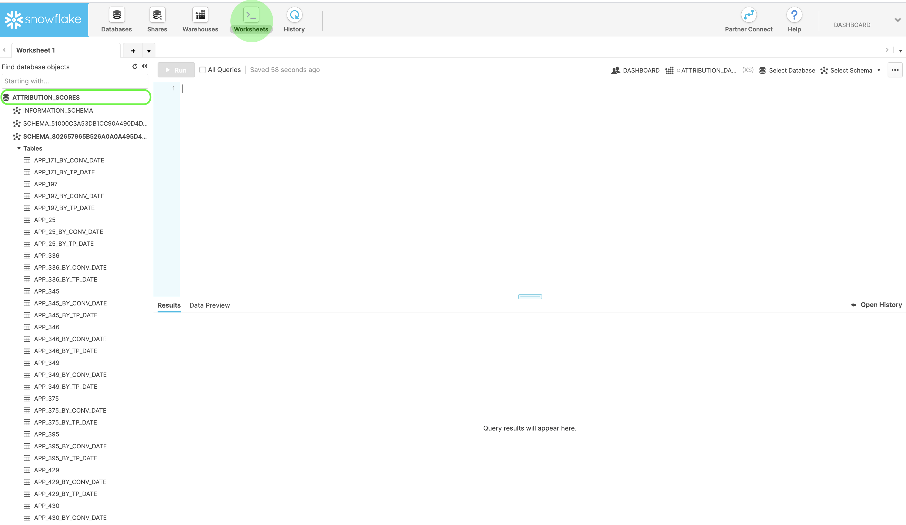

# Acceso a las puntuaciones en Atribución AI

>[!IMPORTANT] Póngase en contacto con attributionai-support@adobe.com para obtener más información sobre las descargas de puntuaciones sin procesar para la exportación masiva de datos.

El acceso a las puntuaciones para la Atribución de IA se realiza a través de Snowflake. Actualmente, debe enviar por correo electrónico a la asistencia de Adobe a attributionai-support@adobe.com para configurar y recibir las credenciales de Snowflake en su cuenta de lector.

Una vez que la asistencia de Adobe haya procesado su solicitud, se le proporcionará una dirección URL para la cuenta de lector en Snowflake y las credenciales correspondientes a continuación:

- URL del copo de nieve
- Nombre de usuario
- Contraseña

>[!NOTE] La cuenta de lector es para consultar los datos mediante clientes SQL, hojas de cálculo y soluciones BI que admiten el conector JDBC.

Una vez que tenga las credenciales y la dirección URL, puede realizar la consulta de las tablas de modelos, ya sea en su formato sin procesar., agregadas por fecha de punto de contacto o fecha de conversión.

## Encontrar tu esquema en Snowflake

Con las credenciales proporcionadas, inicie sesión en Snowflake. Haga clic en la ficha **Hojas de cálculo** en el panel de navegación principal superior izquierdo y, a continuación, vaya al directorio de la base de datos en el panel izquierdo.

A continuación, haga clic en **Seleccionar Esquema** en la esquina superior derecha de la pantalla. En la ventana emergente que aparece, confirme que tiene seleccionada la base de datos correcta. A continuación, haga clic en el menú desplegable *Esquema* y seleccione uno de los esquemas enumerados. Puede realizar la consulta directamente desde las tablas de puntuación que aparecen bajo el esquema seleccionado.

## Descarga de puntuaciones sin procesar

Póngase en contacto con attributionai-support@adobe.com para obtener más información sobre las descargas de puntuaciones sin procesar.

## Conexión de PowerBI a Copo de nieve (opcional)

Las credenciales del copo de nieve se pueden usar para configurar una conexión entre las bases de datos de PowerBI Desktop y Snowflake.

En primer lugar, en el cuadro *Servidor* , escriba la URL del copo de nieve. A continuación, en *Almacén*, escriba &quot;XSMALL&quot;. A continuación, escriba su nombre de usuario y contraseña.

Una vez establecida la conexión, seleccione la base de datos de copos de nieve y, a continuación, seleccione el esquema adecuado. Ahora puede cargar todas las tablas.

Una vez seleccionado el esquema, aparecerán tablas que contienen las puntuaciones de atribución.

| Tabla | Descripción |
| ----- | ----------- |
| APP_{APP_ID} | Puntuación de atribución sin procesar. |
| APP_{APP_ID}_BY_CONV_DATE | Puntuación de atribución sin procesar agregada en el nivel de fecha de conversión. |
| APP_{APP_ID}_BY_TP_DATE | Puntuación de atribución sin procesar agregada en el nivel de fecha del punto de contacto. |

## Pasos siguientes

Este documento describe los pasos necesarios para consultar datos y acceder a puntuaciones para la Atribución de IA. Ahora puede seguir explorando los otros servicios  inteligentes y las guías que se ofrecen.