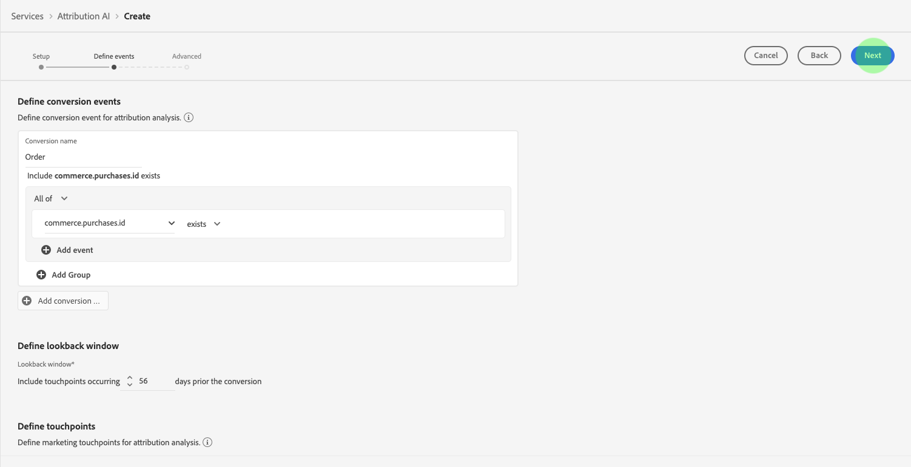
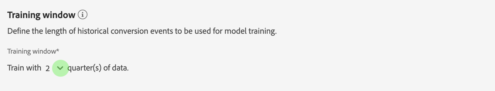

# Guía del usuario de Attribution AI

Attribution AI, como parte de Servicios Inteligentes, es un servicio de atribución algorítmica de varios canales que calcula la influencia y el impacto incremental de las interacciones de los clientes con los resultados especificados. Con la Attribution AI, los especialistas en marketing pueden medir y optimizar el gasto en marketing y publicidad al comprender el impacto de la interacción de cada cliente en cada fase de los viajes de los clientes.

Este documento sirve como guía para interactuar con Attribution AI en la interfaz de usuario de Servicios inteligentes.

## Crear una instancia

En la [!DNL Adobe Experience Platform] interfaz de usuario, haga clic en **Servicios** en el panel de navegación izquierdo. Aparece el explorador *Servicios* y muestra los servicios inteligentes de Adobe disponibles. En el contenedor de Attribution AI, haga clic en **Abrir**.

Aparece la página de servicio de Attribution AI. Esta página lista las instancias de servicio de Attribution AI y muestra información sobre ellas, incluido el nombre de la instancia, los eventos de conversión, la frecuencia con la que se ejecuta la instancia y el estado de la última actualización. Haga clic en **Crear instancia** para comenzar.

A continuación, se abre la página de configuración para Attribution AI, donde puede proporcionar información básica y especificar un conjunto de datos para la instancia.

### Asigne un nombre a la instancia

En Información ** básica, proporcione un nombre y una descripción opcional para la instancia de servicio.

### Seleccionar un conjunto de datos

Después de completar la información básica, haga clic en el menú desplegable rotulado **Seleccionar conjunto** de datos para seleccionar el conjunto de datos. El conjunto de datos se utiliza para entrenar el modelo y puntuar los datos subsiguientes que produce. Al seleccionar un conjunto de datos en el selector desplegable, solo se muestran los que son compatibles con la Attribution AI y cumplen el esquema del modelo de datos de experiencia (XDM). Una vez elegido un conjunto de datos, haga clic en **Siguiente** en la esquina superior derecha para continuar con la página de definición de eventos.

## Definición de eventos

Existen tres tipos diferentes de datos de entrada que se utilizan para definir eventos:

- **Eventos de conversión:** Objetivos comerciales que identifican el impacto de las actividades de mercadotecnia, como pedidos de comercio electrónico, compras en el almacén y visitas al sitio web.
- **Ventana retroactiva:** Proporciona un intervalo de tiempo que indica cuántos días antes de incluir los puntos de contacto del evento de conversión.
- **Puntos de contacto:** eventos de marketing de nivel de destinatario, individual o cookie utilizados para evaluar el impacto numérico o de ingresos de las conversiones.

### Definir eventos de conversión {#define-conversion-events}

Para definir un evento de conversión, debe asignar un nombre al evento y seleccionar el tipo de evento haciendo clic en el menú desplegable **Introducir nombre** de campo.

Una vez seleccionado un evento, aparece un nuevo menú desplegable a la derecha. La segunda lista desplegable se utiliza para proporcionar un contexto adicional al evento mediante el uso de operaciones. Para este evento de conversión, se utiliza la operación predeterminada *existe* .

>[!NOTE]
>
>Al definir el evento, se actualiza una cadena con el nombre ** de conversión.

Los botones *Añadir evento* y *Añadir grupo* se utilizan para definir aún más la conversión. Según la conversión que esté definiendo, es posible que tenga que utilizar los botones *Añadir evento* y *Añadir grupo* para proporcionar contexto adicional.

Al hacer clic en **Añadir evento** , se crean campos adicionales que se pueden rellenar utilizando el mismo método descrito anteriormente. Al hacerlo, se agrega una instrucción *AND* a la definición de cadena debajo del nombre *de* conversión. Haga clic en la **x** para eliminar un evento que se haya agregado.

Al hacer clic en **Añadir grupo** se ofrece la opción de crear campos adicionales separados del original. Con la adición de grupos, aparece un botón azul *Y* . Al hacer clic en **Y** se ofrece una opción para cambiar el parámetro para que contenga &quot;O&quot;. &quot;O&quot; se utiliza para definir varias rutas de conversión exitosas. &quot;And&quot; amplía la ruta de conversión para incluir condiciones adicionales.

Si necesita más de una conversión, haga clic en **Añadir conversión** para crear una nueva tarjeta de conversión. Puede repetir el proceso anterior para definir varias conversiones.

### Definir ventana retroactiva {#lookback-window}

Una vez que haya terminado de definir la conversión, deberá confirmar la ventana retrospectiva. Con las teclas de flecha o haciendo clic en el valor predeterminado (56), especifique cuántos días antes del evento de conversión desea incluir puntos de contacto. Los puntos de contacto se definen en el paso siguiente.

### Definir puntos de contacto

La definición de puntos de contacto sigue un flujo de trabajo similar al de la [definición de conversiones](#define-conversion-events). Inicialmente debe asignar un nombre al punto de contacto y seleccionar un valor de punto de contacto en el menú desplegable *Introducir nombre* de campo. Una vez seleccionada, la lista desplegable de operadores aparece con el valor predeterminado &quot;exists&quot;. Haga clic en el menú desplegable para mostrar una lista de operadores.

Para este punto de contacto, seleccione **es igual que**.

Una vez seleccionado un operador para un punto de contacto, *introduzca el valor* del campo. Los valores desplegables de *Introducir valor* de campo se rellenan en función del operador y el valor de punto de contacto seleccionados previamente. Si un valor no se rellena en la lista desplegable, puede escribir ese valor manualmente. Haga clic en el menú desplegable y seleccione **CLIC**.

>[!NOTE]
>
>Los operadores &quot;existe&quot; y &quot;no existe&quot; no tienen valores de campo asociados a ellos.

Los botones *Añadir evento* y *Añadir grupo* se utilizan para definir el punto de contacto. Debido a la naturaleza compleja que rodea los puntos de contacto, no es raro tener varios eventos y grupos para un solo punto de contacto.

Cuando se hace clic, **Añadir evento** permite agregar campos adicionales. Haga clic en la **x** para eliminar un evento que se haya agregado.

Al hacer clic en **Añadir grupo** , puede crear campos adicionales separados del original. Con la adición de grupos, aparece un botón azul *Y* . Haga clic en **Y** para cambiar el parámetro, el nuevo parámetro &quot;O&quot; se utiliza para definir varias rutas correctas. Este punto de contacto en particular solo tiene una ruta exitosa, por lo tanto no se necesita &quot;O&quot;.

>[!NOTE]
>
>Utilice la cadena debajo de *Touchpoint name* para obtener una descripción general rápida de su touchpoint. Observe que la cadena coincide con el nombre del punto de contacto.

Puede agregar puntos de contacto adicionales haciendo clic en **Añadir punto de contacto** y repitiendo el proceso anterior.

Una vez que haya terminado de definir todos los puntos de contacto necesarios, desplácese hacia arriba y haga clic en **Siguiente** en la esquina superior derecha para continuar con el paso final.

## Configuración avanzada de puntuación y formación

La última página de Attribution AI es la página *Avanzadas* que se utiliza para configurar la formación y la puntuación.

### Programar formación

Con la *programación*, puede seleccionar el día y la hora de la semana que desea que se realice la puntuación.

Haga clic en la lista desplegable en Frecuencia *de* puntuación para seleccionar entre la puntuación diaria, semanal y mensual. A continuación, seleccione los días de la semana en los que desea que tenga lugar la puntuación. Se pueden seleccionar varios días. Haga clic una segunda vez en un día para anular la selección.

Para cambiar la hora del día que desea que se produzca la puntuación, haga clic en el icono del reloj. En la nueva superposición que aparece, introduzca la hora del día en la que desea que se realice la puntuación. Haga clic fuera de la superposición para cerrarla.

>[!NOTE]
>
>Cada proceso de puntuación puede tardar hasta 24 horas en completarse.

### Modelado basado en regiones (opcional) {#region-based-modeling-optional}

El comportamiento de los clientes puede variar significativamente según el país y la región geográfica. Para las empresas globales, el uso de modelos basados en países o regiones puede aumentar la precisión de la atribución. Cada región agregada crea un nuevo modelo con los datos de esa región.

Para definir una nueva región, haga clic en **Añadir región** para realizar el inicio. En el contenedor que aparece, proporcione un nombre para la región. Sólo un valor (&quot;placeContext.geo.countryCode&quot;) se rellena desde la lista desplegable *Introducir nombre* de campo. Seleccione este valor.

A continuación, seleccione un operador.

Por último, escriba el código de país en la lista desplegable *Introducir valor* de campo.

>[!NOTE]
>
>Los códigos de país tienen dos caracteres. Puede encontrar una lista completa aquí [ISO 3166-1 alpha-2](https://datahub.io/core/country-list).

### Ventana Formación {#training-window}

Para asegurarse de que obtiene el modelo más preciso posible, es importante capacitar a su modelo con datos históricos que representen su negocio. De forma predeterminada, el modelo se entrena con 2 trimestres (6 meses) de datos de eventos de conversión. Seleccione la lista desplegable para cambiar el valor predeterminado. Puede elegir entrenar con uno o cuatro cuartos de datos (3 a 12 meses).

>[!NOTE]
>
>Un período de formación más corto es más sensible a las tendencias recientes, mientras que un período de formación más largo crea un modelo más sólido y es menos sensible a las tendencias recientes.

Una vez seleccionada la ventana de formación, haga clic en **Finalizar** en la esquina superior derecha. Deje que los datos se procesen algún tiempo. Una vez completada, aparece un cuadro de diálogo emergente que confirma que la configuración de la instancia ha finalizado. Haga clic en **Aceptar** para que se le redirija a la página de instancias ** de servicio, donde podrá ver la instancia de servicio.

## Pasos siguientes

Siguiendo este tutorial, ha creado correctamente una instancia de servicio en Attribution AI. Una vez que la instancia haya terminado de anotar (aproximadamente 24 horas), estará listo para [descubrir perspectivas](./discover-insights.md)de Attribution AI. Además, si desea descargar los resultados de puntuación, visite la documentación de [descarga de puntuaciones](./download-scores.md) sin procesar.

## Recursos adicionales

El siguiente vídeo describe un flujo de trabajo completo para crear una nueva instancia en Attribution AI.

>[!VIDEO](https://video.tv.adobe.com/v/32668?learn=on&quality=12)