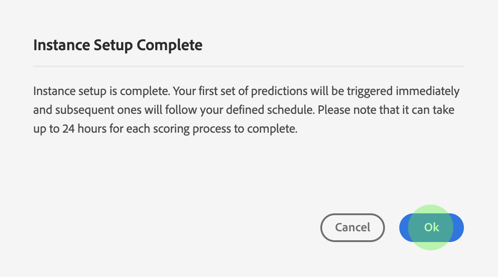

# Guía de Attribution AI UI

Attribution AI, como parte de Intelligent Services, es un servicio de atribución algorítmica de varios canales que calcula la influencia y el impacto incremental de las interacciones de los clientes con los resultados especificados. Con Attribution AI, los especialistas en marketing pueden medir y optimizar el gasto en marketing y publicidad al comprender el impacto de cada interacción del cliente individual en cada fase de los recorridos de los clientes.

Este documento sirve como guía para interactuar con Attribution AI en la interfaz de usuario de servicios inteligentes.

## Creación de un modelo

En el [!DNL Adobe Experience Platform] IU, seleccione **[!UICONTROL Servicios]** en el panel de navegación izquierdo. El **[!UICONTROL Servicios]** aparece el explorador y muestra los servicios inteligentes de Adobe disponibles. En el contenedor de Attribution AI, seleccione **[!UICONTROL Abrir]**.

Aparecerá la página de servicio de Attribution AI. En esta página se muestran los modelos de servicio de Attribution AI y se incluye información sobre ellos, como el nombre del modelo, los eventos de conversión, la frecuencia con la que se ejecuta y el estado de la última actualización.

Puede encontrar el **[!UICONTROL Eventos de conversión totales marcados]** situada en la parte inferior derecha de la variable **[!UICONTROL Crear modelo]** contenedor. Esta métrica rastrea el número total de eventos de conversión clasificados por Attribution AI para el año natural actual, incluidos todos los entornos de simulación de pruebas y cualquier modelo de servicio eliminado.

Los modelos de servicio se pueden editar, clonar y eliminar mediante los controles del lado derecho de la interfaz de usuario. Para mostrar estos controles, seleccione un modelo del existente **[!UICONTROL Modelos de servicio]**. Los controles contienen la siguiente información:

- **[!UICONTROL Editar]**: seleccionando **[!UICONTROL Editar]** permite modificar un modelo de servicio existente. Puede editar el nombre, la descripción, el estado, la frecuencia de puntuación del modelo y las columnas del conjunto de datos de puntuación adicionales.
- **[!UICONTROL Clonar]**: seleccionando **[!UICONTROL Clonar]** copia el modelo de servicio seleccionado. A continuación, puede modificar el flujo de trabajo para realizar ajustes menores y cambiarle el nombre como nuevo modelo.
- **[!UICONTROL Eliminar]**: puede eliminar un modelo de servicio que incluya cualquier ejecución histórica. El conjunto de datos de salida correspondiente se eliminará de Platform. Sin embargo, las puntuaciones sincronizadas con el perfil del cliente en tiempo real no se eliminan.
- **[!UICONTROL Fuente de datos]**: Un vínculo al conjunto de datos que se está utilizando. Si Attribution AI utiliza más de un conjunto de datos, se muestra &quot;Varios&quot; seguido del número de conjuntos de datos. Al seleccionar el hipervínculo, se muestra la ventana emergente de previsualización de los conjuntos de datos.
- **[!UICONTROL Detalles de la última ejecución]**: Esto solo se muestra cuando falla una ejecución. Aquí se muestra información sobre por qué falló la ejecución, como códigos de error.

- **[!UICONTROL Eventos de conversión]**: Una breve descripción general de los eventos de conversión configurados para este modelo.
- **[!UICONTROL Ventana retroactiva]**: el lapso de tiempo definido que indica cuántos días antes del evento de conversión se incluyen los puntos de contacto.
- **[!UICONTROL Touchpoints]**: Una lista de todos los puntos de contacto definidos al crear este modelo.

Seleccionar **[!UICONTROL Crear modelo]** para empezar.

A continuación, aparecerá la página de configuración de Attribution AI, donde puede proporcionar un nombre y una descripción opcional para el modelo de servicio.

## Seleccionar datos {#select-data}

<!-- https://www.adobe.com/go/aai-select-data -->

Por diseño, Attribution AI puede utilizar los datos de Adobe Analytics, evento de experiencia y evento de experiencia del consumidor para calcular las puntuaciones de atribución. Al seleccionar un conjunto de datos, solo se muestran los que son compatibles con Attribution AI. Para seleccionar un conjunto de datos, seleccione la opción (**+**) junto al nombre del conjunto de datos o marque la casilla de verificación para agregar varios conjuntos de datos a la vez. También puede utilizar la opción de búsqueda para encontrar rápidamente los conjuntos de datos que le interesan.

Después de seleccionar los conjuntos de datos que desea utilizar, seleccione el **[!UICONTROL Añadir]** para agregar los conjuntos de datos al panel de vista previa del conjunto de datos.

Selección del icono de información  junto a un conjunto de datos, abre la ventana emergente de vista previa del conjunto de datos.

La vista previa del conjunto de datos contiene datos como la última hora de actualización, el esquema de origen y una vista previa de las primeras diez columnas.

Seleccionar **[!UICONTROL Guardar]** para guardar los borradores conforme avanza por el flujo de trabajo. También puede guardar configuraciones de modelo de borrador y pasar al siguiente paso del flujo de trabajo. Uso **[!UICONTROL Guardar y continuar]** para crear y guardar borradores durante las configuraciones del modelo. La función permite crear y guardar borradores de la configuración del modelo y es especialmente útil cuando tiene que definir muchos campos en el flujo de trabajo de configuración.

### Integridad del conjunto de datos {#dataset-completeness}

<!-- https://www.adobe.com/go/aai-dataset-completeness -->

En la vista previa del conjunto de datos hay un valor de porcentaje de integridad del conjunto de datos. Este valor proporciona una instantánea rápida de cuántas columnas del conjunto de datos están vacías o son nulas. Si un conjunto de datos contiene muchos valores que faltan y estos valores se capturan en otra parte, se recomienda encarecidamente incluir el conjunto de datos que contiene los valores que faltan.

>[!NOTE]
>
>La integridad del conjunto de datos se calcula mediante la ventana de formación máxima para el Attribution AI (un año). Esto significa que los datos con más de un año de antigüedad no se tienen en cuenta al mostrar el valor de integridad del conjunto de datos.

### Seleccionar una identidad {#identity}

Ahora puede unir varios conjuntos de datos entre sí en función del mapa de identidad (campo). Debe seleccionar un tipo de identidad (también conocido como &quot;área de nombres de identidad&quot;) y un valor de identidad dentro de ese área de nombres. Si ha asignado más de un campo como identidad dentro del esquema en el mismo área de nombres, todos los valores de identidad asignados aparecerán en el menú desplegable de identidad precedidos del área de nombres, como `EMAIL (personalEmail.address)` o `EMAIL (workEmail.address)`.

>[!IMPORTANT]
>
>Se debe utilizar el mismo tipo de identidad (área de nombres) para cada conjunto de datos seleccionado. Aparece una marca de verificación verde junto al tipo de identidad dentro de la columna de identidad que indica que los conjuntos de datos son compatibles. Por ejemplo, al usar el área de nombres Phone y `mobilePhone.number` como identificador, todos los identificadores de los conjuntos de datos restantes deben contener y utilizar el área de nombres Phone.

Para seleccionar una identidad, seleccione el valor subrayado ubicado en la columna de identidad. Aparecerá la ventana emergente Seleccionar una identidad.

En caso de que haya más de una identidad disponible dentro de un área de nombres, asegúrese de seleccionar el campo de identidad correcto para su caso de uso. Por ejemplo, hay dos identidades de correo electrónico disponibles en el área de nombres de correo electrónico, un correo electrónico laboral y uno personal. Según el caso de uso, es más probable que un correo electrónico personal se rellene y sea más útil en predicciones individuales. Esto significa que debe seleccionar `EMAIL (personalEmail.address)` como su identidad.

>[!NOTE]
>
> Si no existe ningún tipo de identidad (área de nombres) válido para un conjunto de datos, debe establecer una identidad principal y asignarla a un área de nombres de identidad mediante [editor de esquemas](../../xdm/schema/composition.md#identity). Para obtener más información sobre áreas de nombres e identidades, visite la [Áreas de nombres del servicio de identidad](../../identity-service/namespaces.md) documentación.

## Asignación de campos de campaña y canal de medios {#aai-mapping}

<!-- https://www.adobe.com/go/aai-mapping -->

Cuando haya terminado de seleccionar y agregar conjuntos de datos, la variable **Mapa** paso de configuración. Attribution AI requiere que asigne el campo Canal de medios a cada conjunto de datos seleccionado en el paso anterior. Esto se debe a que sin la asignación de canal de medios entre conjuntos de datos, es posible que las perspectivas derivadas de Attribution AI no se muestren correctamente, lo que dificulta la interpretación de la página de perspectivas. Aunque solo es necesario el canal de medios, se recomienda encarecidamente que asigne algunos de los campos opcionales, como acción de medios, nombre de la campaña, grupo de campañas y etiqueta de campaña. Al hacerlo, Attribution AI proporciona perspectivas más claras y resultados óptimos.

## Definición de eventos {#define-events}

<!-- https://www.adobe.com/go/aai-define-events -->

Existen tres tipos diferentes de datos de entrada utilizados para definir eventos:

- **Eventos de conversión:** Objetivos comerciales que identifican el impacto de las actividades de marketing, como los pedidos de comercio electrónico, las compras en la tienda y las visitas a sitios web.
- **Ventana retroactiva:** Proporciona un intervalo de tiempo que indica cuántos días antes del evento de conversión se deben incluir los puntos de contacto.
- **Puntos de contacto:** eventos de marketing de nivel de destinatario, individual o de cookie utilizados para evaluar el impacto numérico o basado en ingresos de las conversiones.

### Definir eventos de conversión {#define-conversion-events}

Para definir un evento de conversión, debe asignar un nombre al evento y seleccionar el tipo de evento seleccionando el conjunto de datos y el campo en la **Seleccionar un conjunto de datos y un campo** menú desplegable.

Una vez seleccionado un evento, aparece una nueva lista desplegable a su derecha. La segunda lista desplegable se utiliza para proporcionar más contexto al evento mediante el uso de operaciones. Para este evento de conversión, la operación predeterminada *existe* se utiliza.

>[!NOTE]
>
>Una cadena debajo de su *nombre de conversión* se actualiza a medida que define el evento.

A continuación, puede seleccionar un conjunto de datos combinado que se genera combinando todos los conjuntos de datos de entrada en el paso anterior. También puede seleccionar una columna basada en conjuntos de datos individuales de la **Seleccionar un conjunto de datos y un campo** menú desplegable.

El **[!UICONTROL Añadir evento]** y **[!UICONTROL Agregar grupo]** Los botones se utilizan para definir aún más la conversión. Según la conversión que esté definiendo, es posible que tenga que utilizar el **[!UICONTROL Añadir evento]** y **[!UICONTROL Agregar grupo]** para proporcionar más contexto.

Seleccionar **[!UICONTROL Añadir evento]** crea campos adicionales que se pueden rellenar con el mismo método descrito anteriormente. Al hacerlo, se agrega una instrucción AND a la definición de cadena debajo del nombre de conversión. Seleccione el **x** para eliminar un evento que se haya agregado.

Seleccionar **[!UICONTROL Agregar grupo]** ofrece la opción de crear campos adicionales separados del original. Con la adición de grupos, un *Y* aparece el botón. Seleccionar **Y** proporciona una opción para cambiar el parámetro de modo que contenga &quot;Or&quot;. &quot;O&quot; se utiliza para definir varias rutas de conversión correctas. &quot;And&quot; amplía la ruta de conversión para incluir condiciones adicionales.

Si necesita más de una conversión, seleccione **Añadir conversión** para crear una nueva tarjeta de conversión. Puede repetir el proceso anterior para definir varias conversiones.

### Definir ventana retrospectiva {#lookback-window}

Una vez que haya terminado de definir la conversión, debe confirmar la ventana retrospectiva. Con las teclas de flecha o seleccionando el valor predeterminado (56), especifique cuántos días antes del evento de conversión desea incluir puntos de contacto de. Los puntos de contacto se definen en el siguiente paso.

### Definición de puntos de contacto

La definición de puntos de contacto sigue un flujo de trabajo similar al siguiente [definición de conversiones](#define-conversion-events). Inicialmente, debe asignar un nombre al punto de contacto y seleccionar un valor de punto de contacto en la *Introducir nombre de campo* menú desplegable. Una vez seleccionado, aparece la lista desplegable del operador con el valor predeterminado &quot;exists&quot;. Seleccione la lista desplegable para mostrar una lista de operadores.

Para este punto de contacto, seleccione **igual a**.

Una vez seleccionado el operador de un punto de contacto, *Introducir valor de campo* está disponible. Los valores desplegables para *Introducir valor de campo* rellene en función del valor de operador y punto de contacto seleccionado anteriormente. Si un valor no se rellena en la lista desplegable, puede escribirlo en manualmente. Seleccione el menú desplegable y seleccione **CLIC**.

>[!NOTE]
>
>Los operadores &quot;existe&quot; y &quot;no existe&quot; no tienen valores de campo asociados.

El **Añadir evento** y **Agregar grupo** para definir aún más el punto de contacto. Debido a la compleja naturaleza que rodea los puntos de contacto, no es inusual tener varios eventos y grupos para un único punto de contacto.

Cuando se selecciona, **Añadir evento** permite añadir campos adicionales. seleccione el **x** para eliminar un evento que se haya agregado.

Seleccionar **Agregar grupo** le da la opción de crear campos adicionales separados del original. Con la adición de grupos, un *Y* aparece el botón. Seleccionar **Y** para cambiar el parámetro, se utiliza el nuevo parámetro &quot;Or&quot; para definir varias rutas correctas. Este punto de contacto en particular solo tiene una ruta correcta, por lo que no se necesita &quot;O&quot;.

>[!NOTE]
>
>Utilice la cadena debajo de *Nombre de Touchpoint* para obtener una descripción general rápida del punto de contacto. Observe que la cadena coincide con el nombre del punto de contacto.

Puede añadir puntos de contacto adicionales seleccionando **Añadir punto de contacto** y repitiendo el proceso anterior.

Cuando haya terminado de definir todos los puntos de contacto necesarios, desplácese hacia arriba y seleccione **Siguiente** en la esquina superior derecha para continuar con el paso final.

## Configuración avanzada de formación y puntuación

La última página de Attribution AI es la **[!UICONTROL Avanzadas]** página utilizada para configurar la formación y la puntuación.

### Programar formación

Uso del *Programación*, puede seleccionar el día y la hora de la semana en que desea que se realice la puntuación.

Seleccione la lista desplegable debajo de *Frecuencia de puntuación* para seleccionar entre puntuación diaria, semanal y mensual. A continuación, seleccione los días de la semana en los que desea que tenga lugar la puntuación. Se pueden seleccionar varios días. Si se vuelve a seleccionar el mismo día, se anula la selección.

Para cambiar la hora del día en la que desea que se produzca la puntuación, seleccione el icono del reloj. En la nueva superposición que aparece, introduzca la hora del día a la que desea que se realice la puntuación. Seleccione fuera de la superposición para cerrarla.

>[!NOTE]
>
>Cada proceso de puntuación puede tardar hasta 24 horas en completarse.

### Columnas adicionales del conjunto de datos de puntuación (opcional)

De forma predeterminada, se crea un conjunto de datos de puntuación para cada modelo de servicio en un esquema estándar. Puede elegir añadir columnas adicionales basadas en las configuraciones de Evento de conversión y Punto de contacto a la salida del conjunto de datos de puntuación. Para empezar, seleccione las columnas de su conjunto de datos de entrada y, a continuación, puede arrastrarlas y soltarlas para cambiar el orden manteniendo presionado el botón izquierdo del ratón sobre el icono de hamburguesa.

### Modelado basado en regiones (opcional) {#region-based-modeling-optional}

El comportamiento de sus clientes puede diferir significativamente según el país y la región geográfica. Para las empresas globales, el uso de modelos basados en países o regiones puede aumentar la precisión de atribución. Cada región agregada crea un nuevo modelo con los datos de esa región.

Para definir una nueva región, comience seleccionando **[!UICONTROL Agregar región]**. En el contenedor que aparece, indique un nombre para la región. Solo se rellena un valor (&quot;placeContext.geo.countryCode&quot;) del **[!UICONTROL Introducir nombre de campo]** desplegable. Seleccione este valor.

A continuación, seleccione un operador.

Por último, escriba el código de país en la **[!UICONTROL Introducir valor de campo]** desplegable.

>[!NOTE]
>
>Los códigos de país tienen dos caracteres. Puede encontrar una lista completa aquí [ISO 3166-1 alpha-2](https://datahub.io/core/country-list).

### Ventana de formación {#training-window}

Para garantizar que obtiene el modelo más preciso posible, es importante entrenar su modelo con datos históricos que representen su negocio. De forma predeterminada, el modelo se entrena con 2 trimestres (6 meses) de datos de eventos de conversión. Seleccione el menú desplegable para cambiar el valor predeterminado. Puede elegir entrenar con de uno a cuatro trimestres de datos (de 3 a 12 meses).

>[!NOTE]
>
>Una ventana de formación más corta es más sensible a las tendencias recientes, mientras que una ventana de formación más larga crea un modelo más sólido y es menos sensible a las tendencias recientes.

Una vez seleccionada la ventana de formación, seleccione **[!UICONTROL Finalizar]** en la esquina superior derecha. Deje que transcurra un tiempo para que se procesen los datos. Una vez finalizada, aparece un cuadro de diálogo emergente que confirma que la configuración de la instancia ha finalizado. Seleccionar **[!UICONTROL Ok]** para que se le redirija a **[!UICONTROL Instancias de servicio]** página donde puede ver la instancia de servicio de.

## Pasos siguientes

Al seguir este tutorial, ha creado correctamente una instancia de servicio en Attribution AI. Una vez que la instancia haya finalizado la puntuación (puede tardar hasta 24 horas), estará listo para lo siguiente [descubra Attribution AI insights](./discover-insights.md). Además, si desea descargar los resultados de la puntuación, visite la [descarga de puntuaciones](./download-scores.md) documentación.

## Recursos adicionales

El siguiente vídeo describe un flujo de trabajo completo para crear una nueva instancia en Attribution AI.

>[!VIDEO](https://video.tv.adobe.com/v/32668?learn=on&quality=12)
