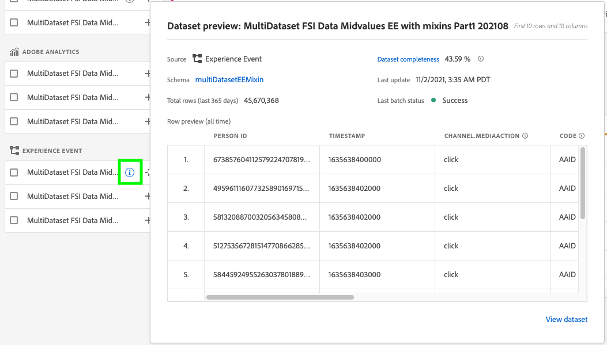
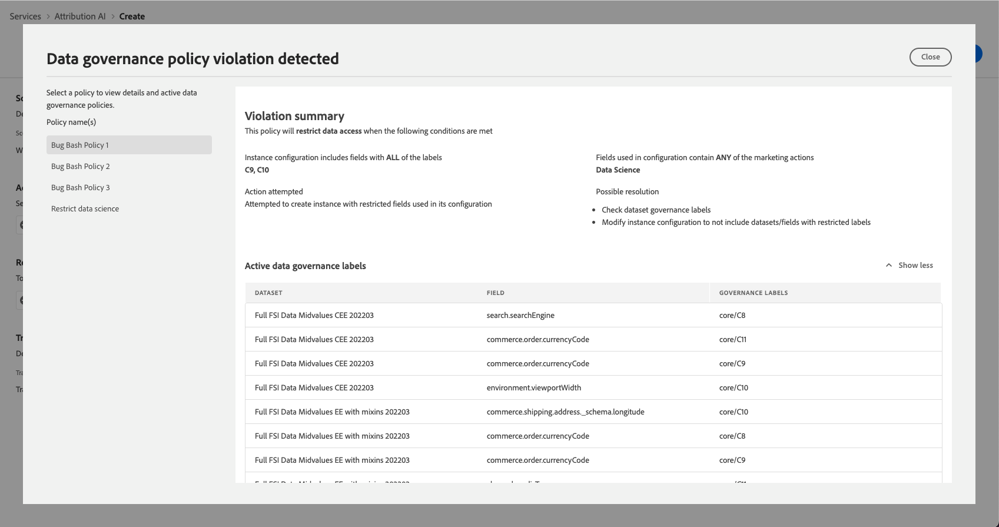

# Guía de la interfaz de usuario de Attribution AI

Attribution AI, como parte de Servicios inteligentes es un servicio de atribución algorítmica de varios canales que calcula la influencia y el impacto incremental de las interacciones de los clientes con los resultados especificados. Con Attribution AI, los especialistas en marketing pueden medir y optimizar el gasto en marketing y publicidad al comprender el impacto de cada interacción individual con los clientes en cada fase de los recorridos de los clientes.

Este documento sirve como guía para interactuar con Attribution AI en la interfaz de usuario de Servicios inteligentes.

## Crear una instancia

En el [!DNL Adobe Experience Platform] IU, seleccione **[!UICONTROL Servicios]** en el panel de navegación izquierdo. La variable **[!UICONTROL Servicios]** el explorador aparece y muestra los servicios inteligentes de Adobe disponibles. En el contenedor para Attribution AI, seleccione **[!UICONTROL Apertura]**.

Aparecerá la página del servicio de Attribution AI. Esta página enumera las instancias de servicio de Attribution AI y muestra información sobre ellas, como el nombre de la instancia, los eventos de conversión, la frecuencia con la que se ejecuta la instancia y el estado de la última actualización.

Puede encontrar la variable **[!UICONTROL Total de eventos de conversión marcados]** métrica ubicada en la parte inferior derecha del **[!UICONTROL Crear instancia]** contenedor. Esta métrica rastrea el número total de eventos de conversión marcados por Attribution AI para el año natural actual, incluidos todos los entornos de espacio aislado y las instancias de servicio eliminadas.

Las instancias de servicio se pueden editar, clonar y eliminar utilizando los controles del lado derecho de la interfaz de usuario. Para mostrar estos controles, seleccione una instancia de la **[!UICONTROL Instancias de servicio]**. Los controles contienen la siguiente información:

- **[!UICONTROL Editar]**: Selección **[!UICONTROL Editar]** permite modificar una instancia de servicio existente. Puede editar el nombre, la descripción, el estado y la frecuencia de puntuación de la instancia.
- **[!UICONTROL Clonar]**: Selección **[!UICONTROL Clonar]** copia la instancia de servicio seleccionada. A continuación, puede modificar el flujo de trabajo para realizar ajustes menores y cambiarle el nombre como una nueva instancia.
- **[!UICONTROL Eliminar]**: Puede eliminar una instancia de servicio, incluidas las ejecuciones históricas. El conjunto de datos de salida correspondiente se eliminará de Platform. Sin embargo, las puntuaciones sincronizadas con Perfil del cliente en tiempo real no se eliminan.
- **[!UICONTROL Fuente de datos]**: Un vínculo al conjunto de datos que se está utilizando. Si Attribution AI está usando más de un conjunto de datos, se muestra &quot;Múltiple&quot; seguido del número de conjuntos de datos. Al seleccionar el hipervínculo, se muestra la ventana emergente de vista previa de conjuntos de datos.
- **[!UICONTROL Detalles de la última ejecución]**: Esto solo se muestra cuando falla una ejecución. Aquí se muestra información sobre por qué la ejecución falló, como códigos de error.

- **[!UICONTROL Eventos de conversión]**: Información general rápida sobre los eventos de conversión configurados para esta instancia.
- **[!UICONTROL Ventana retroactiva]**: El lapso de tiempo definido que indica cuántos días antes de que se incluyan los puntos de contacto del evento de conversión.
- **[!UICONTROL Touchpoints]**: Una lista de todos los puntos de contacto definidos al crear esta instancia.

Select **[!UICONTROL Crear instancia]** para comenzar.

A continuación, aparece la página de configuración de Attribution AI, donde puede proporcionar un nombre y una descripción opcional para la instancia de servicio.

## Selección de datos {#select-data}

<!-- https://www.adobe.com/go/aai-select-data -->

Por diseño, la Attribution AI puede utilizar los datos de Adobe Analytics, Experience Event y Consumer Experience Event para calcular las puntuaciones de atribución. Al seleccionar un conjunto de datos, solo se muestran los que son compatibles con la Attribution AI. Para seleccionar un conjunto de datos, seleccione el (**+**) junto al nombre del conjunto de datos o seleccione la casilla de verificación para agregar varios conjuntos de datos a la vez. También puede utilizar la opción de búsqueda para encontrar rápidamente los conjuntos de datos que le interesen.

Después de seleccionar los conjuntos de datos que desea utilizar, seleccione la **[!UICONTROL Agregar]** para agregar los conjuntos de datos al panel de vista previa del conjunto de datos.

Selección del icono de información  junto a un conjunto de datos se abre la ventana emergente de vista previa del conjunto de datos.

La vista previa del conjunto de datos contiene datos como la hora de la última actualización, el esquema de origen y una vista previa de las diez primeras columnas.

Select **[!UICONTROL Guardar]** para guardar los borradores a medida que avanza por el flujo de trabajo. También puede guardar configuraciones de modelo de borrador y pasar al siguiente paso del flujo de trabajo. Uso **[!UICONTROL Guardar y continuar]** para crear y guardar borradores durante las configuraciones del modelo. La función permite crear y guardar borradores de la configuración del modelo y es especialmente útil cuando tiene que definir muchos campos en el flujo de trabajo de configuración.

### Complejidad del conjunto de datos {#dataset-completeness}

<!-- https://www.adobe.com/go/aai-dataset-completeness -->

En la vista previa del conjunto de datos es un valor de porcentaje de integridad del conjunto de datos. Este valor proporciona una instantánea rápida de cuántas columnas del conjunto de datos están vacías o nulas. Si un conjunto de datos contiene muchos valores que faltan y estos valores se capturan en otra parte, se recomienda que incluya el conjunto de datos que contiene los valores que faltan.

>[!NOTE]
>
>La integridad del conjunto de datos se calcula utilizando la ventana de formación máxima para el Attribution AI (un año). Esto significa que no se tienen en cuenta los datos que tengan más de un año al mostrar el valor de integridad del conjunto de datos.

### Seleccionar una identidad {#identity}

Ahora puede unir varios conjuntos de datos entre sí según el mapa de identidad (campo). Debe seleccionar un tipo de identidad (también conocido como &quot;área de nombres de identidad&quot;) y un valor de identidad dentro de ese área de nombres. Si ha asignado más de un campo como identidad dentro del esquema en el mismo espacio de nombres, todos los valores de identidad asignados aparecerán en la lista desplegable de identidad precedida por el área de nombres, como `EMAIL (personalEmail.address)` o `EMAIL (workEmail.address)`.

>[!IMPORTANT]
>
>Se debe utilizar el mismo tipo de identidad (área de nombres) para cada conjunto de datos que seleccione. Aparece una marca de verificación verde junto al tipo de identidad dentro de la columna de identidad que indica que los conjuntos de datos son compatibles. Por ejemplo, al utilizar el área de nombres de Phone y `mobilePhone.number` como identificador, todos los identificadores para los conjuntos de datos restantes deben contener y utilizar el área de nombres de Phone.

Para seleccionar una identidad, seleccione el valor subrayado ubicado en la columna de identidad. Aparecerá la ventana Seleccionar una identidad.

En el caso de que haya más de una identidad disponible en un área de nombres, asegúrese de seleccionar el campo de identidad correcto para el caso de uso. Por ejemplo, hay dos identidades de correo electrónico disponibles en el área de nombres del correo electrónico, un trabajo y un correo electrónico personal. Según el caso de uso, es más probable que se rellene un correo electrónico personal, que sea más útil en predicciones individuales. Esto significa que debería seleccionar `EMAIL (personalEmail.address)` como su identidad.

>[!NOTE]
>
> Si no existe ningún tipo de identidad válido (área de nombres) para un conjunto de datos, debe establecer una identidad principal y asignarla a un área de nombres de identidad mediante la variable [editor de esquemas](../../xdm/schema/composition.md#identity). Para obtener más información sobre áreas de nombres e identidades, visite [Espacios de nombres del servicio de identidad](../../identity-service/namespaces.md) documentación.

## Asignación de canales de medios y campos de campaña {#aai-mapping}

<!-- https://www.adobe.com/go/aai-mapping -->

Cuando haya terminado de seleccionar y agregar conjuntos de datos, la variable **Mapa** aparece el paso de configuración. Attribution AI requiere que asigne el campo Canal de medios para cada conjunto de datos seleccionado en el paso anterior. Esto se debe a que, sin la asignación de canales de medios entre conjuntos de datos, es posible que las perspectivas derivadas de la Attribution AI no se muestren correctamente, lo que dificulta la interpretación de la página de perspectivas. Aunque solo se requiere el canal de medios, se recomienda encarecidamente asignar algunos de los campos opcionales, como Acción de medios, Nombre de campaña, Grupo de campaña y Etiqueta de campaña. Al hacerlo, el Attribution AI puede proporcionar perspectivas más claras y resultados óptimos.

## Definición de eventos {#define-events}

<!-- https://www.adobe.com/go/aai-define-events -->

Existen tres tipos diferentes de datos de entrada que se utilizan para definir eventos:

- **Eventos de conversión:** Objetivos empresariales que identifican el impacto de las actividades de marketing, como pedidos de comercio electrónico, compras en tiendas y visitas a sitios web.
- **Ventana retroactiva:** Proporciona un lapso de tiempo que indica cuántos días antes de que se incluyan los puntos de contacto del evento de conversión.
- **Puntos de contacto:** eventos de marketing a nivel de destinatario, individuo o cookie utilizados para evaluar el impacto numérico o basado en ingresos de las conversiones.

### Definir eventos de conversión {#define-conversion-events}

Para definir un evento de conversión, debe asignar un nombre al evento y seleccionar el tipo de evento seleccionando el conjunto de datos y el campo en el **Seleccionar un conjunto de datos y un campo** menú desplegable.

Una vez seleccionado un evento, aparece un nuevo menú desplegable a la derecha. La segunda lista desplegable se utiliza para proporcionar un contexto adicional al evento mediante el uso de operaciones. Para este evento de conversión, la operación predeterminada *existe* se utiliza.

>[!NOTE]
>
>Una cadena debajo de su *nombre de conversión* se actualiza a medida que define el evento.

A continuación, puede seleccionar un conjunto de datos combinado que se genere combinando todos los conjuntos de datos de entrada en el paso anterior. Como alternativa, puede seleccionar una columna basada en conjuntos de datos individuales desde el **Seleccionar un conjunto de datos y un campo** menú desplegable.

La variable **[!UICONTROL Agregar evento]** y **[!UICONTROL Agregar grupo]** para definir aún más la conversión. Según la conversión que esté definiendo, es posible que tenga que usar la variable **[!UICONTROL Agregar evento]** y **[!UICONTROL Agregar grupo]** para proporcionar más contexto.

Selección **[!UICONTROL Agregar evento]** crea campos adicionales que se pueden rellenar utilizando el mismo método descrito anteriormente. Al hacerlo, se agrega una instrucción AND a la definición de cadena debajo del nombre de conversión. Seleccione el **x** para eliminar un evento que se haya agregado.

Selección **[!UICONTROL Agregar grupo]** da la opción de crear campos adicionales separados del original. Con la adición de grupos, un azul *Y* aparece. Selección **Y** ofrece una opción para cambiar el parámetro a contener &quot;O&quot;. &quot;O&quot; se utiliza para definir varias rutas de conversión correctas. &quot;And&quot; amplía la ruta de conversión para incluir condiciones adicionales.

Si necesita más de una conversión, seleccione **Agregar conversión** para crear una tarjeta de conversión nueva. Puede repetir el proceso anterior para definir varias conversiones.

### Definir ventana retrospectiva {#lookback-window}

Cuando haya terminado de definir la conversión, debe confirmar la ventana retrospectiva. Con las teclas de flecha o seleccionando el valor predeterminado (56), especifique cuántos días antes del evento de conversión desea incluir los puntos de contacto. Los puntos de contacto se definen en el paso siguiente.

### Definir puntos de contacto

La definición de puntos de contacto sigue un flujo de trabajo similar a [definición de conversiones](#define-conversion-events). Inicialmente, debe asignar un nombre al punto de contacto y seleccionar un valor de punto de contacto del *Introducir nombre de campo* menú desplegable. Una vez seleccionado, aparece la lista desplegable de operadores con el valor predeterminado &quot;existe&quot;. Seleccione la lista desplegable para mostrar una lista de operadores.

Para este punto de contacto, seleccione **es igual que**.

Una vez seleccionado un operador para un punto de contacto, *Introducir valor de campo* está disponible. Los valores desplegables de *Introducir valor de campo* rellene en función del operador y el valor del punto de contacto que haya seleccionado anteriormente. Si un valor no se rellena en la lista desplegable, puede escribirlo manualmente. Seleccione la lista desplegable y seleccione **HAGA CLIC EN**.

>[!NOTE]
>
>Los operadores &quot;existe&quot; y &quot;no existe&quot; no tienen valores de campo asociados a ellos.

La variable **Agregar evento** y **Agregar grupo** para definir aún más el punto de contacto. Debido a la naturaleza compleja que rodea los puntos de contacto, no es inusual tener múltiples eventos y grupos para un solo punto de contacto.

Cuando se selecciona, **Agregar evento** permite agregar campos adicionales. seleccione **x** para eliminar un evento que se haya agregado.

Selección **Agregar grupo** le da la opción de crear campos adicionales separados del original. Con la adición de grupos, un azul *Y* aparece. Select **Y** para cambiar el parámetro, se utiliza el nuevo parámetro &quot;O&quot; para definir varias rutas correctas. Este punto de contacto en particular solo tiene una ruta correcta, por lo que no es necesario &quot;O&quot;.

>[!NOTE]
>
>Utilice la cadena de *Nombre del punto de contacto* para obtener información general rápida sobre su punto de contacto. Observe que la cadena coincide con el nombre del punto de contacto.

Para añadir puntos de contacto adicionales, seleccione **Añadir punto de contacto** y repitiendo el proceso anterior.

Cuando haya terminado de definir todos los puntos de contacto necesarios, desplácese hacia arriba y seleccione **Siguiente** en la esquina superior derecha para continuar con el paso final.

## Configuración avanzada de capacitación y puntuación

La página final en Attribution AI es la **[!UICONTROL Avanzadas]** página utilizada para configurar la formación y la puntuación.

### Programar capacitación

Al usar la variable *Programación*, puede seleccionar el día y la hora de la semana que desea que se realice la puntuación.

Seleccione la lista desplegable en *Frecuencia de puntuación* para seleccionar entre la puntuación diaria, semanal y mensual. A continuación, seleccione los días de la semana en los que desea que se realice la puntuación. Se pueden seleccionar varios días. Al seleccionar de nuevo el mismo día, se anula la selección.

Para cambiar la hora del día que desea que se produzca la puntuación, seleccione el icono de reloj. En la nueva superposición que aparece, introduzca la hora del día en la que desea que se realice la puntuación. Seleccione fuera de la superposición para cerrarla.

>[!NOTE]
>
>Cada proceso de puntuación puede tardar hasta 24 horas en completarse.

### Columnas adicionales del conjunto de datos de puntuación (opcional)

De forma predeterminada, se crea un conjunto de datos de puntuación para cada instancia de servicio en un esquema estándar. Puede elegir agregar columnas adicionales basadas en las configuraciones de Evento de conversión y Punto de contacto a la salida del conjunto de datos de puntuación. Para empezar, seleccione columnas de su conjunto de datos de entrada, puede arrastrarlas y soltarlas para cambiar el orden manteniendo presionado el botón izquierdo del ratón sobre el icono de hamburguesa.

### Modelado basado en regiones (opcional) {#region-based-modeling-optional}

Los comportamientos de los clientes pueden variar de forma significativa según el país y la región geográfica. Para las empresas globales, el uso de modelos basados en países o regiones puede aumentar la precisión de atribución. Cada región agregada crea un nuevo modelo con los datos de esa región.

Para definir una nueva región, comience por seleccionar **[!UICONTROL Añadir región]**. En el contenedor que aparece, proporcione un nombre para la región. Solo un valor (&quot;placeContext.geo.countryCode&quot;) se rellena desde la variable **[!UICONTROL Introducir nombre de campo]** lista desplegable. Seleccione este valor.

A continuación, seleccione un operador.

Por último, escriba el código de país en la **[!UICONTROL Introducir valor de campo]** lista desplegable.

>[!NOTE]
>
>Los códigos de país tienen dos caracteres. Aquí puede encontrar una lista completa [ISO 3166-1 alfa-2](https://datahub.io/core/country-list).

### Ventana de formación {#training-window}

Para garantizar que obtiene el modelo más preciso posible, es importante formar su modelo con datos históricos que representen su negocio. De forma predeterminada, el modelo se forma utilizando 2 trimestres (6 meses) de datos de eventos de conversión. Seleccione la lista desplegable para cambiar el valor predeterminado. Puede optar por entrenar con entre uno y cuatro trimestres de datos (de 3 a 12 meses).

>[!NOTE]
>
>Un período de formación más breve es más sensible a las tendencias recientes, mientras que un período de formación más largo crea un modelo más robusto y es menos sensible a las tendencias recientes.

Una vez seleccionada la ventana de formación, seleccione **[!UICONTROL Finalizar]** en la esquina superior derecha. Espere un tiempo para que los datos se procesen. Una vez finalizada, aparece un cuadro de diálogo de apertura que confirma que la configuración de la instancia ha finalizado. Select **[!UICONTROL Ok]** para ser redirigido a la función **[!UICONTROL Instancias de servicio]** página en la que puede ver la instancia de servicio.

## Políticas de gobernanza

Una vez que revise el flujo de trabajo para crear una instancia y enviar la configuración del modelo, la variable [aplicación de políticas](/help/data-governance/enforcement/auto-enforcement.md) comprueba si hay alguna infracción. Si se produce una infracción de política, aparece una ventana emergente que indica que se han violado una o más políticas. Esto sirve para garantizar que las operaciones de datos y las acciones de marketing dentro de Platform sean compatibles con las políticas de uso de datos.

La ventana emergente proporciona información específica sobre la infracción. Puede resolver estas infracciones mediante la configuración de directivas y otras medidas que no están directamente relacionadas con el flujo de trabajo de configuración. Por ejemplo, puede cambiar las etiquetas para que se puedan usar ciertos campos con fines científicos de datos. Como alternativa, también puede modificar la configuración del modelo en sí para que no use nada con una etiqueta en ella. Consulte la documentación para obtener más información sobre cómo configurar [políticas](/help/data-governance/policies/overview.md).

## Control de acceso basado en atributos

>[!IMPORTANT]
>
>El control de acceso basado en atributos está disponible actualmente solo en una versión limitada.

[Control de acceso basado en atributos](../../../help/access-control/abac/overview.md) es una función de Adobe Experience Platform que permite a los administradores controlar el acceso a objetos específicos o a funciones basadas en atributos. Los atributos pueden ser metadatos agregados a un objeto, como una etiqueta agregada a un campo o segmento de esquema. Un administrador define políticas de acceso que incluyen atributos para administrar los permisos de acceso de los usuarios.

Esta funcionalidad le permite etiquetar campos de esquema del Modelo de datos de experiencia (XDM) con etiquetas que definen ámbitos organizativos o de uso de datos. En paralelo, los administradores pueden utilizar la interfaz de administración de usuarios y funciones para definir las políticas de acceso que rodean los campos de esquema XDM y administrar mejor el acceso dado a los usuarios o grupos de usuarios (usuarios internos, externos o de terceros). Además, el control de acceso basado en atributos permite a los administradores administrar el acceso a segmentos específicos.

Mediante el control de acceso basado en atributos, los administradores pueden controlar el acceso de los usuarios a los datos personales confidenciales (SPD) y a la información de identificación personal (PII) en todos los flujos de trabajo y recursos de Platform. Los administradores pueden definir funciones de usuario que solo tengan acceso a campos y datos específicos que se correspondan con esos campos.

Debido al control de acceso basado en atributos, es posible que algunos campos y funcionalidades tengan acceso restringido y no estén disponibles para determinadas instancias del servicio de Attribution AI. Algunos ejemplos son &quot;Identidad&quot;, &quot;Definición de puntuación&quot; y &quot;Clonar&quot;.

En la parte superior del espacio de trabajo de Attribution AI **página perspectivas**, los detalles que aparecen en la barra lateral tienen acceso restringido.

Si selecciona conjuntos de datos con esquemas restringidos en la variable **[!UICONTROL Flujo de trabajo de creación de instancias]** , aparece un signo de advertencia junto al nombre del conjunto de datos con el mensaje : [!UICONTROL Se excluye la información restringida].

Cuando se obtienen vistas previas de conjuntos de datos con esquema restringido en la variable **[!UICONTROL Flujo de trabajo de creación de instancias]** , aparece una advertencia que indica que [!UICONTROL Debido a las restricciones de acceso, cierta información no se muestra en la vista previa del conjunto de datos.]

Después de crear una instancia con información restringida y continuar con el **[!UICONTROL Definir objetivo]** , aparece una advertencia en la parte superior: [!UICONTROL Debido a restricciones de acceso, cierta información no se muestra en la configuración.]

## Pasos siguientes

Al seguir este tutorial, ha creado correctamente una instancia de servicio en Attribution AI. Una vez que la instancia haya finalizado la puntuación (aproximadamente hasta 24 horas), estará listo para [descubrir perspectivas de Attribution AI](./discover-insights.md). Además, si desea descargar los resultados de puntuación, visite la [descarga de puntuaciones](./download-scores.md) documentación.

## Recursos adicionales

El siguiente vídeo describe un flujo de trabajo completo para crear una nueva instancia en Attribution AI.

>[!VIDEO](https://video.tv.adobe.com/v/32668?learn=on&quality=12)
