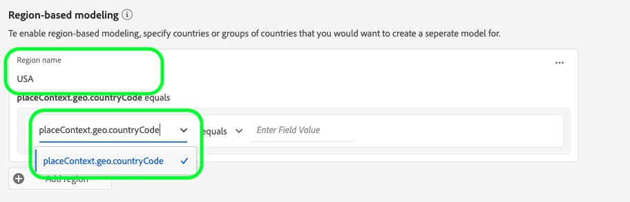

# Guía de la interfaz de usuario de Attribution AI

Attribution AI, como parte de Servicios inteligentes es un servicio de atribución algorítmica de varios canales que calcula la influencia y el impacto incremental de las interacciones de los clientes con los resultados especificados. Con Attribution AI, los especialistas en marketing pueden medir y optimizar el gasto en marketing y publicidad al comprender el impacto de cada interacción individual con los clientes en cada fase de los recorridos de los clientes.

Este documento sirve como guía para interactuar con Attribution AI en la interfaz de usuario de Servicios inteligentes.

## Crear una instancia

En la interfaz de usuario de [!DNL Adobe Experience Platform], haga clic en **[!UICONTROL Services]** en el panel de navegación izquierdo. El explorador **[!UICONTROL Services]** aparece y muestra los servicios inteligentes de Adobe disponibles. En el contenedor para Attribution AI, haga clic en **[!UICONTROL Open]**.

Aparecerá la página del servicio de Attribution AI. Esta página enumera las instancias de servicio de Attribution AI y muestra información sobre ellas, como el nombre de la instancia, los eventos de conversión, la frecuencia con la que se ejecuta la instancia y el estado de la última actualización.

Puede encontrar la métrica **[!UICONTROL Total conversion events scored]** ubicada en el lado inferior derecho del contenedor **[!UICONTROL Create instance]** . Esta métrica rastrea el número total de eventos de conversión marcados por Attribution AI para el año natural actual, incluidos todos los entornos de espacio aislado y las instancias de servicio eliminadas.

Las instancias de servicio se pueden editar, clonar y eliminar utilizando los controles del lado derecho de la interfaz de usuario. Para mostrar estos controles, seleccione una instancia de su **[!UICONTROL Service instances]** existente. Los controles contienen la siguiente información:

- **[!UICONTROL Edit]**: La selección de  **[!UICONTROL Edit]** permite modificar una instancia de servicio existente. Puede editar el nombre, la descripción, el estado y la frecuencia de puntuación de la instancia.
- **[!UICONTROL Clone]**: Al seleccionar  **[!UICONTROL Clone]** se copia la instancia de servicio seleccionada. A continuación, puede modificar el flujo de trabajo para realizar ajustes menores y cambiarle el nombre como una nueva instancia.
- **[!UICONTROL Delete]**: Puede eliminar una instancia de servicio, incluidas las ejecuciones históricas.
- **[!UICONTROL Data source]**: Un vínculo al conjunto de datos que utiliza esta instancia.
- **[!UICONTROL Last run details]**: Esto solo se muestra cuando falla una ejecución. Aquí se muestra información sobre por qué la ejecución falló, como códigos de error.

- **[!UICONTROL Conversion events]**: Información general rápida sobre los eventos de conversión configurados para esta instancia.
- **[!UICONTROL Lookback window]**: El lapso de tiempo definido que indica cuántos días antes de que se incluyan los puntos de contacto del evento de conversión.
- **[!UICONTROL Touchpoints]**: Una lista de todos los puntos de contacto definidos al crear esta instancia.

Seleccione **[!UICONTROL Create instance]** para comenzar.

A continuación, aparece la página de configuración para la Attribution AI, donde puede proporcionar información básica y especificar un conjunto de datos para la instancia.

### Asigne un nombre a la instancia

En **[!UICONTROL Basic information]**, proporcione un nombre y una descripción opcional para su instancia de servicio.

### Seleccionar un conjunto de datos

Después de completar la información básica, haga clic en el menú desplegable etiquetado **Seleccionar conjunto de datos** para seleccionar el conjunto de datos. El conjunto de datos se utiliza para entrenar el modelo y puntuar los datos posteriores que produce. Al seleccionar un conjunto de datos en el selector desplegable, solo se muestran los que son compatibles con la Attribution AI y se ajustan al esquema del Modelo de datos de experiencia (XDM). Una vez elegido un conjunto de datos, haga clic en **Siguiente** en la esquina superior derecha para continuar con la página definir eventos.

>[!TIP]
>
>Los conjuntos de datos de Adobe Analytics son compatibles mediante el conector de origen de Analytics.

## Definición de eventos

Existen tres tipos diferentes de datos de entrada que se utilizan para definir eventos:

- **Eventos de conversión:** objetivos comerciales que identifican el impacto de las actividades de marketing, como pedidos de comercio electrónico, compras en el almacén y visitas a sitios web.
- **Ventana retrospectiva:** Proporciona un lapso de tiempo que indica cuántos días antes de que se incluyan los puntos de contacto del evento de conversión.
- **Touchpoints:** eventos de marketing a nivel de destinatario, individuo o cookie utilizados para evaluar el impacto numérico o basado en ingresos de las conversiones.

### Definir eventos de conversión {#define-conversion-events}

Para definir un evento de conversión, debe asignar un nombre al evento y seleccionar el tipo de evento haciendo clic en el menú desplegable **Introducir nombre de campo**.

Una vez seleccionado un evento, aparece un nuevo menú desplegable a la derecha. La segunda lista desplegable se utiliza para proporcionar un contexto adicional al evento mediante el uso de operaciones. Para este evento de conversión, se utiliza la operación predeterminada *exists*.

>[!NOTE]
>
>Se actualiza una cadena con el *nombre de conversión* al definir el evento.

Los botones **[!UICONTROL Add event]** y **[!UICONTROL Add Group]** se utilizan para definir aún más la conversión. Según la conversión que defina, es posible que necesite utilizar los botones **[!UICONTROL Add event]** y **[!UICONTROL Add group]** para proporcionar un contexto más amplio.

Al hacer clic en **[!UICONTROL Add event]** se crean campos adicionales que se pueden rellenar utilizando el mismo método descrito anteriormente. Al hacerlo, se agrega una instrucción AND a la definición de cadena debajo del nombre de conversión. Haga clic en **x** para eliminar un evento que se haya agregado.

Al hacer clic en **[!UICONTROL Add Group]** se da la opción de crear campos adicionales separados del original. Con la adición de grupos, aparece un botón azul *And*. Al hacer clic en **And** se proporciona una opción para cambiar el parámetro a contener &quot;O&quot;. &quot;O&quot; se utiliza para definir varias rutas de conversión correctas. &quot;And&quot; amplía la ruta de conversión para incluir condiciones adicionales.

Si necesita más de una conversión, haga clic en **Agregar conversión** para crear una tarjeta de conversión nueva. Puede repetir el proceso anterior para definir varias conversiones.

### Definir ventana retrospectiva {#lookback-window}

Cuando haya terminado de definir la conversión, debe confirmar la ventana retrospectiva. Con las teclas de flecha o haciendo clic en el valor predeterminado (56), especifique cuántos días antes del evento de conversión desea incluir los puntos de contacto. Los puntos de contacto se definen en el paso siguiente.

### Definir puntos de contacto

La definición de puntos de contacto sigue un flujo de trabajo similar al de [definición de conversiones](#define-conversion-events). Inicialmente, debe asignar un nombre al punto de contacto y seleccionar un valor de punto de contacto en el menú desplegable *Especifique el nombre del campo*. Una vez seleccionado, aparece la lista desplegable de operadores con el valor predeterminado &quot;existe&quot;. Haga clic en la lista desplegable para mostrar una lista de operadores.

Para este punto de contacto, seleccione **es igual a**.

Una vez seleccionado un operador para un punto de contacto, *Introducir valor de campo* está disponible. Los valores desplegables para *Introducir valor de campo* se rellenan en función del operador y el valor de punto de contacto seleccionados previamente. Si un valor no se rellena en la lista desplegable, puede escribirlo manualmente. Haga clic en el menú desplegable y seleccione **CLICK**.

>[!NOTE]
>
>Los operadores &quot;existe&quot; y &quot;no existe&quot; no tienen valores de campo asociados a ellos.

Los botones *Add event* y *Add Group* se utilizan para definir aún más el punto de contacto. Debido a la naturaleza compleja que rodea los puntos de contacto, no es inusual tener múltiples eventos y grupos para un solo punto de contacto.

Cuando se hace clic, **Add event** permite agregar campos adicionales. Haga clic en **x** para eliminar un evento que se haya agregado.

Al hacer clic en **Agregar grupo** se proporciona la opción de crear campos adicionales separados del original. Con la adición de grupos, aparece un botón azul *And*. Haga clic en **And** para cambiar el parámetro, se utilizará el nuevo parámetro &quot;O&quot; para definir varias rutas correctas. Este punto de contacto en particular solo tiene una ruta correcta, por lo que no es necesario &quot;O&quot;.

>[!NOTE]
>
>Utilice la cadena en *Touchpoint name* para obtener una descripción general rápida de su touchpoint. Observe que la cadena coincide con el nombre del punto de contacto.

Para agregar puntos de contacto adicionales, haga clic en **Agregar punto de contacto** y repita el proceso anterior.

Una vez que haya terminado de definir todos los puntos de contacto necesarios, desplácese hacia arriba y haga clic en **Siguiente** en la esquina superior derecha para continuar con el paso final.

## Configuración avanzada de capacitación y puntuación

La última página de Attribution AI es la página **[!UICONTROL Advanced]** que se utiliza para configurar la formación y la puntuación.

### Programar capacitación

Mediante el *Schedule*, puede seleccionar el día y la hora de la semana en que desea que se realice la puntuación.

Haga clic en el menú desplegable en *Frecuencia de puntuación* para seleccionar entre la puntuación diaria, semanal y mensual. A continuación, seleccione los días de la semana en los que desea que se realice la puntuación. Se pueden seleccionar varios días. Haga clic en un día por segunda vez para anular la selección.

Para cambiar la hora del día que desea que se produzca la puntuación, haga clic en el icono de reloj. En la nueva superposición que aparece, introduzca la hora del día en la que desea que se realice la puntuación. Haga clic fuera de la superposición para cerrarla.

>[!NOTE]
>
>Cada proceso de puntuación puede tardar hasta 24 horas en completarse.

### Columnas adicionales del conjunto de datos de puntuación (opcional)

De forma predeterminada, se crea un conjunto de datos de puntuación para cada instancia de servicio en un esquema estándar. Puede elegir agregar columnas adicionales basadas en las configuraciones de Evento de conversión y Punto de contacto a la salida del conjunto de datos de puntuación. Para empezar, seleccione columnas de su conjunto de datos de entrada, puede arrastrarlas y soltarlas para cambiar el orden manteniendo presionado el botón izquierdo del ratón sobre el icono de hamburguesa.

### Modelado basado en regiones (opcional) {#region-based-modeling-optional}

Los comportamientos de los clientes pueden variar de forma significativa según el país y la región geográfica. Para las empresas globales, el uso de modelos basados en países o regiones puede aumentar la precisión de atribución. Cada región agregada crea un nuevo modelo con los datos de esa región.

Para definir una nueva región, comience haciendo clic en **[!UICONTROL Add region]**. En el contenedor que aparece, proporcione un nombre para la región. Solo se rellena un valor (&quot;placeContext.geo.countryCode&quot;) en la lista desplegable **[!UICONTROL Enter Field Name]**. Seleccione este valor.

A continuación, seleccione un operador.

Por último, escriba el código de país en la lista desplegable **[!UICONTROL Enter Field Value]**.

>[!NOTE]
>
>Los códigos de país tienen dos caracteres. Puede encontrar una lista completa aquí [ISO 3166-1 alpha-2](https://datahub.io/core/country-list).

### Ventana de capacitación {#training-window}

Para garantizar que obtiene el modelo más preciso posible, es importante entrenar el modelo con datos históricos que representen su negocio. De forma predeterminada, el modelo se forma utilizando 2 trimestres (6 meses) de datos de eventos de conversión. Seleccione la lista desplegable para cambiar el valor predeterminado. Puede optar por entrenar con entre uno y cuatro trimestres de datos (de 3 a 12 meses).

>[!NOTE]
>
>Un período de formación más breve es más sensible a las tendencias recientes, mientras que un período de formación más largo crea un modelo más robusto y es menos sensible a las tendencias recientes.

Una vez seleccionada la ventana de formación, haga clic en **[!UICONTROL Finish]** en la esquina superior derecha. Espere un tiempo para que los datos se procesen. Una vez finalizada, aparece un cuadro de diálogo de apertura que confirma que la configuración de la instancia ha finalizado. Haga clic en **[!UICONTROL Ok]** para redirigirlo a la página **[!UICONTROL Service instances]** donde podrá ver la instancia de servicio.

## Pasos siguientes

Al seguir este tutorial, ha creado correctamente una instancia de servicio en Attribution AI. Una vez que la instancia haya terminado de puntuar (aproximadamente 24 horas), estará listo para [descubrir perspectivas de Attribution AI](./discover-insights.md). Además, si desea descargar los resultados de puntuación, visite la documentación de [descarga de puntuaciones](./download-scores.md).

## Recursos adicionales

El siguiente vídeo describe un flujo de trabajo completo para crear una nueva instancia en Attribution AI.

>[!VIDEO](https://video.tv.adobe.com/v/32668?learn=on&quality=12)
