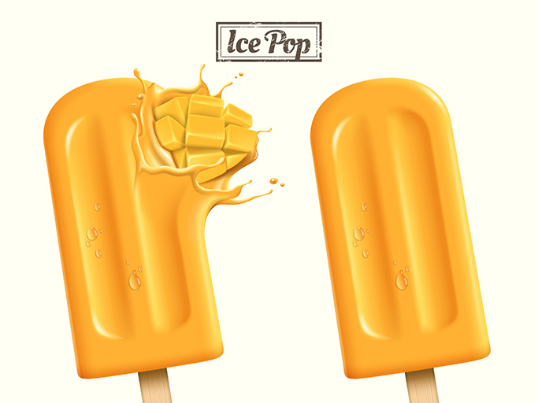

# Extracción de color

>[!NOTE]
>
>[!DNL Content and Commerce AI] está en versión beta. La documentación está sujeta a cambios.

El servicio de extracción de color, cuando se proporciona una imagen, puede calcular un histograma de colores de píxeles y ordenarlos por colores dominantes en bloques. Los colores de los píxeles de la imagen se agrupan en 40 colores predominantes que son representativos del espectro de colores. A continuación, se calcula un histograma de valores de color entre esos 40 colores. El servicio tiene dos variantes:

**Extracción de color (imagen completa)**

Este método extrae un histograma de color en toda la imagen.

**Extracción de color (con máscara)**

Este método utiliza un extractor de primer plano basado en el aprendizaje profundo para identificar objetos en primer plano. El modelo está formado en un catálogo de imágenes de comercio electrónico. Una vez extraído el objeto de primer plano, se calcula un histograma sobre los colores dominantes como se ha descrito anteriormente.

En el ejemplo mostrado en este documento se utilizó la siguiente imagen:



**Formato API**

```http
POST /services/v1/predict
```

**Solicitud**

La siguiente solicitud de ejemplo utiliza el método full-image para la extracción de color.

La siguiente solicitud extrae colores de una imagen en función de los parámetros de entrada proporcionados en la carga útil. Consulte la tabla debajo de la carga útil de ejemplo para obtener más información sobre los parámetros de entrada mostrados.

>[!CAUTION]
>
>`analyzer_id` determina qué [!DNL Sensei Content Framework] se utiliza. Verifique que dispone de la información adecuada `analyzer_id` antes de realizar su solicitud. Para el servicio de extracción de color, el `analyzer_id` ID es:
>`Feature:image-color-histogram:Service-6fe52999293e483b8e4ae9a95f1b81a7`

```SHELL
curl -i -X POST https://sensei.adobe.io/services/v1/predict \
  -H 'Authorization: Bearer {ACCESS_TOKEN}' \
  -H 'Content-Type: multipart/form-data' \
  -H 'x-api-key: {API_KEY}' \
  -H 'cache-control: no-cache,no-cache' \
  -F file=@test_image.jpg \
  -F 'contentAnalyzerRequests={
   "enable_diagnostics":"true",
   "requests":[
     {
         "analyzer_id": "Feature:image-color-histogram:Service-6fe52999293e483b8e4ae9a95f1b81a7",
         "parameters": {
          "application-id": "1234", 
          "content-type": "inline", 
          "encoding": "jpeg", 
          "threshold": "0", 
          "top-N": "0", 
          "custom": {}, 
          "data": [{
            "content-id": "0987", 
            "content": "inline-image", 
            "content-type": "inline", 
            "encoding": "jpeg", 
            "threshold": "0", 
            "top-N": "0", 
            "historic-metadata": [], 
            "custom": {"exclude_mask": 1}
            }]
          }
      }
    ]
}'
```

| Propiedad | Descripción | Obligatorio |
| --- | --- | --- |
| `analyzer_id` | ID del [!DNL Sensei] servicio en el que se implementa la solicitud. Este ID determina cuál de los [!DNL Sensei Content Frameworks] se utiliza. Para obtener servicios personalizados, póngase en contacto con el equipo de Content and Commerce AI para configurar un ID personalizado. | Sí |
| `application-id` | ID de la aplicación creada. | Sí |
| `data` | Matriz que contiene objetos JSON. Cada objeto de la matriz representa una imagen. Cualquier parámetro pasado como parte de esta matriz anula los parámetros globales especificados fuera de la `data` matriz. Cualquiera de las propiedades restantes que se describen a continuación en esta tabla se puede sobrescribir desde dentro `data`. | Sí |
| `content-id` | ID única para el elemento de datos que se devuelve en la respuesta. Si no se pasa, se asigna un ID generado automáticamente. | No |
| `content` | El contenido que analizará el servicio de extracción de color. En el evento de que la imagen forma parte del cuerpo de la solicitud, utilice `-F file=@<filename>` el comando curl para pasar la imagen, dejando este parámetro como una cadena vacía. <br> Si la imagen es un archivo en S3, pase la dirección URL firmada. Cuando el contenido forma parte del cuerpo de la solicitud, la lista de los elementos de datos debe tener un solo objeto. Si se pasa más de un objeto, solo se procesa el primer objeto. | Sí |
| `content-type` | Se utiliza para indicar si la entrada es parte del cuerpo de la solicitud o una dirección URL firmada para un bucket S3. El valor predeterminado de esta propiedad es `inline`. | No |
| `encoding` | Formato de archivo de la imagen de entrada. Actualmente solo se pueden procesar imágenes JPEG y PNG. El valor predeterminado de esta propiedad es `jpeg`. | No |
| `threshold` | El umbral de puntuación (0 a 1) por encima del cual deben devolverse los resultados. Utilice el valor `0` para devolver todos los resultados. El valor predeterminado de esta propiedad es `0`. | No |
| `top-N` | Número de resultados que se van a devolver (no puede ser un entero negativo). Utilice el valor `0` para devolver todos los resultados. Cuando se utiliza junto con `threshold`, el número de resultados devueltos es el menor de cualquiera de los límites establecidos. El valor predeterminado de esta propiedad es `0`. | No |
| `custom` | Parámetros personalizados que se van a pasar. | No |
| `historic-metadata` | Matriz que puede pasarse a los metadatos. | No |

**Respuesta**

Una respuesta correcta devuelve los detalles de los colores extraídos. Cada color se representa mediante una `feature_value` tecla que contiene la siguiente información:

- Un nombre de color
- Porcentaje que muestra este color en relación con la imagen
- Valor RGB del color

En el primer objeto de ejemplo siguiente, el `feature_value` de `White,0.59,251,251,243` significa que el color encontrado es blanco, el blanco se encuentra en el 59% de la imagen y tiene un valor RGB de 251.251.243.

```json
{
  "status": 200,
  "content_id": "test_image.jpg",
  "cas_responses": [
    {
      "status": 200,
      "analyzer_id": "Feature:image-color-histogram:Service-e952f4acd7c2425199b476a2eb459635",
      "content_id": "test_image.jpg",
      "result": {
        "response_type": "feature",
        "response": [
          {
            "feature_value": [
              {
                "feature_name": "color_name_and_rgb",
                "feature_value": "White,0.59,251,251,243"
              },
              {
                "feature_value": "Orange,0.30,248,169,48",
                "feature_name": "color_name_and_rgb"
              },
              {
                "feature_name": "color_name_and_rgb",
                "feature_value": "Mustard,0.08,251,199,77"
              },
              {
                "feature_name": "color_name_and_rgb",
                "feature_value": "Gold,0.02,250,191,55"
              }
            ],
            "feature_name": "color"
          }
        ]
      }
    }
  ],
  "error": []
}
```

| Propiedad | Descripción |
| --- | --- |
| `content_id` | Nombre de la imagen que se cargó en la solicitud de POST. |
| `feature_value` | Matriz cuyos objetos contienen claves con el mismo nombre de propiedad. Estas claves contienen una cadena que representa el nombre del color, un porcentaje que este color aparece en relación con la imagen enviada en el `content_id`y el valor RGB del color. |
