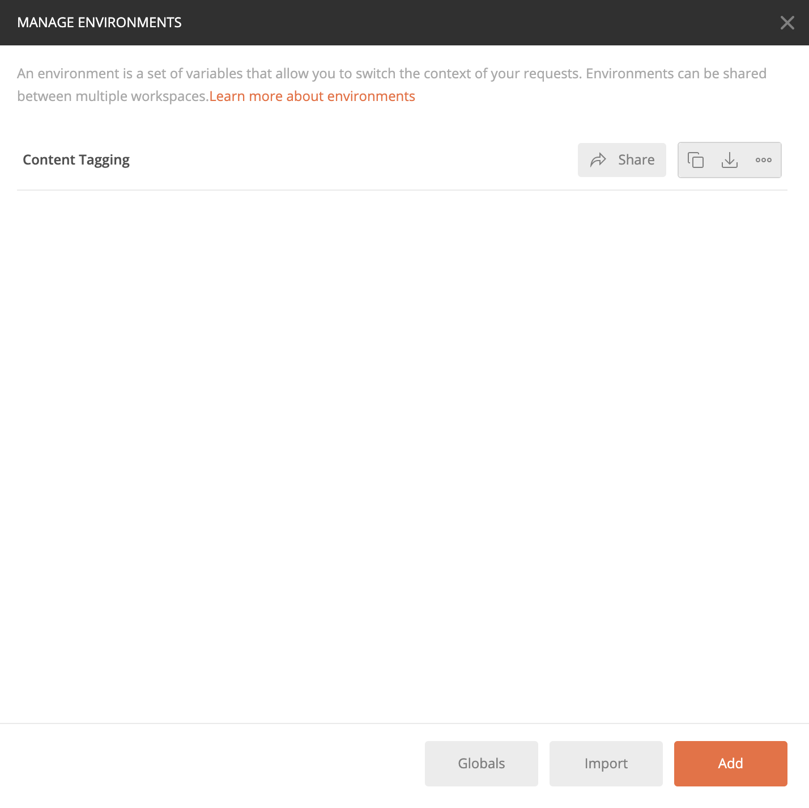

# Introducción al etiquetado de contenido

[!DNL Content tagging] utiliza API de Adobe I/O. Para realizar llamadas a las API de Adobe I/O y a la integración de la consola de I/O, primero debe completar el [tutorial de autenticación](https://www.adobe.com/go/platform-api-authentication-en).

Sin embargo, cuando llega al paso **Agregar API**, la API se encuentra en Creative Cloud en lugar de en Adobe Experience Platform, como se muestra en la siguiente captura de pantalla:

Al completar el tutorial de autenticación, se proporcionan los valores de cada uno de los encabezados necesarios en todas las llamadas de API de Adobe I/O, como se muestra a continuación:

- `Authorization: Bearer {ACCESS_TOKEN}`
- `x-api-key: {API_KEY}`
- `x-gw-ims-org-id: {ORG_ID}`

## Crear un entorno de Postman (opcional)

Una vez configurado el proyecto y la API en Adobe Developer Console, tiene la opción de descargar un archivo de entorno para Postman. En **[!UICONTROL API]** en el carril izquierdo del proyecto, seleccione **[!UICONTROL Etiquetado de contenido]**. Se abre una nueva ficha que contiene una tarjeta denominada &quot;[!DNL Try it out]&quot;. Seleccione **Descargar para Postman** para descargar un archivo JSON utilizado para configurar su entorno de Postman.

Una vez descargado el archivo, abre Postman y selecciona el **icono de engranaje** en la parte superior derecha para abrir el cuadro de diálogo **administrar entornos**.

A continuación, seleccione **Importar** desde el cuadro de diálogo **Administrar entornos**.

Se le redirigirá y se le pedirá que seleccione un archivo de entorno de su equipo. Seleccione el archivo JSON que descargó anteriormente y, a continuación, seleccione **Abrir** para cargar el entorno.

Se le redirigirá de nuevo a la ficha *Administrar entornos* con un nuevo nombre de entorno rellenado. Seleccione el nombre del entorno para ver y editar las variables disponibles en Postman. Aún necesita rellenar manualmente `JWT_TOKEN` y `ACCESS_TOKEN`. Estos valores deberían haberse obtenido al completar el [tutorial de autenticación](https://www.adobe.com/go/platform-api-authentication-en).

Una vez finalizadas, las variables deberían tener un aspecto similar al de la captura de pantalla siguiente. Seleccione **Actualizar** para finalizar la configuración de su entorno.

Ahora puede seleccionar su entorno del menú desplegable en la esquina superior derecha y rellenar automáticamente los valores guardados. Simplemente vuelva a editar los valores en cualquier momento para actualizar todas las llamadas a la API.

Para obtener más información sobre cómo trabajar con las API de Adobe I/O mediante Postman, consulte la publicación de Medium sobre [uso de Postman para la autenticación JWT en el Adobe I/O](https://medium.com/adobetech/using-postman-for-jwt-authentication-on-adobe-i-o-7573428ffe7f).

## Lectura de llamadas de API de muestra

Esta guía proporciona ejemplos de llamadas de API para mostrar cómo dar formato a las solicitudes. Estas incluyen rutas, encabezados obligatorios y cargas de solicitud con el formato correcto. También se proporciona el JSON de muestra devuelto en las respuestas de la API. Para obtener información sobre las convenciones utilizadas en la documentación de las llamadas de API de ejemplo, consulte la sección sobre [cómo leer las llamadas de API de ejemplo](../../landing/troubleshooting.md) en la guía de solución de problemas del Experience Platform.

## Pasos siguientes {#next-steps}

Una vez que tenga todas sus credenciales, estará listo para configurar un trabajador personalizado para [!DNL Content tagging]. Los siguientes documentos le ayudarán a comprender el marco de trabajo de extensibilidad y la configuración del entorno.

Para obtener más información sobre el marco de trabajo de extensibilidad, comience leyendo el documento [introduction to extensibility](https://experienceleague.adobe.com/docs/asset-compute/using/extend/understand-extensibility.html). Este documento describe los requisitos previos y los requisitos de aprovisionamiento.

Para obtener más información acerca de la configuración de un entorno para [!DNL Content tagging], comience por leer la guía de [configuración de un entorno de desarrollo](https://experienceleague.adobe.com/docs/asset-compute/using/extend/setup-environment.html). Este documento proporciona instrucciones de configuración que le permiten desarrollar para el servicio de Asset compute.
