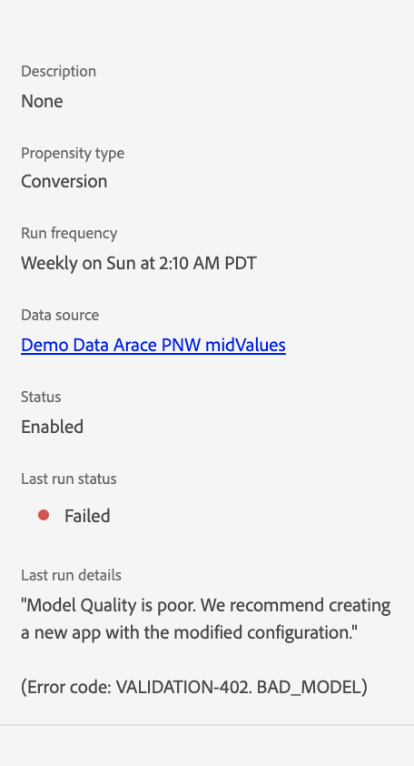

# Solución de errores de Customer AI

Customer AI muestra errores cuando falla la formación, puntuación y configuración del modelo. En el **[!UICONTROL Instancias de servicio]** , una columna para **[!UICONTROL ESTADO DE LA ÚLTIMA EJECUCIÓN]** muestra uno de los siguientes mensajes: **[!UICONTROL Correcto]**, **[!UICONTROL Problema de formación]** y **[!UICONTROL Error]**.

En el caso de que **[!UICONTROL Error]** o **[!UICONTROL Problema de formación]** se muestra, puede seleccionar el estado de ejecución para abrir un panel lateral. El panel lateral contiene el **[!UICONTROL Último estado de ejecución]** y **[!UICONTROL Detalles de la última ejecución]**. **[!UICONTROL Detalles de la última ejecución]** contiene información sobre por qué falló la ejecución. En el caso de que Customer AI no pueda proporcionar detalles sobre su error, póngase en contacto con el servicio de asistencia técnica con el código de error proporcionado.

 

## No se puede acceder a Customer AI en Chrome incógnito

Los errores de carga en el modo incógnito de Google Chrome están presentes debido a las actualizaciones en la configuración de seguridad del modo incógnito de Google Chrome. El problema se está trabajando activamente con Chrome para que experience.adobe.com sea un dominio de confianza.

 

### Corrección recomendada

Para solucionar este problema, debe agregar experience.adobe.com como sitio que siempre puede usar cookies. Para empezar, vaya a **chrome://settings/cookies**. A continuación, desplácese hacia abajo hasta el **Comportamientos personalizados** seguido de seleccionar la **Agregar** situado junto a &quot;sitios que siempre pueden utilizar cookies&quot;. En la ventana emergente que aparece, copie y pegue `[*.]experience.adobe.com` a continuación, seleccione la **Inclusión de cookies de terceros** en esta casilla de verificación del sitio. Una vez finalizada, seleccione **Agregar** y vuelva a cargar Customer AI en incógnito.

## La calidad del modelo es deficiente

Si recibe el error &quot;[!UICONTROL La calidad del modelo es deficiente. Se recomienda crear una aplicación nueva con la configuración modificada]&quot;. Siga los pasos recomendados a continuación para solucionar problemas.

 

### Corrección recomendada

&quot;La calidad del modelo es deficiente&quot; significa que la precisión del modelo no se encuentra dentro de un rango aceptable. Customer AI no pudo construir un modelo y un AUC fiables (Área bajo la curva ROC) &lt; 0,65 después de la formación. Para solucionar el error, se recomienda cambiar uno de los parámetros de configuración y volver a ejecutar la formación.

Comience por comprobar la precisión de sus datos. Es importante que los datos contengan los campos necesarios para el resultado predictivo.

- Compruebe si el conjunto de datos tiene las fechas más recientes. Customer AI siempre supone que los datos están actualizados cuando se activa el modelo.
- Compruebe si faltan datos en la ventana de predicción y elegibilidad definida. Los datos deben completarse sin espacios. Asegúrese también de que su conjunto de datos cumpla la [Requisitos de datos históricos de Customer AI](./data-requirements.md#data-requirements).
- Compruebe si faltan datos en comercio, aplicación, web y búsqueda, dentro de las propiedades del campo de esquema.

Si los datos no parecen ser el problema, intente cambiar la condición de población de elegibilidad para restringir el modelo a ciertos perfiles (por ejemplo, `_experience.analytics.customDimensions.eVars.eVar142` existe en los últimos 56 días). Esto restringe la población y el tamaño de los datos utilizados en la ventana de capacitación.

Si la restricción de la población elegible no funcionaba o no era posible, cambie la ventana de predicción.

- Intente cambiar la ventana de predicción a 7 días y vea si el error sigue ocurriendo. Si el error ya no se produce, esto indica que es posible que no tenga datos suficientes para la ventana de predicción definida.
