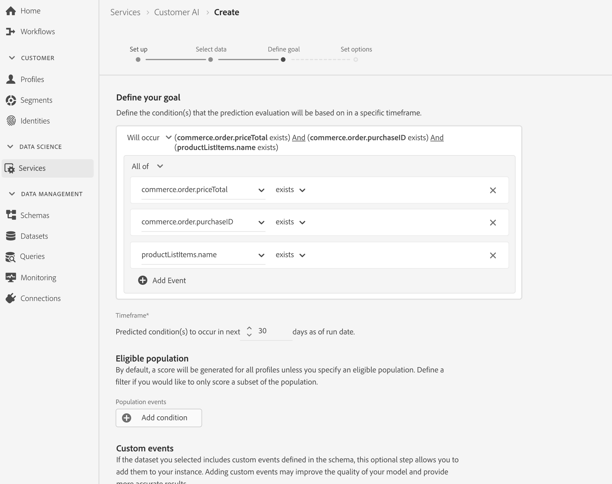
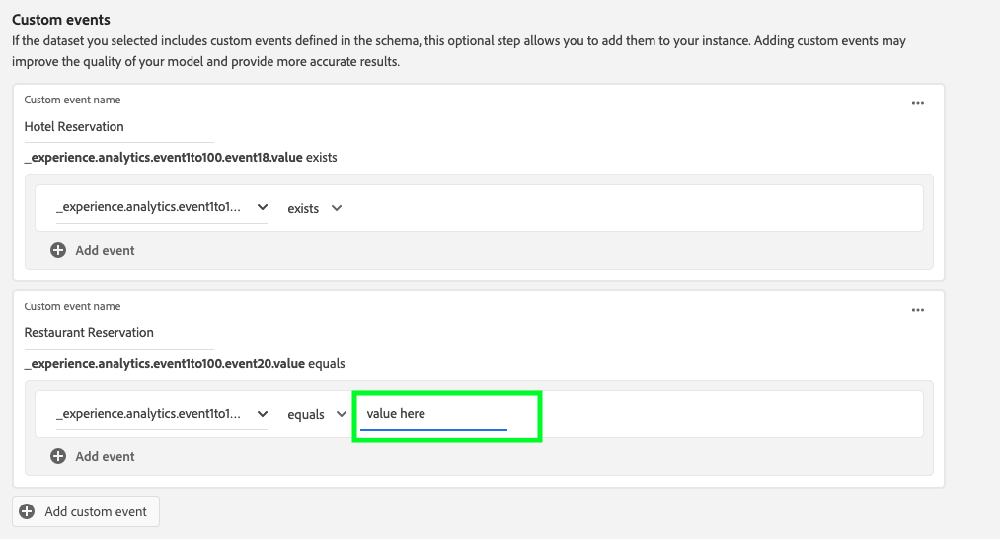
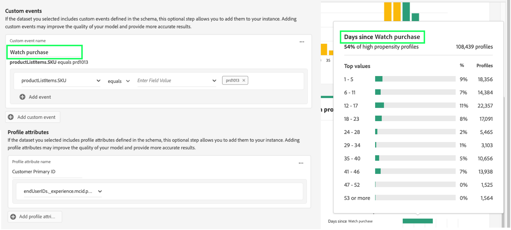
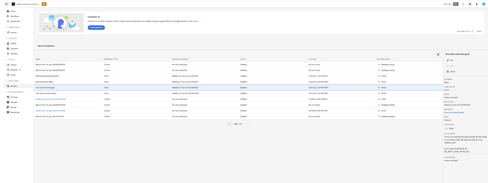

# Configuración de una instancia de Customer AI

La AI del cliente, como parte de los servicios AI/ML, le permite generar puntuaciones de tendencia personalizadas sin tener que preocuparse por el aprendizaje automático.

Los servicios AI/ML proporcionan Customer AI como un servicio de Adobe Sensei simple de usar que se puede configurar para diferentes casos de uso. Las secciones siguientes proporcionan los pasos para configurar una instancia de Customer AI.

## Crear una instancia {#set-up-your-instance}

En la interfaz de usuario de Platform, seleccione **[!UICONTROL Servicios]** en el panel de navegación izquierdo. La variable **[!UICONTROL Servicios]** aparece y muestra todos los servicios disponibles a su disposición. En el contenedor para Customer AI, seleccione **[!UICONTROL Apertura]**.

La variable **Customer AI** La interfaz de usuario de aparece y muestra todas las instancias de servicio.

- Puede encontrar la variable **[!UICONTROL Perfiles totales marcados]** métrica ubicada en la parte inferior derecha del **[!UICONTROL Crear instancia]** contenedor. Esta métrica rastrea el número total de perfiles marcados por Customer AI durante el año natural actual, incluidos todos los entornos de espacio aislado y las instancias de servicio eliminadas.

Las instancias de servicio se pueden editar, clonar y eliminar utilizando los controles del lado derecho de la interfaz de usuario. Para mostrar estos controles, seleccione una instancia de la **[!UICONTROL Instancias de servicio]**. Los controles contienen lo siguiente:

- **[!UICONTROL Editar]**: Selección **[!UICONTROL Editar]** permite modificar una instancia de servicio existente. Puede editar el nombre, la descripción y la frecuencia de puntuación de la instancia.
- **[!UICONTROL Clonar]**: Selección **[!UICONTROL Clonar]** copia la configuración de instancia de servicio seleccionada actualmente. A continuación, puede modificar el flujo de trabajo para realizar ajustes menores y cambiarle el nombre como una nueva instancia.
- **[!UICONTROL Eliminar]**: Puede eliminar una instancia de servicio, incluidas las ejecuciones históricas. El conjunto de datos de salida correspondiente se eliminará de Platform. Sin embargo, las puntuaciones sincronizadas con Perfil del cliente en tiempo real no se eliminan.
- **[!UICONTROL Fuente de datos]**: Un vínculo al conjunto de datos utilizado por esta instancia. Si se utilizan varios conjuntos de datos, al seleccionar el texto del hipervínculo se abre la ventana emergente de vista previa del conjunto de datos.
- **[!UICONTROL Detalles de la última ejecución]**: Esto solo se muestra cuando falla una ejecución. Aquí se muestra información sobre por qué se ha producido un error en la ejecución, como códigos de error.
- **[!UICONTROL Definición de la puntuación]**: Información general rápida sobre el objetivo que configuró para esta instancia.

Para crear una nueva instancia, seleccione **[!UICONTROL Crear instancia]**.

## Configuración

Aparece el flujo de trabajo de creación de instancias, empezando por el **[!UICONTROL Configuración]** paso a paso.

A continuación se proporciona información importante sobre los valores con los que debe proporcionar a la instancia:

- **[!UICONTROL Nombre]:** El nombre de la instancia se utiliza en todos los lugares donde se muestran las puntuaciones de Customer AI. Por lo tanto, los nombres deben describir lo que representan las puntuaciones de predicción. Por ejemplo, &quot;Probabilidad de cancelar la suscripción a la revista&quot;.

- **[!UICONTROL Descripción]:** Descripción que indica lo que está intentando predecir.

- **[!UICONTROL Tipo de propensión]:** El tipo de tendencia determina la intención de la puntuación y la polaridad de la métrica. Puede elegir **[!UICONTROL Pérdida]** o **[!UICONTROL Conversión]**. Consulte la nota debajo de [resumen de puntuación](./discover-insights.md#scoring-summary) en el documento de perspectivas de descubrimiento para obtener más información sobre cómo afecta el tipo de propensión a su instancia.

Proporcione los valores necesarios y, a continuación, seleccione **[!UICONTROL Siguiente]** para continuar.

## Selección de datos {#select-data}

Por diseño, la Customer AI utiliza los datos de Adobe Analytics, Adobe Audience Manager, Experience Events en general y Consumer Experience Event para calcular las puntuaciones de tendencia. Al seleccionar un conjunto de datos, solo se muestran los que son compatibles con la AI del cliente. Para seleccionar un conjunto de datos, seleccione el (**+**) junto al nombre del conjunto de datos o seleccione la casilla de verificación para agregar varios conjuntos de datos a la vez. Utilice la opción de búsqueda para encontrar rápidamente los conjuntos de datos que le interesen.

Después de seleccionar los conjuntos de datos que desea utilizar, seleccione la **[!UICONTROL Agregar]** para agregar los conjuntos de datos al panel de vista previa del conjunto de datos.

Selección del icono de información  junto al conjunto de datos se abre la ventana emergente de vista previa del conjunto de datos.

La vista previa del conjunto de datos contiene datos como la hora de la última actualización, el esquema de origen y una vista previa de las diez primeras columnas.

Select **[!UICONTROL Guardar]** para guardar los borradores a medida que avanza por el flujo de trabajo. También puede guardar configuraciones de modelo de borrador y pasar al siguiente paso del flujo de trabajo. Uso **[!UICONTROL Guardar y continuar]** para crear y guardar borradores durante las configuraciones del modelo. La función permite crear y guardar borradores de la configuración del modelo y es especialmente útil cuando tiene que definir muchos campos en el flujo de trabajo de configuración.

### Complejidad del conjunto de datos {#dataset-completeness}

Hay un valor de porcentaje de integridad del conjunto de datos en la vista previa del conjunto de datos. Este valor proporciona una instantánea rápida de cuántas columnas del conjunto de datos están vacías o nulas. Si un conjunto de datos contiene muchos valores que faltan y estos valores se capturan en otra parte, se recomienda que incluya el conjunto de datos que contiene los valores que faltan. En este ejemplo, el ID de persona está vacío, pero el ID de persona se captura en un conjunto de datos independiente que se puede incluir.

>[!NOTE]
>
>La integridad del conjunto de datos se calcula mediante la ventana de formación máxima para Customer AI (un año). Esto significa que no se tienen en cuenta los datos que tengan más de un año al mostrar el valor de integridad del conjunto de datos.

### Seleccionar una identidad {#identity}

Ahora puede unir varios conjuntos de datos entre sí según el mapa de identidad (campo). Debe seleccionar un tipo de identidad (también conocido como &quot;área de nombres de identidad&quot;) y un valor de identidad dentro de ese área de nombres. Si ha asignado más de un campo como identidad dentro del esquema en el mismo espacio de nombres, todos los valores de identidad asignados aparecerán en la lista desplegable de identidad precedida por el área de nombres, como `EMAIL (personalEmail.address)` o `EMAIL (workEmail.address)`.

[seleccionar el mismo espacio de nombres](../images/user-guide/cai-identity-map.png)

>[!IMPORTANT]
>
>Se debe utilizar el mismo tipo de identidad (área de nombres) para cada conjunto de datos que seleccione. Aparece una marca de verificación verde junto al tipo de identidad dentro de la columna de identidad que indica que los conjuntos de datos son compatibles. Por ejemplo, al utilizar el área de nombres de Phone y `mobilePhone.number` como identificador, todos los identificadores para los conjuntos de datos restantes deben contener y utilizar el área de nombres de Phone.

Para seleccionar una identidad, seleccione el valor subrayado ubicado en la columna de identidad. Aparecerá la ventana Seleccionar una identidad.

<!--  -->
[seleccionar el mismo espacio de nombres](../images/user-guide/cai-identity-namespace.png)

En el caso de que haya más de una identidad disponible en un área de nombres, asegúrese de seleccionar el campo de identidad correcto para el caso de uso. Por ejemplo, hay dos identidades de correo electrónico disponibles en el área de nombres del correo electrónico, un trabajo y un correo electrónico personal. Según el caso de uso, es más probable que se rellene un correo electrónico personal, que sea más útil en predicciones individuales. Esto significa que `EMAIL (personalEmail.address)` se seleccionaría como identidad.

>[!NOTE]
>
> Si no existe ningún tipo de identidad válido (área de nombres) para un conjunto de datos, debe establecer una identidad principal y asignarla a un área de nombres de identidad mediante la variable [editor de esquemas](../../../xdm/schema/composition.md#identity). Para obtener más información sobre áreas de nombres e identidades, visite [Espacios de nombres del servicio de identidad](../../../identity-service/namespaces.md) documentación.

## Definir objetivo {#define-a-goal}

<!-- https://www.adobe.com/go/cai-define-a-goal -->

La variable **[!UICONTROL Definir objetivo]** y proporciona un entorno interactivo para que defina visualmente un objetivo de predicción. Un objetivo está compuesto por uno o más eventos, donde la ocurrencia de cada evento se basa en la condición que contiene. El objetivo de una instancia de Customer AI es determinar la probabilidad de alcanzar su objetivo en un lapso de tiempo determinado.

Para crear un objetivo, seleccione **[!UICONTROL Introducir nombre de campo]** y seguido de un campo de la lista desplegable. Seleccione la segunda entrada, una cláusula para la condición del evento y, a continuación, proporcione de forma opcional el valor objetivo para completar el evento. Para configurar eventos adicionales, seleccione **[!UICONTROL Agregar evento]**. Por último, complete el objetivo aplicando un intervalo de tiempo de predicción en cantidad de días y, a continuación, seleccione **[!UICONTROL Siguiente]**.

<!--  -->

### Ocurrirá y no ocurrirá

Al definir el objetivo, tiene la opción de seleccionar **[!UICONTROL Ocurrirá]** o **[!UICONTROL No ocurrirá]**. Selección **[!UICONTROL Ocurrirá]** significa que las condiciones de evento que defina deben cumplirse para que los datos de evento de un cliente se incluyan en la interfaz de usuario de perspectivas.

Por ejemplo, si desea configurar una aplicación para predecir si un cliente realizará una compra, puede seleccionar **[!UICONTROL Ocurrirá]** seguido de **[!UICONTROL Todo]** y, a continuación, introduzca **commerce.purchases.id** (o un campo similar) y **[!UICONTROL existe]** como operador.

<!--  -->

Sin embargo, puede haber casos en los que le interese predecir si algún evento no se producirá en un intervalo de tiempo determinado. Para configurar un objetivo con esta opción, seleccione **[!UICONTROL No ocurrirá]** en la lista desplegable de nivel superior.

Por ejemplo, si le interesa predecir qué clientes participan menos y no visitan la página de inicio de sesión de su cuenta en el mes siguiente. Select **[!UICONTROL No ocurrirá]** seguido de **[!UICONTROL Todo]** y, a continuación, introduzca **web.webInteraction.URL** (o un campo similar) y **[!UICONTROL es igual que]** como operador con **inicio de sesión de cuenta** como valor.

### Todos y cualquiera de

En algunos casos, es posible que desee predecir si se producirá una combinación de eventos y, en otros, es posible que desee predecir la aparición de cualquier evento de un conjunto predefinido. Para predecir si un cliente tendrá una combinación de eventos, seleccione la opción **[!UICONTROL Todo]** en la lista desplegable de segundo nivel de la **[!UICONTROL Definir objetivo]** página.

Por ejemplo, es posible que desee predecir si un cliente compra un producto en particular. Este objetivo de predicción se define mediante dos condiciones: a `commerce.order.purchaseID` **existe** y `productListItems.SKU` **es igual que** algún valor específico.

Para predecir si un cliente tendrá algún evento de un conjunto determinado, puede usar la variable **[!UICONTROL Cualquiera de]** .

Por ejemplo, es posible que desee predecir si un cliente visita una determinada dirección URL o una página web con un nombre determinado. Este objetivo de predicción se define mediante dos condiciones: `web.webPageDetails.URL` **comienza con** un valor determinado y `web.webPageDetails.name` **comienza con** un valor en particular.

### Población elegible *(opcional)*

De forma predeterminada, se generan puntuaciones de tendencia para todos los perfiles a menos que se especifique una población apta. Puede especificar una población apta definiendo condiciones para incluir o excluir perfiles según eventos.

### Eventos personalizados (*opcional*) {#custom-events}

Si tiene información adicional además del [campos de evento estándar](../input-output.md#standard-events) utilizado por Customer AI para generar puntuaciones de tendencia, se proporciona una opción de eventos personalizada. El uso de esta opción le permite añadir eventos adicionales que considere influyentes, lo que puede mejorar la calidad del modelo y ayudar a proporcionar resultados más precisos. Si el conjunto de datos seleccionado incluye eventos personalizados definidos en el esquema, puede agregarlos a la instancia.

>[!NOTE]
>
> Para obtener una explicación detallada sobre cómo los eventos personalizados afectan a los resultados de puntuación de AI del cliente, visite [Ejemplo de evento personalizado](#custom-event) para obtener más información.

Para agregar un evento personalizado, seleccione **[!UICONTROL Añadir evento personalizado]**. A continuación, introduzca un nombre de evento personalizado y asígnelo al campo de evento del esquema. Los nombres de evento personalizados se muestran en lugar del valor de los campos al consultar factores influyentes y otras perspectivas. Esto significa que se utilizará el nombre de evento personalizado en lugar del ID/valor del evento. Para obtener más información sobre cómo se muestran los eventos personalizados, consulte la [sección de ejemplo de evento personalizado](#custom-event). La Customer AI utiliza estos eventos personalizados adicionales para mejorar la calidad del modelo y ofrecer resultados más precisos.

A continuación, seleccione el operador que desee utilizar en la lista desplegable de operadores disponibles. Solo se muestran los operadores compatibles con el evento.

Por último, introduzca los valores de campo si el operador seleccionado requiere uno. En este ejemplo, solo necesitamos ver si existe una reserva de hotel o restaurante. Sin embargo, si queremos ser más exactos, podríamos utilizar el operador equals e introducir un valor exacto en el símbolo del sistema.

Una vez finalizada, seleccione **[!UICONTROL Siguiente]** en la parte superior derecha para continuar.

### Atributos de perfil personalizados (*opcional*)

Puede definir campos importantes del conjunto de datos de perfil (con marcas de tiempo) en los datos, además del [campos de evento estándar](../input-output.md#standard-events) utilizado por Customer AI para generar puntuaciones de tendencia. El uso de esta opción le permite agregar atributos de perfil adicionales que considere influyentes, lo que puede mejorar la calidad del modelo y proporcionar resultados más precisos. Además, la adición de atributos de perfil personalizados permite al AI del cliente mostrar mejor cómo terminaron los perfiles particulares en un bloque de inclinación.

>[!NOTE]
>
>La adición de un atributo de perfil personalizado sigue el mismo flujo de trabajo que la adición de un evento personalizado. De forma similar a los eventos personalizados, los atributos de perfil personalizados afectan a la puntuación del modelo del mismo modo. Para obtener una explicación detallada, visite [Ejemplo de evento personalizado](#custom-event) para obtener más información.

#### Seleccione los atributos de perfil en la exportación de instantáneas de perfil

También puede optar por incluir atributos de perfil de la exportación diaria de instantáneas de perfil. Estos atributos se sincronizan con la exportación de instantáneas de perfil y muestran el valor disponible más recientemente.

>[!WARNING]
>
> Tenga cuidado de no seleccionar un atributo de perfil que se actualice como resultado del objetivo de predicción o que esté altamente correlacionado con el objetivo de predicción. Esto causa fugas de datos y sobreajuste del modelo. Un ejemplo de este atributo es `total_purchases_in_the_last_3_months` que predice la conversión de compra.

>[!NOTE]
>
>La compatibilidad con el uso de atributos de perfil de la exportación de instantáneas de UPS está disponible en la interfaz de usuario bajo petición.

### Adición de un ejemplo de evento personalizado {#custom-event}

En el siguiente ejemplo, se añade un evento personalizado y un atributo de perfil a una instancia de Customer AI. El objetivo de la instancia de Customer AI es predecir la probabilidad de que un cliente compre otro producto de Luma en los próximos 60 días. Normalmente, los datos del producto están vinculados a un SKU del producto. En este caso, el SKU es `prd1013`. Una vez entrenado/puntuado el modelo Customer AI, este SKU se puede vincular a un evento y mostrarse como un factor influyente para un bloque de propensión.

Customer AI aplica automáticamente la generación de funciones como &quot;Días transcurridos&quot; o &quot;Recuentos de&quot; a eventos personalizados como **Compra de Watch**. Si este evento se consideró un factor influyente en el motivo por el que los clientes son de alta, media o baja tendencia, Customer AI lo muestra como `Days since prd1013 purchase` o `Count of prd1013 purchase`. Al crearlo como un evento personalizado, puede darle al evento un nuevo nombre que facilite la lectura de los resultados. Por ejemplo, `Days since Watch purchase`. Además, Customer AI utiliza este evento en su formación y puntuación incluso si el evento no es un evento estándar. Esto significa que puede agregar varios eventos que considere influyentes y personalizar aún más el modelo mediante la inclusión de datos como reservas, registros de visitantes y otros eventos. Añadir estos puntos de datos aumenta aún más la precisión y precisión del modelo de AI del cliente.

## Definir opciones

El paso set options permite configurar una programación para automatizar ejecuciones de predicciones, definir exclusiones de predicciones para filtrar ciertos eventos y alternar **[!UICONTROL Perfil]** encendido/apagado.

### Configuración de una programación *(opcional)* {#configure-a-schedule}

Para configurar una programación de puntuación, comience configurando la variable **[!UICONTROL Frecuencia de puntuación]**. Las ejecuciones de predicciones automatizadas se pueden programar para que se ejecuten de forma semanal o mensual.

### Exclusiones de predicción *(opcional)*

Si el conjunto de datos contiene columnas agregadas como datos de prueba, puede agregar esa columna o evento a una lista de exclusión seleccionando **[!UICONTROL Añadir exclusión]** seguido de introducir el campo que desea excluir. Esto evita que los eventos que cumplen determinadas condiciones se evalúen al generar puntuaciones. Esta función se puede usar para filtrar las entradas o promociones de datos irrelevantes.

Para excluir un evento, seleccione **[!UICONTROL Añadir exclusión]** y defina el evento. Para eliminar una exclusión, seleccione los puntos suspensivos (**[!UICONTROL ...]**) en la parte superior derecha del contenedor de eventos y, a continuación, seleccione **[!UICONTROL Quitar contenedor]**.

### Alternar perfil

La opción Perfil permite que la AI del cliente exporte los resultados de puntuación al Perfil del cliente en tiempo real. Al desactivar esta opción, se evita que los resultados de puntuación de los modelos se agreguen al perfil. Los resultados de puntuación de Customer AI siguen disponibles con esta función deshabilitada.

Al utilizar Customer AI por primera vez, puede desactivar esta función hasta que esté satisfecho con los resultados de salida del modelo. Esto evita que cargue varios conjuntos de datos de puntuación en los perfiles del cliente mientras ajusta el modelo. Una vez que haya terminado de calibrar el modelo, puede clonar el modelo utilizando la variable [opción clone](#set-up-your-instance) de la variable **Instancias de servicio** página. Esto le permite crear una copia del modelo y activar el perfil.

Una vez que haya configurado el programa de puntuación, incluidas las exclusiones de predicción y el botón de alternancia de perfil en el que desea que esté, seleccione **[!UICONTROL Finalizar]** en la parte superior derecha para crear la instancia de Customer AI.

Si la instancia se crea correctamente, se activa inmediatamente una ejecución de predicción y las ejecuciones posteriores se ejecutan según la programación definida.

>[!NOTE]
>
>Según el tamaño de los datos de entrada, las ejecuciones de predicciones pueden tardar hasta 24 horas en completarse.

Al seguir esta sección, ha configurado una instancia de Customer AI y ejecutado una ejecución de predicciones. Una vez finalizada correctamente la ejecución, las perspectivas puntuadas rellenan automáticamente los perfiles con puntuaciones predichas si está habilitada la opción de alternancia de perfiles. Espere hasta 24 horas antes de continuar con la siguiente sección de este tutorial.

## Políticas de gobernanza

Una vez que revise el flujo de trabajo para crear una instancia y enviar la configuración del modelo, la variable [aplicación de políticas](/help/data-governance/enforcement/auto-enforcement.md) comprueba si hay alguna infracción. Si se produce una infracción de política, aparece una ventana emergente que indica que se han violado una o más políticas. Esto sirve para garantizar que las operaciones de datos y las acciones de marketing dentro de Platform sean compatibles con las políticas de uso de datos.

La ventana emergente proporciona información específica sobre la infracción. Puede resolver estas infracciones mediante la configuración de directivas y otras medidas que no están directamente relacionadas con el flujo de trabajo de configuración. Por ejemplo, puede cambiar las etiquetas para que se puedan usar ciertos campos con fines científicos de datos. Como alternativa, también puede modificar la configuración del modelo en sí para que no use nada con una etiqueta en ella. Consulte la documentación para obtener más información sobre cómo configurar [políticas](/help/data-governance/policies/overview.md).

## Control de acceso basado en atributos

>[!IMPORTANT]
>
>El control de acceso basado en atributos está disponible actualmente solo en una versión limitada.

[Control de acceso basado en atributos](../../../access-control/abac/overview.md) es una función de Adobe Experience Platform que permite a los administradores controlar el acceso a objetos específicos o a funciones basadas en atributos. Los atributos pueden ser metadatos agregados a un objeto, como una etiqueta agregada a un campo o segmento de esquema. Un administrador define políticas de acceso que incluyen atributos para administrar los permisos de acceso de los usuarios.

Esta funcionalidad le permite etiquetar campos de esquema del Modelo de datos de experiencia (XDM) con etiquetas que definen ámbitos organizativos o de uso de datos. En paralelo, los administradores pueden utilizar la interfaz de administración de usuarios y funciones para definir las políticas de acceso que rodean los campos de esquema XDM y administrar mejor el acceso dado a los usuarios o grupos de usuarios (usuarios internos, externos o de terceros). Además, el control de acceso basado en atributos permite a los administradores administrar el acceso a segmentos específicos.

Mediante el control de acceso basado en atributos, los administradores de su organización pueden controlar el acceso de los usuarios a los datos personales confidenciales (SPD) y a la información de identificación personal (PII) en todos los flujos de trabajo y recursos de Platform. Los administradores pueden definir funciones de usuario que solo tengan acceso a campos y datos específicos que se correspondan con esos campos.

Debido al control de acceso basado en atributos, algunos campos y funcionalidades tendrían acceso restringido y no estarían disponibles para ciertas instancias de servicio de Customer AI. Algunos ejemplos son &quot;Identidad&quot;, &quot;Definición de puntuación&quot; y &quot;Clonar&quot;.

En la parte superior del espacio de trabajo de Customer AI **página perspectivas**, observe que los detalles en la barra lateral, la definición de puntuación, la identidad y los atributos de perfil muestran &quot;Acceso restringido&quot;.

<!-- If you select datasets with restricted schemas on the **[!UICONTROL Create instance workflow]** page, a warning sign appears next to the dataset name with the message: [!UICONTROL Restricted information is excluded].

 -->

Cuando se obtienen vistas previas de conjuntos de datos con esquema restringido en la variable **[!UICONTROL Flujo de trabajo de creación de instancias]** , aparece una advertencia que indica que [!UICONTROL Debido a las restricciones de acceso, cierta información no se muestra en la vista previa del conjunto de datos.]

Después de crear una instancia con información restringida y continuar con el **[!UICONTROL Definir objetivo]** , aparece una advertencia en la parte superior: [!UICONTROL Debido a restricciones de acceso, cierta información no se muestra en la configuración.]

## Pasos siguientes {#next-steps}

Al seguir este tutorial, ha configurado correctamente una instancia de Customer AI y ha generado puntuaciones de tendencia. Ahora puede elegir usar el Generador de segmentos para [crear segmentos de clientes con puntuaciones predichas](./create-segment.md) o [descubra perspectivas con Customer AI](./discover-insights.md).

## Recursos adicionales

El siguiente vídeo está diseñado para comprender el flujo de trabajo de configuración de Customer AI. Además, se proporcionan prácticas recomendadas y ejemplos de casos de uso.

>[!IMPORTANT]
>
> El siguiente vídeo está desactualizado. Para obtener la información más actualizada, consulte la documentación.

>[!VIDEO](https://video.tv.adobe.com/v/32665?learn=on&quality=12)
