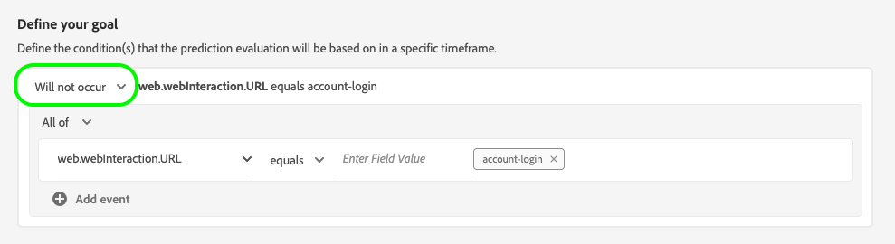
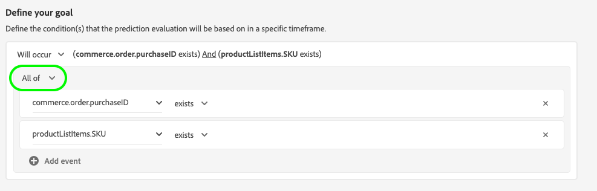
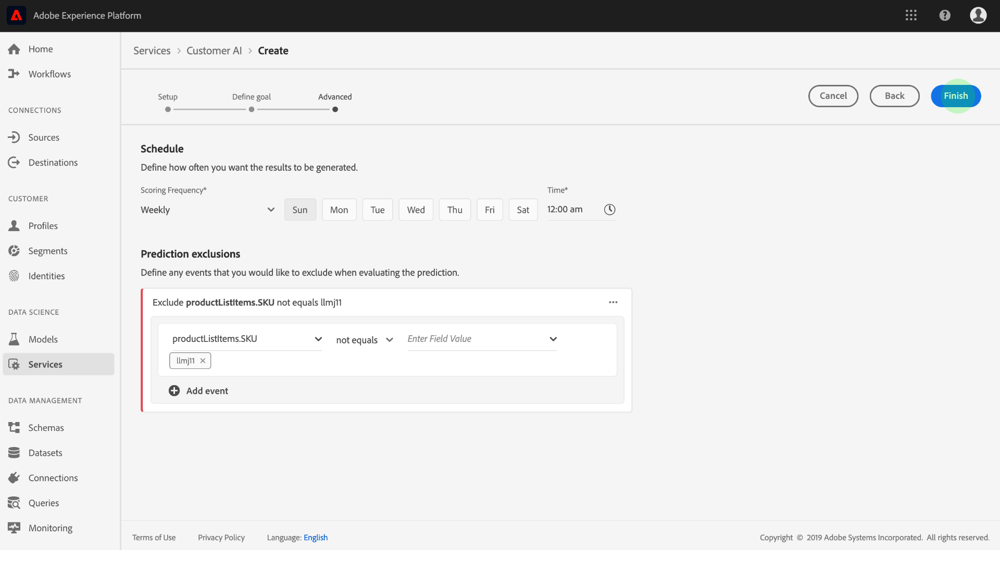

# Configuración de una instancia de AI de cliente

La API del cliente, como parte de Servicios inteligentes, le permite generar puntuaciones de tendencia personalizadas sin tener que preocuparse por el aprendizaje automático.

Los servicios inteligentes proporcionan una API de cliente como un servicio de Adobe Sensei sencillo de usar que se puede configurar para diferentes casos de uso. Las siguientes secciones proporcionan los pasos para configurar una instancia de AI del cliente.

## Configurar la instancia {#set-up-your-instance}

En la interfaz de usuario de la plataforma, seleccione **[!UICONTROL Servicios]** en el panel de navegación izquierdo. Aparece el navegador de **[!UICONTROL servicios]** y muestra todos los servicios disponibles. En el contenedor de AI del cliente, seleccione **[!UICONTROL Abrir]**.

Aparece la interfaz de usuario de AI **del** cliente y muestra todas las instancias de servicio.

- Puede encontrar la métrica de puntuación **[!UICONTROL de perfiles]** totales en la parte inferior derecha del contenedor **[!UICONTROL Crear instancia]** . Esta métrica rastrea el número total de perfiles puntuados por la API del cliente para el año civil actual, incluidos todos los entornos de simulación de pruebas y las instancias de servicio eliminadas.

Las instancias de servicio se pueden editar, clonar y eliminar mediante los controles del lado derecho de la interfaz de usuario. Para mostrar estos controles, seleccione una instancia de las instancias **** de servicio existentes. Los controles contienen lo siguiente:

- **[!UICONTROL Editar]**: Si selecciona **[!UICONTROL Editar]** , podrá modificar una instancia de servicio existente. Puede editar el nombre, la descripción y la frecuencia de puntuación de la instancia.
- **[!UICONTROL Clonar]**: Al seleccionar **[!UICONTROL Clonar]** , se copia la configuración de instancia de servicio seleccionada. A continuación, puede modificar el flujo de trabajo para realizar pequeñas modificaciones y cambiarle el nombre como una nueva instancia.
- **[!UICONTROL Eliminar]**: Puede eliminar una instancia de servicio, incluidas las ejecuciones históricas.
- **[!UICONTROL Fuente]** de datos: Vínculo al conjunto de datos utilizado por esta instancia.
- **[!UICONTROL Detalles]** de la última ejecución: Esto solo se muestra cuando falla una ejecución. Aquí se muestra información sobre por qué falló la ejecución, como códigos de error.
- **[!UICONTROL Definición]** de puntuación: Información general rápida sobre el objetivo configurado para esta instancia.

Para crear una nueva instancia, seleccione **[!UICONTROL Crear instancia]**.

Aparece el flujo de trabajo de creación de instancias, comenzando en el paso **[!UICONTROL Configuración]** .

A continuación encontrará información importante sobre los valores con los que debe proporcionar la instancia:

- El nombre de la instancia se utiliza en todos los lugares donde se muestran las puntuaciones de AI del cliente. Por lo tanto, los nombres deben describir lo que las puntuaciones de predicción representan, por ejemplo, &quot;Probabilidad de cancelar la suscripción de la revista&quot;.

- El tipo de tendencia determina la intención de la puntuación y la polaridad de la métrica. Puede elegir entre **[!UICONTROL Corn]** o **[!UICONTROL Conversión]**. Consulte la nota en [resumen](./discover-insights.md#scoring-summary) de puntuación en el documento de perspectivas de descubrimiento para obtener más información sobre cómo afecta el tipo de tendencia a la instancia.

- La fuente de datos es la ubicación de los datos. Dataset es el conjunto de datos de entrada que se utiliza para predecir puntuaciones. Según el diseño, la API del cliente utiliza los datos del Evento de experiencias de consumo para calcular las puntuaciones de tendencia. Al seleccionar un conjunto de datos en el selector desplegable, solo se muestran los que son compatibles con la API del cliente.

- De forma predeterminada, se generan puntuaciones de tendencia para todos los perfiles, a menos que se especifique una población elegible. Puede especificar una población elegible definiendo condiciones para incluir o excluir perfiles en función de eventos.

Proporcione los valores necesarios y, a continuación, seleccione **[!UICONTROL Siguiente]**.

### Definir un objetivo {#define-a-goal}

Aparece el paso **[!UICONTROL Definir objetivo]** y proporciona un entorno interactivo para que usted pueda definir visualmente un objetivo de predicción. Un objetivo se compone de uno o más eventos, donde la incidencia de cada evento se basa en la condición que contiene. El objetivo de una instancia de AI de cliente es determinar la probabilidad de lograr su objetivo dentro de un intervalo de tiempo determinado.

Para crear un objetivo, seleccione **[!UICONTROL Especificar nombre]** de campo y seleccione un campo en la lista desplegable. Seleccione la segunda entrada y seleccione una cláusula para la condición del evento, luego proporcione el valor de destinatario para completar el evento. Se pueden configurar eventos adicionales seleccionando **[!UICONTROL Añadir evento]**. Por último, complete el objetivo aplicando un intervalo de tiempo de predicción en número de días y, a continuación, seleccione **[!UICONTROL Siguiente]**.

#### Ocurrirá y no ocurrirá

Al definir el objetivo, tiene la opción de seleccionar **[!UICONTROL Se producirá]** o **[!UICONTROL no se producirá]**. La selección de **[!UICONTROL Se producirá]** significa que las condiciones de evento que defina deben cumplirse para que los datos de evento de un cliente se incluyan en la interfaz de usuario de perspectivas.

Por ejemplo, si desea configurar una aplicación para predecir si un cliente realizará una compra, puede seleccionar **[!UICONTROL Ocurrirá]** seguido de **[!UICONTROL Todo]** y, a continuación, escribir **commerce.Purchases.id** y **exista** como operador.

Sin embargo, puede haber casos en los que le interese predecir si algún evento no ocurrirá en un determinado intervalo de tiempo. Para configurar un objetivo con esta opción, seleccione **[!UICONTROL No se producirá]** en el menú desplegable de nivel superior.

Por ejemplo: si le interesa predecir qué clientes se comprometen menos y no visitan la página de inicio de sesión de su cuenta en el mes siguiente. Seleccionar no **[!UICONTROL ocurrirá]** seguido de **[!UICONTROL Todo]** y, a continuación, escribir **web.webInteraction.URL** e **[!UICONTROL igual]** que el operador con inicio de sesión **de** cuenta como valor.

#### Todos y cualquiera de

En algunos casos, es posible que desee predecir si se producirá una combinación de eventos y, en otros casos, es posible que desee predecir la aparición de cualquier evento de un conjunto predefinido. Para predecir si un cliente tendrá una combinación de eventos, seleccione la opción **[!UICONTROL Todos]** en la lista desplegable de segundo nivel de la página **[!UICONTROL Definir objetivo]** .

Por ejemplo: es posible que desee predecir si un cliente compra un producto en particular. Este objetivo de predicción se define mediante dos condiciones: un `commerce.order.purchaseID` existe **y el valor** es `productListItems.SKU` igual **** a un valor específico.

Para predecir si un cliente tendrá algún evento de un conjunto determinado, puede utilizar la opción **[!UICONTROL Cualquiera]** .

Por ejemplo: es posible que desee predecir si un cliente visita una determinada dirección URL o una página Web con un nombre determinado. Este objetivo de predicción se define mediante dos condiciones: `web.webPageDetails.URL` **inicios con** un valor particular y `web.webPageDetails.name` inicios con **** un valor particular.

### Configurar una programación *(opcional)* {#configure-a-schedule}

Aparece el paso **[!UICONTROL Avanzado]** . Este paso opcional le permite configurar una programación para automatizar las ejecuciones de predicciones, definir exclusiones de predicciones para filtrar determinados eventos o seleccionar **[!UICONTROL Finalizar]** si no se necesita nada.

Configure un programa de puntuación configurando la frecuencia **[!UICONTROL de]** puntuación. Las ejecuciones de predicciones automatizadas se pueden programar para que se ejecuten de forma semanal o mensual.

Debajo de la configuración de programación, puede definir exclusiones de predicción para evitar que se evalúen eventos que cumplan determinadas condiciones al generar puntuaciones. Esta función se puede utilizar para filtrar las entradas de datos irrelevantes.

Para excluir determinados eventos, seleccione **[!UICONTROL Añadir exclusión]** y defina el evento de la misma manera que se define el objetivo. Para eliminar una exclusión, seleccione las elipses (**[!UICONTROL ...]**) en la parte superior derecha del contenedor de evento y, a continuación, seleccione **[!UICONTROL Eliminar Contenedor]**.

Excluya eventos según sea necesario y, a continuación, seleccione **[!UICONTROL Finalizar]** para crear la instancia.

Si la instancia se crea correctamente, se activa inmediatamente una ejecución de predicción y las ejecuciones posteriores se ejecutan según la programación definida.

>[!NOTE]
>
>Según el tamaño de los datos de entrada, las ejecuciones de predicciones pueden tardar hasta 24 horas en completarse.

Al seguir esta sección, ha configurado una instancia de AI del cliente y se ha ejecutado una ejecución de predicción. Una vez finalizada correctamente la ejecución, las perspectivas puntuadas rellenan automáticamente los perfiles con puntuaciones predichas. Espere hasta 24 horas antes de continuar con la siguiente sección de este tutorial.

## Pasos siguientes {#next-steps}

Siguiendo este tutorial, ha configurado correctamente una instancia de AI del cliente y ha generado puntuaciones de tendencia. Ahora puede elegir usar el Generador de segmentos para [crear segmentos de clientes con puntuaciones](./create-segment.md) predichas o [descubrir perspectivas con la API](./discover-insights.md)del cliente.

## Recursos adicionales

El siguiente vídeo está diseñado para ayudarle a comprender el flujo de trabajo de configuración de la API del cliente. Además, se proporcionan prácticas recomendadas y ejemplos de casos de uso.

>[!VIDEO](https://video.tv.adobe.com/v/32665?learn=on&quality=12)

