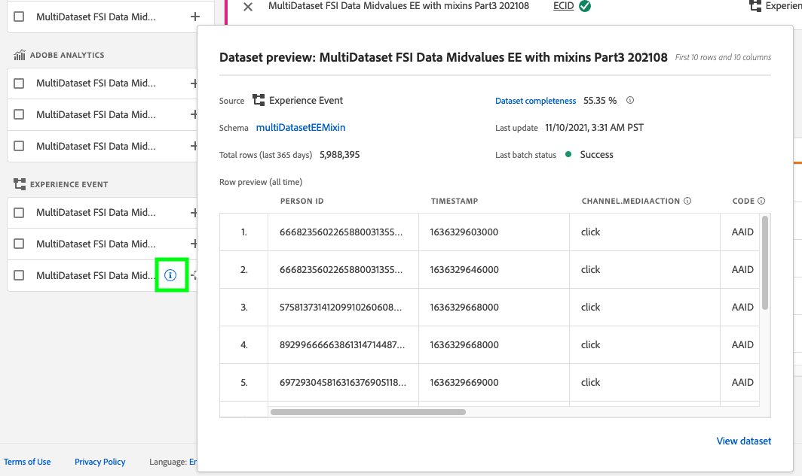
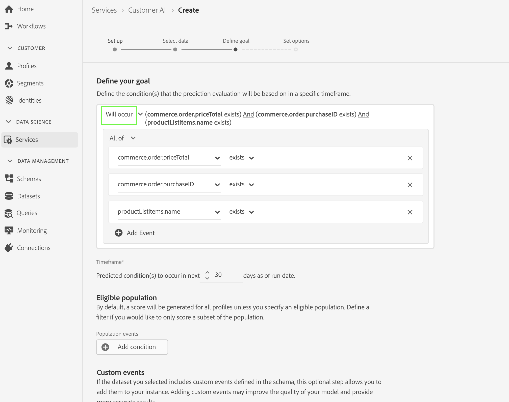

# Configuración de una instancia de Customer AI

La inteligencia artificial aplicada al cliente, como parte de los servicios de inteligencia artificial/aprendizaje automático, le permite generar puntuaciones de tendencia personalizadas sin tener que preocuparse por el aprendizaje automático.

Los servicios de inteligencia artificial aplicada al cliente proporcionan inteligencia artificial aplicada al cliente como un servicio de Adobe Sensei fácil de usar que se puede configurar para diferentes casos de uso. En las secciones siguientes se proporcionan los pasos para configurar una instancia de Customer AI.

## Creación de una instancia {#set-up-your-instance}

En la IU de Platform, seleccione **[!UICONTROL Servicios]** en el panel de navegación izquierdo. El **[!UICONTROL Servicios]** aparece el explorador y muestra todos los servicios disponibles a su disposición. En el contenedor de la inteligencia artificial aplicada al cliente, seleccione **[!UICONTROL Abrir]**.

El **Inteligencia artificial aplicada al cliente** Aparecerá la interfaz de usuario y mostrará todas las instancias de servicio.

- Puede encontrar el **[!UICONTROL Perfiles totales marcados]** situada en la parte inferior derecha de la variable **[!UICONTROL Crear instancia]** contenedor. Esta métrica rastrea el número total de perfiles clasificados por la inteligencia artificial aplicada al cliente para el año natural actual, incluidos todos los entornos de simulación de pruebas y cualquier instancia de servicio eliminada.

Las instancias de servicio se pueden editar, clonar y eliminar mediante los controles del lado derecho de la interfaz de usuario. Para mostrar estos controles, seleccione una instancia de la existente **[!UICONTROL Instancias de servicio]**. Los controles contienen lo siguiente:

- **[!UICONTROL Editar]**: seleccionando **[!UICONTROL Editar]** permite modificar una instancia de servicio existente. Puede editar el nombre, la descripción y la frecuencia de puntuación de la instancia.
- **[!UICONTROL Clonar]**: seleccionando **[!UICONTROL Clonar]** copia la configuración de la instancia de servicio seleccionada actualmente. A continuación, puede modificar el flujo de trabajo para realizar ajustes menores y cambiarle el nombre como una nueva instancia.
- **[!UICONTROL Eliminar]**: puede eliminar una instancia de servicio que incluya ejecuciones históricas. El conjunto de datos de salida correspondiente se eliminará de Platform. Sin embargo, las puntuaciones sincronizadas con el perfil del cliente en tiempo real no se eliminan.
- **[!UICONTROL Fuente de datos]**: Un vínculo al conjunto de datos utilizado por esta instancia. Si se utilizan varios conjuntos de datos, al seleccionar el texto del hipervínculo se abre la ventana emergente de vista previa del conjunto de datos.
- **[!UICONTROL Detalles de la última ejecución]**: Esto solo se muestra cuando falla una ejecución. Aquí se muestra información sobre por qué falló la ejecución, como códigos de error.
- **[!UICONTROL Definición de puntuación]**: Una breve descripción general del objetivo configurado para esta instancia.

Para crear una nueva instancia, seleccione **[!UICONTROL Crear instancia]**.

## Configuración de

Aparece el flujo de trabajo de creación de instancias, que comienza en **[!UICONTROL Configuración de]** paso.

A continuación se proporciona información importante sobre los valores que debe proporcionar a la instancia:

- **[!UICONTROL Nombre]:** El nombre de la instancia se utiliza en todos los lugares donde se muestran las puntuaciones de inteligencia artificial aplicada al cliente. Por lo tanto, los nombres deben describir lo que representan las puntuaciones de predicción. Por ejemplo, &quot;Probabilidad de cancelar la suscripción a la revista&quot;.

- **[!UICONTROL Descripción]:** Una descripción que indique lo que intenta predecir.

- **[!UICONTROL Tipo de tendencia]:** El tipo de tendencia determina la intención de la puntuación y la polaridad de la métrica. Puede elegir una de estas opciones **[!UICONTROL Pérdida]** o **[!UICONTROL Conversión]**. Consulte la nota debajo de [resumen de puntuación](./discover-insights.md#scoring-summary) en el documento descubriendo perspectivas para obtener más información sobre cómo afecta el tipo de tendencia a la instancia.

Proporcione los valores necesarios y seleccione **[!UICONTROL Siguiente]** para continuar.

## Seleccionar datos {#select-data}

Por diseño, la inteligencia artificial aplicada al cliente utiliza los datos de Adobe Analytics, Adobe Audience Manager, Eventos de experiencia en general y Evento de experiencia del consumidor para calcular las puntuaciones de tendencia. Al seleccionar un conjunto de datos, solo se enumeran los que son compatibles con la inteligencia artificial aplicada al cliente. Para seleccionar un conjunto de datos, seleccione la opción (**+**) junto al nombre del conjunto de datos o marque la casilla de verificación para agregar varios conjuntos de datos a la vez. Utilice la opción de búsqueda para encontrar rápidamente los conjuntos de datos que le interesan.

Después de seleccionar los conjuntos de datos que desea utilizar, seleccione el **[!UICONTROL Añadir]** para agregar los conjuntos de datos al panel de vista previa del conjunto de datos.

Selección del icono de información  junto al conjunto de datos, se abre la ventana emergente de vista previa del conjunto de datos.

La vista previa del conjunto de datos contiene datos como la última hora de actualización, el esquema de origen y una vista previa de las primeras diez columnas.

Seleccionar **[!UICONTROL Guardar]** para guardar los borradores conforme avanza por el flujo de trabajo. También puede guardar configuraciones de modelo de borrador y pasar al siguiente paso del flujo de trabajo. Uso **[!UICONTROL Guardar y continuar]** para crear y guardar borradores durante las configuraciones del modelo. La función permite crear y guardar borradores de la configuración del modelo y es especialmente útil cuando tiene que definir muchos campos en el flujo de trabajo de configuración.

### Integridad del conjunto de datos {#dataset-completeness}

Hay un valor de porcentaje de integridad del conjunto de datos en la previsualización del conjunto de datos. Este valor proporciona una instantánea rápida de cuántas columnas del conjunto de datos están vacías o son nulas. Si un conjunto de datos contiene muchos valores que faltan y estos valores se capturan en otra parte, se recomienda encarecidamente incluir el conjunto de datos que contiene los valores que faltan. En este ejemplo, el ID de persona está vacío, pero el ID de persona se captura en un conjunto de datos independiente que se puede incluir.

>[!NOTE]
>
>La integridad del conjunto de datos se calcula mediante la ventana de formación máxima para la inteligencia artificial aplicada al cliente (un año). Esto significa que los datos con más de un año de antigüedad no se tienen en cuenta al mostrar el valor de integridad del conjunto de datos.

### Seleccionar una identidad {#identity}

Ahora puede unir varios conjuntos de datos entre sí en función del mapa de identidad (campo). Debe seleccionar un tipo de identidad (también conocido como &quot;área de nombres de identidad&quot;) y un valor de identidad dentro de ese área de nombres. Si ha asignado más de un campo como identidad dentro del esquema en el mismo área de nombres, todos los valores de identidad asignados aparecerán en el menú desplegable de identidad precedidos del área de nombres, como `EMAIL (personalEmail.address)` o `EMAIL (workEmail.address)`.

[seleccionar el mismo área de nombres](../images/user-guide/cai-identity-map.png)

>[!IMPORTANT]
>
>Se debe utilizar el mismo tipo de identidad (área de nombres) para cada conjunto de datos seleccionado. Aparece una marca de verificación verde junto al tipo de identidad dentro de la columna de identidad que indica que los conjuntos de datos son compatibles. Por ejemplo, al usar el área de nombres Phone y `mobilePhone.number` como identificador, todos los identificadores de los conjuntos de datos restantes deben contener y utilizar el área de nombres Phone.

Para seleccionar una identidad, seleccione el valor subrayado ubicado en la columna de identidad. Aparecerá la ventana emergente Seleccionar una identidad.

<!--  -->
[seleccionar el mismo área de nombres](../images/user-guide/cai-identity-namespace.png)

En caso de que haya más de una identidad disponible dentro de un área de nombres, asegúrese de seleccionar el campo de identidad correcto para su caso de uso. Por ejemplo, hay dos identidades de correo electrónico disponibles en el área de nombres de correo electrónico, un correo electrónico laboral y uno personal. Según el caso de uso, es más probable que un correo electrónico personal se rellene y sea más útil en predicciones individuales. Esto significa que `EMAIL (personalEmail.address)` se seleccionaría como la identidad.

>[!NOTE]
>
> Si no existe ningún tipo de identidad (área de nombres) válido para un conjunto de datos, debe establecer una identidad principal y asignarla a un área de nombres de identidad mediante [editor de esquemas](../../../xdm/schema/composition.md#identity). Para obtener más información sobre áreas de nombres e identidades, visite la [Áreas de nombres del servicio de identidad](../../../identity-service/namespaces.md) documentación.

## Definir meta {#define-a-goal}

<!-- https://www.adobe.com/go/cai-define-a-goal -->

El **[!UICONTROL Definir meta]** Este paso aparece y proporciona un entorno interactivo para que defina visualmente un objetivo de predicción. Un objetivo se compone de uno o más eventos, donde la ocurrencia de cada evento se basa en la condición que mantiene. El objetivo de una instancia de inteligencia artificial aplicada al cliente es determinar la probabilidad de lograr su objetivo en un lapso de tiempo determinado.

Para crear una meta, seleccione **[!UICONTROL Introducir nombre de campo]** y seguido de un campo de la lista desplegable. Seleccione la segunda entrada, una cláusula para la condición del evento y, opcionalmente, proporcione el valor de destino para completar el evento. Se pueden configurar eventos adicionales seleccionando **[!UICONTROL Añadir evento]**. Por último, complete el objetivo aplicando un intervalo de tiempo de predicción en número de días y, a continuación, seleccione **[!UICONTROL Siguiente]**.

<!--  -->

### Se producirá y no se producirá

Al definir el objetivo, tiene la opción de seleccionar **[!UICONTROL Se producirá]** o **[!UICONTROL No se producirá]**. Seleccionar **[!UICONTROL Se producirá]** significa que las condiciones de evento que defina deben cumplirse para que los datos de evento de un cliente se incluyan en la interfaz de usuario de perspectivas.

Por ejemplo, si desea configurar una aplicación para predecir si un cliente realizará una compra, puede seleccionar **[!UICONTROL Se producirá]** seguido de **[!UICONTROL Todos de]** y luego introduzca **commerce.purchases.id** (o un campo similar) y **[!UICONTROL existe]** como operador.

<!--  -->

Sin embargo, puede haber casos en los que esté interesado en predecir si algún evento no se producirá en un periodo de tiempo determinado. Para configurar una meta con esta opción, seleccione **[!UICONTROL No se producirá]** en la lista desplegable de nivel superior.

Por ejemplo, si está interesado en predecir qué clientes participan menos y no visita la página de inicio de sesión de la cuenta en el mes siguiente. Seleccionar **[!UICONTROL No se producirá]** seguido de **[!UICONTROL Todos de]** y luego introduzca **web.webInteraction.URL** (o un campo similar) y **[!UICONTROL igual a]** como operador con **account-login** como el valor.

### Todos y cualquiera de

En algunos casos, es posible que desee predecir si se producirá una combinación de eventos y, en otros casos, es posible que desee predecir la aparición de cualquier evento a partir de un conjunto predefinido. Para predecir si un cliente tendrá una combinación de eventos, seleccione la **[!UICONTROL Todos de]** opción de la lista desplegable de segundo nivel en la **[!UICONTROL Definir meta]** página.

Por ejemplo, es posible que desee predecir si un cliente compra un producto en particular. Este objetivo de predicción se define mediante dos condiciones: `commerce.order.purchaseID` **existe** y el `productListItems.SKU` **igual a** algún valor específico.

Para predecir si un cliente tendrá algún evento de un conjunto determinado, puede utilizar el **[!UICONTROL Cualquiera de]** opción.

Por ejemplo, es posible que desee predecir si un cliente visita una determinada dirección URL o una página web con un nombre determinado. Este objetivo de predicción se define mediante dos condiciones: `web.webPageDetails.URL` **empieza por** un valor particular y `web.webPageDetails.name` **empieza por** un valor en particular.

### Población elegible *(opcional)*

De forma predeterminada, las puntuaciones de tendencia se generan para todos los perfiles a menos que se especifique una población elegible. Puede especificar una población elegible definiendo condiciones para incluir o excluir perfiles basados en eventos.

### Eventos personalizados (*opcional*) {#custom-events}

Si dispone de información adicional además de lo siguiente [campos de eventos estándar](../data-requirements.md#standard-events) Cuando la inteligencia artificial aplicada al cliente la utiliza para generar puntuaciones de tendencia, se proporciona una opción de eventos personalizados. El uso de esta opción le permite agregar eventos adicionales que considere influyentes, lo que puede mejorar la calidad del modelo y ayudar a proporcionar resultados más precisos. Si el conjunto de datos seleccionado incluye eventos personalizados definidos en el esquema, puede agregarlos a la instancia.

>[!NOTE]
>
> Para obtener una explicación detallada sobre cómo afectan los eventos personalizados a los resultados de puntuación de la inteligencia artificial aplicada al cliente, visite la [Ejemplo de evento personalizado](#custom-event) sección.

Para añadir un evento personalizado, seleccione **[!UICONTROL Añadir evento personalizado]**. A continuación, introduzca un nombre de evento personalizado y asígnelo al campo de evento del esquema. Los nombres de evento personalizados se muestran en lugar del valor de los campos al observar factores influyentes y otras perspectivas. Esto significa que se utilizará el nombre de evento personalizado en lugar del ID/valor del evento. Para obtener más información sobre cómo se muestran los eventos personalizados, consulte la [sección de ejemplo de evento personalizado](#custom-event). La inteligencia artificial aplicada al cliente utiliza estos eventos personalizados adicionales para mejorar la calidad del modelo y proporcionar resultados más precisos.

A continuación, seleccione el operador que desee utilizar en la lista desplegable de operadores disponibles. Solo se muestran los operadores compatibles con el evento.

Por último, introduzca los valores de campo si el operador seleccionado requiere uno. En este ejemplo, solo necesitamos ver si existe una reserva de hotel o restaurante. Sin embargo, si queremos ser más exactos, podemos utilizar el operador &quot;es igual a&quot; e introducir un valor exacto en el indicador de valores.

Una vez finalizado, seleccione **[!UICONTROL Siguiente]** en la parte superior derecha para continuar.

### Atributos de perfil personalizados (*opcional*)

Puede definir campos importantes del conjunto de datos de perfil (con marcas de tiempo) en los datos, además del [campos de eventos estándar](../data-requirements.md#standard-events) lo utiliza la inteligencia artificial aplicada al cliente para generar puntuaciones de tendencia. El uso de esta opción le permite agregar atributos de perfil adicionales que considere influyentes, lo que puede mejorar la calidad del modelo y proporcionar resultados más precisos. Además, la adición de atributos de perfil personalizados permite a la inteligencia artificial aplicada al cliente mostrar mejor cómo los perfiles particulares terminaron en un bloque de tendencia.

>[!NOTE]
>
>Añadir un atributo de perfil personalizado sigue el mismo flujo de trabajo que añadir un evento personalizado. De forma similar a los eventos personalizados, los atributos de perfil personalizados afectan a la puntuación del modelo del mismo modo. Para obtener una explicación detallada, visite la [Ejemplo de evento personalizado](#custom-event) sección.

#### Seleccione atributos de perfil en la exportación Instantánea de perfil

También puede incluir atributos de perfil desde la exportación diaria de instantáneas de perfil. Estos atributos se sincronizan con la exportación Instantánea de perfil y muestran el valor disponible más recientemente.

>[!WARNING]
>
> Tenga cuidado de no seleccionar un atributo de perfil que se actualice como resultado del objetivo de predicción o que esté muy correlacionado con el objetivo de predicción. Esto provoca fugas de datos y un ajuste excesivo del modelo. Un ejemplo de este atributo es `total_purchases_in_the_last_3_months` que predice la conversión de compra.

>[!NOTE]
>
>La compatibilidad con el uso de atributos de perfil de la exportación de instantáneas de UPS está disponible en la interfaz de usuario bajo solicitud.

### Adición de un ejemplo de evento personalizado {#custom-event}

En el ejemplo siguiente, se agrega un evento personalizado y un atributo de perfil a una instancia de inteligencia artificial aplicada al cliente. El objetivo de la instancia de inteligencia artificial aplicada al cliente es predecir la probabilidad de que un cliente compre otro producto de Luma en los próximos 60 días. Normalmente, los datos del producto están vinculados a un SKU del producto. En este caso, el SKU es `prd1013`. Una vez que el modelo de inteligencia artificial aplicada al cliente se ha entrenado/clasificado, esta SKU se puede vincular a un evento y mostrarse como un factor influyente para un bloque de tendencia.

La inteligencia artificial aplicada al cliente aplica automáticamente la generación de funciones como &quot;Días transcurridos desde&quot; o &quot;Recuentos de&quot; a eventos personalizados como **Ver compra**. Si este evento se consideró un factor influyente en la razón por la que los clientes son de alta, media o baja tendencia, la inteligencia artificial aplicada al cliente lo muestra como `Days since prd1013 purchase` o `Count of prd1013 purchase`. Al crear esto como un evento personalizado, puede asignar un nuevo nombre al evento, lo que facilita la lectura de los resultados. Por ejemplo, `Days since Watch purchase`. Además, la inteligencia artificial aplicada al cliente utiliza este evento en su formación y puntuación, incluso si el evento no es un evento estándar. Esto significa que puede agregar varios eventos que crea que podrían ser influyentes y personalizar aún más el modelo incluyendo datos como reservas, registros de visitantes y otros eventos. Añadir estos puntos de datos aumenta aún más la precisión del modelo de inteligencia artificial aplicada al cliente.

## Definir opciones

El paso Establecer opciones permite configurar una programación para automatizar las ejecuciones de predicción, definir exclusiones de predicción para filtrar determinados eventos y alternar **[!UICONTROL Perfil]** activado/desactivado.

### Configurar una programación *(opcional)* {#configure-a-schedule}

Para configurar una programación de puntuación, comience configurando la variable **[!UICONTROL Frecuencia de puntuación]**. Las ejecuciones de predicción automatizadas se pueden programar para ejecutarse de forma semanal o mensual.

### Exclusiones de predicción *(opcional)*

Si el conjunto de datos contenía columnas agregadas como datos de prueba, puede agregar esa columna o evento a una lista de exclusión seleccionando **[!UICONTROL Añadir exclusión]** seguido de introducir el campo que desea excluir. Esto evita que los eventos que cumplen determinadas condiciones se evalúen al generar puntuaciones. Esta función se puede utilizar para filtrar entradas de datos o promociones irrelevantes.

Para excluir un evento, seleccione **[!UICONTROL Añadir exclusión]** y definir el evento. Para eliminar una exclusión, seleccione los puntos suspensivos (**[!UICONTROL ...]**), en la parte superior derecha del contenedor de eventos, y seleccione **[!UICONTROL Eliminar contenedor]**.

### Alternar perfil

La opción Perfil permite que la inteligencia artificial aplicada al cliente exporte los resultados de la puntuación al Perfil del cliente en tiempo real. Al deshabilitar esta opción, se evita que los resultados de puntuación de los modelos se agreguen al perfil. Los resultados de la puntuación de inteligencia artificial aplicada al cliente siguen estando disponibles con esta función deshabilitada.

Cuando utilice la inteligencia artificial aplicada al cliente por primera vez, puede desactivar esta función hasta que esté satisfecho con los resultados de salida del modelo. Esto evita que cargue varios conjuntos de datos de puntuación en los perfiles de cliente y, al mismo tiempo, ajusta el modelo. Una vez que haya terminado de calibrar el modelo, puede clonarlo con el [opción clonar](#set-up-your-instance) desde el **Instancias de servicio** página. Esto le permite crear una copia del modelo y activar o desactivar el perfil.

Una vez que tenga la programación de puntuación establecida, las exclusiones de predicción incluidas y el perfil cambie a donde desee que esté, seleccione **[!UICONTROL Finalizar]** en la parte superior derecha para crear la instancia de inteligencia artificial aplicada al cliente.

Si la instancia se crea correctamente, se activa inmediatamente una ejecución de predicción y las ejecuciones posteriores se ejecutan según la programación definida.

>[!NOTE]
>
>Según el tamaño de los datos de entrada, las ejecuciones de predicción pueden tardar hasta 24 horas en completarse.

Al seguir esta sección, ha configurado una instancia de inteligencia artificial aplicada al cliente y ha ejecutado una ejecución de predicción. Una vez finalizada correctamente la ejecución, las perspectivas de puntuación rellenan automáticamente los perfiles con puntuaciones predichas si la opción de perfil está activada. Espere hasta 24 horas antes de continuar a la siguiente sección de este tutorial.

## Pasos siguientes {#next-steps}

Al seguir este tutorial, ha configurado correctamente una instancia de inteligencia artificial aplicada al cliente y ha generado puntuaciones de tendencia. Ahora puede elegir usar el Generador de segmentos para lo siguiente [crear segmentos de clientes con puntuaciones predichas](./create-segment.md) o [descubra perspectivas con Customer AI](./discover-insights.md).

## Recursos adicionales

El siguiente vídeo está diseñado para ayudarle a comprender el flujo de trabajo de configuración de la inteligencia artificial aplicada al cliente. Además, se ofrecen prácticas recomendadas y ejemplos de casos de uso.

>[!IMPORTANT]
>
> El siguiente vídeo no está actualizado. Para obtener la información más actualizada, consulte la documentación.

>[!VIDEO](https://video.tv.adobe.com/v/32665?learn=on&quality=12)
