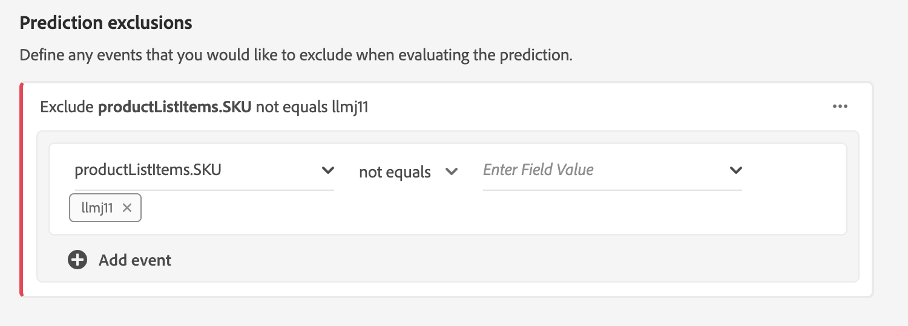

# Configuración de una instancia de AI de cliente

La API del cliente, como parte de Servicios inteligentes, le permite generar puntuaciones de tendencia personalizadas sin tener que preocuparse por el aprendizaje automático.

Los servicios inteligentes proporcionan una API de cliente como un servicio de Adobe Sensei sencillo de usar que se puede configurar para diferentes casos de uso. Las siguientes secciones proporcionan los pasos para configurar una instancia de AI del cliente.

## Configurar la instancia {#set-up-your-instance}

En la interfaz de usuario de la plataforma, haga clic en **[!UICONTROL Servicios]** en el panel de navegación izquierdo. Aparece el navegador de **[!UICONTROL servicios]** y muestra todos los servicios disponibles. En el contenedor de AI del cliente, haga clic en **[!UICONTROL Abrir]**.

La pantalla *de AI* del cliente muestra todas las instancias de AI del cliente existentes. Haga clic en **[!UICONTROL Crear instancia]**.

Aparece el flujo de trabajo de creación de instancias, comenzando en el paso *Configuración* .

A continuación encontrará información importante sobre los valores con los que debe proporcionar la instancia:

* El nombre de la instancia se utiliza en todos los lugares donde se muestra la puntuación de AI del cliente. Por lo tanto, los nombres deben describir lo que las puntuaciones de predicción representan, por ejemplo, &quot;Probabilidad de cancelar la suscripción de la revista&quot;.

* El tipo de tendencia determina la intención de la puntuación y la polaridad de la métrica. Puede elegir &quot;[!UICONTROL Enmarcar]&quot; o &quot;[!UICONTROL Conversión]&quot;. Consulte la nota en [resumen](./discover-insights.md#scoring-summary) de puntuación en el documento de perspectivas de descubrimiento para obtener más información sobre cómo afecta el tipo de tendencia a la instancia.

* La fuente de datos es la ubicación de los datos. Dataset es el conjunto de datos de entrada que se utiliza para predecir puntuaciones. Según el diseño, la API del cliente utiliza los datos del Evento de experiencias de consumo para calcular las puntuaciones de tendencia. Al seleccionar un conjunto de datos en el selector desplegable, solo se muestran los que son compatibles con la API del cliente.

* De forma predeterminada, se generan puntuaciones de tendencia para todos los perfiles, a menos que se especifique una población elegible. Puede especificar una población elegible definiendo condiciones para incluir o excluir perfiles en función de eventos.

Proporcione los valores necesarios y haga clic en **[!UICONTROL Siguiente]**.

### Definir un objetivo {#define-a-goal}

Aparece el paso **[!UICONTROL Definir objetivo]** y proporciona un entorno interactivo para que usted pueda definir visualmente un objetivo. Un objetivo se compone de uno o más eventos, donde la incidencia de cada evento se basa en la condición que contiene. El objetivo de una instancia de AI de cliente es determinar la probabilidad de lograr su objetivo dentro de un intervalo de tiempo determinado.

Haga clic en **[!UICONTROL Especificar nombre]** de campo y seleccione un campo en la lista desplegable. Haga clic en la segunda entrada y seleccione una cláusula para la condición del evento, luego proporcione un valor de destinatario para completar el evento. Para configurar eventos adicionales, haga clic en **[!UICONTROL Añadir evento]**. Por último, complete el objetivo aplicando un intervalo de tiempo de predicción en número de días y, a continuación, haga clic en **[!UICONTROL Siguiente]**.

### Configurar una programación *(opcional)* {#configure-a-schedule}

Aparece el paso **[!UICONTROL Avanzado]** . Este paso opcional le permite configurar una programación para automatizar las ejecuciones de predicciones, definir exclusiones de predicciones para filtrar determinados eventos o hacer clic en **[!UICONTROL Finalizar]** si no se necesita nada.

Configure un programa de puntuación configurando la frecuencia *de* puntuación. Las ejecuciones de predicciones automatizadas se pueden programar para que se ejecuten de forma semanal o mensual.

Debajo de la configuración de programación, puede definir exclusiones de predicción para evitar que se evalúen eventos que cumplan determinadas condiciones al generar puntuaciones. Esta función se puede utilizar para filtrar las entradas de datos irrelevantes.

Para excluir determinados eventos, haga clic en **[!UICONTROL Añadir exclusión]** y defina el evento de la misma manera que se define el objetivo. Para eliminar una exclusión, haga clic en las elipses (**[!UICONTROL ...]**) en la parte superior derecha del contenedor de evento y, a continuación, haga clic en **[!UICONTROL Eliminar Contenedor]**.

Excluya eventos según sea necesario y haga clic en **[!UICONTROL Finalizar]** para crear la instancia.

Si la instancia se crea correctamente, se activa inmediatamente una ejecución de predicción y las ejecuciones posteriores se ejecutan según la programación definida.

>[!NOTE]
>
>Según el tamaño de los datos de entrada, las ejecuciones de predicciones pueden tardar hasta 24 horas en completarse.

Al seguir esta sección, ha configurado una instancia de AI del cliente y se ha ejecutado una ejecución de predicción. Una vez finalizada correctamente la ejecución, las perspectivas puntuadas rellenan automáticamente los perfiles con puntuaciones predichas. Espere hasta 24 horas antes de continuar con la siguiente sección de este tutorial.

## Pasos siguientes {#next-steps}

Siguiendo este tutorial, ha configurado correctamente una instancia de AI del cliente y ha generado puntuaciones de tendencia. Ahora puede elegir usar el Generador de segmentos para [crear segmentos de clientes con puntuaciones](./create-segment.md) predichas o [descubrir perspectivas con la API](./discover-insights.md)del cliente.

## Recursos adicionales

El siguiente vídeo está diseñado para ayudarle a comprender el flujo de trabajo de configuración de la API del cliente. Además, se proporcionan prácticas recomendadas y ejemplos de casos de uso.

>[!VIDEO](https://video.tv.adobe.com/v/32665?learn=on&quality=12)

