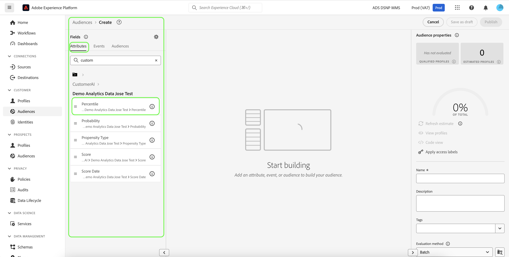

# Crear segmentos de clientes con puntuaciones predichas

Cuando se completa una ejecución de predicción, los perfiles consumen automáticamente las puntuaciones de tendencia predichas. El enriquecimiento de perfiles con puntuaciones de inteligencia artificial aplicada al cliente permite crear segmentos de clientes para encontrar audiencias en función de sus puntuaciones de tendencia. En esta sección se proporcionan los pasos para crear segmentos mediante el Generador de segmentos. Para obtener un tutorial más sólido sobre la creación de segmentos, consulte la [guía del usuario del Generador de segmentos](../../../segmentation/ui/segment-builder.md).

>[!IMPORTANT]
>
>Para utilizar este método, el perfil del cliente en tiempo real debe estar habilitado para el conjunto de datos.

En la interfaz de usuario de Experience Platform, haga clic en **[!UICONTROL Segmentos]** en el panel de navegación izquierdo y luego haga clic en **[!UICONTROL Crear segmento]**.

Aparecerá **Generador de segmentos**. En la columna izquierda de **[!UICONTROL Campos]** y debajo de la ficha **[!UICONTROL Atributos]**, haga clic en la carpeta denominada **[!UICONTROL Perfil individual de XDM]** y, a continuación, haga clic en la carpeta con el área de nombres de su organización. La carpeta **[!UICONTROL Customer AI]** contiene los resultados de las ejecuciones de predicción y recibe el nombre de la instancia a la que pertenecen las puntuaciones. Haga clic en una carpeta de instancias para acceder a los resultados de la instancia deseada.

Ubicado en el centro del Generador de segmentos, arrastre y suelte el atributo **[!UICONTROL Score]** en el *lienzo del generador de reglas* para definir una regla.

En la columna derecha *Propiedades del segmento*, proporcione un nombre para el segmento.

Encima de la columna izquierda de *Campos*, haz clic en el icono de **engranaje** y selecciona una *política de combinación* en la lista desplegable. Haga clic en **[!UICONTROL Guardar]** para crear el segmento.

## Pasos siguientes

Al seguir este tutorial, ha encontrado correctamente audiencias basadas en sus puntuaciones de tendencia mediante el Generador de segmentos. Ahora puede segmentar las audiencias activándolas en destinos. Consulte la [descripción general de destinos](../../../destinations/home.md) para obtener más información.
