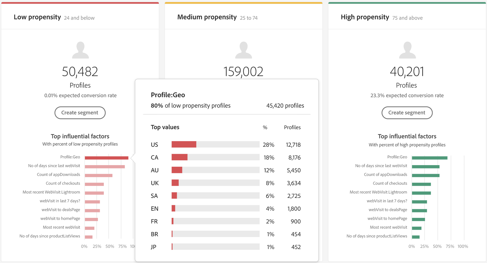

# Descubra perspectivas con Customer AI

La inteligencia artificial aplicada al cliente, como parte de los servicios inteligentes, proporciona a los especialistas en marketing la capacidad de aprovechar Adobe Sensei para anticipar cuál será la próxima acción de sus clientes. La AI del cliente se utiliza para generar puntuaciones de tendencia personalizadas, como la generación y la conversión de perfiles individuales a escala. Esto se logra sin tener que transformar las necesidades comerciales en un problema de aprendizaje automático, seleccionando un algoritmo, formación o implementación.

Este documento sirve como guía para interactuar con las perspectivas de la instancia de servicio en la interfaz de usuario de la inteligencia artificial aplicada al cliente de servicios inteligentes.

## Introducción

Para utilizar las perspectivas para la inteligencia artificial aplicada al cliente, necesita tener disponible una instancia de servicio con un estado de ejecución correcto. Para crear una nueva instancia de servicio, visite [Configuración de una instancia de Customer AI](./configure.md). Si ha creado recientemente una instancia de servicio que aún se está entrenando y puntuando, espere 24 horas para que finalice la ejecución.

## Resumen de instancia de servicio

En el [!DNL Adobe Experience Platform] IU, seleccione **[!UICONTROL Servicios]** en el panel de navegación izquierdo. El *Servicios* aparece el explorador y muestra los servicios inteligentes disponibles. En el contenedor de la inteligencia artificial aplicada al cliente, seleccione **[!UICONTROL Abrir]**.

Aparecerá la página Servicio de inteligencia artificial aplicada al cliente. Esta página enumera las instancias de servicio de la inteligencia artificial aplicada al cliente y muestra información sobre ellas, incluido el nombre de la instancia, el tipo de tendencia, la frecuencia con la que se ejecuta la instancia y el estado de la última actualización.

>[!NOTE]
>
>Solo las instancias de servicio que han completado ejecuciones de puntuación correctas tienen perspectivas.

Seleccione el nombre de una instancia de servicio para empezar.

A continuación, aparecerá la página de información de esa instancia de servicio con la opción de seleccionar **[!UICONTROL Últimas puntuaciones]** o **[!UICONTROL Resumen de rendimiento]**. La pestaña predeterminada **[!UICONTROL Últimas puntuaciones]** proporciona visualizaciones de sus datos. Las visualizaciones y lo que puede hacer con los datos se explican con más detalle en esta guía.

El **[!UICONTROL Resumen de rendimiento]** Esta pestaña muestra las tasas de pérdida o conversión reales de cada bloque de tendencia. Para obtener más información, consulte la sección sobre [métricas de resumen de rendimiento](#performance-metrics).

## Detalles de instancia del servicio

Existen dos formas de ver los detalles de la instancia de servicio: desde el panel o dentro de la instancia de servicio.

### Panel de instancia de servicio

Para ver una descripción general de los detalles de la instancia de servicio dentro del panel, seleccione un contenedor de instancia de servicio para evitar el hipervínculo adjunto al nombre. Esto abre un carril derecho que proporciona detalles adicionales. Los controles contienen lo siguiente:

- **[!UICONTROL Editar]**: seleccionando **[!UICONTROL Editar]** permite modificar una instancia de servicio existente. Puede editar el nombre, la descripción y la frecuencia de puntuación de la instancia.
- **[!UICONTROL Clonar]**: seleccionando **[!UICONTROL Clonar]** copia la configuración de la instancia de servicio seleccionada actualmente. A continuación, puede modificar el flujo de trabajo para realizar ajustes menores y cambiarle el nombre como una nueva instancia.
- **[!UICONTROL Eliminar]**: puede eliminar una instancia de servicio, incluidas las ejecuciones históricas.
- **[!UICONTROL Fuente de datos]**: Un vínculo al conjunto de datos utilizado por esta instancia.
- **[!UICONTROL Frecuencia de ejecución]**: Con qué frecuencia se produce una ejecución de puntuación y cuándo.
- **[!UICONTROL Definición de puntuación]**: Una breve descripción general del objetivo configurado para esta instancia.

>[!NOTE]
>
>En caso de que falle una ejecución de puntuación, se proporciona un mensaje de error. El mensaje de error se enumera en **Detalles de la última ejecución** en el carril derecho, que solo es visible para las ejecuciones fallidas.

### Mostrar el menú desplegable de más perspectivas

La segunda forma de ver detalles adicionales de una instancia de servicio se encuentra en la página de perspectivas. Seleccionar **[!UICONTROL Mostrar más]** en la parte superior derecha para rellenar una lista desplegable. Se muestran detalles, como la definición de puntuación, cuándo se creó, el tipo de tendencia y los conjuntos de datos utilizados. Para obtener más información sobre cualquiera de las propiedades enumeradas, visite [Configuración de una instancia de Customer AI](./configure.md).

### Ventana emergente de previsualización del conjunto de datos de Customer AI

Si la inteligencia artificial aplicada al cliente utiliza más de un conjunto de datos, un hipervínculo con la etiqueta **[!UICONTROL Múltiple]** seguido del número de conjuntos de datos entre corchetes `()` se proporciona.

Al seleccionar el vínculo de varios conjuntos de datos, se abre la ventana emergente de vista previa del conjunto de datos de inteligencia artificial aplicada al cliente. Cada color de la previsualización representa un conjunto de datos como se muestra mediante la tecla de color a la izquierda de las columnas del conjunto de datos. En este ejemplo, solo puede ver eso **Conjunto de datos 1** contiene el `PROP1` columna.

### Edición de una instancia

Para editar una instancia, seleccione **[!UICONTROL Editar]** en la barra de navegación superior derecha.

Aparecerá el cuadro de diálogo de edición, que le permitirá editar el nombre, la descripción, el estado y la frecuencia de puntuación de la instancia. Para confirmar los cambios y cerrar el cuadro de diálogo, seleccione **[!UICONTROL Guardar]** en la esquina inferior derecha.

### Más acciones

El **[!UICONTROL Más acciones]** situado en la barra de navegación superior derecha junto a **[!UICONTROL Editar]**. Seleccionar **[!UICONTROL Más acciones]** abre un menú desplegable que le permite seleccionar una de las siguientes operaciones:

- **[!UICONTROL Clonar]**: seleccionando **[!UICONTROL Clonar]** copia la configuración de la instancia de servicio. A continuación, puede modificar el flujo de trabajo para realizar ajustes menores y cambiarle el nombre como una nueva instancia.
- **[!UICONTROL Eliminar]**: elimina la instancia.
- **[!UICONTROL Puntuaciones de acceso]**: seleccionando **[!UICONTROL Puntuaciones de acceso]** abre un cuadro de diálogo que proporciona un vínculo al [descarga de puntuaciones para Customer AI](./download-scores.md) En este tutorial, el cuadro de diálogo también proporciona el id del conjunto de datos necesario para realizar llamadas de API.
- **[!UICONTROL Ver historial de ejecución]**: Aparece un cuadro de diálogo que contiene una lista de todas las ejecuciones de puntuación asociadas con la instancia de servicio.

## Resumen de las puntuaciones {#scoring-summary}

Resumen de puntuación muestra el número total de perfiles marcados y los clasifica en bloques que contienen alta, media y baja tendencia. Los bloques de tendencia se determinan en función del intervalo de puntuación, el bajo es menor que 24, el medio es de 25 a 74 y el alto es mayor que 74. Cada cubo tiene un color correspondiente a la leyenda.

>[!NOTE]
>
>Si se trata de una puntuación de tendencia a la conversión, las puntuaciones más altas se muestran en verde y las más bajas en rojo. Si predice una tendencia a la pérdida invertida, las puntuaciones más altas están en rojo y las más bajas en verde. El cubo mediano permanece amarillo independientemente del tipo de tendencia que elija.

Puede situarse sobre cualquier color del anillo para ver información adicional, como un porcentaje y un número total de perfiles pertenecientes a un bloque.

## Distribución de puntuaciones

El **[!UICONTROL Distribución de puntuaciones]** La tarjeta de le ofrece un resumen visual de la población en función de la puntuación. Los colores que se ven en la [!UICONTROL Distribución de puntuaciones] representan el tipo de puntuación de tendencia generada. Al pasar el ratón por encima de cualquiera de las distribuciones de puntuación, se proporciona el recuento exacto que pertenece a esa distribución.

## Factores influyentes

Para cada bloque de puntuación, se genera una tarjeta que muestra los 10 factores influyentes principales para ese bloque. Los factores influyentes le proporcionan detalles adicionales sobre por qué sus clientes pertenecen a varios bloques de puntuación.

### Desgloses de factores influyentes

Al pasar el ratón por encima de cualquiera de los principales factores influyentes, los datos se desglosan aún más. Se le proporciona una descripción general de por qué ciertos perfiles pertenecen a un bloque de tendencia. Según el factor, se le pueden dar valores numéricos, categóricos o booleanos. El ejemplo siguiente muestra valores categóricos por región.

Además, con los desgloses detallados, puede comparar un factor de distribución si se produce en dos o más bloques de tendencia y crear segmentos más específicos con estos valores. El siguiente ejemplo ilustra el primer caso de uso:

Se puede ver que es menos probable que los perfiles con baja tendencia a la conversión hayan realizado una visita reciente a las páginas web adobe.com. El factor &quot;Días transcurridos desde la última visita web&quot; tiene solo un 8 % de cobertura en comparación con el 26 % de los perfiles de tendencia medios. Con estos números, puede comparar la distribución dentro de cada bloque para el factor. Esta información se puede utilizar para inferir que la actualización de la visita web no es tan influyente en el bloque de baja tendencia como en el bloque de tendencia medio.

### Creación de segmentos

Selección de la **[!UICONTROL Crear segmento]** en cualquiera de los contenedores para baja, media y alta tendencia, le redirige al generador de segmentos.

>[!NOTE]
>
>El **[!UICONTROL Crear segmento]** El botón solo está disponible si el Perfil del cliente en tiempo real está habilitado para el conjunto de datos. Para obtener más información sobre cómo habilitar el Perfil del cliente en tiempo real, visite la [Resumen del perfil del cliente en tiempo real](../../../rtcdp/overview.md).

El generador de segmentos se utiliza para definir un segmento. Al seleccionar **[!UICONTROL Crear segmento]** En la página Perspectivas, la inteligencia artificial aplicada al cliente añade automáticamente la información de bloques seleccionada al segmento. Para terminar de crear el segmento, simplemente rellene el **Nombre** y **Descripción** contenedores ubicados en el carril derecho de la interfaz de usuario del generador de segmentos. Después de asignar un nombre y una descripción al segmento, seleccione **[!UICONTROL Guardar]** en la parte superior derecha.

>[!NOTE]
>
>Dado que las puntuaciones de tendencia se escriben en el perfil individual, están disponibles en el Generador de segmentos como cualquier otro atributo de perfil. Cuando vaya al generador de segmentos para crear nuevos segmentos, puede ver todas las puntuaciones de tendencia en el área de nombres Inteligencia artificial aplicada al cliente.

Para ver el nuevo segmento en la IU de Platform, seleccione **[!UICONTROL Segmentos]** en el panel de navegación izquierdo. El **[!UICONTROL Examinar]** aparece la página y muestra todos los segmentos disponibles.

## Rendimiento histórico {#historical-performance}

El **[!UICONTROL Resumen de rendimiento]** Esta pestaña muestra las tasas de pérdida o conversión reales, separadas en cada uno de los bloques de tendencia marcados por la inteligencia artificial aplicada al cliente.

Inicialmente solo se muestran las tasas esperadas (líneas punteadas). Las tasas esperadas se muestran cuando no se ha producido una ejecución de puntuación y los datos aún no están disponibles. Sin embargo, una vez transcurrido un periodo de resultados, la tasa esperada se sustituye por una tasa real (línea continua).

Al pasar el ratón por encima de las líneas, se muestran la fecha y la tasa real/esperada de ese día en ese bloque.

Puede filtrar el periodo de tiempo para las tasas esperadas y reales que se muestran. Seleccione el **icono de calendario** a continuación, seleccione un nuevo intervalo de fechas. Los resultados de cada uno de los bloques se actualizan para mostrarse dentro del nuevo intervalo de fechas.

### Tasas de ejecución de puntuación individual

La mitad inferior de la **[!UICONTROL Resumen de rendimiento]** La pestaña muestra los resultados de cada ejecución de puntuación individual. Seleccione la fecha desplegable en la parte superior derecha para mostrar los resultados de una ejecución de puntuación diferente.

Dependiendo de si predice una pérdida o conversión, la variable [!UICONTROL Distribución de puntuaciones] El gráfico muestra la distribución de perfiles cancelados/convertidos y no cancelados/no convertidos en cada incremento.

## Evaluación de modelo {#model-evaluation}

Además de rastrear los resultados predichos y reales a lo largo del tiempo en la pestaña Rendimiento histórico, los especialistas en marketing tienen incluso más transparencia sobre la calidad del modelo con la pestaña Evaluación del modelo. Puede utilizar los gráficos de alza y ganancias para determinar las diferencias entre el uso de un modelo predictivo y el direccionamiento aleatorio. Además, puede determinar cuántos resultados positivos se capturarían en cada límite de puntuación. Esto resulta útil para la segmentación y para alinear el retorno de la inversión con las acciones de marketing.

### Gráfico de alza

El gráfico de elevación mide la mejora de utilizar un modelo predictivo en lugar de una segmentación aleatoria.

Los indicadores del modelo de alta calidad incluyen:

- Valores altos de elevación en los primeros deciles. Esto significa que el modelo es bueno para identificar a los usuarios con la mayor tendencia a realizar la acción de interés.
- Valores de alza descendente. Esto significa que es más probable que los clientes con puntuaciones más altas realicen la acción de interés que las personas con puntuaciones más bajas.

### Gráfico de ganancias

El gráfico de ganancias acumuladas mide el porcentaje de resultados positivos capturados por puntuaciones de objetivos por encima de un determinado umbral. Después de ordenar los clientes por puntuación de tendencia de alta a baja, la población se divide en deciles: 10 grupos del mismo tamaño. Un modelo perfecto capturaría todos los resultados positivos en los deciles de mayor puntuación. Un método de direccionamiento aleatorio de línea de base captura los resultados positivos proporcionalmente al tamaño del grupo: segmentar 30% de los usuarios capturaría 30% de los resultados.

Los indicadores del modelo de alta calidad incluyen:

- Las ganancias acumuladas se acercan al 100% rápidamente.
- La curva de ganancias acumuladas del modelo está más cerca de la esquina superior izquierda del gráfico.
- El gráfico de ganancias acumuladas se puede utilizar para determinar los límites de puntuación para la segmentación y el direccionamiento. Por ejemplo, si el modelo registra el 70 % de los resultados positivos en los dos primeros deciles de puntuación, se espera que la segmentación de usuarios con una puntuación del percentil > 80 capture aproximadamente el 70 % de los resultados positivos.

### AUC (área bajo la curva)

El AUC refleja la fuerza de la relación entre la clasificación por puntuación y la ocurrencia del objetivo previsto. Un **AUC** de 0,5 significa que el modelo no es mejor que una suposición aleatoria. Un **AUC** de 1 significa que el modelo puede predecir perfectamente quién tomará la acción relevante.

## Pasos siguientes

Este documento describe las perspectivas proporcionadas por una instancia del servicio de inteligencia artificial aplicada al cliente. Ahora puede continuar con el tutorial sobre [descarga de puntuaciones en Customer AI](./download-scores.md) o examinar el otro [Adobe Servicios inteligentes](../../home.md) guías que se ofrecen.

## Recursos adicionales

El siguiente vídeo describe cómo utilizar la inteligencia artificial aplicada al cliente para ver la salida de los modelos y los factores influyentes.

>[!VIDEO](https://video.tv.adobe.com/v/32666?learn=on&quality=12)
