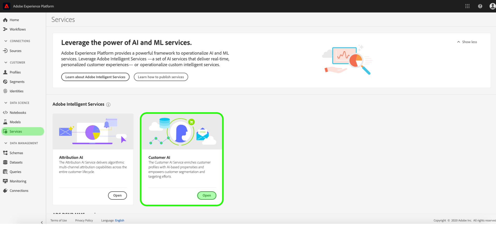

# Descubra las perspectivas con la API del cliente

La API del cliente, como parte de Servicios inteligentes, proporciona a los especialistas en marketing la capacidad de aprovechar Adobe Sensei para anticipar lo que serán las próximas acciones de sus clientes. La AI del cliente se utiliza para generar puntuaciones de tendencia personalizadas, como la generación y la conversión de perfiles individuales a escala. Esto se logra sin tener que transformar las necesidades comerciales en un problema de aprendizaje automático, eligiendo un algoritmo, capacitación o implementación.

Este documento sirve como guía para interactuar con perspectivas de instancias de servicio en la interfaz de usuario de Intelligent Services Customer AI.

## Primeros pasos

Para utilizar perspectivas para la API del cliente, debe tener disponible una instancia de servicio con un estado de ejecución correcto. Para crear una nueva instancia de servicio, visite [Configuración de una instancia de AI del cliente](./configure.md). Si ha creado recientemente una instancia de servicio y aún está en formación y puntaje, espere 24 horas para que termine de ejecutarse.

## Información general de la instancia de servicio

En la interfaz de usuario [!DNL Adobe Experience Platform], haga clic en **[!UICONTROL Servicios]** en el panel de navegación izquierdo. Aparece el explorador *Services* y muestra los Servicios inteligentes disponibles. En el contenedor de la API del cliente, haga clic en **[!UICONTROL Abrir]**.

Aparece la página de servicio de AI del cliente. Esta página lista las instancias de servicio de AI del cliente y muestra información sobre ellas, incluido el nombre de la instancia, el tipo de tendencia, la frecuencia con la que se ejecuta la instancia y el estado de la última actualización.

>[!NOTE]
>
>Solo las instancias de servicio que hayan completado correctamente las ejecuciones de puntuación tienen perspectivas.

Haga clic en el nombre de una instancia de servicio para comenzar.

A continuación, se abre la página de perspectivas de esa instancia de servicio, donde se le proporcionan visualizaciones de los datos. Las visualizaciones y lo que se puede hacer con los datos se explican con más detalle en esta guía.

### Detalles de instancia de servicio

Existen dos formas de vista de los detalles de las instancias de servicio: desde el panel o dentro de la instancia de servicio.

Para obtener una vista general de los detalles de la instancia de servicio dentro del panel, seleccione un contenedor de instancia de servicio y evite el hipervínculo que se adjunta al nombre. Se abre un carril derecho que proporciona detalles adicionales. Los controles contienen lo siguiente:

- **[!UICONTROL Editar]**: Si selecciona  **** Editar, podrá modificar una instancia de servicio existente. Puede editar el nombre, la descripción y la frecuencia de puntuación de la instancia.
- **[!UICONTROL Clonar]**: Al seleccionar  **** Clonecopia, se configura la instancia de servicio seleccionada. A continuación, puede modificar el flujo de trabajo para realizar pequeñas modificaciones y cambiarle el nombre como una nueva instancia.
- **[!UICONTROL Eliminar]**: Puede eliminar una instancia de servicio, incluidas las ejecuciones históricas.
- **[!UICONTROL Fuente]** de datos: Vínculo al conjunto de datos utilizado por esta instancia.
- **[!UICONTROL Frecuencia]** de ejecución: La frecuencia con la que se produce un puntaje y el momento en que se produce.
- **[!UICONTROL Definición]** de puntuación: Información general rápida sobre el objetivo configurado para esta instancia.

>[!NOTE]
>
>En el evento de que una ejecución de puntuación falla, se proporciona un mensaje de error. El mensaje de error se muestra en **Detalles de la última ejecución** en el carril derecho, que solo está visible para las ejecuciones fallidas.

La segunda forma de vista de detalles adicionales para una instancia de servicio se encuentra dentro de la página de perspectivas. Puede hacer clic en **[!UICONTROL Mostrar más]** en la parte superior derecha para completar una lista desplegable. Se muestran detalles como la definición de la puntuación, cuándo se creó y el tipo de tendencia. Para obtener más información sobre cualquiera de las propiedades enumeradas, visite [Configuración de una instancia de AI del cliente](./configure.md).

### Editar una instancia

Para editar una instancia, haga clic en **[!UICONTROL Editar]** en la navegación superior derecha.

Aparece el cuadro de diálogo de edición, que le permite editar el nombre, la descripción, el estado y la frecuencia de puntuación de la instancia. Para confirmar los cambios y cerrar el cuadro de diálogo, seleccione **[!UICONTROL Guardar]** en la esquina inferior derecha.

### Más acciones

El botón **[!UICONTROL Más acciones]** se encuentra en la navegación superior derecha junto a **[!UICONTROL Editar]**. Al hacer clic en **[!UICONTROL Más acciones]** se abre una lista desplegable que le permite seleccionar una de las siguientes operaciones:

- **[!UICONTROL Clonar]**: Al seleccionar  **** Clonecopia, se configura la instancia de servicio. A continuación, puede modificar el flujo de trabajo para realizar pequeñas modificaciones y cambiarle el nombre como una nueva instancia.
- **[!UICONTROL Eliminar]**: Elimina la instancia.
- **[!UICONTROL Puntuaciones]** de acceso: Al seleccionar  **[!UICONTROL Access]** scoresse abre un cuadro de diálogo que proporciona un vínculo a las puntuaciones de  [descarga para el ](./download-scores.md) AItutorial del cliente, el cuadro de diálogo también proporciona la identificación del conjunto de datos necesaria para realizar llamadas de API.
- **[!UICONTROL Historial]** de ejecución de vistas: Aparece un cuadro de diálogo que contiene una lista de todas las ejecuciones de puntuación asociadas con la instancia de servicio.

## Resumen de puntuación {#scoring-summary}

El resumen de puntuación muestra el número total de perfiles puntuados y los categoriza en bloques que contienen alta, media y baja tendencia. Los bloques de propensión se determinan en función del rango de puntuación, el bajo es menor que 24, el medio es de 25 a 74 y el alto es superior a 74. Cada cubo tiene un color correspondiente a la leyenda.

>[!NOTE]
>
>Si se trata de una puntuación de propensión a la conversión, las puntuaciones altas se muestran en verde y las bajas en rojo. Si predices una tendencia a la agitación, esto es volteado, las puntuaciones altas están en rojo y las bajas son verdes. El bloque mediano permanece amarillo independientemente del tipo de propensión que elija.

Puede pasar el ratón sobre cualquier color del anillo para vista información adicional, como un porcentaje y un número total de perfiles que pertenecen a un cubo.

## Distribución de puntuaciones

La tarjeta **[!UICONTROL Distribución de puntuaciones]** le proporciona un resumen visual de la población en base a la puntuación. Los colores que se ven en la tarjeta [!UICONTROL Distribución de puntuaciones] representan el tipo de puntuación de tendencia generada. Al pasar el ratón por encima de cualquiera de las distribuciones de puntuación, se obtiene el recuento exacto de esa distribución.

## Factores influyentes

Para cada bloque de puntuación, se genera una tarjeta que muestra los 10 factores influyentes principales para ese bloque. Los factores influyentes proporcionan detalles adicionales sobre por qué los clientes pertenecen a varios bloques de puntaje.

### Exploraciones influyentes de los factores

Si pasa el ratón por encima de cualquiera de los factores de mayor influencia, los datos se desglosan aún más. Se le proporciona una descripción general de por qué ciertos perfiles pertenecen a un bloque de propensión. En función del factor, se le pueden dar valores numéricos, categóricos o booleanos. El ejemplo siguiente muestra valores categóricos por región.

Además, con los desgloses, puede comparar un factor de distribución si se produce en dos o más bloques de propensión y crear segmentos más específicos con estos valores. El siguiente ejemplo ilustra el primer caso de uso:

Puede ver que los perfiles con baja propensión a convertir tienen menos probabilidades de haber realizado una visita reciente a las páginas web de adobe.com. El factor &quot;Días desde la última visita web&quot; tiene sólo un 8% de cobertura, en comparación con el 26% en los perfiles de propensión media. Con estos números, puede comparar la distribución dentro de cada bloque del factor. Esta información puede utilizarse para deducir que la actualización en la visita por Internet no influye tanto en el bloque de baja propensión como en el bloque de propensión media.

### Crear un segmento

Al seleccionar el botón **[!UICONTROL Crear segmento]** en cualquiera de los bloques para baja, media y alta propensión, se le redirige al generador de segmentos.

>[!NOTE]
>
>El botón **[!UICONTROL Crear segmento]** sólo está disponible si el Perfil del cliente en tiempo real está habilitado para el conjunto de datos. Para obtener más información sobre cómo habilitar el Perfil de clientes en tiempo real, visite [Información general sobre el Perfil de clientes en tiempo real](../../../rtcdp/overview.md).

El generador de segmentos se utiliza para definir un segmento. Al seleccionar **[!UICONTROL Crear segmento]** desde la página Perspectivas, la API del cliente agrega automáticamente la información de bloques seleccionada al segmento. Para terminar de crear el segmento, simplemente rellene los contenedores *Name* y *Description* ubicados en el carril derecho de la interfaz de usuario del generador de segmentos. Después de dar un nombre y una descripción al segmento, haga clic en **[!UICONTROL Guardar]** en la parte superior derecha.

>[!NOTE]
>
>Dado que las puntuaciones de tendencia se escriben en el perfil individual, están disponibles en el Generador de segmentos como cualquier otro atributo de perfil. Al navegar al generador de segmentos para crear nuevos segmentos, puede ver todas las distintas puntuaciones de tendencia en la Área de nombres de la API del cliente.

Para vista del nuevo segmento en la interfaz de usuario de la plataforma, haga clic en **[!UICONTROL Segmentos]** en el panel de navegación izquierdo. Aparece la página **[!UICONTROL Examinar]** y muestra todos los segmentos disponibles.

## Pasos siguientes

Este documento describía las perspectivas proporcionadas por una instancia de servicio de inteligencia artificial del cliente. Ahora puede continuar con el tutorial sobre [descarga de puntuaciones en la API del cliente](./download-scores.md) o explorar las otras [guías de servicios inteligentes de Adobe](../../home.md) que se ofrecen.

## Recursos adicionales

En el siguiente vídeo se describe cómo utilizar la API del cliente para ver la salida de los modelos y los factores influyentes.

>[!VIDEO](https://video.tv.adobe.com/v/32666?learn=on&quality=12)