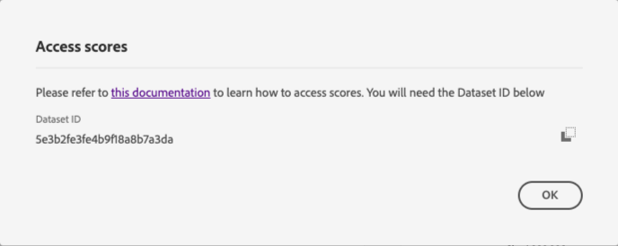

# Descarga de puntuaciones en la API del cliente

Este documento sirve como guía para descargar puntuaciones para la API del cliente.

## Primeros pasos

La API del cliente le permite descargar puntuaciones en formato de archivo de parqué. Este tutorial requiere que haya leído y terminado la sección de descarga de puntuaciones de AI del cliente en la guía de [introducción](../getting-started.md) .

Además, para acceder a las puntuaciones de la API del cliente, debe tener disponible una instancia de servicio con un estado de ejecución correcto. Para crear una nueva instancia de servicio, visite [Configuración de una instancia](./configure.md)de AI de cliente. Si ha creado recientemente una instancia de servicio y aún está en formación y puntaje, espere 24 horas para que termine de ejecutarse.

Actualmente, existen dos formas de descargar puntuaciones de AI de cliente:

1. Si desea descargar las puntuaciones en el nivel individual y/o no tiene activado el Perfil del cliente en tiempo real, vaya a [buscar el ID](#dataset-id)del conjunto de datos para realizar el inicio.
2. Si tiene activado el Perfil y desea descargar segmentos que ha configurado mediante la API del cliente, navegue para [descargar un segmento configurado con la API](#segment)del cliente.

## Find your dataset ID {#dataset-id}

Dentro de la instancia de servicio para obtener información sobre la API del cliente, haga clic en el menú desplegable *Más acciones* en la navegación superior derecha y, a continuación, seleccione **[!UICONTROL Acceso a puntuaciones]**.


Aparece un nuevo cuadro de diálogo que contiene un vínculo a la documentación de las puntuaciones de descarga y al ID del conjunto de datos de la instancia actual. Copie el ID del conjunto de datos en el portapapeles y continúe con el paso siguiente.



## Recuperar el ID de lote {#retrieve-your-batch-id}

Con el ID del conjunto de datos del paso anterior, debe realizar una llamada a la API del catálogo para recuperar un ID de lote. Se utilizan parámetros de consulta adicionales para esta llamada de API a fin de devolver el último lote exitoso en lugar de una lista de lotes que pertenecen a su organización. Para devolver lotes adicionales, aumente el número del parámetro de consulta de límite a la cantidad deseada que desee que se devuelva. Para obtener más información sobre los tipos de parámetros de consulta disponibles, visite la guía sobre el [filtrado de datos del catálogo mediante parámetros](../../../catalog/api/filter-data.md)de consulta.

**Formato API**

```http
GET /batches?&dataSet={DATASET_ID}&createdClient=acp_foundation_push&status=success&orderBy=desc:created&limit=1
```

| Parámetro | Descripción |
| --------- | ----------- |
| `{DATASET_ID}` | ID del conjunto de datos disponible en el cuadro de diálogo &quot;Puntuaciones de acceso&quot;. |

**Solicitud**

```shell
curl -X GET 'https://platform.adobe.io/data/foundation/catalog/batches?dataSet=5cd9146b31dae914b75f654f&createdClient=acp_foundation_push&status=success&orderBy=desc:created&limit=1' \
  -H 'Authorization: Bearer {ACCESS_TOKEN}' \
  -H 'x-api-key: {API_KEY}' \
  -H 'x-gw-ims-org-id: {IMS_ORG}' \
  -H 'x-sandbox-name: {SANDBOX_NAME}'
```

**Respuesta**

Una respuesta correcta devuelve una carga útil que contiene un objeto de ID de lote. En este ejemplo, el valor clave del objeto devuelto es el ID de lote `01E5QSWCAASFQ054FNBKYV6TIQ`. Copie el ID de lote para utilizarlo en la siguiente llamada de API.

```json
{
    "01E5QSWCAASFQ054FNBKYV6TIQ": {
        "status": "success",
        "tags": {
            "Tags": [ ... ],
        },
        "relatedObjects": [
            {
                "type": "dataSet",
                "id": "5cd9146b31dae914b75f654f"
            }
        ],
        "id": "01E5QSWCAASFQ054FNBKYV6TIQ",
        "externalId": "01E5QSWCAASFQ054FNBKYV6TIQ",
        "replay": {
            "predecessors": [
                "01E5N7EDQQP4JHJ93M7C3WM5SP"
            ],
            "reason": "Replacing for 2020-04-09",
            "predecessorListingType": "IMMEDIATE"
        },
        "inputFormat": {
            "format": "parquet"
        },
        "imsOrg": "412657965Y566A4A0A495D4A@AdobeOrg",
        "started": 1586715571808,
        "metrics": {
            "partitionCount": 1,
            "outputByteSize": 2380339,
            "inputFileCount": -1,
            "inputByteSize": 2381007,
            "outputRecordCount": 24340,
            "outputFileCount": 1,
            "inputRecordCount": 24340
        },
        "completed": 1586715582735,
        "created": 1586715571217,
        "createdClient": "acp_foundation_push",
        "createdUser": "sensei_exp_attributionai@AdobeID",
        "updatedUser": "acp_foundation_dataTracker@AdobeID",
        "updated": 1586715583582,
        "version": "1.0.5"
    }
}
```

## Recupere la siguiente llamada de API con su ID de lote {#retrieve-the-next-api-call-with-your-batch-id}

Una vez que tenga su ID de lote, podrá realizar una nueva solicitud de GET a `/batches`. La solicitud devuelve un vínculo que se utiliza como la siguiente solicitud de API.

**Formato API**

```http
GET batches/{BATCH_ID}/files
```

| Parámetro | Descripción |
| --------- | ----------- |
| `{BATCH_ID}` | El ID de lote que se recuperó en el paso anterior [recupera el ID](#retrieve-your-batch-id)de lote. |

**Solicitud**

Con su propio ID de lote, realice la siguiente solicitud.

```shell
curl -X GET 'https://platform.adobe.io/data/foundation/export/batches/035e2520-5e69-11ea-b624-51evfeba55d1/files' \
  -H 'Authorization: Bearer {ACCESS_TOKEN}' \
  -H 'x-api-key: {API_KEY}' \
  -H 'x-gw-ims-org-id: {IMS_ORG}' \
  -H 'x-sandbox-name: {SANDBOX_NAME}'
```

**Respuesta**

Una respuesta correcta devuelve una carga útil que contiene un `_links` objeto. Dentro del `_links` objeto hay un valor `href` con una nueva llamada de API. Copie este valor para continuar con el paso siguiente.

```json
{
    "data": [
        {
            "dataSetFileId": "035e2520-5e69-11ea-b624-51ecfeba55d0-1",
            "dataSetViewId": "5e3b2fe3fe4b9f18a8b7a3db",
            "version": "1.0.0",
            "created": "1583361894479",
            "updated": "1583361894479",
            "isValid": false,
            "_links": {
                "self": {
                    "href": "https://platform.adobe.io:443/data/foundation/export/files/035e2520-5e69-11ea-b624-51ecfeba55d0-1"
                }
            }
        }
    ],
    "_page": {
        "limit": 100,
        "count": 1
    }
}
```

## Recuperar los archivos {#retrieving-your-files}

Utilizando el `href` valor obtenido en el paso anterior como una llamada de API, realice una nueva solicitud de GET para recuperar el directorio de archivos.

**Formato API**

```http
GET files/{DATASETFILE_ID}
```

| Parámetro | Descripción |
| --------- | ----------- |
| `{DATASETFILE_ID}` | El ID de dataSetFile se devuelve en el `href` valor del paso [](#retrieve-the-next-api-call-with-your-batch-id)anterior. También se puede acceder a ella en la `data` matriz bajo el tipo de objeto `dataSetFileId`. |

**Solicitud**

```shell
curl -X GET 'https://platform.adobe.io:443/data/foundation/export/files/035e2520-5e69-11ea-b624-51ecfeba55d0-1' \
  -H 'Authorization: Bearer {ACCESS_TOKEN}' \
  -H 'x-api-key: {API_KEY}' \
  -H 'x-gw-ims-org-id: {IMS_ORG}' \
  -H 'x-sandbox-name: {SANDBOX_NAME}'
```

**Respuesta**

La respuesta contiene una matriz de datos que puede tener una sola entrada o una lista de archivos pertenecientes a ese directorio. El ejemplo siguiente contiene una lista de archivos y se ha resumido para facilitar la lectura. En este escenario, debe seguir la dirección URL de cada archivo para acceder al archivo.

```json
{
    "data": [
        {
            "name": "part-00000-tid-7597930103898538622-a25f1890-efa9-40eb-a2cb-1b378e93d582-528-1-c000.snappy.parquet",
            "length": "16214531",
            "_links": {
                "self": {
                    "href": "https://platform.adobe.io:443/data/foundation/export/files/035e2520-5e69-11ea-b624-51ecfeba55d0-1?path=part-00000-tid-7597930103898538622-a25f1890-efa9-40eb-a2cb-1b378e93d582-528-1-c000.snappy.parquet"
                }
            }
        },
        {
            "name": "...",
            "length": "16235375",
            "_links": {
                "self": {
                    "href": "..."
                }
            }
        }
    ],
    "_page": {
        "limit": 100,
        "count": 100
    },
    "_links": {
        "next": {
            "href": "..."
        },
        "page": {
            "href": "...",
            "templated": true
        }
    }
}
```

| Parámetro | Descripción |
| --------- | ----------- |
| `_links.self.href` | Dirección URL de solicitud de GET utilizada para descargar un archivo en el directorio. |


Copie el `href` valor de cualquier objeto de archivo de la `data` matriz y, a continuación, continúe con el paso siguiente.

## Descargar los datos del archivo

Para descargar los datos del archivo, realice una solicitud de GET al `"href"` valor copiado en el paso anterior [para recuperar los archivos](#retrieving-your-files).

>[!NOTE]
>
>Si realiza esta solicitud directamente en la línea de comandos, es posible que se le pregunte si desea agregar un resultado después de los encabezados de la solicitud. El siguiente ejemplo de solicitud utiliza `--output {FILENAME.FILETYPE}`.

**Formato API**

```http
GET files/{DATASETFILE_ID}?path={FILE_NAME}
```

| Parámetro | Descripción |
| --------- | ----------- |
| `{DATASETFILE_ID}` | El ID de dataSetFile se devuelve en el `href` valor de un paso [](#retrieve-the-next-api-call-with-your-batch-id)anterior. |
| `{FILE_NAME}` | Nombre del archivo. |

**Solicitud**

```shell
curl -X GET 'https://platform.adobe.io:443/data/foundation/export/files/035e2520-5e69-11ea-b624-51ecfeba55d0-1?path=part-00000-tid-7597930103898538622-a25f1890-efa9-40eb-a2cb-1b378e93d582-528-1-c000.snappy.parquet' \
  -H 'Authorization: Bearer {ACCESS_TOKEN}' \
  -H 'x-api-key: {API_KEY}' \
  -H 'x-gw-ims-org-id: {IMS_ORG}' \
  -H 'x-sandbox-name: {SANDBOX_NAME}' \
  -O 'filename.parquet'
```

>[!TIP]
>
>Antes de realizar la solicitud de GET, asegúrese de que se encuentra en el directorio o la carpeta en los que desea guardar el archivo.

**Respuesta**

La respuesta descarga el archivo solicitado en el directorio actual. En este ejemplo, el nombre de archivo es &quot;filename.parquet&quot;.


## Descargar un segmento configurado con la API del cliente {#segment}

Una forma alternativa de descargar los datos de puntuación es mediante la exportación de la audiencia a un conjunto de datos. Una vez completado correctamente un trabajo de segmentación (el valor del `status` atributo es &quot;SUCCEEDED&quot;), puede exportar la audiencia a un conjunto de datos en el que se pueda acceder a él y tomar medidas al respecto. Para obtener más información sobre la segmentación, visite la descripción general [de la](../../../segmentation/home.md)segmentación.

>[!IMPORTANT]
>
>Para utilizar este método de exportación, es necesario habilitar el Perfil del cliente en tiempo real para el conjunto de datos.

La sección [Exportar un segmento](../../../segmentation/tutorials/evaluate-a-segment.md) de la guía de evaluación de segmentos abarca los pasos necesarios para exportar un conjunto de datos de audiencia. La guía describe y proporciona ejemplos de lo siguiente:

- **Crear un conjunto de datos de destinatario:** Cree el conjunto de datos para albergar miembros de la audiencia.
- **Generar perfiles de audiencia en el conjunto de datos:** Rellene el conjunto de datos con Perfiles individuales XDM en función de los resultados de un trabajo de segmento.
- **Monitorear el progreso de exportación:** Compruebe el progreso actual del proceso de exportación.
- **Leer datos de audiencia:** Recupere los Perfiles individuales XDM resultantes que representan a los miembros de la audiencia.

## Pasos siguientes

Este documento describe los pasos necesarios para descargar puntuaciones de AI de cliente. Ahora puede seguir explorando los otros servicios [](../../home.md) inteligentes y las guías que se ofrecen.
