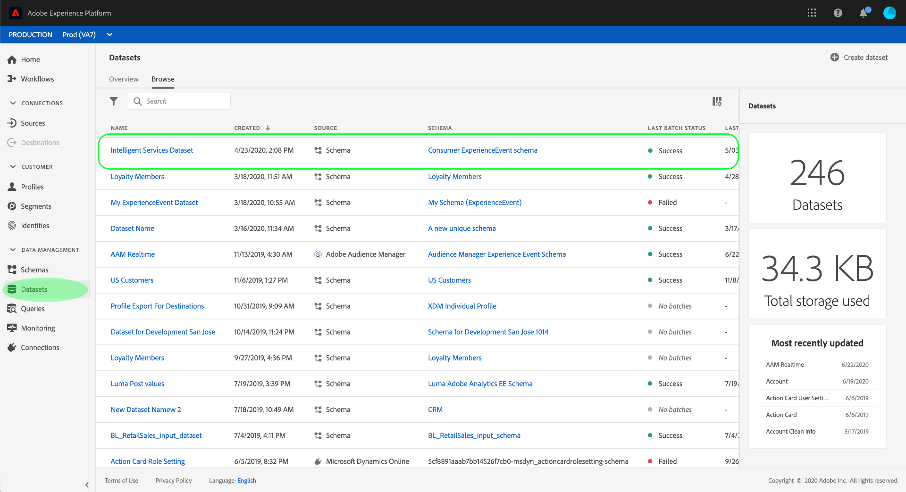

# Preparación de datos para su uso en [!DNL Intelligent Services]

Para [!DNL Intelligent Services] descubrir perspectivas a partir de los datos de eventos de marketing, los datos deben enriquecirse y mantenerse semánticamente en una estructura estándar. [!DNL Intelligent Services] aproveche los esquemas [!DNL Experience Data Model] (XDM) para lograrlo. Específicamente, todos los conjuntos de datos utilizados en [!DNL Intelligent Services] deben cumplir el esquema XDM de Consumer ExperienceEvent (CEE).

Este documento proporciona una guía general sobre cómo asignar los datos de eventos de marketing de varios canales a este esquema, esbozando información sobre los campos importantes dentro del esquema para ayudarle a determinar cómo asignar los datos de manera efectiva a su estructura.

## Resumen de flujo de trabajo

El proceso de preparación varía en función de si los datos se almacenan en Adobe Experience Platform o externamente. En esta sección se resumen los pasos necesarios que debe seguir, en cualquier caso.

### Preparación de datos externos

Si los datos se almacenan fuera de [!DNL Experience Platform], siga los pasos a continuación:

1. Póngase en contacto con los servicios de consultoría de Adobe para solicitar las credenciales de acceso para un contenedor de Almacenamiento de blob de Azure dedicado.
1. Con las credenciales de acceso, cargue los datos en el contenedor Blob.
1. Trabaje con los servicios de consultoría de Adobe para obtener los datos asignados al esquema [](#cee-schema) Consumer ExperienceEvent e ingeridos en [!DNL Intelligent Services].

### [!DNL Experience Platform] preparación de datos

Si los datos ya están almacenados en [!DNL Platform], siga los pasos a continuación:

1. Revise la estructura del esquema [](#cee-schema) Consumer ExperienceEvent y determine si los datos se pueden asignar a sus campos.
1. Póngase en contacto con los servicios de consultoría de Adobe para ayudarle a asignar los datos al esquema y a [!DNL Intelligent Services]ingerirlos o [seguir los pasos de esta guía](#mapping) si desea asignarlos usted mismo.

## Explicación del esquema de CEE {#cee-schema}

El esquema Consumer ExperienceEvent describe el comportamiento de una persona en relación con eventos de marketing digital (web o móvil), así como con la actividad comercial en línea o sin conexión. Se requiere el uso de este esquema [!DNL Intelligent Services] debido a sus campos (columnas) semánticamente bien definidos, evitando nombres desconocidos que de otro modo harían que los datos resultaran menos claros.

El esquema CEE, al igual que todos los esquemas de ExperienceEvent de XDM, captura el estado del sistema basado en series temporales cuando se produjo un evento (o conjunto de eventos), incluido el momento y la identidad del sujeto involucrado. Los Eventos de experiencias son registros de hechos de lo que ocurrió, y por lo tanto son inmutables y representan lo que pasó sin agregación ni interpretación.

[!DNL Intelligent Services] utilice varios campos clave dentro de este esquema para generar perspectivas a partir de los datos de eventos de marketing, todos los cuales se pueden encontrar en el nivel raíz y expandirse para mostrar los subcampos requeridos.


Al igual que todos los esquemas XDM, la mezcla CEE es extensible. En otras palabras, se pueden agregar campos adicionales a la mezcla CEE y, si es necesario, se pueden incluir variaciones diferentes en varios esquemas.

Encontrará un ejemplo completo de la mezcla en el repositorio [XDM](https://github.com/adobe/xdm/blob/797cf4930d5a80799a095256302675b1362c9a15/docs/reference/context/experienceevent-consumer.schema.md)público. Además, puede crear vistas y copiar el siguiente archivo [](https://github.com/AdobeDocs/experience-platform.en/blob/master/help/intelligent-services/assets/CEE_XDM_sample_rows.json) JSON para ver un ejemplo de cómo se pueden estructurar los datos para cumplir con el esquema CEE. Consulte estos dos ejemplos cuando conozca los campos clave descritos en la sección siguiente para determinar cómo puede asignar sus propios datos al esquema.

## Campos clave

Existen varios campos clave dentro de la mezcla CEE que deben utilizarse para [!DNL Intelligent Services] generar perspectivas útiles. Esta sección describe el caso de uso y los datos esperados para estos campos, y proporciona vínculos a la documentación de referencia para obtener más ejemplos.

### Campos obligatorios

Aunque se recomienda encarecidamente el uso de todos los campos clave, hay dos campos **necesarios** para [!DNL Intelligent Services] que funcionen:

* [Campo de identidad principal](#identity)
* [xdm:timestamp](#timestamp)
* [xdm:canal](#channel) (obligatorio solo para Attribution AI)

#### Identidad primaria {#identity}

Uno de los campos del esquema debe configurarse como un campo de identidad principal, que permite [!DNL Intelligent Services] vincular cada instancia de datos de series temporales a una persona individual.

Debe determinar el mejor campo para utilizarlo como identidad principal en función de la fuente y la naturaleza de los datos. Un campo de identidad debe incluir una Área de nombres **de** identidad que indique el tipo de datos de identidad que el campo espera como valor. Algunos valores de Área de nombres válidos son:

* &quot;email&quot;
* &quot;phone&quot;
* &quot;mcid&quot; (para Adobe Audience Manager ID)
* &quot;aaid&quot; (para Adobe Analytics ID)

Si no está seguro de qué campo debe utilizar como identidad principal, póngase en contacto con los servicios de consultoría de Adobe para determinar cuál es la mejor solución.

#### xdm:timestamp {#timestamp}

Este campo representa la fecha y hora en que se produjo el evento. Este valor debe proporcionarse como una cadena, según la norma ISO 8601.

#### xdm:canal {#channel}

>[!NOTE]
>
>Este campo solo es obligatorio cuando se utiliza Attribution AI.

Este campo representa el canal de marketing relacionado con ExperienceEvent. El campo incluye información sobre el tipo de canal, el tipo de medio y el tipo de ubicación.


**Esquema de ejemplo**

```json
{
  "@id": "https://ns.adobe.com/xdm/channels/facebook-feed",
  "@type": "https://ns.adobe.com/xdm/channel-types/social",
  "xdm:mediaType": "earned",
  "xdm:mediaAction": "clicks"
}
```

Para obtener información completa sobre cada uno de los subcampos obligatorios para `xdm:channel`, consulte las especificaciones del esquema [de canal de](https://github.com/adobe/xdm/blob/797cf4930d5a80799a095256302675b1362c9a15/docs/reference/channels/channel.schema.md) experiencia. Para ver algunos ejemplos de asignaciones, consulte la [tabla siguiente](#example-channels).

##### Asignaciones de canal de ejemplo {#example-channels}

En la tabla siguiente se proporcionan algunos ejemplos de canales de marketing asignados al `xdm:channel` esquema:

| Canal | `@type` | `mediaType` | `mediaAction` |
| --- | --- | --- | --- |
| Búsqueda de pago | https:/<span>/ns.adobe.com/xdm/canal-types/search | pagado | clicks |
| Social - Marketing | https:/<span>/ns.adobe.com/xdm/canal-types/social | ganado | clicks |
| Mostrar | https:/<span>/ns.adobe.com/xdm/canal-types/display | pagado | clicks |
| Correo electrónico | https:/<span>/ns.adobe.com/xdm/canal-types/email | pagado | clicks |
| Remitente del reenvío interno | https:/<span>/ns.adobe.com/xdm/canal-types/direct | propiedad | clicks |
| Visualización de visualizaciones | https:/<span>/ns.adobe.com/xdm/canal-types/display | pagado | impresiones |
| Redirección de código QR | https:/<span>/ns.adobe.com/xdm/canal-types/direct | propiedad | clicks |
| Dispositivo móvil | https:/<span>/ns.adobe.com/xdm/canal-types/mobile | propiedad | clicks |

### Campos recomendados

El resto de los campos clave se describen en esta sección. Aunque estos campos no son necesariamente necesarios para [!DNL Intelligent Services] que funcionen, se recomienda encarecidamente que utilice tantos como sea posible para obtener perspectivas más enriquecidas.

#### xdm:productListItems

Este campo es una matriz de artículos que representan los productos seleccionados por un cliente, incluidos el SKU del producto, el nombre, el precio y la cantidad.


**Esquema de ejemplo**

```json
[
  {
    "xdm:SKU": "1002352692",
    "xdm:name": "24-Watt 8-Light Chrome Integrated LED Bath Light",
    "xdm:currencyCode": "USD",
    "xdm:quantity": 1,
    "xdm:priceTotal": 159.45
  },
  {
    "xdm:SKU": "3398033623",
    "xdm:name": "16ft RGB LED Strips",
    "xdm:currencyCode": "USD",
    "xdm:quantity": 1,
    "xdm:priceTotal": 79.99
  }
]
```

Para obtener información completa sobre cada uno de los subcampos requeridos para `xdm:productListItems`, consulte las especificaciones del esquema [de detalles](https://github.com/adobe/xdm/blob/797cf4930d5a80799a095256302675b1362c9a15/docs/reference/context/experienceevent-commerce.schema.md) comerciales.

#### xdm:commerce

Este campo contiene información específica sobre el comercio acerca de ExperienceEvent, incluido el número de orden de compra y la información de pago.


**Esquema de ejemplo**

```json
{
    "xdm:order": {
      "xdm:purchaseID": "a8g784hjq1mnp3",
      "xdm:purchaseOrderNumber": "123456",
      "xdm:payments": [
        {
          "xdm:transactionID": "transactid-a111",
          "xdm:paymentAmount": 59,
          "xdm:paymentType": "credit_card",
          "xdm:currencyCode": "USD"
        },
        {
          "xdm:transactionId": "transactid-a222",
          "xdm:paymentAmount": 100,
          "xdm:paymentType": "gift_card",
          "xdm:currencyCode": "USD"
        }
      ],
      "xdm:currencyCode": "USD",
      "xdm:priceTotal": 159
    },
    "xdm:purchases": {
      "xdm:value": 1
    }
  }
```

Para obtener información completa sobre cada uno de los subcampos requeridos para `xdm:commerce`, consulte las especificaciones del esquema [de detalles](https://github.com/adobe/xdm/blob/797cf4930d5a80799a095256302675b1362c9a15/docs/reference/context/experienceevent-commerce.schema.md) comerciales.

#### xdm:web

Este campo representa los detalles web relacionados con ExperienceEvent, como la interacción, los detalles de la página y el remitente del reenvío.


**Esquema de ejemplo**

```json
{
  "xdm:webPageDetails": {
    "xdm:siteSection": "Shopping Cart",
    "xdm:server": "example.com",
    "xdm:name": "Purchase Confirmation",
    "xdm:URL": "https://www.example.com/orderConf",
    "xdm:errorPage": false,
    "xdm:homePage": false,
    "xdm:pageViews": {
      "xdm:value": 1
    }
  },
  "xdm:webReferrer": {
    "xdm:URL": "https://www.example.com/checkout",
    "xdm:referrerType": "internal"
  }
}
```

Para obtener información completa sobre cada uno de los subcampos obligatorios para `xdm:productListItems`, consulte las especificaciones del esquema [de detalles web de](https://github.com/adobe/xdm/blob/797cf4930d5a80799a095256302675b1362c9a15/docs/reference/context/experienceevent-web.schema.md) ExperienceEvent.

#### xdm:marketing

Este campo contiene información relacionada con actividades de marketing que están activas con el touchpoint.


**Esquema de ejemplo**

```json
{
  "xdm:trackingCode": "marketingcampaign111",
  "xdm:campaignGroup": "50%_DISCOUNT",
  "xdm:campaignName": "50%_DISCOUNT_USA"
}
```

Para obtener información completa acerca de cada uno de los subcampos requeridos para `xdm:productListItems`, consulte la especificación de [chechma](https://github.com/adobe/xdm/blob/797cf4930d5a80799a095256302675b1362c9a15/docs/reference/context/marketing.schema.md) de mercadotecnia.

## Asignación e ingesta de datos {#mapping}

Una vez que haya determinado si los datos de los eventos de mercadotecnia se pueden asignar al esquema de CEE, el siguiente paso es determinar en qué datos se van a importar [!DNL Intelligent Services]. Todos los datos históricos utilizados en [!DNL Intelligent Services] deben estar dentro del período mínimo de cuatro meses de datos, más el número de días previsto como período retroactivo.

Después de decidir el rango de datos que desea enviar, póngase en contacto con los servicios de consultoría de Adobe para ayudarle a asignar los datos al esquema y a ingerirlos al servicio.

Si tiene una [!DNL Adobe Experience Platform] suscripción y desea asignar e ingestar los datos usted mismo, siga los pasos descritos en la sección siguiente.

### Uso de Adobe Experience Platform

>[!NOTE]
>
>Los pasos a continuación requieren una suscripción al Experience Platform. Si no tiene acceso a Plataforma, vaya a la sección de [próximos pasos](#next-steps) .

En esta sección se describe el flujo de trabajo para asignar e ingerir datos en Experience Platform para su uso en [!DNL Intelligent Services], incluidos los vínculos a tutoriales para ver los pasos detallados.

#### Crear un esquema y un conjunto de datos de CEE

Cuando esté listo para el inicio de preparar sus datos para la ingestión, el primer paso es crear un nuevo esquema XDM que emplee la mezcla CEE. Los siguientes tutoriales explican el proceso de creación de un nuevo esquema en la interfaz de usuario o la API:

* [Creación de un esquema en la interfaz de usuario](../xdm/tutorials/create-schema-ui.md)
* [Creación de un esquema en la API](../xdm/tutorials/create-schema-api.md)

>[!IMPORTANT]
>
>Los tutoriales anteriores siguen un flujo de trabajo genérico para crear un esquema. Al elegir una clase para el esquema, debe utilizar la clase **ExperienceEvent de** XDM. Una vez seleccionada esta clase, puede agregar la mezcla CEE al esquema.

Después de agregar la mezcla CEE al esquema, puede agregar otras mezclas según sea necesario para campos adicionales dentro de los datos.

Una vez creado y guardado el esquema, puede crear un nuevo conjunto de datos basado en ese esquema. Los siguientes tutoriales explican el proceso de creación de un nuevo conjunto de datos en la interfaz de usuario o la API:

* [Crear un conjunto de datos en la interfaz de usuario](../catalog/datasets/user-guide.md#create) (siga el flujo de trabajo para usar un esquema existente)
* [Creación de un conjunto de datos en la API](../catalog/datasets/create.md)

Una vez creado el conjunto de datos, puede encontrarlo en la interfaz de usuario de la plataforma dentro del espacio de trabajo **[!UICONTROL Conjuntos]** de datos.



#### Añadir campos de identidad al conjunto de datos

Si está trayendo datos de [!DNL Adobe Audience Manager], [!DNL Adobe Analytics]u otra fuente externa, tiene la opción de establecer un campo de esquema como campo de identidad. Para definir un campo de esquema como un campo de identidad, vista la sección sobre la configuración de campos de identidad en el tutorial [de](../xdm/tutorials/create-schema-ui.md#identity-field) interfaz de usuario o en el tutorial [de](../xdm/tutorials/create-schema-api.md#define-an-identity-descriptor) API para crear un esquema.

Si va a ingerir datos de un archivo CSV local, puede pasar a la siguiente sección sobre [asignación e ingesta de datos](#ingest).

#### Asignar y transferir datos {#ingest}

Después de crear un esquema y un conjunto de datos de CEE, puede asignar inicios a las tablas de datos en el esquema e ingerirlos en la plataforma. Consulte el tutorial sobre la [asignación de un archivo CSV a un esquema](../ingestion/tutorials/map-a-csv-file.md) XDM para ver los pasos para realizar esto en la interfaz de usuario. Puede utilizar el siguiente archivo [JSON de](https://github.com/AdobeDocs/experience-platform.en/blob/master/help/intelligent-services/assets/CEE_XDM_sample_rows.json) muestra para probar el proceso de ingestión antes de utilizar sus propios datos.

Una vez que se ha rellenado un conjunto de datos, se puede utilizar el mismo conjunto de datos para ingestar archivos de datos adicionales.

Si los datos se almacenan en una aplicación de terceros admitida, también puede crear un conector [de](../sources/home.md) origen para ingerir los datos de eventos de marketing en tiempo [!DNL Platform] real.

## Pasos siguientes {#next-steps}

Este documento proporciona una guía general sobre cómo preparar sus datos para su uso en [!DNL Intelligent Services]. Si necesita asesoramiento adicional en función de su caso de uso, póngase en contacto con la asistencia de consultoría de Adobe.

Una vez que haya rellenado correctamente un conjunto de datos con los datos de experiencia del cliente, puede utilizarlo [!DNL Intelligent Services] para generar perspectivas. Consulte los siguientes documentos para empezar:

* [Descripción general de Attribution AI](./attribution-ai/overview.md)
* [Información general sobre Customer AI ](./customer-ai/overview.md)
