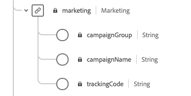

# Preparar datos para su uso en [!DNL Intelligent Services]

Para que [!DNL Intelligent Services] detecte perspectivas a partir de los datos de eventos de marketing, los datos deben enriquecirse semánticamente y mantenerse en una estructura estándar. [!DNL Intelligent Services] aproveche los esquemas  [!DNL Experience Data Model] (XDM) para conseguirlo. Específicamente, todos los conjuntos de datos que se utilizan en [!DNL Intelligent Services] deben ajustarse al esquema XDM de Consumer ExperienceEvent (CEE) o utilizar el conector Adobe Analytics. Además, Customer AI es compatible con el conector Adobe Audience Manager.

Este documento proporciona una guía general sobre cómo asignar los datos de eventos de marketing de varios canales al esquema CEE, y contiene información sobre campos importantes dentro del esquema para ayudarle a determinar cómo asignar los datos de forma eficaz a su estructura. Si planea utilizar datos de Adobe Analytics, consulte la sección [Preparación de datos de Adobe Analytics](#analytics-data). Si planea utilizar datos de Adobe Audience Manager (solo Customer AI), consulte la sección correspondiente a [Adobe Audience Manager data preparation](#AAM-data).

## Resumen del flujo de trabajo

El proceso de preparación varía en función de si los datos se almacenan en Adobe Experience Platform o externamente. En esta sección se resumen los pasos necesarios que debe seguir, en cualquier escenario.

### Preparación de datos externos

Si los datos se almacenan fuera de [!DNL Experience Platform], siga los pasos a continuación:

1. Póngase en contacto con los servicios de consultoría de Adobe para solicitar credenciales de acceso para un contenedor de almacenamiento de Azure Blob dedicado.
1. Con sus credenciales de acceso, cargue los datos en el contenedor Blob.
1. Trabaje con los servicios de consultoría de Adobe para obtener los datos asignados al [esquema de Consumer ExperienceEvent](#cee-schema) e introducidos en [!DNL Intelligent Services].

### Preparación de datos de Adobe Analytics {#analytics-data}

Customer AI y Attribution AI admiten datos de Adobe Analytics de forma nativa. Para utilizar datos de Adobe Analytics, siga los pasos descritos en la documentación para configurar un [Conector de origen de Analytics](../sources/tutorials/ui/create/adobe-applications/analytics.md).

Una vez que el conector de origen transmite los datos al Experience Platform, puede seleccionar Adobe Analytics como fuente de datos seguida de un conjunto de datos durante la configuración de la instancia. Todos los campos y mezclas de esquema requeridos se crean automáticamente durante la configuración de la conexión. No es necesario extraer, transformar o cargar los conjuntos de datos en el formato CEE.

>[!IMPORTANT]
>
>El conector de Adobe Analytics tarda hasta cuatro semanas en rellenar los datos. Si ha configurado recientemente una conexión, debe comprobar que el conjunto de datos tiene la longitud mínima de datos necesaria para el cliente o el Attribution AI. Revise las secciones de datos históricos en [Customer AI](./customer-ai/input-output.md#data-requirements) o [Attribution AI](./attribution-ai/input-output.md#data-requirements) y compruebe que tiene datos suficientes para el objetivo de la predicción.

### Preparación de datos de Adobe Audience Manager (solo Customer AI) {#AAM-data}

Customer AI admite datos de Adobe Audience Manager de forma nativa. Para utilizar datos de Audience Manager, siga los pasos descritos en la documentación para configurar un [conector de origen de Audience Manager](../sources/tutorials/ui/create/adobe-applications/audience-manager.md).

Una vez que el conector de origen transmite los datos al Experience Platform, puede seleccionar Adobe Audience Manager como fuente de datos seguida de un conjunto de datos durante la configuración de Customer AI. Todos los campos y mezclas de esquema requeridos se crean automáticamente durante la configuración de la conexión. No es necesario extraer, transformar o cargar los conjuntos de datos en el formato CEE.

>[!IMPORTANT]
>
>Si recientemente ha configurado un conector, debe verificar que el conjunto de datos tenga la longitud mínima de los datos necesarios. Revise la sección de datos históricos de la [documentación de entrada/salida](./customer-ai/input-output.md) para Customer AI y compruebe que tiene datos suficientes para el objetivo de predicción.

### [!DNL Experience Platform] preparación de datos

Si los datos ya están almacenados en [!DNL Platform] y no se transmiten a través de los conectores de origen de Adobe Analytics o Adobe Audience Manager (solo AI del cliente), siga los pasos a continuación. Se recomienda que entienda el esquema de CEE si planea trabajar con Customer AI.

1. Revise la estructura del [Consumer ExperienceEvent schema](#cee-schema) y determine si los datos se pueden asignar a sus campos.
2. Póngase en contacto con los servicios de consultoría de Adobe para ayudarle a asignar los datos al esquema e incorporarlos en [!DNL Intelligent Services] o [siga los pasos de esta guía](#mapping) si desea asignarlos usted mismo.

## Explicación del esquema CEE {#cee-schema}

El esquema Consumer ExperienceEvent describe el comportamiento de un individuo en relación con eventos de marketing digital (web o móvil), así como con la actividad de comercio en línea o sin conexión. El uso de este esquema es necesario para [!DNL Intelligent Services] debido a sus campos (columnas) semánticamente bien definidos, evitando nombres desconocidos que de otra manera harían los datos menos claros.

El esquema CEE, como todos los esquemas XDM ExperienceEvent, captura el estado del sistema basado en series temporales cuando se produjo un evento (o conjunto de eventos), incluido el punto en el tiempo y la identidad del sujeto involucrado. Los eventos de experiencia son registros de hechos de lo que ha sucedido y, por lo tanto, son inmutables y representan lo que ha sucedido sin agregación ni interpretación.

[!DNL Intelligent Services] utilice varios campos clave dentro de este esquema para generar perspectivas a partir de los datos de eventos de marketing, todos los cuales se pueden encontrar en el nivel raíz y expandirse para mostrar los subcampos requeridos.


Al igual que todos los esquemas XDM, la mezcla CEE es extensible. En otras palabras, se pueden agregar campos adicionales a la mezcla de CEE y se pueden incluir variaciones diferentes en varios esquemas si es necesario.

Puede encontrar un ejemplo completo de la mezcla en el [repositorio XDM público](https://github.com/adobe/xdm/blob/797cf4930d5a80799a095256302675b1362c9a15/docs/reference/context/experienceevent-consumer.schema.md). Además, puede ver y copiar el siguiente [archivo JSON](https://github.com/AdobeDocs/experience-platform.en/blob/master/help/intelligent-services/assets/CEE_XDM_sample_rows.json) para ver un ejemplo de cómo se pueden estructurar los datos para que cumplan con el esquema CEE. Consulte estos dos ejemplos cuando conozca los campos clave descritos en la sección siguiente para determinar cómo puede asignar sus propios datos al esquema.

## Campos clave

Existen varios campos clave dentro de la mezcla CEE que deben utilizarse para que [!DNL Intelligent Services] genere perspectivas útiles. En esta sección se describe el caso de uso y los datos esperados para estos campos, y se proporcionan vínculos a documentación de referencia para ver más ejemplos.

### Campos obligatorios

Aunque se recomienda encarecidamente el uso de todos los campos clave, hay dos campos que son **obligatorios** para que [!DNL Intelligent Services] funcione:

* [Un campo de identidad principal](#identity)
* [xdm:timestamp](#timestamp)
* [xdm:channel](#channel)  (obligatorio solo para Attribution AI)

#### Identidad principal {#identity}

Uno de los campos del esquema debe definirse como campo de identidad principal, que permite a [!DNL Intelligent Services] vincular cada instancia de datos de series temporales a una persona individual.

Debe determinar el mejor campo para utilizarlo como identidad principal en función de la fuente y la naturaleza de los datos. Un campo de identidad debe incluir un **área de nombres de identidad** que indique el tipo de datos de identidad que el campo espera como valor. Algunos valores de espacio de nombres válidos son:

* &quot;email&quot;
* &quot;phone&quot;
* &quot;mcid&quot; (para Adobe Audience Manager ID)
* &quot;aid&quot; (para Adobe Analytics ID)

Si no está seguro de qué campo debe utilizar como identidad principal, póngase en contacto con los servicios de consultoría de Adobe para determinar la mejor solución. Si no se establece una identidad principal, la aplicación de servicio inteligente utiliza el siguiente comportamiento predeterminado:

| Predeterminado | Attribution AI | Customer AI |
| --- | --- | --- |
| Columna de identidad | `endUserIDs._experience.aaid.id` | `endUserIDs._experience.mcid.id` |
| Área de nombres | AAID | ECID |

Para establecer una identidad principal, vaya al esquema desde la pestaña **[!UICONTROL Schemas]** y seleccione el hipervínculo del nombre del esquema para abrir **[!DNL Schema Editor]**.


A continuación, vaya al campo al que desee como identidad principal y selecciónelo. El menú **[!UICONTROL Field properties]** se abre para ese campo.


En el menú **[!UICONTROL Field properties]**, desplácese hacia abajo hasta que encuentre la casilla **[!UICONTROL Identity]**. Después de marcar la casilla, aparece la opción para establecer la identidad seleccionada como **[!UICONTROL Primary identity]**. Seleccione también este cuadro.


A continuación, debe proporcionar un **[!UICONTROL Identity namespace]** de la lista de áreas de nombres predefinidas en la lista desplegable. En este ejemplo, el espacio de nombres ECID está seleccionado porque se está utilizando un Adobe Audience Manager ID `mcid.id`. Seleccione **[!UICONTROL Apply]** para confirmar las actualizaciones y, a continuación, seleccione **[!UICONTROL Save]** en la esquina superior derecha para guardar los cambios en el esquema.


#### xdm:timestamp {#timestamp}

Este campo representa la fecha y hora a la que se produjo el evento. Este valor debe proporcionarse como una cadena, según la norma ISO 8601.

#### xdm:channel {#channel}

>[!NOTE]
>
>Este campo solo es obligatorio cuando se utiliza Attribution AI.

Este campo representa el canal de marketing relacionado con ExperienceEvent. El campo incluye información sobre el tipo de canal, el tipo de medio y el tipo de ubicación.


**Ejemplo de esquema**

```json
{
  "@id": "https://ns.adobe.com/xdm/channels/facebook-feed",
  "@type": "https://ns.adobe.com/xdm/channel-types/social",
  "xdm:mediaType": "earned",
  "xdm:mediaAction": "clicks"
}
```

Para obtener información completa sobre cada uno de los subcampos obligatorios para `xdm:channel`, consulte la especificación [experience channel schema](https://github.com/adobe/xdm/blob/797cf4930d5a80799a095256302675b1362c9a15/docs/reference/channels/channel.schema.md). Para ver algunos ejemplos de asignaciones, consulte la tabla [debajo de](#example-channels).

#### Asignaciones de canales de ejemplo {#example-channels}

La tabla siguiente proporciona algunos ejemplos de canales de marketing asignados al esquema `xdm:channel`:

| Canal | `@type` | `mediaType` | `mediaAction` |
| --- | --- | --- | --- |
| Búsqueda de pago | https:/<span>/ns.adobe.com/xdm/channel-types/search | pago | clicks |
| Social: Marketing | https:/<span>/ns.adobe.com/xdm/channel-types/social | merma | clicks |
| Mostrar | https:/<span>/ns.adobe.com/xdm/channel-types/display | pago | clicks |
| Correo electrónico | https:/<span>/ns.adobe.com/xdm/channel-types/email | pago | clicks |
| Referente interno | https:/<span>/ns.adobe.com/xdm/channel-types/direct | propietario | clicks |
| Mostrar visualización | https:/<span>/ns.adobe.com/xdm/channel-types/display | pago | impresiones |
| Redireccionamiento de código QR | https:/<span>/ns.adobe.com/xdm/channel-types/direct | propietario | clicks |
| Dispositivo móvil | https:/<span>/ns.adobe.com/xdm/channel-types/mobile | propietario | clicks |

### Campos recomendados

El resto de los campos clave se describen en esta sección. Aunque estos campos no son necesariamente obligatorios para que [!DNL Intelligent Services] funcione, se recomienda usar tantos como sea posible para obtener perspectivas más enriquecidas.

#### xdm:productListItems

Este campo es una matriz de artículos que representan productos seleccionados por un cliente, incluidos el SKU, el nombre, el precio y la cantidad del producto.


**Ejemplo de esquema**

```json
[
  {
    "xdm:SKU": "1002352692",
    "xdm:name": "24-Watt 8-Light Chrome Integrated LED Bath Light",
    "xdm:currencyCode": "USD",
    "xdm:quantity": 1,
    "xdm:priceTotal": 159.45
  },
  {
    "xdm:SKU": "3398033623",
    "xdm:name": "16ft RGB LED Strips",
    "xdm:currencyCode": "USD",
    "xdm:quantity": 1,
    "xdm:priceTotal": 79.99
  }
]
```

Para obtener información completa sobre cada uno de los subcampos obligatorios para `xdm:productListItems`, consulte la especificación [detalles de comercio](https://github.com/adobe/xdm/blob/797cf4930d5a80799a095256302675b1362c9a15/docs/reference/context/experienceevent-commerce.schema.md).

#### xdm:commerce

Este campo contiene información específica sobre el comercio acerca de ExperienceEvent, incluido el número de orden de compra y la información de pago.


**Ejemplo de esquema**

```json
{
    "xdm:order": {
      "xdm:purchaseID": "a8g784hjq1mnp3",
      "xdm:purchaseOrderNumber": "123456",
      "xdm:payments": [
        {
          "xdm:transactionID": "transactid-a111",
          "xdm:paymentAmount": 59,
          "xdm:paymentType": "credit_card",
          "xdm:currencyCode": "USD"
        },
        {
          "xdm:transactionId": "transactid-a222",
          "xdm:paymentAmount": 100,
          "xdm:paymentType": "gift_card",
          "xdm:currencyCode": "USD"
        }
      ],
      "xdm:currencyCode": "USD",
      "xdm:priceTotal": 159
    },
    "xdm:purchases": {
      "xdm:value": 1
    }
  }
```

Para obtener información completa sobre cada uno de los subcampos obligatorios para `xdm:commerce`, consulte la especificación [detalles de comercio](https://github.com/adobe/xdm/blob/797cf4930d5a80799a095256302675b1362c9a15/docs/reference/context/experienceevent-commerce.schema.md).

#### xdm:web

Este campo representa los detalles web relacionados con ExperienceEvent, como la interacción, los detalles de la página y el referente.


**Ejemplo de esquema**

```json
{
  "xdm:webPageDetails": {
    "xdm:siteSection": "Shopping Cart",
    "xdm:server": "example.com",
    "xdm:name": "Purchase Confirmation",
    "xdm:URL": "https://www.example.com/orderConf",
    "xdm:errorPage": false,
    "xdm:homePage": false,
    "xdm:pageViews": {
      "xdm:value": 1
    }
  },
  "xdm:webReferrer": {
    "xdm:URL": "https://www.example.com/checkout",
    "xdm:referrerType": "internal"
  }
}
```

Para obtener información completa sobre cada uno de los subcampos obligatorios para `xdm:productListItems`, consulte la especificación [ExperienceEvent web details schema](https://github.com/adobe/xdm/blob/797cf4930d5a80799a095256302675b1362c9a15/docs/reference/context/experienceevent-web.schema.md).

#### xdm:marketing

Este campo contiene información relacionada con las actividades de marketing que están activas con el punto de contacto.



**Ejemplo de esquema**

```json
{
  "xdm:trackingCode": "marketingcampaign111",
  "xdm:campaignGroup": "50%_DISCOUNT",
  "xdm:campaignName": "50%_DISCOUNT_USA"
}
```

Para obtener información completa sobre cada uno de los subcampos obligatorios para `xdm:productListItems`, consulte la especificación [chechma de marketing](https://github.com/adobe/xdm/blob/797cf4930d5a80799a095256302675b1362c9a15/docs/reference/context/marketing.schema.md).

## Asignación e ingesta de datos {#mapping}

Una vez que haya determinado si los datos de eventos de marketing se pueden asignar al esquema de CEE, el siguiente paso es determinar qué datos desea introducir en [!DNL Intelligent Services]. Todos los datos históricos utilizados en [!DNL Intelligent Services] deben estar dentro del intervalo de tiempo mínimo de cuatro meses de datos, más el número de días que se pretenda como periodo retroactivo.

Después de decidir el rango de datos que desea enviar, póngase en contacto con los servicios de consultoría de Adobe para que le ayuden a asignar los datos al esquema e incorporarlos al servicio.

Si tiene una suscripción [!DNL Adobe Experience Platform] y desea asignar e introducir los datos usted mismo, siga los pasos descritos en la sección siguiente.

### Uso de Adobe Experience Platform

>[!NOTE]
>
>Los pasos siguientes requieren una suscripción al Experience Platform. Si no tiene acceso a Platform, vaya a la sección [siguientes pasos](#next-steps).

En esta sección se describe el flujo de trabajo para la asignación e ingesta de datos en Experience Platform para su uso en [!DNL Intelligent Services], incluidos los vínculos a tutoriales para obtener información detallada.

#### Creación de un esquema y conjunto de datos de CEE

Cuando esté listo para empezar a preparar los datos para su ingesta, el primer paso es crear un nuevo esquema XDM que emplee la mezcla CEE. Los siguientes tutoriales explican el proceso de creación de un nuevo esquema en la interfaz de usuario o la API:

* [Creación de un esquema en la interfaz de usuario](../xdm/tutorials/create-schema-ui.md)
* [Creación de un esquema en la API](../xdm/tutorials/create-schema-api.md)

>[!IMPORTANT]
>
>Los tutoriales anteriores siguen un flujo de trabajo genérico para crear un esquema. Al elegir una clase para el esquema, debe utilizar la clase **XDM ExperienceEvent**. Una vez seleccionada esta clase, puede añadir la mezcla CEE al esquema.

Después de agregar la mezcla CEE al esquema, puede agregar otras mezclas según sea necesario para campos adicionales dentro de los datos.

Una vez creado y guardado el esquema, puede crear un nuevo conjunto de datos basado en ese esquema. Los siguientes tutoriales explican el proceso de creación de un nuevo conjunto de datos en la interfaz de usuario o la API:

* [Crear un conjunto de datos en la interfaz de usuario](../catalog/datasets/user-guide.md#create)  (siga el flujo de trabajo para utilizar un esquema existente)
* [Crear un conjunto de datos en la API](../catalog/datasets/create.md)

Una vez creado el conjunto de datos, puede encontrarlo en la interfaz de usuario de Platform dentro del espacio de trabajo **[!UICONTROL Datasets]** .


#### Añadir campos de identidad al conjunto de datos

Si obtiene datos de [!DNL Adobe Audience Manager], [!DNL Adobe Analytics] u otra fuente externa, tiene la opción de establecer un campo de esquema como campo de identidad. Para establecer un campo de esquema como campo de identidad, consulte la sección sobre la configuración de campos de identidad dentro del [tutorial de interfaz de usuario](../xdm/tutorials/create-schema-ui.md#identity-field) o [tutorial de API](../xdm/tutorials/create-schema-api.md#define-an-identity-descriptor) para crear un esquema.

Si va a introducir datos de un archivo CSV local, puede pasar a la siguiente sección sobre [asignación e ingesta de datos](#ingest).

#### Asignación e ingesta de datos {#ingest}

Después de crear un esquema y un conjunto de datos de CEE, puede empezar a asignar las tablas de datos al esquema e ingerir esos datos en Platform. Consulte el tutorial sobre [asignación de un archivo CSV a un esquema XDM](../ingestion/tutorials/map-a-csv-file.md) para ver los pasos para realizarlo en la interfaz de usuario. Puede utilizar el siguiente [archivo JSON de muestra](https://github.com/AdobeDocs/experience-platform.en/blob/master/help/intelligent-services/assets/CEE_XDM_sample_rows.json) para probar el proceso de ingesta antes de usar sus propios datos.

Una vez que se ha rellenado un conjunto de datos, se puede utilizar el mismo conjunto de datos para introducir archivos de datos adicionales.

Si los datos se almacenan en una aplicación de terceros compatible, también puede crear un [conector de origen](../sources/home.md) para introducir los datos de eventos de marketing en [!DNL Platform] en tiempo real.

## Pasos siguientes {#next-steps}

Este documento proporciona una guía general sobre la preparación de los datos para su uso en [!DNL Intelligent Services]. Si necesita asesoramiento adicional basado en su caso de uso, póngase en contacto con el servicio de consultoría de Adobe.

Una vez que haya rellenado correctamente un conjunto de datos con los datos de experiencia del cliente, puede utilizar [!DNL Intelligent Services] para generar perspectivas. Consulte los siguientes documentos para empezar:

* [Descripción general de Attribution AI](./attribution-ai/overview.md)
* [Información general sobre Customer AI ](./customer-ai/overview.md)
