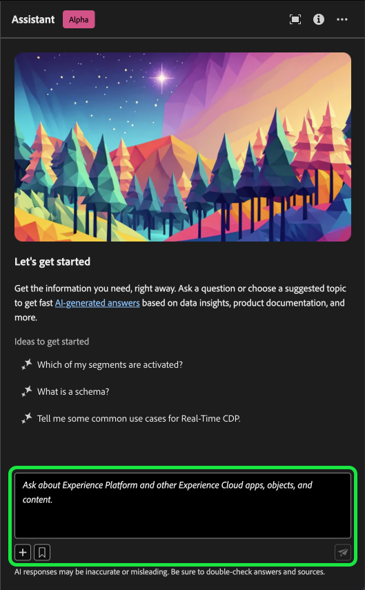

# Ayudante para Adobe Experience Platform

>[!NOTE]
>
>El Asistente para Adobe Experience Platform está actualmente en Alpha. La funcionalidad y la documentación están sujetas a cambios.

El Ayudante es una función de la interfaz de usuario que puede utilizar para desplazarse por los conceptos de Adobe Experience Platform y Real-time Customer Data Platform y comprender su uso, así como la información sobre sus objetos.

Puede consultar el Ayudante para obtener información como:

* Directrices sobre cómo realizar tareas relativas a datos y audiencias.
* Estados y métricas de los objetos de datos existentes en su organización.
* Utilice ejemplos de casos y matices para comprender mejor los objetos de datos, incluidos atributos, flujos de datos, conjuntos de datos, destinos, esquemas, segmentos y fuentes.

Lea la guía siguiente para conocer cómo puede utilizar Assistant para navegar y comprender los flujos de trabajo de Experience Platform y Real-Time CDP.

>[!BEGINSHADEBOX]

**¿Cómo funciona Assistant?**

El asistente responde a las preguntas enviadas consultando una base de datos y luego traduciendo los datos de la base de datos a una respuesta legible en lenguaje natural.

Esta representación interna de los datos subyacentes también se conoce como Gráfico del conocimiento: una red completa de conceptos, datos y metadatos para una respuesta determinada.

El gráfico de conocimiento consta de subgráficos a los que se hace referencia cada vez que se envían consultas:

* Datos de uso del cliente.
* Datos de uso del cliente en varias metatiendas.
* Documentación del Experience League.

Hay dos clases de preguntas que se deben tener en cuenta antes de consultar el Ayudante:

* **Preguntas sobre conceptos**: Las preguntas de concepto tratan sobre conceptos de Adobe relacionados con datos o audiencias. Algunos ejemplos de preguntas conceptuales son:
   * ¿Cuál es la diferencia entre la segmentación por lotes y la segmentación por streaming?
   * ¿Existen modelos de datos del sector y cómo puedo utilizarlos?
   * ¿Para qué se utiliza Real-Time CDP?
* **Preguntas de uso**: Las preguntas de uso tratan sobre los objetos de datos dentro de la organización. Algunos ejemplos de preguntas de uso son:
   * ¿Cuántos conjuntos de datos tengo?
   * ¿Cuántos atributos de esquema nunca se han utilizado?
   * ¿Qué segmentos se han activado?

>[!ENDSHADEBOX]

## Acceder al Asistente en la IU de Experience Platform

Para iniciar el Asistente, seleccione **[!UICONTROL Icono de asistente]** desde el encabezado superior de la interfaz de usuario de Experience Platform.

Aparecerá la interfaz del Ayudante, que le proporcionará inmediatamente información para comenzar. Puede utilizar las opciones que se proporcionan en [!UICONTROL Ideas para empezar] para responder preguntas y comandos como:

* [!UICONTROL ¿Cuáles de mis segmentos están activados?]
* [!UICONTROL ¿Qué es un esquema?]
* [!UICONTROL Casos de uso comunes de Real-Time CDP]

Para interactuar con el Ayudante, utilice el cuadro de entrada para escribir las consultas o comandos. También puede utilizar el operador (**`+`**) símbolo para utilizar la función de autocompletar y el icono de marcador para acceder a sus consultas y comandos marcados.

## Ejemplo de caso de uso: Utilice el Asistente para acelerar el proceso de creación de esquemas

>[!NOTE]
>
>El siguiente flujo de trabajo es un ejemplo que utiliza el proceso de creación de esquemas de eventos de experiencia para ilustrar cómo puede utilizar el Ayudante al utilizar la interfaz de usuario de Experience Platform.

Considere un caso de uso en el que esté creando una **Esquema de comercio de dispositivos en evento**. Durante el proceso de creación del esquema del evento de experiencia, se encuentra con el `eventType` field. &quot;En este punto, tiene la opción de salir del flujo de trabajo y consultar [conceptos básicos de una composición de esquema](../xdm/schema/composition.md) o puede utilizar Assistant para recuperar respuestas a sus preguntas y encontrar recursos adicionales a través de los vínculos de documentación recomendados por Assistant&quot;.

Para empezar, escriba su pregunta en el cuadro de texto proporcionado. En el siguiente ejemplo, se proporciona al asistente la pregunta: &quot;**¿Qué es el campo eventType en un esquema ExperienceEvent?**&quot;

A continuación, el asistente consulta su base de conocimientos y calcula una respuesta. Después de unos momentos, el Asistente devuelve una respuesta y sugerencias relacionadas que puede utilizar como preguntas de seguimiento.

Después de recibir una respuesta del Ayudante, puede seleccionar entre varias opciones para decidir cómo desea continuar.

### Guarde la consulta {#save-your-query}

+++Seleccione para ver un ejemplo de cómo guardar una consulta

Para guardar la consulta, seleccione el icono de marcador junto a la pregunta.

Para acceder a las consultas guardadas, seleccione el icono de marcador debajo del cuadro de entrada y, a continuación, seleccione la consulta que desee ejecutar.

+++

### Vista de datos en su zona protegida {#view-data-in-your-sandbox}

+++Seleccione para ver el ejemplo

Según la consulta, el Ayudante proporciona información adicional perteneciente a los datos de la zona protegida. Para ver cómo se aplica la respuesta a la consulta a la zona protegida, seleccione **[!UICONTROL En su zona protegida].**

Durante este paso, el Ayudante puede proporcionar vínculos directos a las páginas de la interfaz de usuario de ciertos objetos en cuestión. En el siguiente ejemplo, el asistente proporciona vínculos directos a la [!UICONTROL Esquemas] y [!UICONTROL Segmentos] Páginas de IU.

+++

### Verificar la respuesta {#verify-the-response}

+++Seleccione esta opción para ver un ejemplo de cómo mostrar orígenes

Para ver las citas y validar la respuesta del asistente, seleccione **[!UICONTROL Mostrar orígenes]**. El Ayudante proporciona vínculos a documentación que corrobora su respuesta. También puede utilizar las consultas que proporciona el Ayudante en [!UICONTROL Sugerencias relacionadas] para explorar más en profundidad los temas relacionados con la consulta original.

+++

### Uso y visualización de datos {#data-usage-and-visualization}

+++Seleccione esta opción para ver un ejemplo de las preguntas sobre el uso de los datos y la visualización de los datos

Para que el asistente responda a una consulta sobre el uso de datos dentro de su organización, debe estar en una zona protegida activa.

En el ejemplo siguiente, se proporciona al asistente la siguiente consulta: **&quot;Mostrarme definiciones de segmentos con más de 1000 perfiles e incluir el estado de activación&quot;.** A continuación, el asistente responde con un gráfico que visualiza los datos de segmentos y perfiles.

Puede situarse sobre una barra individual para ver datos específicos. También puede seleccionar el icono de expansión para obtener una vista más amplia del gráfico.

Aparece una vista expandida de la visualización. Puede utilizar el modal expandido para inspeccionar más los datos y resulta especialmente útil cuando la visualización devuelve un gran número de columnas.

Cuando se le pregunta sobre el uso de los datos, el Ayudante le explica cómo ha calculado la respuesta. En el ejemplo siguiente, el asistente describe los pasos que ha seguido para mostrar las definiciones de segmentos con más de 1000 perfiles y sus respectivos estados de activación.

También puede proporcionar filtros y modificaciones a las consultas, y puede indicar al Asistente que procese sus conclusiones en función de los filtros que incluya. Por ejemplo, puede pedir al Asistente que le muestre una tendencia de las definiciones de segmentos de recuento en el orden de su fecha de creación, elimine definiciones de segmentos con perfiles totales cero y utilice nombres de mes en lugar de enteros al mostrar los datos.

+++

### Usar completado automático {#use-auto-complete}

+++Seleccione esta opción para ver un ejemplo de autocompletado

Puede utilizar la función de autocompletar para recibir una lista de los objetos de datos que existen en su zona protegida. Las recomendaciones de autocompletar están disponibles para los siguientes dominios: segmentos, esquemas, conjuntos de datos, fuentes y destinos.

Se puede utilizar el completado automático incluyendo el símbolo más (**`+`**) en la consulta. Como alternativa, también puede seleccionar el signo más (**`+`**) situado en la parte inferior del cuadro de entrada de texto. Aparece una ventana con una lista de los objetos de datos recomendados de la zona protegida.

A continuación, seleccione el objeto de datos que desea consultar para completar la pregunta y, a continuación, envíe la pregunta.

+++

### Uso de giro múltiple {#use-multi-turn}

+++Seleccione esta opción para ver un ejemplo de varias vueltas

Puede utilizar las capacidades de varias vueltas del Ayudante para tener una conversación más natural durante la experiencia. El asistente puede responder a las preguntas de seguimiento que se le formulen. ese contexto se puede inferir de una interacción anterior.

En el siguiente ejemplo, se solicita al asistente para el número total de flujos de datos en la organización actual.

A continuación, el Ayudante recibe otra solicitud de seguimiento. Esta vez, el Ayudante responde enumerando los flujos de datos que existen actualmente en su organización.

+++

## Documentación {#documentation}

Actualmente, el índice de documentación cubre Adobe Experience Platform (Real-Time CDP y Audiencias). El índice se actualiza periódicamente.

El modelo de recuperación de documentación está formado en Experience Platform (Real-Time CDP y Audiencias). Preguntas que no entran en el ámbito de Adobe Experience Platform, como las preguntas sobre otros productos de Adobe como Adobe Target y el grupo de Creative Cloud, no pueden responderse.

## Uso de datos {#data-usage}

También puede hacer preguntas al Ayudante sobre el uso de los datos en los siguientes dominios:

* Atributos
* Flujos de datos
* Conjuntos de datos
* Destinos _(Las preguntas relativas a las cuentas y algunas preguntas sobre el flujo de datos no se pueden responder en este momento)._
* Esquemas _(Las preguntas relativas a los grupos de campos no se pueden responder en este momento)._
* Segmentos
* Fuentes _(Las preguntas relativas a las cuentas no se pueden responder en este momento)._

En el caso de las consultas de datos de uso, las respuestas pueden no reflejar el estado actual de la interfaz de usuario. Los datos que respaldan estas preguntas se actualizan una vez cada 24 horas. Por ejemplo, los cambios que los usuarios realizan en Real-Time CDP durante el día se sincronizan con los almacenes de datos por la noche y, a continuación, están disponibles para que los usuarios formulen preguntas por la mañana. Es posible que tenga que dar formato a sus preguntas como: &quot;Cuándo fue el segmento con el título {TITLE} creado?&quot; en lugar de, &quot;¿Cuándo fue la {TITLE} ¿segmento creado?&quot;

Deberá iniciar sesión en una zona protegida para consultar sobre datos específicos relacionados con objetos como esquemas, conjuntos de datos, atributos, destinos y segmentos.

### Ejemplo de preguntas de uso de datos {#example-data-usage-questions}

+++Seleccione esta opción para ver una lista de preguntas de uso de datos de ejemplo

| Tipo de pregunta | Descripción | Ejemplos |
| --- | --- | --- | 
| Linaje de datos | Rastrear el uso de uno o varios objetos en otros objetos de Experience Platform | <ul><li>Qué conjuntos de datos utilizar {SCHEMA_NAME} esquema?</li><li>¿Cuántos conjuntos de datos se han introducido utilizando el mismo esquema?</li><li>¿Qué conjuntos de datos se han utilizado en segmentos activados?</li><li>Enumerar los esquemas que tienen atributos utilizados en segmentos activados.</li><li>Mostrar los segmentos que están activados para {DESTINATION_ACCOUNT_NAME} y tienen más de 1000 perfiles.</li><li>Muéstreme los atributos que se utilizan en los segmentos activados que se han modificado después de enero de 2023.</li><li>¿Cuáles son los conjuntos de datos ingeridos mediante {SOURCE_NAME}?</li><li>Con qué flujos de datos están asociados {DATAFLOW_NAME}</li><li>Enumera los esquemas relacionados con los segmentos activados y creados en el último año.</li></ul> |
| Distribución y agregaciones | Preguntas basadas en resumen sobre el uso de objetos de Experience Platform | <ul><li>¿Cuál es el porcentaje de segmentos activados?</li><li>¿Cuántos campos se utilizan en la segmentación?</li><li>¿Qué segmentos se activan con la mayor cantidad de destinos?</li><li>Enumerar segmentos duplicados.</li><li>Mostrar los segmentos activados a {DESTINATION_ACCOUNT_NAME} y clasificarlos por tamaño de perfil.</li><li>¿Cuál es el porcentaje de segmentos que no se han activado pero que tienen más de 100 perfiles? Muéstrame sus nombres.</li><li>Enumerar los 3 conectores de origen que consumen datos en mis conjuntos de datos.</li><li>Enumere los 5 atributos principales utilizados en segmentos activados en función de su ocurrencia.</li></ul> |
| Búsqueda de objetos | Recupere o acceda a un objeto Experience Platform o a sus propiedades. | <ul><li>Qué conjuntos de datos no tienen ningún esquema asociado</li><li>Enumeración de los atributos utilizados para {SEGMENT_NAME}?</li><li>Dame la lista de esquemas que tienen un perfil habilitado, pero que no se han modificado desde su creación.</li><li>¿Qué segmentos se han modificado en la última semana?</li><li>Enumere los segmentos que tienen las mismas definiciones de segmentos junto con su fecha de creación.</li><li>Qué conjuntos de datos tienen habilitado el perfil e incluyen también cuántos segmentos se han creado a partir de cada conjunto de datos.</li><li>¿Qué cuentas de origen están asociadas al conjunto de datos XYZ?</li><li>Mostrar la definición del segmento y la fecha de modificación de {SEGMENT_NAME}.</li></ul> |

+++

## Proporcionar comentarios {#feedback}

>[!BEGINSHADEBOX]

**Se han solicitado sus comentarios**

Durante esta fase de Alpha, se le invita a proporcionar comentarios sobre las respuestas que reciba del asistente. Todas las respuestas y los comentarios enviados se revisan a fin de seguir mejorando la experiencia del asistente.

Para proporcionar comentarios, seleccione Miniaturas arriba o Miniaturas abajo después de recibir una respuesta del Ayudante y, a continuación, escriba los comentarios en el cuadro de texto proporcionado. A continuación, seleccione **[!UICONTROL Enviar comentarios]** para enviar.

>[!ENDSHADEBOX]

+++Proporcionar comentarios

>[!BEGINTABS]

>[!TAB Pulgares hacia arriba]

Seleccione el icono de pulgares hacia arriba para proporcionar comentarios sobre lo que ha salido bien con su experiencia con el asistente.

>[!TAB Pulgar hacia abajo]

Seleccione el icono de pulgares hacia abajo para proporcionar comentarios sobre las mejoras realizadas en función de su experiencia con el asistente. Durante este paso, también puede proporcionar comentarios específicos sobre la experiencia. Los comentarios proporcionados en los comentarios se revisan diariamente.

>[!TAB Indicador]

Seleccione el icono de indicador para proporcionar más informes sobre su experiencia con el asistente.

>[!ENDTABS]

+++

## Más información {#additional-information}

Consulte esta sección para obtener más información sobre el Ayudante de Experience Platform.

### Advertencias y limitaciones {#caveats-and-limitations}

En la siguiente sección se describen las advertencias y limitaciones actuales que deben tenerse en cuenta al utilizar el Ayudante.
<!-- 
#### Conversational experience

You must consider several nuances regarding the conversational experience when querying the Assistant.

>[!NOTE]
>
>These limitations are temporary and are being improved upon throughout the course of the alpha.

>[!BEGINTABS]

>[!TAB Unable to infer context from prior discussion]

The Assistant currently cannot reference prior discussions as context for a given question. See the table below for examples:

| Ambiguous question | Clear question | Note |
| --- | --- | --- |
| <ul><li>First question: "What is a segment?"</li><li>Follow up question: "Are there different types of them?"</li></ul>| <ul><li>First question: "What is a segment?"</li><li>Follow up question: "Are there different types of **segments**?"</li></ul> | The Assistant cannot infer what "them" means. |
| <ul><li>First question: "What is a segment?"</li><li>Follow up question: "Can you elaborate more?"</li></ul> | <ul><li>First question: "What is a segment?"</li><li>Follow up question: "Explain what a segment is in depth"</li></ul> | The Assistant cannot intelligently reference documentation based on "more". |
| <ul><li>First question: "What is a segment?"</li><li>Follow up question: "Can you give me an example of one?"</li></ul> | <ul><li>First question: "What is a segment?"</li><li>Follow up question: "Can you give me an example of a segment?"</li></ul> | The Assistant cannot infer what you want an example of.|
| <ul><li>First question: "What is a batch segment?"</li><li>Follow up question: "How does it compare to a streaming segment?"</li></ul> | <ul><li>First question: "What is a batch segment?"</li><li>Follow up question: "Can you compare a streaming segment to a batch segment?"</li></ul> | The Assistant cannot infer what "it" is referring to and thus cannot compare the streaming segment. |
| <ul><li>First question: "How many segments do I have?"</li><li>Follow up question: "How many of them use Facebook as a destination?"</li></ul> | <ul><li>First question: "How many segments do I have?"</li><li>Follow up question: "How many of the segments that I have are using Facebook as a destination?"</li></ul> | The Assistant is cannot infer what "them" is referring to. |

{style="table-layout:auto"}

>[!TAB Unable to infer context from a page]

When asking the Assistant about a particular element of the Experience Platform UI page that you are on, you must clearly define the specific element within your question. 

| Ambiguous question | Clear question | Note |
| --- | --- | --- |
| "What does this do?" | "What does {PAGE_NAME} do? | The Assistant cannot infer what "this" is referring to. You must provide the specific page element that you are querying about. |
| "Why won't it save?" | "Why can't I save a new sandbox called {NAME}?" | The Assistant cannot infer what "it" is referring to and cannot know that you are having issues with an entity. |

{style="table-layout:auto"}

Furthermore, the Assistant can only answer questions regarding error messages, given that the error is documented in Experience League.

>[!TAB Ambiguity]

You must phrase your questions clearly and scope them within a product, application, or domain, as the Assistant currently cannot disambiguate questions.

| Ambiguous question | Clear question | Note |
| --- | --- | --- |
| "How do I create a filter? | How do I create a filter in Profile Query Language? | You must specify the feature that which you are filtering for because a variety of Experience Platform features support filtering. |
| "How do I get started? | How do I get started using destinations? | You must provide clarity on your goals and use case because overly broad concepts may result in generic or unnecessarily specific answers. |

{style="table-layout:auto"}

>[!ENDTABS] -->

#### Conversaciones pequeñas limitadas

Puede mantener una pequeña conversación con el Ayudante, pero actualmente su capacidad es limitada.

#### Preguntas de funcionalidad

El Ayudante puede dar una impresión inexacta de lo que puede hacer. Puede responder incorrectamente a los siguientes tipos de preguntas:

| Pregunta de ejemplo | Nota |
| --- | --- |
| &quot;¿Puedes responder preguntas sobre {ENTITY}?&quot; | Siempre que el Ayudante pueda encontrar una sola página que haga referencia a una entidad determinada en su índice, responderá afirmativamente. |
| &quot;¿Lo sabes? **x** ¿idioma?&quot; | Actualmente, el asistente solo admite inglés, pero puede responder &quot;sí&quot; debido a que el modelo subyacente puede admitirlo. |
| &quot;¿Puedes hacer...?&quot; | El Ayudante puede contestar que sí, aunque no pueda hacerlo. |

### Sugerencias {#tips}

En la siguiente sección se describen algunas sugerencias y soluciones que deben tenerse en cuenta al utilizar el Ayudante.

#### Las preguntas pueden responderse con la fuente de información incorrecta

Hay casos en los que la pregunta acerca de los datos de uso puede dar como resultado una respuesta basada en la documentación. Esto se debe a que el Ayudante puede redirigir incorrectamente la pregunta a la fuente de información incorrecta. Para evitarlo, haga lo siguiente:

* Reformulando la pregunta para utilizar un lenguaje más similar a SQL
* Llamar explícitamente a la fuente de información para usar.

Lea la tabla siguiente para ver ejemplos:

| Pregunta incorrecta | Buena pregunta | Notas |
| --- | --- | --- |
| ¿Cuál es mi segmento más grande? | ¿Cuál es mi segmento más grande? Uso de datos. | Indicar explícitamente al Ayudante que desea que la respuesta se base en los datos. |
| ¿Cuál es mi segmento más grande? | Enumerar mi segmento más grande. | Hay casos en los que una pregunta de &quot;qué...&quot; se puede confundir con una pregunta basada en documentación. El uso de un comando como &quot;lista&quot; es un indicador más seguro de que está haciendo una pregunta con datos en contexto. |
| ¿Cuántos conjuntos de datos tengo? | Contar mis conjuntos de datos. | La pregunta original funciona para segmentos, pero es posible que no funcione con conjuntos de datos. |
