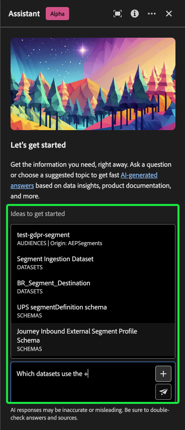

# Ayudante para Adobe Experience Platform

>[!NOTE]
>
>El Asistente para Adobe Experience Platform está actualmente en Alpha. La funcionalidad y la documentación están sujetas a cambios.

El Ayudante para Adobe Experience Platform es una función de la interfaz de usuario que puede utilizar para desplazarse por los conceptos de Experience Platform y Real-time Customer Data Platform, comprender sus conceptos y utilizar información sobre sus objetos.

Puede consultar el Ayudante para obtener información como:

* Directrices sobre cómo realizar tareas relativas a datos y audiencias.
* Estados y métricas de los objetos de datos existentes en su organización.
* Utilice ejemplos de casos y matices para comprender mejor los objetos de datos, incluidos atributos, conjuntos de datos, destinos, esquemas, segmentos y fuentes.

Este documento proporciona información sobre cómo puede acceder al Ayudante y utilizarlo para hacer preguntas y recibir respuestas acerca de los conceptos de Experience Platform y Real-Time CDP.

>[!BEGINSHADEBOX]

**¿Cómo funciona Assistant?**

El asistente responde a las preguntas enviadas consultando una base de datos y luego traduciendo los datos de la base de datos a una respuesta legible en lenguaje natural.

Esta representación interna de los datos subyacentes también se conoce como Gráfico del conocimiento: una red completa de conceptos, datos y metadatos para una respuesta determinada.

El gráfico de conocimiento consta de subgráficos a los que se hace referencia cada vez que se envían consultas:

* Datos de uso del cliente.
* Datos de uso del cliente en varias metatiendas.
* Documentación del Experience League.

Hay dos clases de preguntas que se deben tener en cuenta antes de consultar el Ayudante:

* **Preguntas sobre conceptos**: Las preguntas de concepto tratan sobre conceptos de Adobe relacionados con datos o audiencias. Algunos ejemplos de preguntas conceptuales son:
   * ¿Cuál es la diferencia entre la segmentación por lotes y la segmentación por streaming?
   * ¿Existen modelos de datos del sector y cómo puedo utilizarlos?
   * ¿Para qué se utiliza Real-Time CDP?
* **Preguntas de uso**: Las preguntas de uso tratan sobre los objetos de datos dentro de la organización. Algunos ejemplos de preguntas de uso son:
   * ¿Cuántos conjuntos de datos tengo?
   * ¿Cuántos atributos de esquema nunca se han utilizado?
   * ¿Qué segmentos se han activado?

>[!ENDSHADEBOX]

## Acceder al Asistente para Experience Platform en la IU

Puede acceder al Ayudante desde la navegación del encabezado en la interfaz de usuario de Experience Platform.

Seleccione el **[!UICONTROL Icono de asistente]** del encabezado al panel del Ayudante de lanzamiento.

<!-- +++Use immersive mode

To use [!DNL Immersive mode] select the focus icon in the header navigation of the Assistant.

A dedicated pop-up interface for Assistant appears at the center of your screen.

+++

From here, you can input your question in the text box and query Assistant for concepts regarding data or audiences. You can also ask questions about your data objects to better understand how you can use them for your respective use case.  -->

### Ejemplo de caso de uso: Utilice el Ayudante para acelerar el proceso de creación de esquemas {#example-use-case}

>[!NOTE]
>
>El siguiente flujo de trabajo de ejemplo utiliza el proceso de creación de esquemas de ExperienceEvent para ilustrar cómo puede utilizar el Ayudante al utilizar la interfaz de usuario de Experience Platform.

Considere un caso de uso en el que esté creando una **Esquema de comercio de dispositivos en evento**. Durante el proceso de creación del esquema de ExperienceEvent, se encuentra con el `eventType` field. En este punto, puede dejar el flujo de trabajo y consultar la documentación en [conceptos básicos de una composición de esquema](../xdm/schema/composition.md)o puede utilizar el Asistente para recuperar respuestas inmediatas a sus preguntas.

Para empezar, escriba su pregunta en el cuadro de texto proporcionado. En el siguiente ejemplo, se proporciona al asistente la pregunta: &quot;**¿Qué es el campo eventType en un esquema ExperienceEvent?**&quot;

A continuación, el asistente consulta su base de conocimientos y calcula una respuesta. Después de unos momentos, el Asistente devuelve una respuesta y sugerencias relacionadas que puede utilizar como preguntas de seguimiento.

Una respuesta determinada proporciona hipervínculos a cualquier entidad a la que se haga referencia. En el ejemplo siguiente, seleccione **[!UICONTROL Esquemas]** para ver una lista de los esquemas a los que se hace referencia, o **[!UICONTROL Segmentos]** para ver una lista de los segmentos referenciados.

El Ayudante permite validar la respuesta viendo su origen. Se proporcionan vínculos a la documentación para preguntas de concepto, mientras que las preguntas de uso de datos se pueden comprobar con una consulta SQL que muestra cómo se calculó la respuesta.

### Pregunta de seguimiento {#follow-up-question}

+++Seleccione para ver un ejemplo de una pregunta de seguimiento

Puede obtener más información sobre un tema en particular haciendo una pregunta de seguimiento. En el siguiente ejemplo, se pregunta al Ayudante cómo se puede utilizar eventType en la segmentación.

+++

### Pregunta de uso de datos {#data-usage-question}

+++Seleccione esta opción para ver un ejemplo de una pregunta sobre el uso de datos

También puede hacer preguntas al Ayudante sobre el uso de los datos. Al consultar sobre el uso de datos, debe estar en un simulador para pruebas activo a fin de que el asistente pueda responder a su consulta.

Para las respuestas que incluyen información sobre el uso de los datos, el Ayudante proporciona vínculos a las entidades en cuestión. Además, el Ayudante le explica cómo ha calculado su respuesta.

+++

### Giro múltiple {#multi-turn}

+++Seleccione esta opción para ver un ejemplo de varias vueltas

Puede utilizar las capacidades de varias vueltas del Ayudante para tener una conversación más natural durante la experiencia. El asistente puede responder a las preguntas de seguimiento, ya que el contexto se puede inferir de una interacción anterior.

En el siguiente ejemplo, se solicita al asistente que enumere los segmentos existentes en la organización, como seguimiento de una consulta anterior sobre el número total de segmentos.

A continuación, el asistente recibe otra solicitud de seguimiento. Esta vez, el Ayudante responde enumerando los segmentos existentes ordenados por sus respectivos tamaños.

+++

### Usar autocompletar {#use-auto-complete}

+++Seleccione esta opción para ver un ejemplo de autocompletar

Puede utilizar la función de autocompletar para recibir una lista de los objetos de datos que existen en su zona protegida. Las recomendaciones de autocompletar están disponibles para los siguientes dominios: segmentos, esquemas, conjuntos de datos, fuentes y destinos.

Para utilizar el completado automático, escriba un símbolo más (**`+`**) como parte de su pregunta. Como alternativa, también puede seleccionar el símbolo más (**`+`**) en el cuadro de entrada de texto. A continuación, aparecerá una ventana con una lista de objetos de datos recomendados que existen en la zona protegida.

A continuación, seleccione el objeto de datos que desea consultar para completar la pregunta y, a continuación, envíe la pregunta.

+++

## Ámbito {#scope}

El asistente puede responder preguntas relacionadas con los conceptos de Real-Time CDP y Experience Platform, así como con el uso de datos específicos de su cuenta de usuario. El asistente también puede deducir el contexto en función de la página de la interfaz de usuario en la que se encuentre. Puede identificar:

* La cuenta de usuario que está utilizando.
* La organización a la que pertenece.
* La página que está viendo en la pantalla.
* El recurso (incluidos el tipo y el ID) que está viendo en la pantalla.
* Dado que se encuentra en el proceso de un Experience Platform en particular o de un flujo de trabajo de Real-Time CDP, el asistente puede deducir su intención.

### Documentación {#documentation}

Actualmente, el índice de documentación cubre Adobe Experience Platform (Real-Time CDP y Audiencias). El índice se actualiza periódicamente.

El modelo de recuperación de documentación está formado en Experience Platform (Real-Time CDP y Audiencias). Preguntas que no entran en el ámbito de Adobe Experience Platform, como las preguntas sobre otros productos de Adobe como Adobe Target y el grupo de Creative Cloud, no pueden responderse.

### Uso de datos {#data-usage}

También puede hacer preguntas al Ayudante sobre el uso de los datos en los siguientes dominios:

* Atributos
* Conjuntos de datos
* Destinos _(Las preguntas relativas a las cuentas y algunas preguntas sobre el flujo de datos no se pueden responder en este momento)._
* Esquemas _(Las preguntas relativas a los grupos de campos no se pueden responder en este momento)._
* Segmentos
* Fuentes _(Las preguntas relativas a las cuentas no se pueden responder en este momento)._

En el caso de las consultas de datos de uso, las respuestas pueden no reflejar el estado actual de la interfaz de usuario. Los datos que respaldan estas preguntas se actualizan una vez cada 24 horas. Por ejemplo, los cambios que los usuarios realizan en Real-Time CDP durante el día se sincronizan con los almacenes de datos por la noche y, a continuación, están disponibles para que los usuarios formulen preguntas por la mañana. Es posible que tenga que dar formato a sus preguntas como: &quot;Cuándo fue el segmento con el título {TITLE} creado?&quot; en lugar de, &quot;¿Cuándo fue la {TITLE} ¿segmento creado?&quot;

Deberá iniciar sesión en una zona protegida para consultar sobre datos específicos relacionados con objetos como esquemas, conjuntos de datos, atributos, destinos y segmentos.

### Ejemplo de preguntas de uso de datos {#example-data-usage-questions}

+++Seleccione esta opción para ver una lista de preguntas de uso de datos de ejemplo

| Tipo de pregunta | Descripción | Ejemplos |
| --- | --- | --- | 
| Linaje de datos | Rastrear el uso de uno o varios objetos en otros objetos de Experience Platform | <ul><li>Qué conjuntos de datos utilizar {SCHEMA_NAME} esquema?</li><li>¿Cuántos conjuntos de datos se han introducido utilizando el mismo esquema?</li><li>¿Qué conjuntos de datos se han utilizado en segmentos activados?</li><li>Enumerar los esquemas que tienen atributos utilizados en segmentos activados.</li><li>Mostrar los segmentos que están activados para {DESTINATION_ACCOUNT_NAME} y tienen más de 1000 perfiles.</li><li>Muéstreme los atributos que se utilizan en los segmentos activados que se han modificado después de enero de 2023.</li><li>¿Cuáles son los conjuntos de datos ingeridos mediante {SOURCE_NAME}?</li><li>Con qué flujos de datos están asociados {DATAFLOW_NAME}</li><li>Enumera los esquemas relacionados con los segmentos activados y creados en el último año.</li></ul> |
| Distribución y agregaciones | Preguntas basadas en resumen sobre el uso de objetos de Experience Platform | <ul><li>¿Cuál es el porcentaje de segmentos activados?</li><li>¿Cuántos campos se utilizan en la segmentación?</li><li>¿Qué segmentos se activan con la mayor cantidad de destinos?</li><li>Enumerar segmentos duplicados.</li><li>Mostrar los segmentos activados a {DESTINATION_ACCOUNT_NAME} y clasificarlos por tamaño de perfil.</li><li>¿Cuál es el porcentaje de segmentos que no se han activado pero que tienen más de 100 perfiles? Muéstrame sus nombres.</li><li>Enumerar los 3 conectores de origen que consumen datos en mis conjuntos de datos.</li><li>Enumere los 5 atributos principales utilizados en segmentos activados en función de su ocurrencia.</li></ul> |
| Búsqueda de objetos | Recupere o acceda a un objeto Experience Platform o a sus propiedades. | <ul><li>Qué conjuntos de datos no tienen ningún esquema asociado</li><li>Enumeración de los atributos utilizados para {SEGMENT_NAME}?</li><li>Dame la lista de esquemas que tienen un perfil habilitado, pero que no se han modificado desde su creación.</li><li>¿Qué segmentos se han modificado en la última semana?</li><li>Enumere los segmentos que tienen las mismas definiciones de segmentos junto con su fecha de creación.</li><li>Qué conjuntos de datos tienen habilitado el perfil e incluyen también cuántos segmentos se han creado a partir de cada conjunto de datos.</li><li>¿Qué cuentas de origen están asociadas al conjunto de datos XYZ?</li><li>Mostrar la definición del segmento y la fecha de modificación de {SEGMENT_NAME}.</li></ul> |

+++

## Verificar la respuesta {#verify-the-response}

Puede comprobar la respuesta que devuelve el Ayudante de varias formas diferentes.

### Citas para documentación {#citations}

Con cada respuesta, el Ayudante le proporciona citas a las que puede hacer referencia para verificar o obtener más información.

Seleccionar **[!UICONTROL Mostrar origen]** para obtener una lista de vínculos a la documentación a la que el Ayudante hace referencia para calcular su respuesta. Al seleccionar un vínculo a la documentación a la que se hace referencia, se le redirige a la sección correspondiente de esa página en particular, con la información específica resaltada.

## Proporcionar comentarios {#feedback}

>[!BEGINSHADEBOX]

**Se han solicitado sus comentarios**

Durante esta fase de Alpha, se le invita a proporcionar comentarios sobre las respuestas que reciba del asistente. Todas las respuestas y los comentarios enviados se revisan a fin de seguir mejorando la experiencia del asistente.

Para proporcionar comentarios, seleccione Miniaturas arriba o Miniaturas abajo después de recibir una respuesta del Ayudante y, a continuación, escriba los comentarios en el cuadro de texto proporcionado. A continuación, seleccione **[!UICONTROL Enviar comentarios]** para enviar.

>[!ENDSHADEBOX]

+++Proporcionar comentarios

>[!BEGINTABS]

>[!TAB Pulgares hacia arriba]

Seleccione el icono de pulgares hacia arriba para proporcionar comentarios sobre lo que ha salido bien con su experiencia con el asistente.

>[!TAB Pulgar hacia abajo]

Seleccione el icono de pulgares hacia abajo para proporcionar comentarios sobre las mejoras realizadas en función de su experiencia con el asistente. Durante este paso, también puede proporcionar comentarios específicos sobre la experiencia. Los comentarios proporcionados en los comentarios se revisan diariamente.

>[!TAB Indicador]

Seleccione el icono de indicador para proporcionar más informes sobre su experiencia con el asistente.

>[!ENDTABS]

+++

## Más información {#additional-information}

Consulte esta sección para obtener más información sobre el Ayudante de Experience Platform.

### Advertencias y limitaciones {#caveats-and-limitations}

En la siguiente sección se describen las advertencias y limitaciones actuales que deben tenerse en cuenta al utilizar el Ayudante.
<!-- 
#### Conversational experience

You must consider several nuances regarding the conversational experience when querying the Assistant.

>[!NOTE]
>
>These limitations are temporary and are being improved upon throughout the course of the alpha.

>[!BEGINTABS]

>[!TAB Unable to infer context from prior discussion]

The Assistant currently cannot reference prior discussions as context for a given question. See the table below for examples:

| Ambiguous question | Clear question | Note |
| --- | --- | --- |
| <ul><li>First question: "What is a segment?"</li><li>Follow up question: "Are there different types of them?"</li></ul>| <ul><li>First question: "What is a segment?"</li><li>Follow up question: "Are there different types of **segments**?"</li></ul> | The Assistant cannot infer what "them" means. |
| <ul><li>First question: "What is a segment?"</li><li>Follow up question: "Can you elaborate more?"</li></ul> | <ul><li>First question: "What is a segment?"</li><li>Follow up question: "Explain what a segment is in depth"</li></ul> | The Assistant cannot intelligently reference documentation based on "more". |
| <ul><li>First question: "What is a segment?"</li><li>Follow up question: "Can you give me an example of one?"</li></ul> | <ul><li>First question: "What is a segment?"</li><li>Follow up question: "Can you give me an example of a segment?"</li></ul> | The Assistant cannot infer what you want an example of.|
| <ul><li>First question: "What is a batch segment?"</li><li>Follow up question: "How does it compare to a streaming segment?"</li></ul> | <ul><li>First question: "What is a batch segment?"</li><li>Follow up question: "Can you compare a streaming segment to a batch segment?"</li></ul> | The Assistant cannot infer what "it" is referring to and thus cannot compare the streaming segment. |
| <ul><li>First question: "How many segments do I have?"</li><li>Follow up question: "How many of them use Facebook as a destination?"</li></ul> | <ul><li>First question: "How many segments do I have?"</li><li>Follow up question: "How many of the segments that I have are using Facebook as a destination?"</li></ul> | The Assistant is cannot infer what "them" is referring to. |

{style="table-layout:auto"}

>[!TAB Unable to infer context from a page]

When asking the Assistant about a particular element of the Experience Platform UI page that you are on, you must clearly define the specific element within your question. 

| Ambiguous question | Clear question | Note |
| --- | --- | --- |
| "What does this do?" | "What does {PAGE_NAME} do? | The Assistant cannot infer what "this" is referring to. You must provide the specific page element that you are querying about. |
| "Why won't it save?" | "Why can't I save a new sandbox called {NAME}?" | The Assistant cannot infer what "it" is referring to and cannot know that you are having issues with an entity. |

{style="table-layout:auto"}

Furthermore, the Assistant can only answer questions regarding error messages, given that the error is documented in Experience League.

>[!TAB Ambiguity]

You must phrase your questions clearly and scope them within a product, application, or domain, as the Assistant currently cannot disambiguate questions.

| Ambiguous question | Clear question | Note |
| --- | --- | --- |
| "How do I create a filter? | How do I create a filter in Profile Query Language? | You must specify the feature that which you are filtering for because a variety of Experience Platform features support filtering. |
| "How do I get started? | How do I get started using destinations? | You must provide clarity on your goals and use case because overly broad concepts may result in generic or unnecessarily specific answers. |

{style="table-layout:auto"}

>[!ENDTABS] -->

#### Conversaciones pequeñas limitadas

Puede mantener una pequeña conversación con el Ayudante, pero actualmente su capacidad es limitada.

#### Preguntas de funcionalidad

El Ayudante puede dar una impresión inexacta de lo que puede hacer. Puede responder incorrectamente a los siguientes tipos de preguntas:

| Pregunta de ejemplo | Nota |
| --- | --- |
| &quot;¿Puedes responder preguntas sobre {ENTITY}?&quot; | Siempre que el Ayudante pueda encontrar una sola página que haga referencia a una entidad determinada en su índice, responderá afirmativamente. |
| &quot;¿Lo sabes? **x** ¿idioma?&quot; | Actualmente, el asistente solo admite inglés, pero puede responder &quot;sí&quot; debido a que el modelo subyacente puede admitirlo. |
| &quot;¿Puedes hacer...?&quot; | El Ayudante puede contestar que sí, aunque no pueda hacerlo. |

### Sugerencias {#tips}

En la siguiente sección se describen algunas sugerencias y soluciones que deben tenerse en cuenta al utilizar el Ayudante.

#### Las preguntas pueden responderse con la fuente de información incorrecta

Hay casos en los que la pregunta acerca de los datos de uso puede dar como resultado una respuesta basada en la documentación. Esto se debe a que el Ayudante puede redirigir incorrectamente la pregunta a la fuente de información incorrecta. Para evitarlo, haga lo siguiente:

* Reformulando la pregunta para utilizar un lenguaje más similar a SQL
* Llamar explícitamente a la fuente de información para usar.

Lea la tabla siguiente para ver ejemplos:

| Pregunta incorrecta | Buena pregunta | Notas |
| --- | --- | --- |
| ¿Cuál es mi segmento más grande? | ¿Cuál es mi segmento más grande? Uso de datos. | Indicar explícitamente al Ayudante que desea que la respuesta se base en los datos. |
| ¿Cuál es mi segmento más grande? | Enumerar mi segmento más grande. | Hay casos en los que una pregunta de &quot;qué...&quot; se puede confundir con una pregunta basada en documentación. El uso de un comando como &quot;lista&quot; es un indicador más seguro de que está haciendo una pregunta con datos en contexto. |
| ¿Cuántos conjuntos de datos tengo? | Contar mis conjuntos de datos. | La pregunta original funciona para segmentos, pero es posible que no funcione con conjuntos de datos. |
