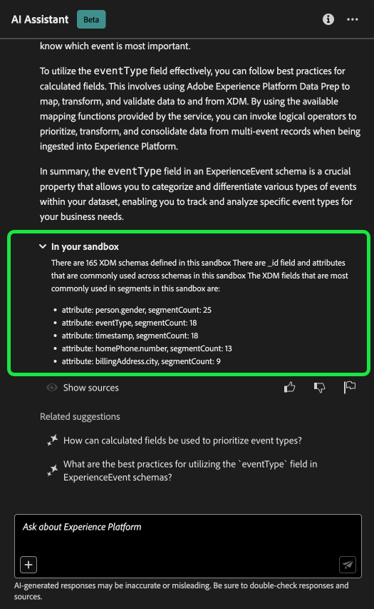
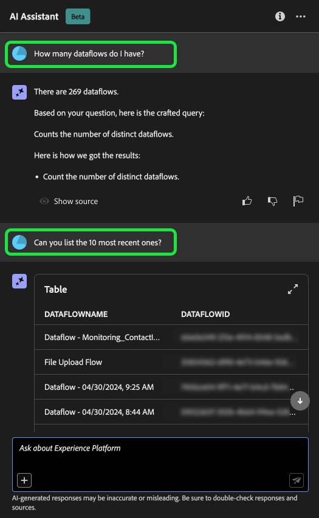
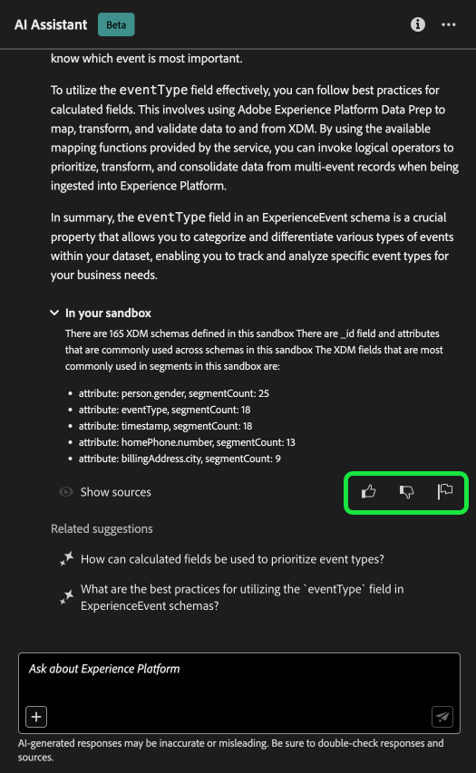

# Asistente de IA para Adobe Experience Platform

>[!NOTE]
>
>El Asistente de IA para Adobe Experience Platform está actualmente en versión beta. La funcionalidad y la documentación están sujetas a cambios.

El asistente de IA es una función de la interfaz de usuario que puede utilizar para desplazarse por los conceptos de Adobe Experience Platform y Real-time Customer Data Platform, comprender su uso y la información sobre sus objetos.

Puede consultar el Asistente de IA para obtener información como:

* Directrices sobre cómo realizar tareas relativas a datos y audiencias.
* Estados y métricas de los objetos de datos existentes en su organización.
* Utilice ejemplos de casos y matices para comprender mejor los objetos de datos, incluidos atributos, audiencias, flujos de datos, conjuntos de datos, destinos, esquemas y fuentes.

Lea la guía siguiente para aprender a utilizar el asistente de IA para navegar y comprender los flujos de trabajo de Experience Platform y Real-Time CDP.

>[!BEGINSHADEBOX]

**¿Cómo funciona el Asistente de IA?**

El asistente de IA responde a las preguntas enviadas consultando una base de datos y luego traduciendo los datos de la base de datos a una respuesta legible en lenguaje natural.

Esta representación interna de los datos subyacentes también se conoce como Gráfico del conocimiento: una red completa de conceptos, datos y metadatos para una respuesta determinada.

El gráfico de conocimiento consta de subgráficos a los que se hace referencia cada vez que se envían consultas:

* Datos de uso del cliente.
* Datos de uso del cliente en varias metatiendas.
* Documentación del Experience League.

Hay dos clases de preguntas que se deben tener en cuenta antes de consultar el Asistente de IA:

* **Preguntas sobre conceptos**: Las preguntas de concepto tratan sobre conceptos de Adobe relacionados con datos o audiencias. Algunos ejemplos de preguntas conceptuales son:
   * ¿Cuál es la diferencia entre la segmentación por lotes y la segmentación por streaming?
   * ¿Existen modelos de datos del sector y cómo puedo utilizarlos?
   * ¿Para qué se utiliza Real-Time CDP?
* **Preguntas de uso**: Las preguntas de uso tratan sobre los objetos de datos dentro de la organización. Algunos ejemplos de preguntas de uso son:
   * ¿Cuántos conjuntos de datos tengo?
   * ¿Cuántos atributos de esquema nunca se han utilizado?
   * ¿Qué audiencias se han activado?

>[!ENDSHADEBOX]

## Objetivos que puede lograr con el asistente de IA {#objectives}

Puede utilizar el Asistente de IA para objetivos como:

| Objetivo | Descripción | Ejemplo |
| --- | --- | --- |
| Conceptos de aprendizaje y flujos de trabajo continuos | <ul><li>Como usuario novato, puede utilizar el asistente de IA para aprender los conceptos de Real-Time CDP y Adobe Journey Optimizer e incorporarse a productos y funciones con los que no está familiarizado.</li><li>Como usuario experimentado, puede utilizar el Asistente de IA para resolver un caso extremo que pueda estar bloqueando el flujo de trabajo. | <ul><li>¿Cómo configuro un tablero en Recorrido Analytics?</li><li>Dime algunos casos de uso para Real-Time CDP.</li></ul> |
| Resolución de problemas | Utilice el Asistente de IA para aprender a depurar los errores básicos que pueden producirse en el flujo de trabajo. | <ul><li>¿Qué causa este error? {ERROR_MESSAGE} ¿Mentiroso?</li><li>¿Por qué no puedo eliminar la audiencia denominada &quot;Luma: Audiencia por correo electrónico&quot;?</li></ul> |
| Higiene de zona protegida | Utilice el asistente de IA para identificar duplicados u objetos que no se utilicen, de modo que pueda mantener de forma eficaz la zona protegida. | <ul><li>¿Puede mostrarme audiencias que sean similares?</li><li>¿Hay algún esquema que no tenga un conjunto de datos asociado?</li></ul> |
| Análisis de valor | Utilice el asistente de IA para identificar los objetos de datos más utilizados, evaluar cualquier indicador de rendimiento o encontrar los objetos de datos más valiosos. | <ul><li>¿Cuántos perfiles hay en nuestra definición de segmento &quot;Luma: Audiencia de correo electrónico&quot;?</li><li>¿Cuándo se activaron las audiencias en el destino de Audiencias del Experience Cloud?</li></ul> |
| Buscar | Utilice el Ayudante de IA para buscar objetos de Experience Platform admitidos, como audiencias, conjuntos de datos, destinos, esquemas y fuentes. | <ul><li>Enumere las audiencias que contienen &quot;Luma&quot; en el nombre y que se crearon en el último trimestre.</li><li>¿Qué atributos hay en el esquema XDM &quot;Luma: Custom Actions&quot;?</li></ul> |
| Análisis de impacto | Utilice el asistente de IA para identificar objetos de datos que se han utilizado en determinados flujos de trabajo y así poder evaluar el impacto de cualquier cambio. | <ul><li>Qué audiencias utilizan `homeAddress.city` en el esquema &quot;Luma: PersonProfiles&quot;?</li><li>Qué conjuntos de datos son los `consents.marketing.push.val` atributo de perfil almacenado en?</li></ul> |

## Acceso al Asistente de IA en la IU de Experience Platform

Para iniciar el asistente de IA, seleccione **[!UICONTROL Icono de asistente de IA]** desde el encabezado superior de la interfaz de usuario de Experience Platform.

Aparecerá la interfaz del Asistente de IA, que le proporcionará inmediatamente información para empezar. Puede utilizar las opciones que se proporcionan en [!UICONTROL Ideas para empezar] para responder preguntas y comandos como:

* [!UICONTROL ¿Cuál de mis audiencias está activada?]
* [!UICONTROL ¿Qué es un esquema?]
* [!UICONTROL Casos de uso comunes de Real-Time CDP]

## Guía de IU del asistente de IA

>[!NOTE]
>
>El siguiente flujo de trabajo es un ejemplo que utiliza el proceso de creación de esquemas de eventos de experiencia para ilustrar cómo puede utilizar el Asistente de IA al utilizar la interfaz de usuario de Experience Platform.

Considere un caso de uso en el que esté creando una **Esquema de comercio de dispositivos en evento**. Durante el proceso de creación del esquema del evento de experiencia, se encuentra con el `eventType` field. &quot;En este punto, tiene la opción de salir del flujo de trabajo y consultar [conceptos básicos de una composición de esquema](../xdm/schema/composition.md) o puede utilizar AI Assistant para recuperar respuestas a sus preguntas y encontrar recursos adicionales a través de los vínculos de documentación recomendados por AI Assistant&quot;.

Para empezar, escriba su pregunta en el cuadro de texto proporcionado. En el siguiente ejemplo, se proporciona un asistente de IA con la pregunta: &quot;**¿Qué es el campo eventType en un esquema ExperienceEvent?**&quot;

A continuación, el asistente de IA consulta su base de conocimiento y calcula una respuesta. Después de unos momentos, el Asistente de IA devuelve una respuesta y sugerencias relacionadas que puede utilizar como preguntas de seguimiento.

Después de recibir una respuesta del Asistente de IA, puede seleccionar entre una serie de opciones para decidir cómo desea continuar.

### Funciones del asistente de IA {#features}

Esta sección describe las diferentes funciones del asistente de IA que puede utilizar durante los flujos de trabajo en Experience Platform.

<!-- 
### Save your query {#save-your-query}

+++Select to view an example of how to save a query

To save your query, select the bookmark icon beside your question.

To access your saved queries, select the bookmark icon below the input box, then select the query you would like to run.

+++ -->

### Vista de datos en su zona protegida {#view-data-in-your-sandbox}

Según la consulta, el asistente de IA proporciona información adicional perteneciente a los datos de la zona protegida. Para ver cómo se aplica la respuesta a la consulta a su zona protegida particular, seleccione **[!UICONTROL En su zona protegida].**

Al ver datos pertenecientes a su zona protegida, el Asistente de IA puede proporcionar vínculos directos a páginas de interfaz de usuario específicas que muestran los datos consultados.

+++Seleccione para ver el ejemplo

En este ejemplo, el asistente de IA devuelve información adicional sobre los esquemas XDM existentes en la zona protegida, incluido su recuento total y los cinco campos más utilizados.

+++

### Ver citas {#view-citations}

Puede verificar las respuestas que le devuelve AI Assistant revisando las citas disponibles con cada respuesta.

+++Seleccione esta opción para ver un ejemplo de cómo mostrar orígenes

Para ver las citas y validar la respuesta del asistente de IA, seleccione **[!UICONTROL Mostrar orígenes]**.

El asistente de IA actualiza la interfaz y le proporciona vínculos a documentación que corrobora la respuesta inicial. Además, cuando las citas están habilitadas, el Asistente de IA actualiza la respuesta para incluir notas al pie de página que indican las partes específicas de la respuesta que hacen referencia a la documentación proporcionada.

También puede utilizar las consultas que ofrece el Asistente de IA en **[!UICONTROL Sugerencias relacionadas]** para explorar más en profundidad los temas relacionados con la consulta original.

+++

### Visualización y datos de uso {#usage-data-and-visualization}

Debe encontrarse en una zona protegida activa para que el asistente de IA responda suficientemente a una pregunta sobre sus datos de uso.

+++Seleccione esta opción para ver un ejemplo de uso, preguntas de datos y visualización de datos

En el siguiente ejemplo, se realiza la siguiente consulta al asistente de IA: **&quot;Mostrar los flujos de datos creados con la fuente de Amazon S3&quot;** A continuación, AI Assistant responde con una tabla que enumera los flujos de datos y sus ID correspondientes. Para ver toda la tabla de datos, seleccione el icono de expansión en la parte superior derecha.

Aparece una vista expandida de la tabla, que le proporciona una lista más completa de flujos de datos basados en los parámetros de la consulta.

Cuando se le pregunta sobre los datos de uso, el asistente de IA proporciona una explicación de cómo calculó la respuesta. En el ejemplo siguiente, AI Assistant describe los pasos que realizó para identificar los flujos de datos creados con el [!DNL Amazon S3] origen.

También puede proporcionar filtros y modificaciones a las consultas, y puede indicar al Asistente de inteligencia artificial que procese sus conclusiones en función de los filtros que incluya. Por ejemplo, puede pedir al Asistente de IA que le muestre una tendencia del recuento de definiciones de segmento en el orden de su fecha de creación, elimine definiciones de segmento con perfiles totales cero y utilice nombres de mes en lugar de enteros al mostrar los datos.

+++

### Usar completado automático {#use-auto-complete}

Puede utilizar la función de autocompletar para recibir una lista de los objetos de datos que existen en su zona protegida. Las recomendaciones de autocompletar están disponibles para los siguientes dominios: audiencias, esquemas, conjuntos de datos, fuentes y destinos.

+++Seleccione esta opción para ver un ejemplo de autocompletado

Se puede utilizar el completado automático incluyendo el símbolo más (**`+`**) en la consulta. Como alternativa, también puede seleccionar el signo más (**`+`**) situado en la parte inferior del cuadro de entrada de texto. Aparece una ventana con una lista de los objetos de datos recomendados de la zona protegida.

+++

### Uso de giro múltiple {#use-multi-turn}

Puede utilizar las capacidades de varias vueltas de AI Assistant para tener una conversación más natural durante su experiencia. El asistente de IA puede responder a las preguntas de seguimiento que se le formulen. ese contexto se puede inferir de una interacción anterior.

+++Seleccione esta opción para ver un ejemplo de varias vueltas

En el siguiente ejemplo, se solicita al asistente de IA primero el número total de flujos de datos y, a continuación, se le solicita que enumere los 10 flujos de datos más recientes.

+++

## Proporcionar comentarios {#feedback}

Puede proporcionar comentarios sobre su experiencia con el asistente de IA mediante las opciones que se proporcionan con la respuesta.

Para proporcionar comentarios, seleccione los pulgares hacia arriba, hacia abajo o un indicador después de recibir una respuesta del asistente de IA y, a continuación, introduzca sus comentarios en el cuadro de texto proporcionado.

+++Seleccione para ver más ejemplos

>[!BEGINTABS]

>[!TAB Pulgares hacia arriba]

Seleccione el icono de miniaturas hacia arriba para proporcionar comentarios sobre lo que ha salido bien con su experiencia con el asistente de IA.

>[!TAB Pulgar hacia abajo]

Seleccione el icono de pulgares hacia abajo para proporcionar comentarios sobre lo que se puede mejorar en función de su experiencia con el asistente de IA. Durante este paso, también puede proporcionar comentarios específicos sobre la experiencia. Los comentarios proporcionados en los comentarios se revisan diariamente.

>[!TAB Indicador]

Seleccione el icono de indicador para proporcionar más informes sobre su experiencia con el asistente de IA.

>[!ENDTABS]

+++

## Documentación {#documentation}

Actualmente, el índice de documentación cubre Adobe Experience Platform (Real-Time CDP y Audiencias). El índice se actualiza periódicamente.

El modelo de recuperación de documentación está formado en Experience Platform (Real-Time CDP y Audiencias). Preguntas que no entran en el ámbito de Adobe Experience Platform, como las preguntas sobre otros productos de Adobe como Adobe Target y el grupo de Creative Cloud, no pueden responderse.

## Datos de uso {#usage-date}

También puede hacer preguntas al asistente de IA sobre sus datos de uso en los siguientes dominios:

* Atributos
* Públicos
* Flujos de datos
* Conjuntos de datos
* Destinos _(Las preguntas relativas a las cuentas y algunas preguntas sobre el flujo de datos no se pueden responder en este momento)._
* Esquemas _(Las preguntas relativas a los grupos de campos no se pueden responder en este momento)._
* Fuentes _(Las preguntas relativas a las cuentas no se pueden responder en este momento)._

En el caso de las consultas de datos de uso, las respuestas pueden no reflejar el estado actual de la interfaz de usuario. Los datos que respaldan estas preguntas se actualizan una vez cada 24 horas. Por ejemplo, los cambios que los usuarios realizan en Real-Time CDP durante el día se sincronizan con los almacenes de datos por la noche y, a continuación, están disponibles para que los usuarios formulen preguntas por la mañana. Además, deberá iniciar sesión en una zona protegida para consultar sobre datos específicos relacionados con objetos como audiencias, esquemas, conjuntos de datos, atributos y destinos.

### Ejemplo de preguntas de datos de uso {#example-usage-data-questions}

+++Seleccione esta opción para ver una lista de preguntas de datos de uso de ejemplo

Lea la tabla siguiente para ver ejemplos de preguntas sobre los datos de uso y sus respectivos casos de uso:

| Tipo de pregunta | Caso de uso | Ejemplos |
| --- | --- | --- | 
| Linaje de datos | Rastrear el uso de uno o varios objetos en otros objetos de Experience Platform | <ul><li>¿Qué conjuntos de datos utilizan el esquema &quot;esquema ACME&quot;?</li><li>¿Cuántos conjuntos de datos se han introducido utilizando el mismo esquema?</li><li>¿Qué conjuntos de datos se han utilizado en audiencias activadas?</li><li>Enumerar los esquemas que tienen atributos utilizados en audiencias activadas.</li><li>Muéstreme las audiencias que están activadas en &quot;Destinos ACME&quot; y que tienen más de 1000 perfiles.</li><li>Muéstreme los atributos que se utilizan en las audiencias activadas que se han modificado después de enero de 2023.</li><li>¿Cuáles son los conjuntos de datos ingeridos mediante la fuente &quot;ACME Amazon S3&quot;?</li><li>¿Qué flujos de datos están asociados con el &quot;flujo de datos de fidelidad ACME&quot;?</li><li>Enumera los esquemas relacionados con las audiencias activadas y creados en el último año.</li></ul> |
| Distribución y agregaciones | Preguntas basadas en resumen sobre el uso de objetos de Experience Platform | <ul><li>¿Cuál es el porcentaje de audiencias activadas?</li><li>¿Cuántos campos se utilizan en la segmentación?</li><li>¿Qué audiencias se activan para la mayor cantidad de destinos?</li><li>Enumerar audiencias duplicadas.</li><li>Muéstreme las audiencias activadas en &quot;Destinos ACME&quot; y clasifíquelas por tamaño de perfil.</li><li>¿Cuál es el porcentaje de audiencias que no se han activado pero que tienen más de 100 perfiles? Muéstrame sus nombres.</li><li>Enumerar los 3 conectores de origen que consumen datos en mis conjuntos de datos.</li><li>Enumere los 5 atributos principales utilizados en las audiencias activadas en función de su ocurrencia.</li></ul> |
| Búsqueda de objetos | Recupere o acceda a un objeto Experience Platform o a sus propiedades. | <ul><li>Qué conjuntos de datos no tienen ningún esquema asociado</li><li>¿Enumerar los atributos utilizados para &quot;Audiencia ACME&quot;?</li><li>Dame la lista de esquemas que tienen un perfil habilitado, pero que no se han modificado desde su creación.</li><li>¿Qué audiencias se han modificado en la última semana?</li><li>Enumerar las audiencias que tienen las mismas definiciones de segmento junto con su fecha de creación.</li><li>Qué conjuntos de datos tienen habilitado el perfil e incluyen también cuántas audiencias se han creado a partir de cada conjunto de datos.</li><li>¿Qué cuentas de origen están asociadas al conjunto de datos XYZ?</li><li>Muéstreme la definición del segmento y la fecha de modificación de &quot;Audiencia ACME&quot;.</li></ul> |
| Comparación de objetos | Identificar audiencias duplicadas. | <ul><li>En función de su definición de segmento, enumere las audiencias que están duplicadas.</li><li>Qué audiencias duplicadas están activadas en &quot;Destinos ACME&quot;.</li></ul> |

+++

## Formulación de preguntas {#phrasing-your-questions}

Debe formular sus preguntas al asistente de IA con claridad y contexto para obtener una respuesta lo más precisa posible. Consulte la siguiente lista de sugerencias para obtener instrucciones sobre cómo hacer una pregunta clara con contexto:

* Exponga su tarea y/o pregunta de forma concisa.
* Evite el lenguaje ambiguo o la sintaxis demasiado compleja para facilitar la comprensión.
* Proporcione un contexto relevante con respecto a su tarea o pregunta, ya que el contexto puede ayudar al Asistente de IA a generar respuestas más relevantes.

Lea la tabla siguiente para obtener más orientación sobre las prácticas recomendadas que deben seguirse al hacer preguntas al asistente de IA:

| Hacer | Ejemplo |
| --- | --- |
| <ul><li>Sea específico sobre el objeto o la información que desea recuperar o analizar.</li><li>Intente poner los nombres de los objetos de datos entre comillas. Si sólo conoce una parte del nombre del objeto, también puede especificarlo en la pregunta.</li><li>Uso [autocompletar objeto](./ui-guide.md#use-auto-complete) para ayudar al asistente de IA a comprender mejor el contexto de la consulta.</li></ul> | <ul><li>¿Qué conjuntos de datos utilizan el esquema &quot;Lealtad de Luma&quot;?</li><li>Muéstreme los segmentos activados que tienen &quot;Luma&quot; en sus nombres. Clasificarlos por recuento de perfiles.</li></ul> |
| <ul><li>Evite la ambigüedad y utilice un lenguaje claro</li><li>Utilice una terminología precisa para garantizar una mejor claridad en la consulta.</li><li>Cuando haga preguntas sobre Adobe Experience Platform, intente utilizar una terminología específica de Experience Platform para mejorar la relevancia de las respuestas.</li></ul> | <ul><li>¿Cuántos perfiles tengo en &quot;Audiencia ACME&quot;?</li><li>Mostrar los 5 atributos XDM principales utilizados en audiencias activadas.</li></ul> |
| <ul><li>Proporcione contexto o especifique un criterio para filtrar los resultados.</li><li>Utilice un criterio de filtro en las preguntas para limitar el volumen de datos en la respuesta.</li></ul> | <ul><li>Mostrar audiencias que no se hayan activado y creado hace más de 6 meses y que nunca se hayan modificado.</li><li>Mostrar las audiencias activadas en &quot;Destino ACME&quot; y tener más de 10000 perfiles.</li></ul> |

{style="table-layout:auto"}

| No lo hagas | Ejemplo |
| --- | --- |
| Utilice un lenguaje vago o ambiguo. | <ul><li>Proporcionarme información sobre conjuntos de datos.</li><li>¿Cuántos usuarios tengo en &quot;Audiencia ACME&quot;?</li><li>Mostrar segmentos.</li><li>Atributos de lista.</li></ul> |
| Realizar solicitudes incompletas. | &quot;Luma: Conjunto de datos de fidelización&quot; |
| Asumir el conocimiento sin contexto. | <ul><li>Audiencias en los últimos 6 meses.</li><li>Cree una consulta para mí.</li></ul> |
| Formular consultas demasiado complejas. | Proporcionar un análisis completo del linaje de datos en todos los objetos y sus dependencias. |
| Omitir criterios o parámetros. | Mostrar conjuntos de datos. |

{style="table-layout:auto"}

## Más información {#additional-information}

Consulte esta sección para obtener más información sobre el asistente de IA para Experience Platform.

### Advertencias y limitaciones {#caveats-and-limitations}

En la siguiente sección se describen las advertencias y limitaciones actuales que se deben tener en cuenta al utilizar el asistente de IA.

#### Conversaciones pequeñas limitadas

Puede mantener una pequeña conversación con el asistente de IA, pero esta capacidad es actualmente limitada.

#### Preguntas de funcionalidad

El asistente de IA puede dar una impresión inexacta de lo que puede hacer. Puede responder incorrectamente a los siguientes tipos de preguntas:

| Pregunta de ejemplo | Nota |
| --- | --- |
| &quot;¿Puedes responder preguntas sobre {ENTITY}?&quot; | Siempre que el asistente de IA pueda encontrar una sola página que haga referencia a una entidad determinada en su índice, responderá afirmativamente. |
| &quot;¿Lo sabes? **x** ¿idioma?&quot; | Actualmente, el asistente de IA solo admite inglés, pero puede responder &quot;sí&quot; debido a que el modelo subyacente puede admitirlo. |
| &quot;¿Puedes hacer...?&quot; | El asistente de IA puede responder que sí, aunque no pueda hacerlo. |

## Preguntas frecuentes {#faq}

A continuación se muestra una lista de respuestas a las preguntas frecuentes sobre AI Assistant.

### ¿La información de AI Assistant se proporciona en tiempo real?

Los datos presentados en las respuestas del asistente de IA se actualizan diariamente. Esto significa que los datos de las respuestas pueden ser hasta 24 horas anteriores a los datos que se pueden ver en la interfaz de usuario del Experience Platform en el momento de la respuesta.

### ¿Con qué aplicaciones de Adobe es compatible AI Assistant?

El asistente de IA admite preguntas de concepto de Adobe Experience Platform, Real-time Customer Data Platform y Adobe Journey Optimizer. Para preguntas sobre el uso de datos, AI Assistant solo admite objetos de datos de Real-Time CDP.

### ¿Cuáles son las capacidades de AI Assistant?

El asistente de IA puede abordar consultas sobre conceptos de Adobe y puede responder preguntas relacionadas con el uso de objetos de Experience Platform. (Por ejemplo, ¿Cuántas audiencias se activan?).

### ¿Puede el asistente de IA proporcionar información sobre los datos de perfil?

No. El asistente de IA no tiene acceso a los datos de nivel de perfil.

### ¿Se utilizará mi información personal en los datos de formación de AI Assistant?

AI Assistant no utiliza información personal con fines formativos. No proporcione ninguna información personal sobre usted (incluyendo su nombre o información de contacto) o sobre otras partes de AI Assistant.