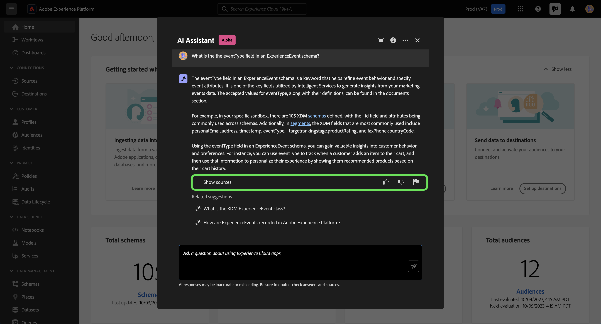
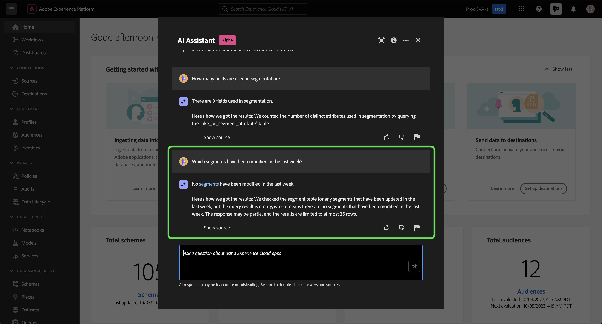

# Ayudante para Adobe Experience Platform

>[!NOTE]
>
>El Asistente para Adobe Experience Platform está actualmente en Alpha. La funcionalidad y la documentación están sujetas a cambios.

El Ayudante para Adobe Experience Platform es una función de la interfaz de usuario que puede utilizar para desplazarse por los conceptos de Experience Platform y Real-time Customer Data Platform, comprender sus conceptos y utilizar información sobre sus objetos.

Puede consultar el Ayudante para obtener información como:

* Directrices sobre cómo realizar tareas relativas a datos y audiencias.
* Estados y métricas de los objetos de datos existentes en su organización.
* Utilice ejemplos de casos y matices para comprender mejor los objetos de datos, incluidos atributos, conjuntos de datos, destinos, esquemas, segmentos y fuentes.

Este documento proporciona información sobre cómo puede acceder al Ayudante y utilizarlo para hacer preguntas y recibir respuestas acerca de los conceptos de Experience Platform y Real-Time CDP.

>[!BEGINSHADEBOX]

**¿Cómo funciona Assistant?**

El asistente responde a las preguntas enviadas consultando una base de datos y luego traduciendo los datos de la base de datos a una respuesta legible en lenguaje natural.

Esta representación interna de los datos subyacentes también se conoce como Gráfico del conocimiento: una red completa de conceptos, datos y metadatos para una respuesta determinada.

El gráfico de conocimiento consta de subgráficos a los que se hace referencia cada vez que se envían consultas:

* Datos de uso del cliente.
* Datos de uso del cliente en varias metatiendas.
* Documentación del Experience League.

Hay dos clases de preguntas que se deben tener en cuenta antes de consultar el Ayudante:

* **Preguntas sobre conceptos**: Las preguntas de concepto tratan sobre conceptos de Adobe relacionados con datos o audiencias. Algunos ejemplos de preguntas conceptuales son:
   * ¿Cuál es la diferencia entre la segmentación por lotes y la segmentación por streaming?
   * ¿Existen modelos de datos del sector y cómo puedo utilizarlos?
   * ¿Para qué se utiliza Real-Time CDP?
* **Preguntas de uso**: Las preguntas de uso tratan sobre los objetos de datos dentro de la organización. Algunos ejemplos de preguntas de uso son:
   * ¿Cuántos conjuntos de datos tengo?
   * ¿Cuántos atributos de esquema nunca se han utilizado?
   * ¿Qué segmentos se han activado?

>[!ENDSHADEBOX]

## Acceder al Asistente para Experience Platform en la IU

Puede acceder al Ayudante desde la navegación del encabezado en la interfaz de usuario de Experience Platform.

Seleccione el **[!UICONTROL Icono de asistente]** del encabezado al panel del Ayudante de lanzamiento.

+++Usar modo inmersivo

Para usar [!DNL Immersive mode] seleccione el icono de enfoque en la navegación de encabezado del Ayudante.

En el centro de la pantalla aparece una interfaz emergente dedicada para el Ayudante.

+++

Desde aquí, puede introducir su pregunta en el cuadro de texto y consultar al Ayudante conceptos relacionados con los datos o las audiencias. También puede hacer preguntas sobre los objetos de datos para comprender mejor cómo puede utilizarlos para su caso de uso respectivo.

### Ejemplo de caso de uso: Utilice el Ayudante para acelerar el proceso de creación de esquemas

>[!NOTE]
>
>El siguiente flujo de trabajo de ejemplo utiliza el proceso de creación de esquemas de ExperienceEvent para ilustrar cómo puede utilizar el Ayudante al utilizar la interfaz de usuario de Experience Platform.

Considere un caso de uso en el que esté creando una **Esquema de comercio de dispositivos en evento**. Durante el proceso de creación del esquema de ExperienceEvent, se encuentra con el `eventType` field. En este punto, puede dejar el flujo de trabajo y consultar la documentación en [conceptos básicos de una composición de esquema](../xdm/schema/composition.md)o puede utilizar el Asistente para recuperar respuestas inmediatas a sus preguntas.

Para empezar, escriba su pregunta en el cuadro de texto proporcionado. En el siguiente ejemplo, se proporciona al asistente la pregunta: &quot;**¿Qué es el campo eventType en un esquema ExperienceEvent?**&quot;

A continuación, el asistente consulta su base de conocimientos y calcula una respuesta. Después de unos momentos, el Asistente devuelve una respuesta y sugerencias relacionadas que puede utilizar como preguntas de seguimiento.

Una respuesta determinada proporciona hipervínculos a cualquier entidad a la que se haga referencia. En el ejemplo siguiente, seleccione **[!UICONTROL Esquemas]** para ver una lista de los esquemas a los que se hace referencia, o **[!UICONTROL Segmentos]** para ver una lista de los segmentos referenciados.

El Ayudante permite validar la respuesta viendo su origen. Se proporcionan vínculos a la documentación para preguntas de concepto, mientras que las preguntas de uso de datos se pueden comprobar con una consulta SQL que muestra cómo se calculó la respuesta.

#### Sugerencias relacionadas

También puede profundizar en el tema de la consulta seleccionando una de las sugerencias relacionadas que proporciona el Asistente.

#### Pregunta de seguimiento

Puede obtener más información sobre un tema en particular haciendo una pregunta de seguimiento. En el siguiente ejemplo, se pregunta al Ayudante cómo se puede utilizar eventType en la segmentación.

#### Pregunta de uso de datos

También puede hacer preguntas al Ayudante sobre el uso de los datos. Al consultar sobre el uso de datos, debe estar en un simulador para pruebas activo a fin de que el asistente pueda responder a su consulta.

## Ámbito

El asistente puede responder preguntas relacionadas con los conceptos de Real-Time CDP y Experience Platform, así como con el uso de datos específicos de su cuenta de usuario. El asistente también puede deducir el contexto en función de la página de la interfaz de usuario en la que se encuentre. Puede identificar:

* La cuenta de usuario que está utilizando.
* La organización a la que pertenece.
* La página que está viendo en la pantalla.
* El recurso (incluidos el tipo y el ID) que está viendo en la pantalla.
* Dado que se encuentra en el proceso de un Experience Platform en particular o de un flujo de trabajo de Real-Time CDP, el asistente puede deducir su intención.

### Documentación

Actualmente, el índice de documentación cubre Adobe Experience Platform (Real-Time CDP y Audiencias). El índice se actualiza periódicamente.

El modelo de recuperación de documentación está formado en Experience Platform (Real-Time CDP y Audiencias). Preguntas que no entran en el ámbito de Adobe Experience Platform, como las preguntas sobre otros productos de Adobe como Adobe Target y el grupo de Creative Cloud, no pueden responderse.

### Uso de datos

También puede hacer preguntas al Ayudante sobre el uso de los datos en los siguientes dominios:

* Atributos
* Conjuntos de datos
* Destinos _(Las preguntas relativas a las cuentas y algunas preguntas sobre el flujo de datos no se pueden responder en este momento)._
* Esquemas _(Las preguntas relativas a los grupos de campos no se pueden responder en este momento)._
* Segmentos
* Fuentes _(Las preguntas relativas a las cuentas no se pueden responder en este momento)._

En el caso de las consultas de datos de uso, las respuestas pueden no reflejar el estado actual de la interfaz de usuario. Los datos que respaldan estas preguntas se actualizan una vez cada 24 horas. Por ejemplo, los cambios que los usuarios realizan en Real-Time CDP durante el día se sincronizan con los almacenes de datos por la noche y, a continuación, están disponibles para que los usuarios formulen preguntas por la mañana. Es posible que tenga que dar formato a sus preguntas como: &quot;Cuándo fue el segmento con el título {TITLE} creado?&quot; en lugar de, &quot;¿Cuándo fue la {TITLE} ¿segmento creado?&quot;

Deberá iniciar sesión en una zona protegida para consultar sobre datos específicos relacionados con objetos como esquemas, conjuntos de datos, atributos, destinos y segmentos.

### Ejemplo de preguntas de uso de datos

+++Seleccione esta opción para ver una lista de preguntas de uso de datos de ejemplo

| Tipo de pregunta | Descripción | Ejemplos |
| --- | --- | --- | 
| Linaje de datos | Rastrear el uso de uno o varios objetos en otros objetos de Experience Platform | <ul><li>Qué conjuntos de datos utilizar {SCHEMA_NAME} esquema?</li><li>¿Cuántos conjuntos de datos se han introducido utilizando el mismo esquema?</li><li>¿Qué conjuntos de datos se han utilizado en segmentos activados?</li><li>Enumerar los esquemas que tienen atributos utilizados en segmentos activados.</li><li>Mostrar los segmentos que están activados para {DESTINATION_ACCOUNT_NAME} y tienen más de 1000 perfiles.</li><li>Muéstreme los atributos que se utilizan en los segmentos activados que se han modificado después de enero de 2023.</li><li>Enumera los esquemas relacionados con los segmentos activados y creados en el último año.</li></ul> |
| Distribución y agregaciones | Preguntas basadas en resumen sobre el uso de objetos de Experience Platform | <ul><li>¿Cuál es el porcentaje de segmentos activados?</li><li>¿Cuántos campos se utilizan en la segmentación?</li><li>¿Qué segmentos se activan con la mayor cantidad de destinos?</li><li>Enumerar segmentos duplicados.</li><li>Mostrar los segmentos activados a {DESTINATION_ACCOUNT_NAME} y clasificarlos por tamaño de perfil.</li><li>¿Cuál es el porcentaje de segmentos que no se han activado pero que tienen más de 100 perfiles? Muéstrame sus nombres.</li><li>Enumere los 5 atributos principales utilizados en segmentos activados en función de su ocurrencia.</li></ul> |
| Búsqueda de objetos | Recupere o acceda a un objeto Experience Platform o a sus propiedades. | <ul><li>Qué conjuntos de datos no tienen ningún esquema asociado</li><li>Enumeración de los atributos utilizados para {SEGMENT_NAME}?</li><li>Dame la lista de esquemas que tienen un perfil habilitado, pero que no se han modificado desde su creación.</li><li>¿Qué segmentos se han modificado en la última semana?</li><li>Enumere los segmentos que tienen las mismas definiciones de segmentos junto con su fecha de creación.</li><li>Qué conjuntos de datos tienen habilitado el perfil e incluyen también cuántos segmentos se han creado a partir de cada conjunto de datos.</li><li>Mostrar la definición del segmento y la fecha de modificación de {SEGMENT_NAME}.</li></ul> |

+++

## Verificar la respuesta

Puede comprobar la respuesta que devuelve el Ayudante de varias formas diferentes.

### Citas para documentación

Con cada respuesta, el Ayudante le proporciona citas a las que puede hacer referencia para verificar o obtener más información.

Seleccionar **[!UICONTROL Mostrar origen]** para obtener una lista de vínculos a la documentación a la que el Ayudante hace referencia para calcular su respuesta.

Para las respuestas que incluyen información sobre el uso de los datos, el Ayudante proporciona vínculos a las entidades en cuestión. Además, el Ayudante le explica cómo ha calculado su respuesta.

## Proporcionar comentarios

>[!BEGINSHADEBOX]

**Se han solicitado sus comentarios**

Durante esta fase de Alpha, se le invita a proporcionar comentarios sobre las respuestas que reciba del asistente. Todas las respuestas y los comentarios enviados se revisan a fin de seguir mejorando la experiencia del asistente.

Para proporcionar comentarios, seleccione Miniaturas arriba o Miniaturas abajo después de recibir una respuesta del Ayudante y, a continuación, escriba los comentarios en el cuadro de texto proporcionado. A continuación, seleccione **[!UICONTROL Enviar comentarios]** para enviar.

>[!ENDSHADEBOX]

+++Proporcionar comentarios

>[!BEGINTABS]

>[!TAB Pulgares hacia arriba]

Seleccione el icono de pulgares hacia arriba para proporcionar comentarios sobre lo que ha salido bien con su experiencia con el asistente.

>[!TAB Pulgar hacia abajo]

Seleccione el icono de pulgares hacia abajo para proporcionar comentarios sobre las mejoras realizadas en función de su experiencia con el asistente. Durante este paso, también puede proporcionar comentarios específicos sobre la experiencia. Los comentarios proporcionados en los comentarios se revisan diariamente.

>[!TAB Indicador]

Seleccione el icono de indicador para proporcionar más informes sobre su experiencia con el asistente.

>[!ENDTABS]

+++

## Más información

Consulte esta sección para obtener más información sobre el Ayudante de Experience Platform.

### Advertencias y limitaciones

En la siguiente sección se describen las advertencias y limitaciones actuales que deben tenerse en cuenta al utilizar el Ayudante.

#### Experiencia de conversación

Al consultar al Ayudante, debe tener en cuenta varios matices relacionados con la experiencia conversacional.

>[!NOTE]
>
>Estas limitaciones son temporales y se están mejorando a lo largo del curso del alfa.

>[!BEGINTABS]

>[!TAB No se puede deducir el contexto de la conversación anterior]

En la actualidad, el Ayudante no puede referirse a los debates anteriores como contexto de una pregunta determinada. Consulte la tabla siguiente para ver ejemplos:

| Pregunta ambigua | Borrar pregunta | Nota |
| --- | --- | --- |
| <ul><li>Primera pregunta: &quot;¿Qué es un segmento?&quot;</li><li>Pregunta de seguimiento: &quot;¿Hay diferentes tipos de ellos?&quot;</li></ul> | <ul><li>Primera pregunta: &quot;¿Qué es un segmento?&quot;</li><li>Pregunta de seguimiento: &quot;¿Existen diferentes tipos de **segmentos**?&quot;</li></ul> | El Ayudante no puede deducir lo que significa &quot;ellos&quot;. |
| <ul><li>Primera pregunta: &quot;¿Qué es un segmento?&quot;</li><li>Pregunta de seguimiento: &quot;¿Puede dar más detalles?&quot;</li></ul> | <ul><li>Primera pregunta: &quot;¿Qué es un segmento?&quot;</li><li>Pregunta de seguimiento: &quot;Explique en profundidad qué es un segmento&quot;</li></ul> | El Ayudante no puede hacer referencia de forma inteligente a la documentación basándose en &quot;más&quot;. |
| <ul><li>Primera pregunta: &quot;¿Qué es un segmento?&quot;</li><li>Pregunta de seguimiento: &quot;¿Puede darme un ejemplo de uno?&quot;</li></ul> | <ul><li>Primera pregunta: &quot;¿Qué es un segmento?&quot;</li><li>Pregunta de seguimiento: &quot;¿Puede darme un ejemplo de un segmento?&quot;</li></ul> | El Ayudante no puede deducir de qué desea un ejemplo. |
| <ul><li>Primera pregunta: &quot;¿Qué es un segmento por lotes?&quot;</li><li>Pregunta de seguimiento: &quot;¿En qué se diferencia de un segmento de flujo continuo?&quot;</li></ul> | <ul><li>Primera pregunta: &quot;¿Qué es un segmento por lotes?&quot;</li><li>Pregunta de seguimiento: &quot;¿Puede comparar un segmento de flujo continuo con un segmento por lotes?&quot;</li></ul> | El Ayudante no puede deducir a qué se refiere y, por lo tanto, no puede comparar el segmento de flujo continuo. |
| <ul><li>Primera pregunta: &quot;¿Cuántos segmentos tengo?&quot;</li><li>Pregunta de seguimiento: &quot;¿Cuántos utilizan Facebook como destino?&quot;</li></ul> | <ul><li>Primera pregunta: &quot;¿Cuántos segmentos tengo?&quot;</li><li>Pregunta de seguimiento: &quot;¿Cuántos de los segmentos que tengo utilizan Facebook como destino?&quot;</li></ul> | El Ayudante no puede deducir a qué se refiere &quot;ellos&quot;. |

{style="table-layout:auto"}

>[!TAB No se puede deducir el contexto de una página]

Al preguntar al asistente sobre un elemento concreto de la página de la interfaz de usuario de Experience Platform en la que se encuentra, debe definir claramente el elemento específico dentro de la pregunta.

| Pregunta ambigua | Borrar pregunta | Nota |
| --- | --- | --- |
| &quot;¿Qué hace esto?&quot; | &quot;¿Qué hace {PAGE_NAME} ¿hacer? | El Ayudante no puede deducir a qué se refiere &quot;esto&quot;. Debe proporcionar el elemento de página específico que está consultando. |
| &quot;¿Por qué no ahorra?&quot; | &quot;¿Por qué no puedo guardar una nueva zona protegida llamada {NAME}?&quot; | El Ayudante no puede deducir a qué se refiere y no puede saber que tiene problemas con una entidad. |

{style="table-layout:auto"}

Además, el Ayudante solo puede responder preguntas relativas a mensajes de error, ya que el error está documentado en Experience League.

>[!TAB Ambigüedad]

Debe formular las preguntas con claridad y enmarcarlas dentro de un producto, aplicación o dominio, ya que el Ayudante no puede desambiguar las preguntas.

| Pregunta ambigua | Borrar pregunta | Nota |
| --- | --- | --- |
| &quot;¿Cómo se crea un filtro? | ¿Cómo se crea un filtro en el lenguaje de consulta de perfil? | Debe especificar la función para la que está filtrando, ya que varias funciones de Experience Platform admiten el filtrado. |
| &quot;¿Cómo empiezo? | ¿Cómo empiezo a utilizar los destinos? | Debe proporcionar claridad sobre sus objetivos y casos de uso, ya que los conceptos demasiado amplios pueden dar como resultado respuestas genéricas o innecesariamente específicas. |

{style="table-layout:auto"}

>[!ENDTABS]

#### Conversaciones pequeñas limitadas

Puede mantener una pequeña conversación con el Ayudante, pero actualmente su capacidad es limitada.

#### Preguntas de funcionalidad

El Ayudante puede dar una impresión inexacta de lo que puede hacer. Puede responder incorrectamente a los siguientes tipos de preguntas:

| Pregunta de ejemplo | Nota |
| --- | --- |
| &quot;¿Puedes responder preguntas sobre {ENTITY}?&quot; | Siempre que el Ayudante pueda encontrar una sola página que haga referencia a una entidad determinada en su índice, responderá afirmativamente. |
| &quot;¿Lo sabes? **x** ¿idioma?&quot; | Actualmente, el asistente solo admite inglés, pero puede responder &quot;sí&quot; debido a que el modelo subyacente puede admitirlo. |
| &quot;¿Puedes hacer...?&quot; | El Ayudante puede contestar que sí, aunque no pueda hacerlo. |

### Sugerencias

En la siguiente sección se describen algunas sugerencias y soluciones que deben tenerse en cuenta al utilizar el Ayudante.

#### Las preguntas pueden responderse con la fuente de información incorrecta

Hay casos en los que la pregunta acerca de los datos de uso puede dar como resultado una respuesta basada en la documentación. Esto se debe a que el Ayudante puede redirigir incorrectamente la pregunta a la fuente de información incorrecta. Para evitarlo, haga lo siguiente:

* Reformulando la pregunta para utilizar un lenguaje más similar a SQL
* Llamar explícitamente a la fuente de información para usar.

Lea la tabla siguiente para ver ejemplos:

| Pregunta incorrecta | Buena pregunta | Notas |
| --- | --- | --- |
| ¿Cuál es mi segmento más grande? | ¿Cuál es mi segmento más grande? Uso de datos. | Indicar explícitamente al Ayudante que desea que la respuesta se base en los datos. |
| ¿Cuál es mi segmento más grande? | Enumerar mi segmento más grande. | Hay casos en los que una pregunta de &quot;qué...&quot; se puede confundir con una pregunta basada en documentación. El uso de un comando como &quot;lista&quot; es un indicador más seguro de que está haciendo una pregunta con datos en contexto. |
| ¿Cuántos conjuntos de datos tengo? | Contar mis conjuntos de datos. | La pregunta original funciona para segmentos, pero es posible que no funcione con conjuntos de datos. |
