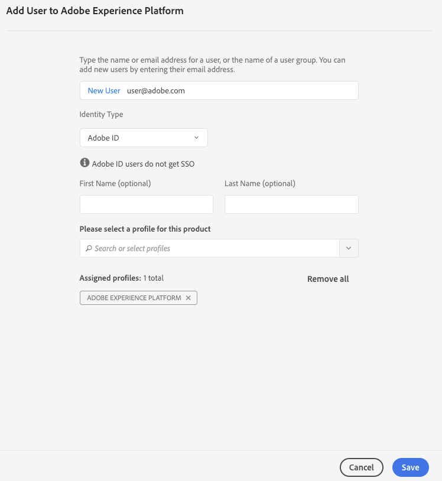
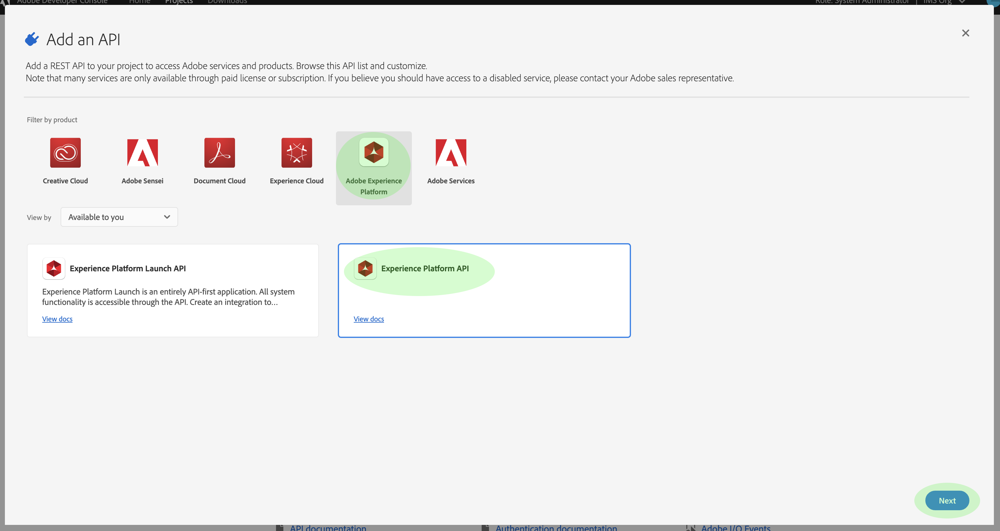

# Autentique y acceda a [!DNL Experience Platform] API

Este documento proporciona un tutorial paso a paso para obtener acceso a una cuenta de desarrollador de Adobe Experience Platform con el fin de realizar llamadas a [!DNL Experience Platform] API.

## Autenticar para realizar llamadas de API

Para mantener la seguridad de sus aplicaciones y usuarios, todas las solicitudes a las API de Adobe I/O deben autenticarse y autorizarse mediante estándares como OAuth y JSON Web Tokens (JWT). El JWT se utiliza junto con la información específica del cliente para generar su token de acceso personal.

Este tutorial trata los pasos de la autenticación mediante la creación de un token de acceso que se describe en el siguiente diagrama de flujo:


## Requisitos previos

Para realizar correctamente llamadas a [!DNL Experience Platform] API, necesita lo siguiente:

* Una organización de IMS con acceso a Adobe Experience Platform
* Una cuenta de Adobe ID registrada
* Un administrador Admin Console para agregarle como **desarrollador** y **usuario** para un producto.

Las siguientes secciones explican los pasos para crear un Adobe ID y convertirse en desarrollador y usuario de una organización.

### Crear un Adobe ID

Si no tiene un Adobe ID, puede crearlo siguiendo los pasos siguientes:

1. Vaya a [Adobe Developer Console](https://console.adobe.io)
2. Seleccione **[!UICONTROL crear una nueva cuenta]**
3. Completar el proceso de registro

## Conviértase en desarrollador y usuario de [!DNL Experience Platform] para una organización

Antes de crear integraciones en Adobe I/O, su cuenta debe tener permisos de desarrollador para un producto en una organización de IMS. Encontrará información detallada sobre las cuentas de desarrollador del Admin Console en el [documento de soporte](https://helpx.adobe.com/es/enterprise/using/manage-developers.html) para administrar programadores.

**Obtener acceso de desarrollador**

Póngase en contacto con un [!DNL Admin Console] administrador de su organización para agregarle como desarrollador para uno de los productos de su organización mediante [[!DNL Admin Console]](https://adminconsole.adobe.com/).


El administrador debe asignarle como desarrollador al menos un perfil de producto para continuar.


Una vez que se le asigne como desarrollador, tendrá privilegios de acceso para crear integraciones en [Adobe I/O](https://www.adobe.com/go/devs_console_ui). Estas integraciones son una canalización de aplicaciones y servicios externos a la API de Adobe.

**Obtener acceso de usuario**

El [!DNL Admin Console] administrador también debe agregarle al producto como usuario.


De forma similar al proceso de adición de un desarrollador, el administrador debe asignarle al menos un perfil de producto para continuar.



## Generar credenciales de acceso en Adobe Developer Console

>[!NOTE]
>
>Si está siguiendo este documento desde la [guía para desarrolladores de Privacy Service](../privacy-service/api/getting-started.md), ahora puede volver a esa guía para generar las credenciales de acceso exclusivas de [!DNL Privacy Service].

Con Adobe Developer Console, debe generar las tres credenciales de acceso siguientes:

* `{IMS_ORG}`
* `{API_KEY}`
* `{ACCESS_TOKEN}`

Sus `{IMS_ORG}` y `{API_KEY}` sólo deben generarse una vez y pueden reutilizarse en futuras [!DNL Platform] llamadas de API. Sin embargo, su `{ACCESS_TOKEN}` es temporal y debe regenerarse cada 24 horas.

Los pasos se describen en detalle a continuación.

### Configuración única

Vaya a [Adobe Developer Console](https://www.adobe.com/go/devs_console_ui) e inicie sesión con su Adobe ID. A continuación, siga los pasos descritos en el tutorial sobre [la creación de un proyecto vacío](https://www.adobe.io/apis/experienceplatform/console/docs.html#!AdobeDocs/adobeio-console/master/projects-empty.md) en la documentación de Adobe Developer Console.

Una vez creado un nuevo proyecto, seleccione **[!UICONTROL Añadir API]** en la pantalla **Información general del proyecto**.


Aparece la pantalla **Añadir una API**. Seleccione el icono de producto para Adobe Experience Platform y, a continuación, elija **[!UICONTROL API de Experience Platform]** antes de seleccionar **[!UICONTROL Siguiente]**.



Una vez que haya seleccionado [!DNL Experience Platform] como la API que se agregará al proyecto, siga los pasos descritos en el tutorial sobre [adición de una API a un proyecto mediante una cuenta de servicio (JWT)](https://www.adobe.io/apis/experienceplatform/console/docs.html#!AdobeDocs/adobeio-console/master/services-add-api-jwt.md) (a partir del paso &quot;Configurar API&quot;) para finalizar el proceso.

Una vez que se ha agregado la API al proyecto, la página **Visión general del proyecto** muestra las siguientes credenciales que son necesarias en todas las llamadas a las [!DNL Experience Platform] API:

* `{API_KEY}` (ID de cliente)
* `{IMS_ORG}` (ID de organización)


### Autenticación para cada sesión

La credencial requerida final que debe recopilar es su `{ACCESS_TOKEN}`. A diferencia de los valores para `{API_KEY}` y `{IMS_ORG}`, se debe generar un nuevo token cada 24 horas para continuar usando las API [!DNL Platform].

Para generar un `{ACCESS_TOKEN}` nuevo, siga los pasos para [generar un token JWT](https://www.adobe.io/apis/experienceplatform/console/docs.html#!AdobeDocs/adobeio-console/master/credentials.md) en la guía de credenciales de la Consola de programadores.

## Comprobación de las credenciales de acceso

Una vez recopiladas las tres credenciales necesarias, puede intentar realizar la siguiente llamada de API. Esta llamada lista todas las clases [!DNL Experience Data Model] (XDM) dentro del contenedor `global` del Registro de Esquemas:

**Formato API**

```http
GET /global/classes
```

**Solicitud**

```SHELL
curl -X GET https://platform.adobe.io/data/foundation/schemaregistry/global/classes \
  -H 'Accept: application/vnd.adobe.xed-id+json' \
  -H 'Authorization: Bearer {ACCESS_TOKEN}' \
  -H 'x-api-key: {API_KEY}' \
  -H 'x-gw-ims-org-id: {IMS_ORG}'
```

**Respuesta**

Si su respuesta es similar a la que se muestra a continuación, sus credenciales son válidas y funcionan. (Esta respuesta se ha truncado para el espacio).

```JSON
{
  "results": [
    {
        "title": "XDM ExperienceEvent",
        "$id": "https://ns.adobe.com/xdm/context/experienceevent",
        "meta:altId": "_xdm.context.experienceevent",
        "version": "1"
    },
    {
        "title": "XDM Individual Profile",
        "$id": "https://ns.adobe.com/xdm/context/profile",
        "meta:altId": "_xdm.context.profile",
        "version": "1"
    }
  ]
}
```

## Usar Postman para autenticación JWT y llamadas de API

[](https://www.postman.com/) Postmanes una herramienta popular para trabajar con las API de RESTful. Esta [publicación media](https://medium.com/adobetech/using-postman-for-jwt-authentication-on-adobe-i-o-7573428ffe7f) describe cómo configurar el postman para que realice automáticamente la autenticación JWT y la utilice para consumir las API de Adobe Experience Platform.

## Pasos siguientes

Al leer este documento, ha recopilado y probado correctamente las credenciales de acceso para las [!DNL Platform] API. Ahora puede seguir el ejemplo de las llamadas de API proporcionadas a través de la [documentación](../landing/documentation/overview.md).

Además de los valores de autenticación recopilados en este tutorial, muchas API [!DNL Platform] también requieren que se proporcione un `{SANDBOX_NAME}` válido como encabezado. Consulte la [información general de los entornos limitados](../sandboxes/home.md) para obtener más información.