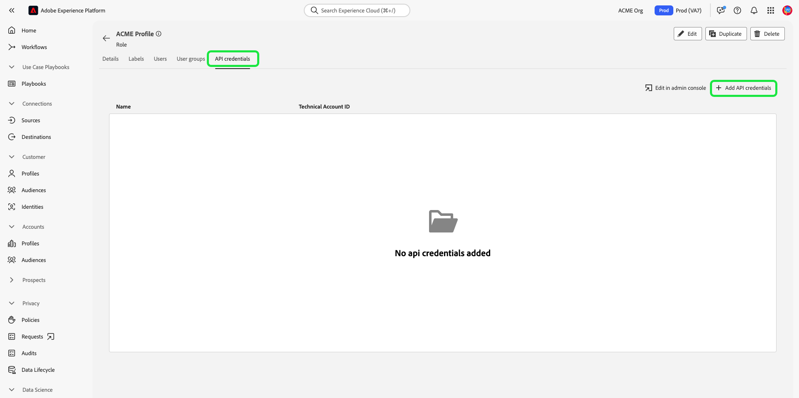

# Autenticación y acceso a las API de Experience Platform

Este documento proporciona un tutorial paso a paso para obtener acceso a una cuenta de desarrollador de Adobe Experience Platform con el fin de hacer llamadas a las API de Experience Platform. Al final de este tutorial, habrá generado las siguientes credenciales necesarias para todas las llamadas a la API de Platform:

* `{ACCESS_TOKEN}`
* `{API_KEY}`
* `{ORG_ID}`

Para mantener la seguridad de sus aplicaciones y usuarios, todas las solicitudes a las API de Adobe I/O deben autenticarse y autorizarse utilizando estándares como OAuth y JSON Web Tokens (JWT). Se utiliza un JWT junto con información específica del cliente para generar su token de acceso personal.

Este tutorial explica cómo recopilar las credenciales necesarias para autenticar las llamadas a la API de Platform, tal como se describe en el siguiente diagrama de flujo:


## Requisitos previos

Para realizar llamadas correctamente a las API de Experience Platform, debe tener lo siguiente:

* Una organización con acceso a Adobe Experience Platform.
* Un Admin Console que puede agregarle como desarrollador y como usuario de un perfil de producto.

También debe disponer de un Adobe ID para completar este tutorial. Si no tiene una Adobe ID, puede crearla siguiendo estos pasos:

1. Ir a [Consola de Adobe Developer](https://console.adobe.io).
2. Seleccionar **[!UICONTROL Crear una nueva cuenta]**.
3. Complete el proceso de registro.

## Obtener acceso de desarrollador y usuario para Experience Platform

Antes de crear integraciones en la consola de Adobe Developer, la cuenta debe tener permisos de desarrollador y usuario para un perfil de producto de Experience Platform en Adobe Admin Console.

### Obtener acceso de desarrollador

Contactar con un [!DNL Admin Console] administrador de su organización para agregarle como desarrollador a un perfil de producto de Experience Platform utilizando [[!DNL Admin Console]](https://adminconsole.adobe.com/). Consulte la [!DNL Admin Console] para obtener instrucciones específicas sobre cómo [administración del acceso de desarrollador para perfiles de producto](https://helpx.adobe.com/es/enterprise/admin-guide.html/enterprise/using/manage-developers.ug.html).

Una vez que se le asigne como desarrollador, puede empezar a crear integraciones en [Consola de Adobe Developer](https://www.adobe.com/go/devs_console_ui). Estas integraciones son una canalización de aplicaciones y servicios externos a las API de Adobe.

### Obtener acceso de usuario

Su [!DNL Admin Console] El administrador también debe agregarle como usuario al mismo perfil de producto de. Consulte la guía de [administración de grupos de usuarios en [!DNL Admin Console]](https://helpx.adobe.com/enterprise/admin-guide.html/enterprise/using/user-groups.ug.html) para obtener más información.

## Generar una clave de API, un ID de organización y un secreto de cliente {#api-ims-secret}

>[!NOTE]
>
>Si está siguiendo este documento desde el [Guía de API de Privacy Service](../privacy-service/api/getting-started.md), ahora puede volver a esa guía para generar las credenciales de acceso exclusivas de [!DNL Privacy Service].

Una vez que se le haya concedido acceso de desarrollador y usuario a Platform mediante [!DNL Admin Console], el siguiente paso es generar su `{ORG_ID}` y `{API_KEY}` credenciales en la consola de Adobe Developer. Estas credenciales solo deben generarse una vez y pueden reutilizarse en futuras llamadas a la API de Platform.

### Añadir un Experience Platform a un proyecto

Vaya a la [consola de desarrollador de Adobe](https://www.adobe.com/go/devs_console_ui) e inicie sesión con su Adobe ID. A continuación, siga los pasos descritos en el tutorial sobre [creación de un proyecto vacío](https://developer.adobe.com/developer-console/docs/guides/projects/projects-empty/) en la documentación de la consola de Adobe Developer.

Una vez creado un nuevo proyecto, seleccione **[!UICONTROL Añadir API]** en el **[!UICONTROL Resumen del proyecto]** pantalla.


Aparece la pantalla **[!UICONTROL Añadir una API]**. Seleccione el icono de producto de Adobe Experience Platform y, a continuación, elija **[!UICONTROL API de Experience Platform]** antes de seleccionar **[!UICONTROL Siguiente]**.


A partir de aquí, siga los pasos descritos en el tutorial sobre [Añadir una API a un proyecto mediante una cuenta de servicio (JWT)](https://www.adobe.io/apis/experienceplatform/console/docs.html#!AdobeDocs/adobeio-console/master/services-add-api-jwt.md) (empezando por el paso &quot;Configurar API&quot;) para finalizar el proceso.

>[!IMPORTANT]
>
>En un paso determinado del proceso vinculado anteriormente, el explorador descarga automáticamente una clave privada y un certificado público asociado. Tenga en cuenta dónde se almacena esta clave privada en el equipo, ya que es necesaria en un paso posterior de este tutorial.

### Recopilar credenciales

Una vez añadida la API al proyecto, la variable **[!UICONTROL API de Experience Platform]** Esta página del proyecto muestra las siguientes credenciales, necesarias en todas las llamadas a las API de Experience Platform:

* `{API_KEY}` ([!UICONTROL ID del cliente])
* `{ORG_ID}` ([!UICONTROL ID de organización])


Además de las credenciales anteriores, también necesita el **[!UICONTROL Secreto del cliente]** para un paso futuro. Seleccionar **[!UICONTROL Recuperar secreto de cliente]** para revelar el valor y, a continuación, copiarlo para utilizarlo posteriormente.


## Generar un token web JSON (JWT) {#jwt}

El siguiente paso es generar un token web JSON (JWT) basado en las credenciales de la cuenta. Este valor se utiliza para generar su `{ACCESS_TOKEN}` para su uso en llamadas a la API de Platform, que deben regenerarse cada 24 horas.

>[!IMPORTANT]
>
>Para los fines de este tutorial, los pasos siguientes describen cómo generar un JWT en Developer Console. Sin embargo, este método de generación solo debe utilizarse con fines de prueba y evaluación.
>
>Para un uso normal, el JWT debe generarse automáticamente. Para obtener más información sobre cómo generar JWT mediante programación, consulte la [guía de autenticación de cuenta de servicio](https://www.adobe.io/developer-console/docs/guides/authentication/JWT/) en Adobe Developer.

Seleccionar **[!UICONTROL Cuenta de servicio (JWT)]** en el panel de navegación izquierdo, seleccione **[!UICONTROL Generar JWT]**.


En el cuadro de texto proporcionado en **[!UICONTROL Generar JWT personalizado]** A continuación, pegue el contenido de la clave privada que generó anteriormente al agregar la API de Platform a su cuenta de servicio. A continuación, seleccione **[!UICONTROL Generar token]**.


La página se actualiza para mostrar el JWT generado, junto con un ejemplo de comando cURL que le permite generar un token de acceso. Para los fines de este tutorial, seleccione **[!UICONTROL Copiar]** junto a **[!UICONTROL JWT generado]** para copiar el token en el portapapeles.


## Generación de un token de acceso

Una vez que haya generado un JWT, puede utilizarlo en una llamada de API para generar su `{ACCESS_TOKEN}`. A diferencia de los valores para `{API_KEY}` y `{ORG_ID}`, se debe generar un nuevo token cada 24 horas para seguir utilizando las API de Platform.

**Solicitud**

La siguiente solicitud genera un nuevo `{ACCESS_TOKEN}` en función de las credenciales proporcionadas en la carga útil. Este extremo solo acepta datos de formulario como carga útil y, por lo tanto, debe recibir un `Content-Type` encabezado de `multipart/form-data`.

```shell
curl -X POST https://ims-na1.adobelogin.com/ims/exchange/jwt \
  -H 'Content-Type: multipart/form-data' \
  -F 'client_id={API_KEY}' \
  -F 'client_secret={SECRET}' \
  -F 'jwt_token={JWT}'
```

| Propiedad | Descripción |
| --- | --- |
| `{API_KEY}` | El `{API_KEY}` ([!UICONTROL ID de cliente]) que recuperó en un [paso anterior](#api-ims-secret). |
| `{SECRET}` | El secreto de cliente que recuperó en un [paso anterior](#api-ims-secret). |
| `{JWT}` | El JWT que ha generado en un [paso anterior](#jwt). |

>[!NOTE]
>
>Puede utilizar la misma clave de API, secreto de cliente y JWT para generar un nuevo token de acceso para cada sesión. Esto le permite automatizar la generación de tokens de acceso en las aplicaciones.

**Respuesta**

```json
{
  "token_type": "bearer",
  "access_token": "{ACCESS_TOKEN}",
  "expires_in": 86399992
}
```

| Propiedad | Descripción |
| --- | --- |
| `token_type` | El tipo de token que se devuelve. Para tokens de acceso, este valor siempre es `bearer`. |
| `access_token` | El generado `{ACCESS_TOKEN}`. Este valor, con el prefijo `Bearer`, es obligatorio, ya que `Authentication` para todas las llamadas a la API de Platform. |
| `expires_in` | Número de milisegundos que restan hasta que caduque el token de acceso. Una vez que este valor alcanza 0, se debe generar un nuevo token de acceso para seguir utilizando las API de Platform. |

## Probar credenciales de acceso

Una vez que haya recopilado las tres credenciales necesarias, puede intentar realizar la siguiente llamada de API. Esta llamada enumera todas las [!DNL Experience Data Model] (XDM) clases disponibles para su organización.

**Solicitud**

```SHELL
curl -X GET https://platform.adobe.io/data/foundation/schemaregistry/global/classes \
  -H 'Accept: application/vnd.adobe.xed-id+json' \
  -H 'Authorization: Bearer {ACCESS_TOKEN}' \
  -H 'x-api-key: {API_KEY}' \
  -H 'x-gw-ims-org-id: {ORG_ID}'
```

**Respuesta**

Si su respuesta es similar a la que se muestra a continuación, sus credenciales son válidas y funcionan. (Esta respuesta se ha truncado para el espacio).

```JSON
{
  "results": [
    {
        "title": "XDM ExperienceEvent",
        "$id": "https://ns.adobe.com/xdm/context/experienceevent",
        "meta:altId": "_xdm.context.experienceevent",
        "version": "1"
    },
    {
        "title": "XDM Individual Profile",
        "$id": "https://ns.adobe.com/xdm/context/profile",
        "meta:altId": "_xdm.context.profile",
        "version": "1"
    }
  ]
}
```

## Usar Postman para autenticar y probar llamadas a la API

[Postman](https://www.postman.com/) es una herramienta popular que permite a los desarrolladores explorar y probar las API de RESTful. Esta [Publicación mediana](https://medium.com/adobetech/using-postman-for-jwt-authentication-on-adobe-i-o-7573428ffe7f) describe cómo puede configurar Postman para que realice automáticamente la autenticación JWT y utilizarla para consumir API de Platform.

## Control de acceso de desarrollador y API con permisos de Experience Platform

>[!NOTE]
>
>Solo los administradores del sistema tienen la capacidad de ver y administrar credenciales de API en Permisos.

Antes de crear integraciones en la consola de Adobe Developer, la cuenta debe tener permisos de desarrollador y usuario para un perfil de producto de Experience Platform en Adobe Admin Console.

### Añadir desarrolladores al perfil del producto

Vaya a [[!DNL Admin Console]](https://adminconsole.adobe.com/) e inicie sesión con su Adobe ID.

Seleccionar **[!UICONTROL Productos]**, luego seleccione **[!UICONTROL Adobe Experience Platform]** de la lista de productos.


Desde el **[!UICONTROL Perfiles de producto]** pestaña, seleccione **[!UICONTROL AEP-Default-All-Users]**. También puede utilizar la barra de búsqueda para buscar el perfil del producto introduciendo el nombre.


Seleccione el **[!UICONTROL Desarrolladores]** pestaña, luego seleccione **[!UICONTROL Agregar desarrollador]**.


Introduzca el del desarrollador **[!UICONTROL Correo electrónico o nombre de usuario]**. Un válido [!UICONTROL Correo electrónico o nombre de usuario] mostrará los detalles del desarrollador. Seleccione **[!UICONTROL Guardar]**.


El desarrollador se ha añadido correctamente y aparece en [!UICONTROL Desarrolladores] pestaña.


### Configuración de una API

Un desarrollador puede agregar y configurar una API dentro de un proyecto en la consola de Adobe Developer.

Seleccione el proyecto y luego seleccione **[!UICONTROL Añadir API]**.


En el **[!UICONTROL Añadir una API]** seleccionar cuadro de diálogo **[!UICONTROL Adobe Experience Platform]**, luego seleccione **[!UICONTROL API de Experience Platform]**.


En el **[!UICONTROL Configurar API]** pantalla, seleccione **[!UICONTROL AEP-Default-All-Users]**.

### Asignar API a un rol

Un administrador del sistema puede asignar API a funciones en la interfaz de usuario del Experience Platform.

Seleccionar **[!UICONTROL Permisos]** y la función a la que desea agregar la API. Seleccione el **[!UICONTROL Credenciales de API]** pestaña, luego seleccione **[!UICONTROL Añadir credenciales de API]**.



Seleccione la API que desee añadir a la función y, a continuación, seleccione **[!UICONTROL Guardar]**.


Se le devolverá a la [!UICONTROL Credenciales de API] , donde se muestra la API recién agregada.


## Pasos siguientes

Al leer este documento, ha recopilado y probado correctamente sus credenciales de acceso para las API de Platform. Ahora puede seguir junto con las llamadas de API de ejemplo proporcionadas a través de [documentación](../landing/documentation/overview.md).

Además de los valores de autenticación recopilados en este tutorial, muchas API de plataforma también requieren un `{SANDBOX_NAME}` se proporcionará como encabezado. Consulte la [información general sobre las zonas protegidas](../sandboxes/home.md) para obtener más detalles.