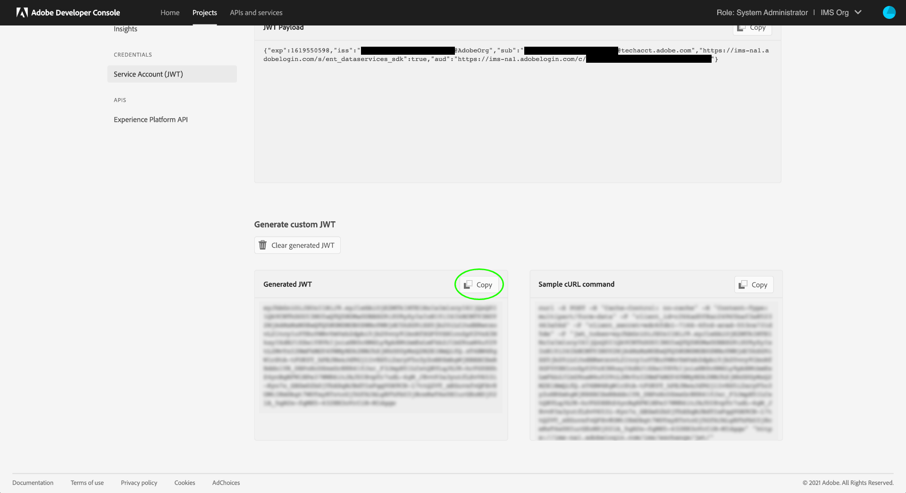

# Autenticación y acceso a las API de Experience Platform

Este documento proporciona un tutorial paso a paso para obtener acceso a una cuenta de desarrollador de Adobe Experience Platform con el fin de hacer llamadas a las API de Experience Platform. Al final de este tutorial, habrá generado o recopilado las siguientes credenciales que se requieren como encabezados en todas las llamadas a la API de Platform:

* `{ACCESS_TOKEN}`
* `{API_KEY}`
* `{ORG_ID}`

>[!TIP]
>
>Además de las tres credenciales anteriores, muchas API de plataforma también requieren una `{SANDBOX_NAME}` se proporcionará como encabezado. Consulte la [información general sobre zonas protegidas](../sandboxes/home.md) para obtener más información sobre los entornos limitados y [extremo de administración de zona protegida](/help/sandboxes/api/sandboxes.md#list) para obtener información sobre cómo enumerar los entornos limitados disponibles para su organización.

Para mantener la seguridad de sus aplicaciones y usuarios, todas las solicitudes a las API de Experience Platform deben autenticarse y autorizarse utilizando estándares como OAuth.

Este tutorial explica cómo recopilar las credenciales necesarias para autenticar las llamadas a la API de Platform, tal como se describe en el diagrama de flujo siguiente. Puede recopilar la mayoría de las credenciales necesarias en la configuración inicial única. Sin embargo, el token de acceso debe actualizarse cada 24 horas.


## Requisitos previos {#prerequisites}

Para realizar llamadas correctamente a las API de Experience Platform, debe tener lo siguiente:

* Una organización con acceso a Adobe Experience Platform.
* Un Admin Console que puede agregarle como desarrollador y como usuario de un perfil de producto.
* Un Experience Platform del sistema que puede otorgarle los controles de acceso basados en atributos necesarios para realizar operaciones de lectura o escritura en diferentes partes de Experience Platform a través de API.

También debe disponer de un Adobe ID para completar este tutorial. Si no tiene una Adobe ID, puede crearla siguiendo estos pasos:

1. Ir a [Consola de Adobe Developer](https://console.adobe.io).
2. Seleccionar **[!UICONTROL Crear una nueva cuenta]**.
3. Complete el proceso de registro.

## Obtener acceso de desarrollador y usuario para Experience Platform {#gain-developer-user-access}

Antes de crear integraciones en la consola de Adobe Developer, la cuenta debe tener permisos de desarrollador y usuario para un perfil de producto de Experience Platform en Adobe Admin Console.

### Obtener acceso de desarrollador {#gain-developer-access}

Contactar con un [!DNL Admin Console] administrador de su organización para agregarle como desarrollador a un perfil de producto de Experience Platform utilizando [[!DNL Admin Console]](https://adminconsole.adobe.com/). Consulte la [!DNL Admin Console] para obtener instrucciones específicas sobre cómo [administración del acceso de desarrollador para perfiles de producto](https://helpx.adobe.com/es/enterprise/admin-guide.html/enterprise/using/manage-developers.ug.html).

Una vez que se le asigne como desarrollador, puede empezar a crear integraciones en [Consola de Adobe Developer](https://www.adobe.com/go/devs_console_ui). Estas integraciones son una canalización de aplicaciones y servicios externos a las API de Adobe.

### Obtener acceso de usuario {#gain-user-access}

Su [!DNL Admin Console] El administrador también debe agregarle como usuario al mismo perfil de producto de. Con el acceso de los usuarios, puede ver en la interfaz de usuario el resultado de las operaciones de API que realiza.

Consulte la guía de [administración de grupos de usuarios en [!DNL Admin Console]](https://helpx.adobe.com/enterprise/admin-guide.html/enterprise/using/user-groups.ug.html) para obtener más información.

## Generación de una clave de API (ID de cliente) y un ID de organización {#generate-credentials}

>[!NOTE]
>
>Si está siguiendo este documento desde el [Guía de API de Privacy Service](../privacy-service/api/getting-started.md), ahora puede volver a esa guía para generar las credenciales de acceso exclusivas de [!DNL Privacy Service].

Una vez que se le haya concedido acceso de desarrollador y usuario a Platform mediante [!DNL Admin Console], el siguiente paso es generar su `{ORG_ID}` y `{API_KEY}` credenciales en la consola de Adobe Developer. Estas credenciales solo deben generarse una vez y pueden reutilizarse en futuras llamadas a la API de Platform.

### Añadir un Experience Platform a un proyecto {#add-platform-to-project}

Vaya a la [consola de desarrollador de Adobe](https://www.adobe.com/go/devs_console_ui) e inicie sesión con su Adobe ID. A continuación, siga los pasos descritos en el tutorial sobre [creación de un proyecto vacío](https://developer.adobe.com/developer-console/docs/guides/projects/projects-empty/) en la documentación de la consola de Adobe Developer.

Una vez creado un nuevo proyecto, seleccione **[!UICONTROL Añadir API]** en el **[!UICONTROL Resumen del proyecto]** pantalla.

>[!TIP]
>
>Si está aprovisionado para varias organizaciones, utilice el selector de organizaciones en la esquina superior derecha de la interfaz para asegurarse de que se encuentra en la organización que necesita.


Aparece la pantalla **[!UICONTROL Añadir una API]**. Seleccione el icono de producto de Adobe Experience Platform y, a continuación, elija **[!UICONTROL API de Experience Platform]** antes de seleccionar **[!UICONTROL Siguiente]**.


>[!TIP]
>
>Seleccione el **[!UICONTROL Ver documentos]** opción para navegar en una ventana separada del explorador para completar el [Documentación de referencia de la API de Experience Platform](https://developer.adobe.com/experience-platform-apis/).

### Seleccione el tipo de autenticación de servidor a servidor OAuth {#select-oauth-server-to-server}

A continuación, seleccione el tipo de autenticación para generar tokens de acceso y acceder a la API de Experience Platform.

>[!IMPORTANT]
>
>Seleccione el **[!UICONTROL Servidor a servidor OAuth]** ya que este será el único método admitido a partir de ahora. El **[!UICONTROL Cuenta de servicio (JWT)]** El método está obsoleto. Aunque las integraciones que utilizan el método de autenticación JWT seguirán funcionando hasta el 1 de enero de 2025, Adobe recomienda migrar las integraciones existentes al nuevo método de servidor a servidor OAuth antes de esa fecha. Obtenga más información en la sección [!BADGE Obsoleto]{type=negative}[Generar un token web JSON (JWT)](#jwt).


### Selección de los perfiles de producto para la integración {#select-product-profiles}

En el **[!UICONTROL Configurar API]** pantalla, seleccione **[!UICONTROL AEP-Default-All-Users]**.

<!--
Your integration's service account will gain access to granular features through the product profiles selected here.

-->

>[!IMPORTANT]
>
Para obtener acceso a determinadas funciones de Platform, también necesita que un administrador del sistema le conceda los permisos de control de acceso basados en atributos necesarios. Obtenga más información en esta sección [Obtenga los permisos de control de acceso basados en atributos necesarios](#get-abac-permissions).


Seleccionar **[!UICONTROL Guardar API configurada]** cuando esté listo.

En el tutorial de vídeo siguiente también se muestra una descripción detallada de los pasos descritos anteriormente para configurar una integración con la API de Experience Platform:

>[!VIDEO](https://video.tv.adobe.com/v/28832/?learn=on)

### Recopilar credenciales {#gather-credentials}

Una vez añadida la API al proyecto, la variable **[!UICONTROL API de Experience Platform]** Esta página del proyecto muestra las siguientes credenciales, necesarias en todas las llamadas a las API de Experience Platform:


* `{API_KEY}` ([!UICONTROL ID del cliente])
* `{ORG_ID}` ([!UICONTROL ID de organización])

<!--


<!--

In addition to the above credentials, you also need the generated **[!UICONTROL Client Secret]** for a future step. Select **[!UICONTROL Retrieve client secret]** to reveal the value, and then copy it for later use.


-->

## Generación de un token de acceso {#generate-access-token}

El siguiente paso es generar una `{ACCESS_TOKEN}` credenciales para su uso en llamadas a la API de Platform. A diferencia de los valores para `{API_KEY}` y `{ORG_ID}`, se debe generar un nuevo token cada 24 horas para seguir utilizando las API de Platform. Seleccionar **[!UICONTROL Generar token de acceso]**, como se muestra a continuación.


>[!TIP]
>
También puede utilizar un entorno y una colección de Postman para generar tokens de acceso. Para obtener más información, lea la sección sobre [uso de Postman para autenticar y probar llamadas a la API](#use-postman).

## [!BADGE Obsoleto]{type=negativo} Generar un token web JSON (JWT) {#jwt}

>[!WARNING]
>
El método JWT para generar tokens de acceso ha quedado obsoleto. Todas las integraciones nuevas deben crearse con la variable [método de autenticación de servidor a servidor OAuth](#select-oauth-server-to-server). Adobe también recomienda migrar las integraciones existentes al método OAuth. Lea la siguiente documentación importante:
> 
* [Guía de migración para aplicaciones de JWT a OAuth](https://developer.adobe.com/developer-console/docs/guides/authentication/ServerToServerAuthentication/migration/)
* [Guía de implementación para aplicaciones nuevas y antiguas con OAuth](https://developer.adobe.com/developer-console/docs/guides/authentication/ServerToServerAuthentication/implementation/)
* [Ventajas de utilizar el método de credenciales de servidor a servidor OAuth](https://developer.adobe.com/developer-console/docs/guides/authentication/ServerToServerAuthentication/migration/#why-oauth-server-to-server-credentials)

+++ Ver información obsoleta

El siguiente paso es generar un token web JSON (JWT) basado en las credenciales de la cuenta. Este valor se utiliza para generar su `{ACCESS_TOKEN}` para su uso en llamadas a la API de Platform, que deben regenerarse cada 24 horas.

>[!IMPORTANT]
>
Para los fines de este tutorial, los pasos siguientes describen cómo generar un JWT en Developer Console. Sin embargo, este método de generación solo debe utilizarse con fines de prueba y evaluación.
>
Para un uso normal, el JWT debe generarse automáticamente. Para obtener más información sobre cómo generar JWT mediante programación, consulte la [guía de autenticación de cuenta de servicio](https://www.adobe.io/developer-console/docs/guides/authentication/JWT/) en Adobe Developer.

Seleccionar **[!UICONTROL Cuenta de servicio (JWT)]** en el panel de navegación izquierdo, seleccione **[!UICONTROL Generar JWT]**.


En el cuadro de texto proporcionado en **[!UICONTROL Generar JWT personalizado]** A continuación, pegue el contenido de la clave privada que generó anteriormente al agregar la API de Platform a su cuenta de servicio. A continuación, seleccione **[!UICONTROL Generar token]**.


La página se actualiza para mostrar el JWT generado, junto con un ejemplo de comando cURL que le permite generar un token de acceso. Para los fines de este tutorial, seleccione **[!UICONTROL Copiar]** junto a **[!UICONTROL JWT generado]** para copiar el token en el portapapeles.



**Generación de un token de acceso**

Una vez que haya generado un JWT, puede utilizarlo en una llamada de API para generar su `{ACCESS_TOKEN}`. A diferencia de los valores para `{API_KEY}` y `{ORG_ID}`, se debe generar un nuevo token cada 24 horas para seguir utilizando las API de Platform.

**Solicitud**

La siguiente solicitud genera un nuevo `{ACCESS_TOKEN}` en función de las credenciales proporcionadas en la carga útil. Este extremo solo acepta datos de formulario como carga útil y, por lo tanto, debe recibir un `Content-Type` encabezado de `multipart/form-data`.

```shell
curl -X POST https://ims-na1.adobelogin.com/ims/exchange/jwt \
  -H 'Content-Type: multipart/form-data' \
  -F 'client_id={API_KEY}' \
  -F 'client_secret={SECRET}' \
  -F 'jwt_token={JWT}'
```

| Propiedad | Descripción |
| --- | --- |
| `{API_KEY}` | El `{API_KEY}` ([!UICONTROL ID de cliente]) que recuperó en un [paso anterior](#api-ims-secret). |
| `{SECRET}` | El secreto de cliente que recuperó en un [paso anterior](#api-ims-secret). |
| `{JWT}` | El JWT que ha generado en un [paso anterior](#jwt). |

>[!NOTE]
>
Puede utilizar la misma clave de API, secreto de cliente y JWT para generar un nuevo token de acceso para cada sesión. Esto le permite automatizar la generación de tokens de acceso en las aplicaciones.

**Respuesta**

```json
{
  "token_type": "bearer",
  "access_token": "{ACCESS_TOKEN}",
  "expires_in": 86399992
}
```

| Propiedad | Descripción |
| --- | --- |
| `token_type` | El tipo de token que se devuelve. Para tokens de acceso, este valor siempre es `bearer`. |
| `access_token` | El generado `{ACCESS_TOKEN}`. Este valor, con el prefijo `Bearer`, es obligatorio, ya que `Authentication` para todas las llamadas a la API de Platform. |
| `expires_in` | Número de milisegundos que restan hasta que caduque el token de acceso. Una vez que este valor alcanza 0, se debe generar un nuevo token de acceso para seguir utilizando las API de Platform. |

+++

## Probar credenciales de acceso {#test-credentials}

Una vez que haya recopilado las tres credenciales necesarias (token de acceso, clave de API e ID de organización) , puede intentar realizar la siguiente llamada de API. Esta llamada enumera todas las [!DNL Experience Data Model] (XDM) clases disponibles para su organización. Importe y ejecute la llamada en [Postman](#use-postman).

>[!BEGINSHADEBOX]

**Solicitud**

```SHELL
curl -X GET https://platform.adobe.io/data/foundation/schemaregistry/global/classes \
  -H 'Accept: application/vnd.adobe.xed-id+json' \
  -H 'Authorization: Bearer {{ACCESS_TOKEN}}' \
  -H 'x-api-key: {{API_KEY}}' \
  -H 'x-gw-ims-org-id: {{ORG_ID}}'
```

**Respuesta**

Si su respuesta es similar a la que se muestra a continuación, sus credenciales son válidas y funcionan. (Esta respuesta se ha truncado para el espacio).

```JSON
{
  "results": [
    {
        "title": "XDM ExperienceEvent",
        "$id": "https://ns.adobe.com/xdm/context/experienceevent",
        "meta:altId": "_xdm.context.experienceevent",
        "version": "1"
    },
    {
        "title": "XDM Individual Profile",
        "$id": "https://ns.adobe.com/xdm/context/profile",
        "meta:altId": "_xdm.context.profile",
        "version": "1"
    }
  ]
}
```

>[!ENDSHADEBOX]

>[!IMPORTANT]
>
Aunque la llamada anterior es suficiente para probar las credenciales de acceso, tenga en cuenta que no podrá acceder ni modificar varios recursos sin tener los permisos de control de acceso basados en atributos adecuados. Obtenga más información en la **Obtenga los permisos de control de acceso basados en atributos necesarios** más abajo.

## Obtenga los permisos de control de acceso basados en atributos necesarios {#get-abac-permissions}

Para acceder o modificar varios recursos dentro de Experience Platform, debe tener los permisos de control de acceso adecuados. Los administradores del sistema pueden concederle la [permisos que necesita](/help/access-control/ui/permissions.md). Obtenga más información en la sección acerca de [administrar credenciales de API para un rol](/help/access-control/abac/ui/permissions.md#manage-api-credentials-for-role).

Encontrará información detallada sobre cómo un administrador del sistema puede conceder los permisos necesarios para acceder a los recursos de la plataforma a través de la API en el siguiente tutorial de vídeo:

>[!VIDEO](https://video.tv.adobe.com/v/28832/?learn=on&t=159)

## Usar Postman para autenticar y probar llamadas a la API {#use-postman}

[Postman](https://www.postman.com/) es una herramienta popular que permite a los desarrolladores explorar y probar las API de RESTful. Puede utilizar las colecciones y los entornos de Experience Platform Postman para acelerar el trabajo con las API de Experience Platform. Más información sobre [uso de Postman en Experience Platform](/help/landing/postman.md) e introducción a colecciones y entornos.

Encontrará información detallada sobre el uso de Postman con colecciones y entornos de Experience Platform en los videotutoriales que se muestran a continuación:

**Descargar e importar un entorno de Postman para utilizarlo con las API de Experience Platform**

>[!VIDEO](https://video.tv.adobe.com/v/28832/?learn=on&t=106)

**Uso de una colección Postman para generar tokens de acceso**

Descargue la [Colección Postman del servicio Identity Management](https://github.com/adobe/experience-platform-postman-samples/tree/master/apis/ims) y vea el siguiente vídeo para aprender a generar tokens de acceso.

>[!VIDEO](https://video.tv.adobe.com/v/29698/?learn=on)

**Descargar colecciones de Postman de API de Experience Platform e interactuar con las API**

>[!VIDEO](https://video.tv.adobe.com/v/29704/?learn=on)

<!--
This [Medium post](https://medium.com/adobetech/using-postman-for-jwt-authentication-on-adobe-i-o-7573428ffe7f) describes how you can set up Postman to automatically perform JWT authentication and use it to consume Platform APIs.
-->

## Administradores del sistema: Conceder control de acceso a API y desarrollador con permisos de Experience Platform {#grant-developer-and-api-access-control}

>[!NOTE]
>
Solo los administradores del sistema tienen la capacidad de ver y administrar credenciales de API en Permisos.

Antes de crear integraciones en la consola de Adobe Developer, la cuenta debe tener permisos de desarrollador y usuario para un perfil de producto de Experience Platform en Adobe Admin Console.

### Añadir desarrolladores al perfil del producto {#add-developers-to-product-profile}

Vaya a [[!DNL Admin Console]](https://adminconsole.adobe.com/) e inicie sesión con su Adobe ID.

Seleccionar **[!UICONTROL Productos]**, luego seleccione **[!UICONTROL Adobe Experience Platform]** de la lista de productos.


Desde el **[!UICONTROL Perfiles de producto]** pestaña, seleccione **[!UICONTROL AEP-Default-All-Users]**. También puede utilizar la barra de búsqueda para buscar el perfil del producto introduciendo el nombre.


Seleccione el **[!UICONTROL Desarrolladores]** pestaña, luego seleccione **[!UICONTROL Agregar desarrollador]**.


Introduzca el del desarrollador **[!UICONTROL Correo electrónico o nombre de usuario]**. Un válido [!UICONTROL Correo electrónico o nombre de usuario] mostrará los detalles del desarrollador. Seleccione **[!UICONTROL Guardar]**.


El desarrollador se ha añadido correctamente y aparece en [!UICONTROL Desarrolladores] pestaña.


<!--

Commenting out this part since it duplicates information from the section Add Experience Platform to a project

### Set up an API

A developer can add and configure an API within a project in the Adobe Developer Console.

Select your project, then select **[!UICONTROL Add API]**.


In the **[!UICONTROL Add an API]** dialog box select **[!UICONTROL Adobe Experience Platform]**, then select **[!UICONTROL Experience Platform API]**.


In the **[!UICONTROL Configure API]** screen, select **[!UICONTROL AEP-Default-All-Users]**.

-->

### Asignar API a un rol

Un administrador del sistema puede asignar API a funciones en la interfaz de usuario del Experience Platform.

Seleccionar **[!UICONTROL Permisos]** y la función a la que desea agregar la API. Seleccione el **[!UICONTROL Credenciales de API]** pestaña, luego seleccione **[!UICONTROL Añadir credenciales de API]**.


Seleccione la API que desee añadir a la función y, a continuación, seleccione **[!UICONTROL Guardar]**.


Se le devolverá a la [!UICONTROL Credenciales de API] , donde se muestra la API recién agregada.


## Recursos adicionales {#additional-resources}

Consulte los recursos adicionales vinculados a continuación para obtener más ayuda sobre la introducción a las API de Experience Platform

* [Autenticación y acceso a las API de Experience Platform](https://experienceleague.adobe.com/docs/platform-learn/tutorials/platform-api-authentication.html?lang=es) página tutoriales de vídeo
* [Identity Management Service Postman Collection](https://github.com/adobe/experience-platform-postman-samples/tree/master/apis/ims) para generar tokens de acceso
* [Colecciones Postman de API de Experience Platform](https://github.com/adobe/experience-platform-postman-samples/tree/master/apis/experience-platform)

## Pasos siguientes {#next-steps}

Al leer este documento, ha recopilado y probado correctamente sus credenciales de acceso para las API de Platform. Ahora puede seguir junto con las llamadas de API de ejemplo proporcionadas a través de [documentación](../landing/documentation/overview.md).

Además de los valores de autenticación recopilados en este tutorial, muchas API de plataforma también requieren un `{SANDBOX_NAME}` se proporcionará como encabezado. Consulte la [información general sobre las zonas protegidas](../sandboxes/home.md) para obtener más detalles.