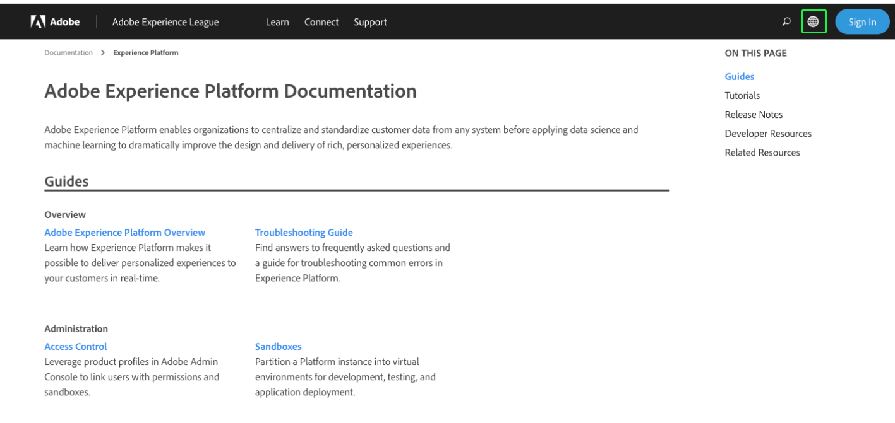

# Compatibilidad con el lenguaje de documentación del Experience Platform

La documentación de Adobe Experience Platform está disponible en varios idiomas.

Para cambiar el idioma en el que se presenta la documentación, seleccione el icono idioma en la barra de navegación superior.

Cuando se abra la lista desplegable de idiomas, elija el idioma en el que desea ver la documentación.

