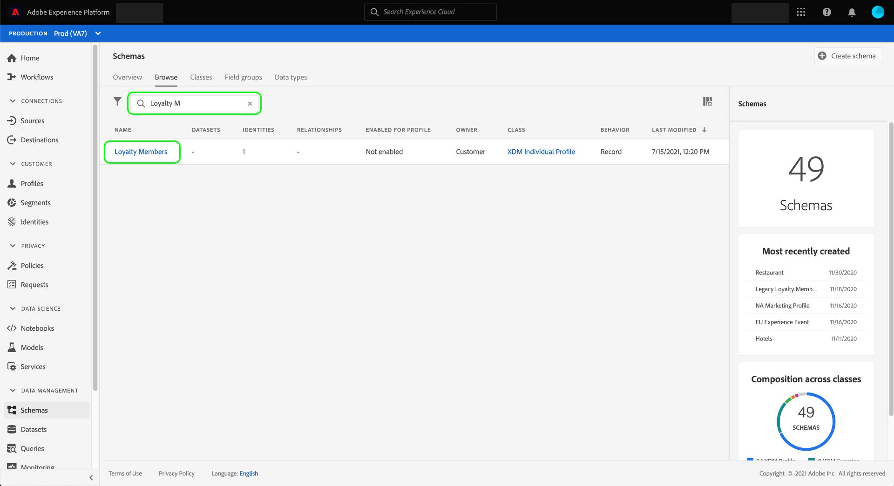

# Configuración de un conjunto de datos para capturar datos de consentimiento y preferencias

Para que Adobe Experience Platform pueda procesar sus datos de consentimiento/preferencias del cliente, esos datos deben enviarse a un conjunto de datos cuyo esquema contenga campos relacionados con consentimientos y otros permisos. Específicamente, este conjunto de datos debe basarse en la variable [!DNL XDM Individual Profile] y habilitada para su uso en [!DNL Real-Time Customer Profile].

Este documento proporciona los pasos para configurar un conjunto de datos para procesar los datos de consentimiento en el Experience Platform. Para obtener una descripción general del flujo de trabajo completo para procesar datos de consentimiento/preferencias en Platform, consulte la [información general sobre el procesamiento de consentimiento](./overview.md).

>[!IMPORTANT]
>
>Los ejemplos de esta guía utilizan un conjunto estandarizado de campos para representar los valores de consentimiento del cliente, tal como se definen en la variable [[!UICONTROL Detalles de consentimiento y preferencia] grupo de campos de esquema](../../../../xdm/field-groups/profile/consents.md). La estructura de estos campos pretende proporcionar un modelo de datos eficiente que abarque muchos casos de uso comunes de recopilación de consentimiento.
>
>Sin embargo, también puede definir sus propios grupos de campos para representar el consentimiento según sus propios modelos de datos. Consulte con su equipo legal para obtener la aprobación de un modelo de datos de consentimiento que se ajuste a sus necesidades comerciales, en función de las siguientes opciones:
>
>* El grupo de campo de consentimiento estandarizado
>* Un grupo de campos de consentimiento personalizado creado por su organización
>* Combinación del grupo de campos de consentimiento estandarizado y los campos adicionales proporcionados por un grupo de campos de consentimiento personalizado


## Requisitos previos

Este tutorial requiere una comprensión práctica de los siguientes componentes de Adobe Experience Platform:

* [Modelo de datos de experiencia (XDM)](../../../../xdm/home.md): El marco normalizado por el cual [!DNL Experience Platform] organiza los datos de experiencia del cliente.
   * [Aspectos básicos de la composición del esquema](../../../../xdm/schema/composition.md): Obtenga información sobre los componentes básicos de los esquemas XDM.
* [Perfil del cliente en tiempo real](../../../../profile/home.md): Consolida los datos de los clientes de fuentes diferentes en una vista completa y unificada al tiempo que ofrece una cuenta procesable y con marca de tiempo de cada interacción con los clientes.

>[!IMPORTANT]
>
>Este tutorial supone que se conoce el [!DNL Profile] esquema en Platform que desea utilizar para capturar información de atributos del cliente. Independientemente del método que utilice para recopilar datos de consentimiento, este esquema debe ser [habilitado para Perfil de cliente en tiempo real](../../../../xdm/ui/resources/schemas.md#profile). Además, la identidad principal del esquema no puede ser un campo directamente identificable que esté prohibido utilizar en publicidad basada en intereses, como una dirección de correo electrónico. Consulte a su asesor legal si no está seguro de qué campos están restringidos.

## [!UICONTROL Detalles de consentimiento y preferencia] estructura de grupo de campos {#structure}

La variable [!UICONTROL Detalles de consentimiento y preferencia] grupo de campos proporciona campos de consentimiento estandarizados a un esquema. Actualmente, este grupo de campos solo es compatible con esquemas basados en la variable [!DNL XDM Individual Profile] Clase .

El grupo de campos proporciona un único campo de tipo objeto, `consents`, cuyas subpropiedades capturan un conjunto de campos de consentimiento estandarizados. El siguiente JSON es un ejemplo del tipo de datos `consents` espera tras la ingesta de datos:

```json
{
  "consents": {
    "collect": {
      "val": "y",
    },
    "share": {
      "val": "y",
    },
    "personalize": {
      "content": {
        "val": "y"
      }
    },
    "marketing": {
      "preferred": "email",
      "any": {
        "val": "y"
      },
      "push": {
        "val": "n",
        "reason": "Too Frequent",
        "time": "2019-01-01T15:52:25+00:00"
      }
    },
    "idSpecific": {
      "email": {
        "jdoe@example.com": {
          "marketing": {
            "email": {
              "val": "n"
            }
          }
        }
      }
    }
  },
  "metadata": {
    "time": "2019-01-01T15:52:25+00:00"
  }
}
```

>[!NOTE]
>
>Para obtener más información sobre la estructura y el significado de las subpropiedades en `consents`, consulte la descripción general de la variable [[!UICONTROL Detalles de consentimiento y preferencia] grupo de campos](../../../../xdm/field-groups/profile/consents.md).

## Agregue los grupos de campos necesarios al [!DNL Profile] esquema {#add-field-group}

Para recopilar datos de consentimiento mediante el estándar de Adobe, debe tener un esquema habilitado para el perfil que contenga los dos grupos de campos siguientes:

* [!UICONTROL Detalles de consentimiento y preferencia]
* [!UICONTROL Mapa de identidades] (obligatorio si se utiliza Platform Web o Mobile SDK para enviar señales de consentimiento)

En la interfaz de usuario de Platform, seleccione **[!UICONTROL Esquemas]** en el panel de navegación izquierdo, seleccione **[!UICONTROL Examinar]** para mostrar una lista de esquemas existentes. Desde aquí, seleccione el nombre del [!DNL Profile]esquema habilitado que desea agregar campos de consentimiento. Las capturas de pantalla de esta sección utilizan el esquema &quot;Miembros de lealtad&quot; integrado en la variable [tutorial de creación de esquemas](../../../../xdm/tutorials/create-schema-ui.md) como ejemplo.



>[!TIP]
>
>Puede utilizar las capacidades de búsqueda y filtrado del espacio de trabajo para encontrar el esquema más fácil. Consulte la guía de [exploración de recursos XDM](../../../../xdm/ui/explore.md) para obtener más información.

La variable [!DNL Schema Editor] , mostrando la estructura del esquema en el lienzo. En el lado izquierdo del lienzo, seleccione **[!UICONTROL Agregar]** en el **[!UICONTROL Grupos de campo]** para obtener más información.


La variable **[!UICONTROL Agregar grupo de campos]** se abre. Desde aquí, seleccione **[!UICONTROL Detalles de consentimiento y preferencia]** de la lista. Si lo desea, puede utilizar la barra de búsqueda para reducir los resultados y localizar más fácilmente el grupo de campos.


A continuación, busque la **[!UICONTROL Mapa de identidades]** grupo de campos de la lista y selecciónelo también. Una vez que ambos grupos de campos se enumeran en el carril derecho, seleccione **[!UICONTROL Agregar grupos de campos]**.


El lienzo vuelve a aparecer y muestra que la variable `consents` y `identityMap` se han agregado campos a la estructura del esquema. Si necesita campos de consentimiento y preferencias adicionales que no captura el grupo de campos estándar, consulte la sección del apéndice en [adición de campos de consentimiento y preferencia personalizados al esquema](#custom-consent). De lo contrario, seleccione **[!UICONTROL Guardar]** para finalizar los cambios en el esquema.


>[!IMPORTANT]
>
>Si va a crear un esquema nuevo o está editando un esquema existente que no se haya habilitado para Perfil, debe [habilitar el esquema para Perfil](../../../../xdm/ui/resources/schemas.md#profile) antes de guardar.

Si el esquema que ha editado lo utiliza el [!UICONTROL Conjunto de datos de perfil] especificado en el conjunto de datos del SDK web de Platform, ese conjunto de datos ahora incluirá los nuevos campos de consentimiento. Ahora puede volver a la [guía de procesamiento de consentimiento](./overview.md#merge-policies) para continuar el proceso de configuración de Experience Platform para procesar los datos de consentimiento. Si no ha creado un conjunto de datos para este esquema, siga los pasos de la siguiente sección.

## Crear un conjunto de datos basado en el esquema de consentimiento {#dataset}

Una vez que haya creado un esquema con campos de consentimiento, debe crear un conjunto de datos que, en última instancia, incorpore los datos de consentimiento de los clientes. Este conjunto de datos debe estar habilitado para [!DNL Real-Time Customer Profile].

Para empezar, seleccione **[!UICONTROL Conjuntos de datos]** en el panel de navegación izquierdo, seleccione **[!UICONTROL Crear conjunto de datos]** en la esquina superior derecha.


En la página siguiente, seleccione **[!UICONTROL Crear conjunto de datos a partir del esquema]**.


La variable **[!UICONTROL Crear conjunto de datos a partir del esquema]** flujo de trabajo, empezando por el **[!UICONTROL Seleccionar esquema]** paso a paso. En la lista proporcionada, busque uno de los esquemas de consentimiento que creó anteriormente. Opcionalmente, puede utilizar la barra de búsqueda para reducir los resultados y localizar el esquema con mayor facilidad. Seleccione el botón de opción situado junto al esquema deseado y, a continuación, seleccione **[!UICONTROL Siguiente]** para continuar.


La variable **[!UICONTROL Configurar el conjunto de datos]** aparece. Proporcione un nombre y una descripción únicos y fácilmente identificables para el conjunto de datos antes de seleccionar **[!UICONTROL Finalizar]**.


Aparecerá la página de detalles del conjunto de datos recién creado. Si el conjunto de datos se basa en el esquema de series temporales, el proceso finaliza. Si el conjunto de datos se basa en el esquema de registro, el paso final del proceso es habilitar el conjunto de datos para utilizarlo en [!DNL Real-Time Customer Profile].

En el carril derecho, seleccione la opción **[!UICONTROL Perfil]** alternar.


Finalmente, seleccione **[!UICONTROL Habilitar]** en la ventana de confirmación para habilitar el esquema de [!DNL Profile].


El conjunto de datos ahora se guarda y se habilita para su uso en [!DNL Profile]. Si planea utilizar el SDK web de Platform para enviar datos de consentimiento al perfil, debe seleccionar este conjunto de datos como el [!UICONTROL Conjunto de datos de perfil] al configurar su [datastream](../../../../edge/datastreams/overview.md).

## Pasos siguientes

Al seguir este tutorial, ha agregado campos de consentimiento a un [!DNL Profile]Esquema habilitado para , cuyo conjunto de datos se utilizará para introducir datos de consentimiento mediante el SDK web de Platform o la ingesta directa de XDM.

Ahora puede volver a la [información general sobre el procesamiento de consentimiento](./overview.md#merge-policies) para continuar configurando Experience Platform para procesar los datos de consentimiento.

## Apéndice

La siguiente sección contiene información adicional sobre la creación de un conjunto de datos para ingerir datos de preferencias y consentimiento del cliente.

### Añadir campos de consentimiento y preferencia personalizados al esquema {#custom-consent}

Si necesita capturar señales de consentimiento adicionales fuera de las representadas por el estándar [!UICONTROL Detalles de consentimiento y preferencia] grupo de campos, puede utilizar componentes XDM personalizados para mejorar el esquema de consentimiento para adaptarlo a sus necesidades comerciales particulares. En esta sección se describen los principios básicos de cómo personalizar el esquema de consentimiento para introducir estas señales en Perfil.

>[!IMPORTANT]
>
>Los SDK web y móviles de Platform no admiten campos personalizados en sus comandos de cambio de consentimiento. Actualmente, la única forma de ingerir campos de consentimiento personalizados en Perfil es mediante [ingesta por lotes](../../../../ingestion/batch-ingestion/overview.md) o [conexión de origen](../../../../sources/home.md).

Se recomienda encarecidamente que utilice el [!UICONTROL Detalles de consentimiento y preferencia] grupo de campos como línea de base para la estructura de los datos de consentimiento y añada campos adicionales según sea necesario, en lugar de intentar crear toda la estructura desde cero.

Para añadir campos personalizados a la estructura de un grupo de campos estándar, primero debe crear un grupo de campos personalizado. Después de agregar la variable [!UICONTROL Detalles de consentimiento y preferencia] grupo de campos al esquema, seleccione el **plus (+)** en el **[!UICONTROL Grupos de campo]** y, a continuación, seleccione **[!UICONTROL Crear nuevo grupo de campos]**. Proporcione un nombre y una descripción opcional para el grupo de campos y, a continuación, seleccione **[!UICONTROL Agregar grupo de campos]**.


La variable [!DNL Schema Editor] vuelve a aparecer con el nuevo grupo de campos personalizados seleccionado en el carril izquierdo. En el lienzo, aparecen controles que permiten agregar campos personalizados a la estructura del esquema. Para añadir un nuevo campo de consentimiento o preferencia, seleccione la opción **plus (+)** junto al icono `consents` objeto.


Aparece un nuevo campo dentro de la variable `consents` objeto. Dado que está agregando un campo personalizado a un objeto XDM estándar, el nuevo campo se crea en un objeto que tiene un espacio de nombres con su ID de inquilino.


En el carril derecho debajo de **[!UICONTROL Propiedades del campo]**, proporcione un nombre y una descripción para el campo. Al seleccionar el campo **[!UICONTROL Tipo]**, debe utilizar el tipo de datos estándar adecuado para un campo de consentimiento o preferencia personalizado:

* [[!UICONTROL Campo de consentimiento genérico]](../../../../xdm/data-types/consent-field.md)
* [[!UICONTROL Campo de preferencia de marketing genérico]](../../../../xdm/data-types/marketing-field.md)
* [[!UICONTROL Campo de preferencia de marketing genérico con suscripciones]](../../../../xdm/data-types/marketing-field-subscriptions.md)
* [[!UICONTROL Campo de preferencia de personalización genérica]](../../../../xdm/data-types/personalization-field.md)

Cuando termine, seleccione **[!UICONTROL Aplicar]**.


El campo de consentimiento o preferencia se agrega a la estructura del esquema. Tenga en cuenta que [!UICONTROL Ruta] mostrado en el carril derecho contiene la variable `_tenantId` espacio de nombres. Este área de nombres debe incluirse siempre que haga referencia a la ruta a este campo en las operaciones de datos.


Siga los pasos anteriores para seguir agregando los campos de consentimiento y preferencias que necesite. Cuando termine, seleccione **[!UICONTROL Guardar]** para confirmar los cambios.

Si no ha creado un conjunto de datos para este esquema, continúe con la sección de [creación de un conjunto de datos](#dataset).
