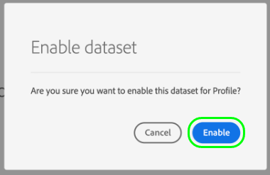

# Configurar un conjunto de datos para capturar datos de consentimiento y preferencia

Para que Adobe Experience Platform procese los datos de consentimiento/preferencia del cliente, esos datos deben enviarse a un conjunto de datos cuyo esquema contenga campos relacionados con consentimientos y otros permisos. Específicamente, este conjunto de datos debe estar basado en la clase [!DNL XDM Individual Profile] y habilitado para su uso en [!DNL Real-Time Customer Profile].

Este documento proporciona información sobre los pasos necesarios para configurar un conjunto de datos para procesar los datos de consentimiento en Experience Platform. Para obtener una descripción general del flujo de trabajo completo para procesar los datos de consentimiento/preferencia en Platform, consulte la [descripción general del procesamiento del consentimiento](./overview.md).

>[!IMPORTANT]
>
>Los ejemplos de esta guía utilizan un conjunto estandarizado de campos para representar los valores de consentimiento del cliente, tal como se definen en el grupo de campos de esquema [[!UICONTROL Detalles de consentimiento y preferencia]](../../../../xdm/field-groups/profile/consents.md). La estructura de estos campos pretende proporcionar un modelo de datos eficiente para cubrir muchos casos de uso comunes de recopilación de consentimiento.
>
>Sin embargo, también puede definir sus propios grupos de campos para representar el consentimiento según sus propios modelos de datos. Consulte con su equipo legal para obtener la aprobación de un modelo de datos de consentimiento que se ajuste a sus necesidades comerciales, en función de las siguientes opciones:
>
>* El grupo de campos de consentimiento estandarizado
>* Un grupo de campos de consentimiento personalizado creado por su organización
>* Una combinación del grupo de campos de consentimiento estandarizado y los campos adicionales proporcionados por un grupo de campos de consentimiento personalizado

## Requisitos previos

Este tutorial requiere una comprensión práctica de los siguientes componentes de Adobe Experience Platform:

* [Modelo de datos de experiencia (XDM)](../../../../xdm/home.md): El marco de trabajo estandarizado mediante el cual [!DNL Experience Platform] organiza los datos de experiencia del cliente.
   * [Aspectos básicos de la composición de esquemas](../../../../xdm/schema/composition.md): Obtenga información acerca de los componentes básicos de los esquemas XDM.
* [Perfil del cliente en tiempo real](../../../../profile/home.md): consolida los datos de clientes de diferentes fuentes en una vista completa y unificada, a la vez que ofrece una cuenta procesable con marca de tiempo de cada interacción con el cliente.

>[!IMPORTANT]
>
>En este tutorial se da por hecho que conoce el esquema [!DNL Profile] de Platform que desea utilizar para capturar información de atributos del cliente. Independientemente del método que utilice para recopilar datos de consentimiento, este esquema debe estar [habilitado para el perfil del cliente en tiempo real](../../../../xdm/ui/resources/schemas.md#profile). Además, la identidad principal del esquema no puede ser un campo directamente identificable que esté prohibido utilizar en publicidad basada en intereses, como una dirección de correo electrónico. Consulte a su asesor legal si no está seguro de qué campos están restringidos.

## [!UICONTROL Detalles de consentimiento y preferencia] estructura de grupo de campos {#structure}

El grupo de campos [!UICONTROL Detalles de consentimiento y preferencia] proporciona campos de consentimiento estandarizados para un esquema. Actualmente, este grupo de campos solo es compatible con esquemas basados en la clase [!DNL XDM Individual Profile].

El grupo de campos proporciona un único campo de tipo de objeto, `consents`, cuyas subpropiedades capturan un conjunto de campos de consentimiento estandarizados. El siguiente JSON es un ejemplo del tipo de datos que `consents` espera tras la ingesta de datos:

```json
{
  "consents": {
    "collect": {
      "val": "y",
    },
    "share": {
      "val": "y",
    },
    "personalize": {
      "content": {
        "val": "y"
      }
    },
    "marketing": {
      "preferred": "email",
      "any": {
        "val": "y"
      },
      "push": {
        "val": "n",
        "reason": "Too Frequent",
        "time": "2019-01-01T15:52:25+00:00"
      }
    },
    "idSpecific": {
      "email": {
        "jdoe@example.com": {
          "marketing": {
            "email": {
              "val": "n"
            }
          }
        }
      }
    }
  },
  "metadata": {
    "time": "2019-01-01T15:52:25+00:00"
  }
}
```

>[!NOTE]
>
>Para obtener más información acerca de la estructura y el significado de las subpropiedades de `consents`, vea la descripción general del grupo de campos [[!UICONTROL Detalles de consentimiento y preferencia]](../../../../xdm/field-groups/profile/consents.md).

## Agregar grupos de campos requeridos al esquema [!DNL Profile] {#add-field-group}

Para recopilar datos de consentimiento mediante el estándar de Adobe, debe tener un esquema habilitado para el perfil que contenga los dos grupos de campos siguientes:

* [[!UICONTROL Detalles de consentimiento y preferencia]](../../../../xdm/field-groups/profile/consents.md)
* [[!UICONTROL IdentityMap]](../../../../xdm/field-groups/profile/identitymap.md) (necesario si se usa el SDK web o móvil de Platform para enviar señales de consentimiento)

En la interfaz de usuario de Platform, seleccione **[!UICONTROL Esquemas]** en el panel de navegación izquierdo y, a continuación, seleccione la pestaña **[!UICONTROL Examinar]** para mostrar una lista de los esquemas existentes. Aquí, seleccione el nombre del esquema habilitado para [!DNL Profile] al que desea agregar campos de consentimiento. Las capturas de pantalla de esta sección utilizan el esquema &quot;Miembros fieles&quot; integrado en el [tutorial de creación de esquemas](../../../../xdm/tutorials/create-schema-ui.md) como ejemplo.


>[!TIP]
>
>Puede utilizar las funcionalidades de búsqueda y filtrado del espacio de trabajo para facilitar la búsqueda del esquema. Consulte la guía [Exploración de recursos XDM](../../../../xdm/ui/explore.md) para obtener más información.

Aparece [!DNL Schema Editor] que muestra la estructura del esquema en el lienzo. En el lado izquierdo del lienzo, seleccione **[!UICONTROL Agregar]** en la sección **[!UICONTROL Grupos de campos]**.


Aparecerá el cuadro de diálogo **[!UICONTROL Agregar grupo de campos]**. Aquí, seleccione **[!UICONTROL Detalles de consentimiento y preferencia]** de la lista. Si lo desea, puede utilizar la barra de búsqueda para reducir los resultados y localizar más fácilmente el grupo de campos.


A continuación, busque el grupo de campos **[!UICONTROL IdentityMap]** en la lista y selecciónelo también. Una vez que ambos grupos de campos estén enumerados en el carril derecho, seleccione **[!UICONTROL Agregar grupos de campos]**.


El lienzo vuelve a aparecer y muestra que los campos `consents` y `identityMap` se han agregado a la estructura de esquema. Si necesita campos de consentimiento y preferencia adicionales no capturados por el grupo de campos estándar, consulte la sección del apéndice sobre [agregar campos de consentimiento y preferencia personalizados al esquema](#custom-consent). De lo contrario, seleccione **[!UICONTROL Guardar]** para finalizar los cambios en el esquema.


>[!IMPORTANT]
>
>Si está creando un esquema nuevo o editando uno existente que no se ha habilitado para el perfil, debe [habilitar el esquema para el perfil](../../../../xdm/ui/resources/schemas.md#profile) antes de guardar.

Si el esquema que editó lo usa el [!UICONTROL conjunto de datos de perfil] especificado en su flujo de datos del SDK web de Platform, ese conjunto de datos ahora incluirá los nuevos campos de consentimiento. Ahora puede volver a la [guía de procesamiento de consentimiento](./overview.md#merge-policies) para continuar con el proceso de configuración del Experience Platform para procesar los datos de consentimiento. Si no ha creado ningún conjunto de datos para este esquema, siga los pasos de la sección siguiente.

## Cree un conjunto de datos basado en el esquema de consentimiento {#dataset}

Una vez creado un esquema con campos de consentimiento, debe crear un conjunto de datos que, en última instancia, introduzca los datos de consentimiento de los clientes. Este conjunto de datos debe estar habilitado para [!DNL Real-Time Customer Profile].

Para empezar, seleccione **[!UICONTROL Conjuntos de datos]** en el panel de navegación izquierdo y, a continuación, seleccione **[!UICONTROL Crear conjunto de datos]** en la esquina superior derecha.


En la página siguiente, seleccione **[!UICONTROL Crear conjunto de datos a partir del esquema]**.


Aparece el flujo de trabajo **[!UICONTROL Crear conjunto de datos a partir del esquema]**, comenzando en el paso **[!UICONTROL Seleccionar esquema]**. En la lista proporcionada, busque uno de los esquemas de consentimiento que creó anteriormente. Si lo desea, puede utilizar la barra de búsqueda para reducir los resultados y localizar el esquema con mayor facilidad. Seleccione el botón de opción situado junto al esquema deseado y, a continuación, seleccione **[!UICONTROL Siguiente]** para continuar.


Aparecerá el paso **[!UICONTROL Configurar conjunto de datos]**. Proporcione un nombre y una descripción únicos y fácilmente identificables para el conjunto de datos antes de seleccionar **[!UICONTROL Finalizar]**.


Aparecerá la página de detalles del conjunto de datos recién creado. Si el conjunto de datos se basa en el esquema de series temporales, el proceso se completa. Si el conjunto de datos se basa en el esquema de registros, el paso final del proceso es habilitar el conjunto de datos para utilizarlo en [!DNL Real-Time Customer Profile].

En el carril derecho, seleccione la opción **[!UICONTROL Perfil]**.


Finalmente, seleccione **[!UICONTROL Habilitar]** en la ventana emergente de confirmación para habilitar el esquema para [!DNL Profile].



El conjunto de datos ahora está guardado y habilitado para su uso en [!DNL Profile]. Si planea utilizar el SDK web de Platform para enviar datos de consentimiento al perfil, debe seleccionar este conjunto de datos como [!UICONTROL Conjunto de datos del perfil] al configurar su [secuencia de datos](../../../../datastreams/overview.md).

## Pasos siguientes

Al seguir este tutorial, ha agregado campos de consentimiento a un esquema habilitado para [!DNL Profile], cuyo conjunto de datos se utilizará para introducir datos de consentimiento mediante el SDK web de Platform o la ingesta directa de XDM.

Ahora puede volver a la [descripción general del procesamiento del consentimiento](./overview.md#merge-policies) para seguir configurando el Experience Platform y procesar los datos de consentimiento.

## Apéndice

La siguiente sección contiene información adicional sobre la creación de un conjunto de datos para la ingesta de datos de consentimiento y preferencia del cliente.

### Añadir campos de consentimiento y preferencia personalizados al esquema {#custom-consent}

Si necesita capturar señales de consentimiento adicionales fuera de las representadas por el grupo de campos [!UICONTROL Detalles de consentimiento y preferencia] estándar, puede usar componentes XDM personalizados para mejorar el esquema de consentimiento y adaptarlo a sus necesidades comerciales particulares. Esta sección describe los principios básicos de cómo personalizar el esquema de consentimiento para introducir estas señales en el perfil.

>[!IMPORTANT]
>
>Los SDK web y móvil de Platform no admiten campos personalizados en sus comandos de cambio de consentimiento. Actualmente, la única manera de introducir campos de consentimiento personalizados en el perfil es mediante [ingesta por lotes](../../../../ingestion/batch-ingestion/overview.md) o una [conexión de origen](../../../../sources/home.md).

Se recomienda encarecidamente que use el grupo de campos [!UICONTROL Detalles de consentimiento y preferencia] como línea de base para la estructura de los datos de consentimiento y agregue campos adicionales según sea necesario, en lugar de intentar crear toda la estructura desde cero.

Para agregar campos personalizados a la estructura de un grupo de campos estándar, primero debe crear un grupo de campos personalizados. Después de agregar el grupo de campos [!UICONTROL Detalles de consentimiento y preferencia] al esquema, seleccione el icono **más (+)** en la sección **[!UICONTROL Grupos de campos]** y, a continuación, seleccione **[!UICONTROL Crear nuevo grupo de campos]**. Proporcione un nombre y una descripción opcional para el grupo de campos y, a continuación, seleccione **[!UICONTROL Agregar grupo de campos]**.


[!DNL Schema Editor] vuelve a aparecer con el nuevo grupo de campos personalizados seleccionado en el carril izquierdo. En el lienzo, aparecen controles que le permiten agregar campos personalizados a la estructura del esquema. Para agregar un nuevo campo de consentimiento o preferencia, seleccione el icono **más (+)** junto al objeto `consents`.


Aparece un nuevo campo dentro del objeto `consents`. Dado que está agregando un campo personalizado a un objeto XDM estándar, el nuevo campo se crea bajo un objeto que tiene un espacio de nombres en el ID de inquilino.


En el carril derecho bajo **[!UICONTROL Propiedades del campo]**, proporcione un nombre y una descripción para el campo. Al seleccionar **[!UICONTROL Type]** del campo, debe utilizar el tipo de datos estándar adecuado para un campo de preferencia o consentimiento personalizado:

* [[!UICONTROL Campo de consentimiento genérico]](../../../../xdm/data-types/consent-field.md)
* [[!UICONTROL Campo de preferencias de marketing genéricas]](../../../../xdm/data-types/marketing-field.md)
* [[!UICONTROL Campo de preferencia de marketing genérico con suscripciones]](../../../../xdm/data-types/marketing-field-subscriptions.md)
* [[!UICONTROL Campo de preferencias genéricas de Personalization]](../../../../xdm/data-types/personalization-field.md)

Cuando termine, seleccione **[!UICONTROL Aplicar]**.


El campo de consentimiento o preferencia se agrega a la estructura de esquema. Tenga en cuenta que la [!UICONTROL ruta] mostrada en el carril derecho contiene el área de nombres `_tenantId`. Este área de nombres debe incluirse siempre que se haga referencia a la ruta de este campo en las operaciones de datos.


Siga los pasos anteriores para seguir agregando los campos de consentimiento y preferencia que necesita. Cuando termine, selecciona **[!UICONTROL Guardar]** para confirmar los cambios.

Si no ha creado ningún conjunto de datos para este esquema, continúe con la sección de [creación de un conjunto de datos](#dataset).
