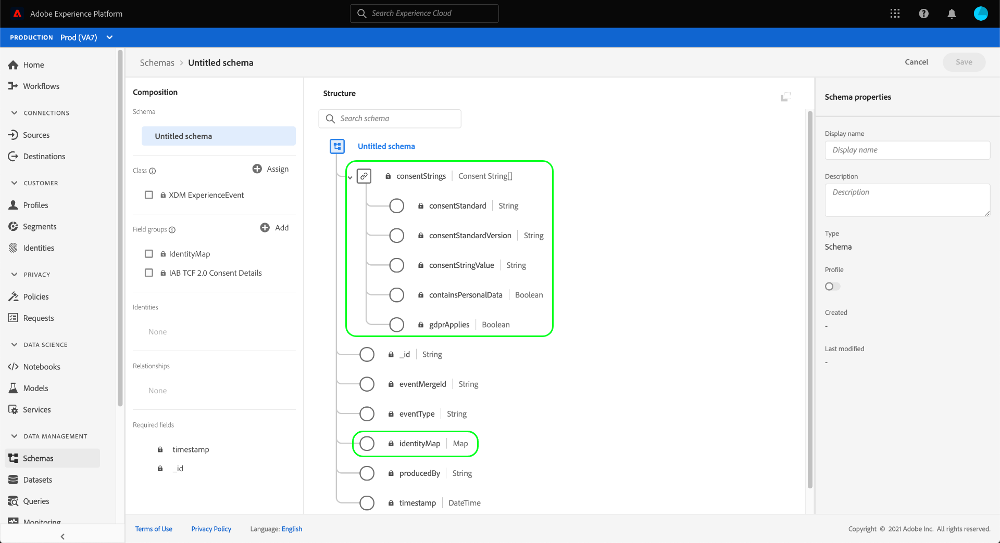

# Crear conjuntos de datos para capturar datos de consentimiento TCF 2.0 de IAB

Para que Adobe Experience Platform pueda procesar los datos de consentimiento del cliente de acuerdo con la IAB [!DNL Transparency & Consent Framework] (TCF) 2.0, esos datos deben enviarse a conjuntos de datos cuyos esquemas contengan campos de consentimiento TCF 2.0.

Específicamente, se requieren dos conjuntos de datos para capturar los datos de consentimiento TCF 2.0:

* Un conjunto de datos basado en la clase [!DNL XDM Individual Profile], habilitado para utilizarse en [!DNL Real-time Customer Profile].
* Un conjunto de datos basado en la clase [!DNL XDM ExperienceEvent].

Este documento proporciona los pasos para configurar estos dos conjuntos de datos a fin de recopilar datos de consentimiento TCF 2.0 de IAB. Para obtener una visión general del flujo de trabajo completo para configurar las operaciones de datos de la Plataforma para TCF 2.0, consulte la [información general de cumplimiento TCF 2.0 de IAB](./overview.md).

## Requisitos previos

Este tutorial requiere un conocimiento práctico de los siguientes componentes de Adobe Experience Platform:

* [Modelo de datos de experiencia (XDM)](../../../../xdm/home.md): Marco normalizado por el cual se  [!DNL Experience Platform] organizan los datos de experiencia del cliente.
   * [Conceptos básicos de la composición](../../../../xdm/schema/composition.md) de esquemas: Obtenga información sobre los componentes básicos de los esquemas XDM.
* [Adobe Experience Platform Identity Service](../../../../identity-service/home.md): Le permite unir las identidades de los clientes desde sus distintas fuentes de datos entre dispositivos y sistemas.
   * [Áreas de nombres](../../../../identity-service/namespaces.md) de identidad: Los datos de identidad del cliente deben proporcionarse en una Área de nombres de identidad específica reconocida por Identity Service.
* [Perfil](../../../../profile/home.md) del cliente en tiempo real: Aprovecha  [!DNL Identity Service] para permitirle crear perfiles detallados de clientes a partir de sus conjuntos de datos en tiempo real. [!DNL Real-time Customer Profile] extrae datos del Data Lake y persiste en los perfiles de los clientes en su propio almacén de datos independiente.

## [!UICONTROL Detalles de ] privacidad Estructura de mezcla  {#structure}

La combinación [!UICONTROL Detalles de privacidad] proporciona los campos de consentimiento del cliente que se requieren para la compatibilidad con TCF 2.0. Hay dos versiones de esta mezcla: una compatible con la clase [!DNL XDM Individual Profile] y la otra con la clase [!DNL XDM ExperienceEvent].

Las secciones siguientes explican la estructura de cada una de estas mezclas, incluyendo los datos que esperan durante la ingestión.

### Mezcla de perfil {#profile-mixin}

Para esquemas basados en [!DNL XDM Individual Profile], la combinación [!UICONTROL Detalles de privacidad] proporciona un solo campo de tipo de mapa, `xdm:identityPrivacyInfo`, que asigna las identidades de los clientes a sus preferencias de consentimiento TCF. El siguiente JSON es un ejemplo del tipo de datos que `xdm:identityPrivacyInfo` espera tras la ingestión de datos:

```json
{
  "xdm:identityPrivacyInfo": {
      "ECID": {
        "13782522493631189": {
          "xdm:identityIABConsent": {
            "xdm:consentTimestamp": "2020-04-11T05:05:05Z",
            "xdm:consentString": {
              "xdm:consentStandard": "IAB TCF",
              "xdm:consentStandardVersion": "2.0",
              "xdm:consentStringValue": "BObdrPUOevsguAfDqFENCNAAAAAmeAAA.PVAfDObdrA.DqFENCAmeAENCDA",
              "xdm:gdprApplies": true,
              "xdm:containsPersonalData": false
            }
          }
        }
      }
    }
}
```

Como se muestra en el ejemplo, cada clave de nivel raíz de `xdm:identityPrivacyInfo` corresponde a una Área de nombres de identidad reconocida por Identity Service. A su vez, cada propiedad de Área de nombres debe tener al menos una subpropiedad cuya clave coincida con el valor de identidad correspondiente del cliente para esa Área de nombres. En este ejemplo, el cliente se identifica con un valor de ID de Experience Cloud (`ECID`) de `13782522493631189`.

>[!NOTE]
>
>Aunque en el ejemplo anterior se utiliza un solo par Área de nombres/valor para representar la identidad del cliente, puede agregar claves adicionales para otras Áreas de nombres y cada Área de nombres puede tener varios valores de identidad, cada uno con su propio conjunto de preferencias de consentimiento TCF.

Dentro del objeto de valor de identidad hay un solo campo, `xdm:identityIABConsent`. Este objeto captura los valores de consentimiento TCF del cliente para la Área de nombres de identidad y el valor especificados. Las subpropiedades contenidas en este campo se enumeran a continuación:

| Propiedad | Descripción |
| --- | --- |
| `xdm:consentTimestamp` | Marca de hora [ISO 8601](https://www.ietf.org/rfc/rfc3339.txt) del momento en que cambiaron los valores de consentimiento TCF. |
| `xdm:consentString` | Objeto que contiene los datos de consentimiento actualizados del cliente y otra información contextual. Consulte la sección sobre [propiedades de cadena de consentimiento](#consent-string) para obtener información sobre las subpropiedades requeridas de este objeto. |

### Mezcla de evento {#event-mixin}

Para esquemas basados en [!DNL XDM ExperienceEvent], la combinación [!UICONTROL Detalles de privacidad] proporciona un solo campo de tipo de matriz: `xdm:consentStrings`. Cada elemento de esta matriz debe ser un objeto que contenga las propiedades necesarias para una cadena de consentimiento TCF, similar al campo `xdm:consentString` de la mezcla de perfil. Para obtener más información sobre estas subpropiedades, consulte la [siguiente sección](#consent-string).

```json
{
  "xdm:consentStrings": [
    {
      "xdm:consentStandard": "IAB TCF",
      "xdm:consentStandardVersion": "2.0",
      "xdm:consentStringValue": "BObdrPUOevsguAfDqFENCNAAAAAmeAAA.PVAfDObdrA.DqFENCAmeAENCDA",
      "xdm:gdprApplies": true,
      "xdm:containsPersonalData": false
    }
  ]
}
```

### Propiedades de cadena de consentimiento {#consent-string}

Ambas versiones de la combinación [!UICONTROL Detalles de privacidad] requieren al menos un objeto que capture los campos necesarios que describan la cadena de consentimiento TCF para el cliente. Estas propiedades se explican a continuación:

| Propiedad | Descripción |
| --- | --- |
| `xdm:consentStandard` | El marco de consentimiento al que se aplican los datos. Para el cumplimiento de TCF, el valor debe ser `IAB TCF`. |
| `xdm:consentStandardVersion` | Número de versión del marco de consentimiento indicado por `xdm:consentStandard`. Para la compatibilidad con TCF 2.0, el valor debe ser `2.0`. |
| `xdm:consentStringValue` | Cadena de consentimiento generada por la plataforma de gestión de consentimiento (CMP) en función de la configuración seleccionada por el cliente. |
| `xdm:gdprApplies` | Un valor booleano que indica si el RGPD se aplica o no a este cliente. El valor debe establecerse en `true` para que se pueda aplicar TCF 2.0. El valor predeterminado es `false` si no se incluye. |
| `xdm:containsPersonalData` | Un valor booleano que indica si la actualización de consentimiento contiene o no datos personales. El valor predeterminado es `false` si no se incluye. |

## Crear esquemas de consentimiento del cliente {#create-schemas}

Para crear conjuntos de datos que capten datos de consentimiento, primero debe crear esquemas XDM en los que basar dichos conjuntos de datos.

En la interfaz de usuario de la plataforma, seleccione **[!UICONTROL Esquemas]** en el panel de navegación izquierdo para abrir el espacio de trabajo [!UICONTROL Esquemas]. Desde aquí, siga los pasos de las secciones siguientes para crear cada esquema necesario.

>[!NOTE]
>
>Si ya tiene esquemas XDM que desea utilizar para capturar datos de consentimiento, puede editar esos esquemas en lugar de crear otros nuevos. Sin embargo, si un esquema existente se ha habilitado para su uso en el Perfil del cliente en tiempo real, su identidad principal no puede ser un campo de identificación directa que esté prohibido de usar en publicidad basada en intereses, como una dirección de correo electrónico. Consulte a su asesor legal si no está seguro de qué campos están restringidos.
>
>Además, al editar esquemas existentes, solo se pueden realizar cambios aditivos (no de ruptura). Consulte la sección sobre los [principios de la evolución del esquema](../../../../xdm/schema/composition.md#evolution) para obtener más información.

### Crear un esquema de consentimiento basado en registros {#profile-schema}

En el espacio de trabajo **[!UICONTROL Esquemas]**, seleccione **[!UICONTROL Crear esquema]** y, a continuación, elija **[!UICONTROL Perfil individual XDM]** en la lista desplegable.


Aparece el [!DNL Schema Editor], que muestra la estructura del esquema en el lienzo. Utilice el carril derecho para proporcionar un nombre y una descripción para el esquema y, a continuación, seleccione **[!UICONTROL Añadir]** en la sección **[!UICONTROL Mezclas]** en la parte izquierda del lienzo.


Aparece el cuadro de diálogo **[!UICONTROL Añadir mezcla]**. Desde aquí, seleccione **[!UICONTROL Detalles de privacidad]** en la lista. Opcionalmente, puede utilizar la barra de búsqueda para reducir los resultados y encontrar la mezcla más fácilmente. Una vez seleccionada la mezcla, seleccione **[!UICONTROL Añadir mezcla]**.


El lienzo vuelve a aparecer y muestra que el campo `identityPrivacyInfo` se ha agregado a la estructura de esquema.


A partir de aquí, repita los pasos anteriores para añadir las siguientes mezclas adicionales al esquema:

* [!UICONTROL IdentityMap]
* [!UICONTROL Región de captura de datos para Perfil]
* [!UICONTROL Detalles demográficos]
* [!UICONTROL Detalles de contacto personal]


Si está editando un esquema existente que ya se ha habilitado para su uso en [!DNL Real-time Customer Profile], seleccione **[!UICONTROL Guardar]** para confirmar los cambios antes de pasar a la sección de [creación de un conjunto de datos basado en su esquema de consentimiento](#dataset). Si va a crear un nuevo esquema, siga los pasos descritos en la subsección siguiente.

#### Habilitar el esquema para utilizarlo en [!DNL Real-time Customer Profile]

Para que Platform pueda asociar los datos de consentimiento que recibe con perfiles específicos del cliente, el esquema de consentimiento debe estar habilitado para su uso en [!DNL Real-time Customer Profile].

>[!NOTE]
>
>El esquema de ejemplo que se muestra en esta sección utiliza su campo `identityMap` como identidad principal. Si desea establecer otro campo como identidad principal, asegúrese de que está utilizando un identificador indirecto, como un ID de cookie, y no un campo directamente identificable que está prohibido usar en publicidad basada en intereses, como una dirección de correo electrónico. Consulte a su asesor legal si no está seguro de qué campos están restringidos.
>
>Los pasos para establecer un campo de identidad principal para un esquema se encuentran en el [tutorial de creación de esquema](../../../../xdm/tutorials/create-schema-ui.md#identity-field).

Para habilitar el esquema para [!DNL Profile], seleccione el nombre del esquema en el carril izquierdo para abrir el cuadro de diálogo **[!UICONTROL Propiedades del Esquema]** en el carril derecho. Desde aquí, seleccione el botón de alternancia **[!UICONTROL Perfil]**.


Aparece una ventana emergente que indica que falta una identidad principal. Seleccione la casilla de verificación para utilizar una identidad principal alternativa, ya que la identidad principal estará contenida en el campo `identityMap`.


Finalmente, seleccione **[!UICONTROL Guardar]** para confirmar los cambios.


### Crear un esquema de consentimiento basado en series temporales {#event-schema}

En el espacio de trabajo **[!UICONTROL Esquemas]**, seleccione **[!UICONTROL Crear esquema]** y, a continuación, elija **[!UICONTROL XDM ExperienceEvent]** en la lista desplegable.


Aparece el [!DNL Schema Editor], que muestra la estructura del esquema en el lienzo. Utilice el carril derecho para proporcionar un nombre y una descripción para el esquema y, a continuación, seleccione **[!UICONTROL Añadir]** en la sección **[!UICONTROL Mezclas]** en la parte izquierda del lienzo.


Aparece el cuadro de diálogo **[!UICONTROL Añadir mezcla]**. Desde aquí, seleccione **[!UICONTROL Detalles de privacidad]** en la lista. Opcionalmente, puede utilizar la barra de búsqueda para reducir los resultados y encontrar la mezcla más fácilmente. Una vez que haya elegido una mezcla, seleccione **[!UICONTROL Añadir mezcla]**.


El lienzo vuelve a aparecer y muestra que la matriz `consentStrings` se ha agregado a la estructura de esquema.



A partir de aquí, repita los pasos anteriores para añadir las siguientes mezclas adicionales al esquema:

* [!UICONTROL IdentityMap]
* [!UICONTROL Detalles del entorno]
* [!UICONTROL Detalles web]
* [!UICONTROL Detalles de implementación]

Una vez agregadas las mezclas, termine seleccionando **[!UICONTROL Guardar]**.


## Cree datasets basados en sus esquemas de consentimiento {#datasets}

Para cada uno de los esquemas requeridos descritos anteriormente, debe crear un conjunto de datos que, en última instancia, ingrese los datos de consentimiento de los clientes. El conjunto de datos basado en el esquema de registros debe habilitarse para [!DNL Real-time Customer Profile], mientras que el conjunto de datos basado en el esquema de la serie temporal **no debe** habilitarse para [!DNL Profile].

Para comenzar, seleccione **[!UICONTROL Conjuntos de datos]** en el panel de navegación izquierdo y, a continuación, seleccione **[!UICONTROL Crear conjunto de datos]** en la esquina superior derecha.


En la página siguiente, seleccione **[!UICONTROL Crear conjunto de datos a partir de esquema]**.


Aparece el flujo de trabajo **[!UICONTROL Crear conjunto de datos a partir de esquema]**, comenzando en el paso **[!UICONTROL Seleccionar esquema]**. En la lista proporcionada, busque uno de los esquemas de consentimiento que creó anteriormente. De forma opcional, puede utilizar la barra de búsqueda para reducir los resultados y encontrar el esquema más fácilmente. Seleccione el botón de radio junto al esquema deseado y, a continuación, seleccione **[!UICONTROL Siguiente]** para continuar.


Aparece el paso **[!UICONTROL Configurar conjunto de datos]**. Proporcione un nombre y una descripción únicos y fáciles de identificar para el conjunto de datos antes de seleccionar **[!UICONTROL Finalizar]**.


Se abre la página de detalles del conjunto de datos recién creado. Si el conjunto de datos se basa en el esquema de la serie temporal, el proceso se completa. Si el conjunto de datos se basa en su esquema de registros, el paso final del proceso es habilitar el conjunto de datos para su uso en [!DNL Real-time Customer Profile].

En el carril derecho, seleccione el conmutador **[!UICONTROL Perfil]** y, a continuación, seleccione **[!UICONTROL Habilitar]** en la ventana emergente de confirmación para habilitar el esquema para [!DNL Profile].


Siga los pasos anteriores de nuevo para crear el otro conjunto de datos necesario para la compatibilidad con TCF 2.0.

## Pasos siguientes

Siguiendo este tutorial, ha creado dos conjuntos de datos que ahora se pueden utilizar para recopilar datos de consentimiento del cliente:

* Conjunto de datos basado en registros que se habilita para su uso en el Perfil del cliente en tiempo real.
* Conjunto de datos basado en series temporales que no está habilitado para [!DNL Profile].

Ahora puede volver a la [información general de IAB TCF 2.0](./overview.md#merge-policies) para continuar el proceso de configuración de la plataforma para el cumplimiento de TCF 2.0.