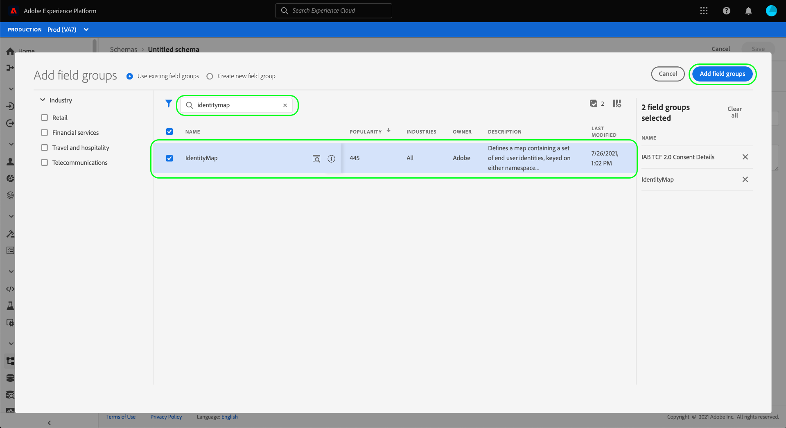
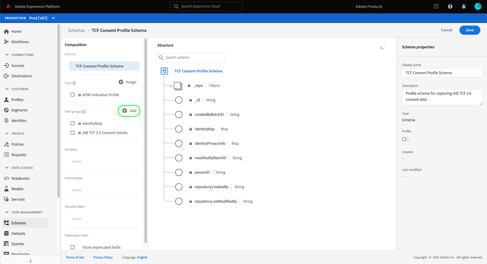

# Crear conjuntos de datos para capturar datos de consentimiento de IAB TCF 2.0

Para que Adobe Experience Platform procese los datos de consentimiento del cliente de acuerdo con IAB [!DNL Transparency & Consent Framework] (TCF) 2.0, esos datos deben enviarse a conjuntos de datos cuyos esquemas contengan campos de consentimiento TCF 2.0.

Específicamente, se requieren dos conjuntos de datos para capturar datos de consentimiento TCF 2.0:

* Un conjunto de datos basado en la clase [!DNL XDM Individual Profile], habilitado para su uso en [!DNL Real-Time Customer Profile].
* Un conjunto de datos basado en la clase [!DNL XDM ExperienceEvent].

>[!IMPORTANT]
>
>Platform solo aplica las cadenas TCF recopiladas en el conjunto de datos de perfil individual. Aunque todavía se necesita un conjunto de datos de ExperienceEvent para crear un conjunto de datos como parte de este flujo de trabajo, solo es necesario introducir datos en el conjunto de datos de perfil. El conjunto de datos de ExperienceEvent se puede seguir utilizando si desea rastrear eventos de cambio de consentimiento a lo largo del tiempo, pero estos valores no se utilizan en al aplicar en la activación de segmentos.

Este documento proporciona información sobre los pasos necesarios para configurar estos dos conjuntos de datos. Para obtener una descripción general del flujo de trabajo completo para configurar las operaciones de datos de Platform para TCF 2.0, consulte la [descripción general del cumplimiento de IAB TCF 2.0](./overview.md).

## Requisitos previos

Este tutorial requiere una comprensión práctica de los siguientes componentes de Adobe Experience Platform:

* [Modelo de datos de experiencia (XDM)](../../../../xdm/home.md): El marco de trabajo estandarizado mediante el cual [!DNL Experience Platform] organiza los datos de experiencia del cliente.
   * [Aspectos básicos de la composición de esquemas](../../../../xdm/schema/composition.md): Obtenga información acerca de los componentes básicos de los esquemas XDM.
* [Servicio de identidad de Adobe Experience Platform](../../../../identity-service/home.md): le permite vincular las identidades de los clientes de diferentes fuentes de datos entre dispositivos y sistemas.
   * [Áreas de nombres de identidad](../../../../identity-service/features/namespaces.md): los datos de identidad del cliente deben proporcionarse en un área de nombres de identidad específica reconocida por el servicio de identidad.
* [Perfil del cliente en tiempo real](../../../../profile/home.md): aprovecha [!DNL Identity Service] para permitirle crear perfiles de clientes detallados a partir de sus conjuntos de datos en tiempo real. [!DNL Real-Time Customer Profile] extrae datos del lago de datos y conserva los perfiles de los clientes en su propio almacén de datos independiente.

## Grupos de campo de TCF 2.0 {#field-groups}

El grupo de campos de esquema [!UICONTROL Detalles de consentimiento TCF de IAB 2.0] proporciona campos de consentimiento de cliente necesarios para la compatibilidad con TCF 2.0. Existen dos versiones de este grupo de campos: una compatible con la clase [!DNL XDM Individual Profile] y otra con la clase [!DNL XDM ExperienceEvent].

Las secciones siguientes explican la estructura de cada uno de estos grupos de campos, incluidos los datos que esperan durante la ingesta.

### Grupo de campos de perfil {#profile-field-group}

Para esquemas basados en [!DNL XDM Individual Profile], el grupo de campos [!UICONTROL Detalles de consentimiento TCF de IAB 2.0] proporciona un único campo de tipo de asignación, `identityPrivacyInfo`, que asigna identidades de clientes a sus preferencias de consentimiento TCF. Este grupo de campos debe incluirse en un esquema basado en registros que esté habilitado para el Perfil del cliente en tiempo real a fin de que se aplique automáticamente.

Consulte la [guía de referencia](../../../../xdm/field-groups/profile/iab.md) para este grupo de campos para obtener más información sobre su estructura y caso de uso.

### Grupo de campos de evento {#event-field-group}

Si desea rastrear los eventos de cambio de consentimiento a lo largo del tiempo, puede agregar el grupo de campos [!UICONTROL Detalles de consentimiento TCF de IAB 2.0] a su esquema [!UICONTROL XDM ExperienceEvent].

Si no planea rastrear los eventos de cambio de consentimiento a lo largo del tiempo, no es necesario incluir este grupo de campos en el esquema de eventos. Al aplicar automáticamente los valores de consentimiento TCF, el Experience Platform solo utiliza la información de consentimiento más reciente introducida en el [grupo de campos de perfil](#profile-field-group). Los valores de consentimiento capturados por los eventos no participan en los flujos de trabajo de aplicación automática.

Consulte la [guía de referencia](../../../../xdm/field-groups/event/iab.md) para este grupo de campos para obtener más información sobre su estructura y caso de uso.

## Creación de esquemas de consentimiento del cliente {#create-schemas}

Para crear conjuntos de datos que capturan datos de consentimiento, primero debe crear esquemas XDM en los que basar esos conjuntos de datos.

Como se mencionó en la sección anterior, se requiere un esquema que utilice la clase [!UICONTROL XDM Individual Profile] para aplicar el consentimiento en los flujos de trabajo de la plataforma descendente. Si desea rastrear los cambios de consentimiento a lo largo del tiempo, también puede crear un esquema independiente basado en [!UICONTROL XDM ExperienceEvent]. Ambos esquemas deben contener un campo `identityMap` y un grupo de campos TCF 2.0 adecuado.

En la interfaz de usuario de Platform, seleccione **[!UICONTROL Esquemas]** en el panel de navegación izquierdo para abrir el área de trabajo [!UICONTROL Esquemas]. A partir de aquí, siga los pasos de las secciones siguientes para crear cada esquema requerido.

>[!NOTE]
>
>Si tiene esquemas XDM existentes que desee utilizar para capturar datos de consentimiento en su lugar, puede editar esos esquemas en lugar de crear nuevos. Sin embargo, si se ha habilitado un esquema existente para utilizarlo en el perfil del cliente en tiempo real, su identidad principal no puede ser un campo directamente identificable que esté prohibido usar en publicidad basada en intereses, como una dirección de correo electrónico. Consulte a su asesor legal si no está seguro de qué campos están restringidos.
>
>Además, al editar esquemas existentes, solo se pueden realizar cambios aditivos (sin interrupciones). Consulte la sección sobre los [principios de la evolución del esquema](../../../../xdm/schema/composition.md#evolution) para obtener más información.

### Creación de un esquema de consentimiento de perfil {#profile-schema}

Seleccione **[!UICONTROL Crear esquema]** y, a continuación, elija **[!UICONTROL Perfil XDM individual]** en el menú desplegable.

Aparece el cuadro de diálogo **[!UICONTROL Agregar grupos de campos]**, que le permite empezar a agregar grupos de campos al esquema de inmediato. Desde aquí, seleccione **[!UICONTROL Detalles de consentimiento TCF 2.0 de IAB]** en la lista. Si lo desea, puede utilizar la barra de búsqueda para reducir los resultados y localizar más fácilmente el grupo de campos.

A continuación, busque el grupo de campos **[!UICONTROL IdentityMap]** en la lista y selecciónelo también. Una vez que ambos grupos de campos estén enumerados en el carril derecho, seleccione **[!UICONTROL Agregar grupos de campos]**.

El lienzo vuelve a aparecer y muestra que los campos `identityPrivacyInfo` y `identityMap` se han agregado a la estructura de esquema.

Antes de agregar más campos al esquema, seleccione el campo raíz para mostrar **[!UICONTROL Propiedades del esquema]** en el carril derecho, donde puede proporcionar un nombre y una descripción para el esquema.

Después de proporcionar un nombre y una descripción, si lo desea, puede agregar más campos al esquema seleccionando **[!UICONTROL Agregar]** en la sección **[!UICONTROL Grupos de campos]** a la izquierda del lienzo.

Si está editando un esquema existente que ya se ha habilitado para usarlo en [!DNL Real-Time Customer Profile], seleccione **[!UICONTROL Guardar]** para confirmar los cambios antes de pasar a la sección [creación de un conjunto de datos basado en su esquema de consentimiento](#dataset). Si está creando un nuevo esquema, siga los pasos descritos en la subsección siguiente.

#### Habilitar el esquema para utilizarlo en [!DNL Real-Time Customer Profile]

Para que Platform asocie los datos de consentimiento que recibe a perfiles de clientes específicos, el esquema de consentimiento debe habilitarse para su uso en [!DNL Real-Time Customer Profile].

>[!NOTE]
>
>El esquema de ejemplo que se muestra en esta sección utiliza su campo `identityMap` como identidad principal. Si desea establecer otro campo como identidad principal, asegúrese de que está utilizando un identificador indirecto como un ID de cookie y no un campo directamente identificable que esté prohibido utilizar en publicidad basada en intereses, como una dirección de correo electrónico. Consulte a su asesor legal si no está seguro de qué campos están restringidos.
>
>Los pasos para establecer un campo de identidad principal para un esquema se encuentran en la guía de la interfaz de usuario de [[!UICONTROL Esquemas]](../../../../xdm/ui/fields/identity.md).

Para habilitar el esquema para [!DNL Profile], seleccione el nombre del esquema en el carril izquierdo para abrir la sección **[!UICONTROL Propiedades del esquema]**. Aquí, seleccione el botón de alternancia **[!UICONTROL Perfil]**.

Aparece una ventana emergente que indica que falta la identidad principal. Seleccione la casilla de verificación para utilizar una identidad principal alternativa, ya que la identidad principal se incluirá en el campo `identityMap`.

Finalmente, selecciona **[!UICONTROL Guardar]** para confirmar los cambios.

### Creación de un esquema de consentimiento de evento {#event-schema}

>[!NOTE]
>
>Los esquemas de consentimiento de eventos solo se utilizan para rastrear eventos de cambio de consentimiento a lo largo del tiempo y no participan en flujos de trabajo de aplicación descendentes. Si no desea rastrear los cambios de consentimiento a lo largo del tiempo, puede pasar a la siguiente sección sobre [creación de conjuntos de datos de consentimiento](#datasets).

En el área de trabajo **[!UICONTROL Esquemas]**, seleccione **[!UICONTROL Crear esquema]** y, a continuación, elija **[!UICONTROL XDM ExperienceEvent]** en el menú desplegable.

Aparecerá el cuadro de diálogo **[!UICONTROL Agregar grupos de campos]**. Desde aquí, seleccione **[!UICONTROL Detalles de consentimiento TCF 2.0 de IAB]** en la lista. Si lo desea, puede utilizar la barra de búsqueda para reducir los resultados y localizar más fácilmente el grupo de campos.

A continuación, busque el grupo de campos **[!UICONTROL IdentityMap]** en la lista y selecciónelo también. Una vez que ambos grupos de campos estén enumerados en el carril derecho, seleccione **[!UICONTROL Agregar grupos de campos]**.

El lienzo vuelve a aparecer y muestra que los campos `consentStrings` y `identityMap` se han agregado a la estructura de esquema.

Antes de agregar más campos al esquema, seleccione el campo raíz para mostrar **[!UICONTROL Propiedades del esquema]** en el carril derecho, donde puede proporcionar un nombre y una descripción para el esquema.

Después de proporcionar un nombre y una descripción, si lo desea, puede agregar más campos al esquema seleccionando **[!UICONTROL Agregar]** en la sección **[!UICONTROL Grupos de campos]** a la izquierda del lienzo.

Una vez agregados los grupos de campos que necesita, termine seleccionando **[!UICONTROL Guardar]**.

## Creación de conjuntos de datos basados en los esquemas de consentimiento {#datasets}

Para cada uno de los esquemas requeridos descritos anteriormente, debe crear un conjunto de datos que, en última instancia, introduzca los datos de consentimiento de los clientes. El conjunto de datos basado en el esquema de registro debe estar habilitado para [!DNL Real-Time Customer Profile], mientras que el conjunto de datos basado en el esquema de serie temporal **no debe estar habilitado para**.[!DNL Profile]

Para empezar, seleccione **[!UICONTROL Conjuntos de datos]** en el panel de navegación izquierdo y, a continuación, seleccione **[!UICONTROL Crear conjunto de datos]** en la esquina superior derecha.

En la página siguiente, seleccione **[!UICONTROL Crear conjunto de datos a partir del esquema]**.

Aparece el flujo de trabajo **[!UICONTROL Crear conjunto de datos a partir del esquema]**, comenzando en el paso **[!UICONTROL Seleccionar esquema]**. En la lista proporcionada, busque uno de los esquemas de consentimiento que creó anteriormente. Si lo desea, puede utilizar la barra de búsqueda para reducir los resultados y localizar el esquema con mayor facilidad. Seleccione el botón de opción situado junto al esquema deseado y, a continuación, seleccione **[!UICONTROL Siguiente]** para continuar.

Aparecerá el paso **[!UICONTROL Configurar conjunto de datos]**. Proporcione un nombre y una descripción únicos y fácilmente identificables para el conjunto de datos antes de seleccionar **[!UICONTROL Finalizar]**.

Aparecerá la página de detalles del conjunto de datos recién creado. Si el conjunto de datos se basa en el esquema de series temporales, el proceso se completa. Si el conjunto de datos se basa en el esquema de registros, el paso final del proceso es habilitar el conjunto de datos para utilizarlo en [!DNL Real-Time Customer Profile].

En el carril derecho, seleccione la opción **[!UICONTROL Perfil]** y, a continuación, seleccione **[!UICONTROL Habilitar]** en la ventana emergente de confirmación para habilitar el esquema para [!DNL Profile].

Vuelva a seguir los pasos anteriores para crear un conjunto de datos basado en eventos si ha creado un esquema para él.

## Pasos siguientes

Al seguir este tutorial, ha creado al menos un conjunto de datos que ahora se puede utilizar para recopilar datos de consentimiento del cliente:

* Un conjunto de datos basado en registros que está habilitado para su uso en el Perfil del cliente en tiempo real. **(obligatorio)**
* Un conjunto de datos basado en series de tiempo que no está habilitado para [!DNL Profile]. (Opcional)

Ahora puede volver a la [descripción general de IAB TCF 2.0](./overview.md#merge-policies) para continuar con el proceso de configuración de Platform para el cumplimiento de TCF 2.0.
