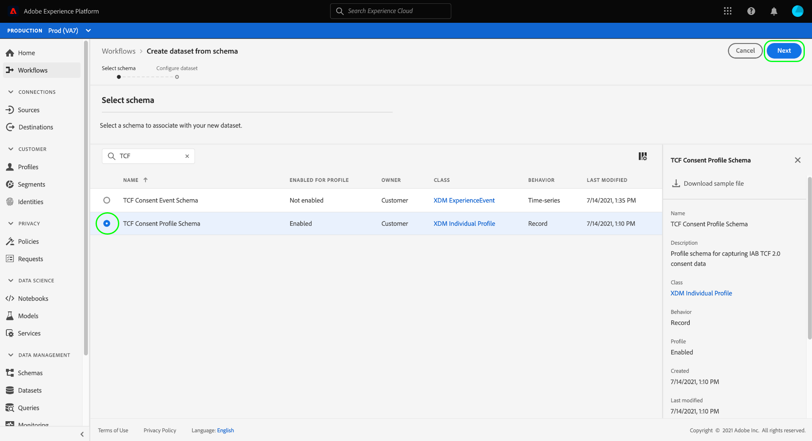

# Crear conjuntos de datos para capturar datos de consentimiento TCF de IAB 2.0

Para que Adobe Experience Platform procese los datos de consentimiento del cliente de acuerdo con la IAB [!DNL Transparency & Consent Framework] (TCF) 2.0, esos datos deben enviarse a conjuntos de datos cuyos esquemas contienen campos de consentimiento TCF 2.0.

Específicamente, se requieren dos conjuntos de datos para capturar los datos de consentimiento de TCF 2.0:

* Un conjunto de datos basado en la variable [!DNL XDM Individual Profile] clase, habilitada para usar en [!DNL Real-Time Customer Profile].
* Un conjunto de datos basado en la variable [!DNL XDM ExperienceEvent] Clase .

>[!IMPORTANT]
>
>La plataforma solo aplica las cadenas TCF recopiladas en el conjunto de datos de perfil individual. Aunque se sigue necesitando un conjunto de datos de ExperienceEvent para crear un conjunto de datos como parte de este flujo de trabajo, solo es necesario introducir datos en el conjunto de datos del perfil. El conjunto de datos de ExperienceEvent se puede seguir utilizando si desea rastrear eventos de cambio de consentimiento a lo largo del tiempo, pero estos valores no se utilizan en al aplicar la activación de segmentos.

Este documento proporciona los pasos para configurar estos dos conjuntos de datos. Para obtener una descripción general del flujo de trabajo completo para configurar las operaciones de datos de Platform para TCF 2.0, consulte la [Información general sobre la conformidad con IAB TCF 2.0](./overview.md).

## Requisitos previos

Este tutorial requiere una comprensión práctica de los siguientes componentes de Adobe Experience Platform:

* [Modelo de datos de experiencia (XDM)](../../../../xdm/home.md): El marco normalizado por el cual [!DNL Experience Platform] organiza los datos de experiencia del cliente.
   * [Aspectos básicos de la composición del esquema](../../../../xdm/schema/composition.md): Obtenga información sobre los componentes básicos de los esquemas XDM.
* [Servicio de identidad de Adobe Experience Platform](../../../../identity-service/home.md): Permite unir las identidades de los clientes desde las distintas fuentes de datos entre dispositivos y sistemas.
   * [Espacios de nombres de identidad](../../../../identity-service/namespaces.md): Los datos de identidad del cliente deben proporcionarse en un área de nombres de identidad específica reconocida por el servicio de identidad.
* [Perfil del cliente en tiempo real](../../../../profile/home.md): Aprovechamientos [!DNL Identity Service] para permitirle crear perfiles de cliente detallados a partir de sus conjuntos de datos en tiempo real. [!DNL Real-Time Customer Profile] extrae datos del lago de datos y mantiene los perfiles de cliente en su propio almacén de datos independiente.

## Grupos de campos de TCF 2.0 {#field-groups}

La variable [!UICONTROL Detalles de consentimiento TCF 2.0 de IAB] grupo de campos de esquema proporciona campos de consentimiento del cliente que son necesarios para la compatibilidad con TCF 2.0. Existen dos versiones de este grupo de campos: uno compatible con el [!DNL XDM Individual Profile] y la otra con la clase [!DNL XDM ExperienceEvent] Clase .

Las secciones siguientes explican la estructura de cada uno de estos grupos de campos, incluidos los datos que esperan durante la ingesta.

### Grupo de campos de perfil {#profile-field-group}

Para esquemas basados en [!DNL XDM Individual Profile], el [!UICONTROL Detalles de consentimiento TCF 2.0 de IAB] grupo de campos proporciona un único campo de tipo asignación, `identityPrivacyInfo`, que asigna las identidades de los clientes a sus preferencias de consentimiento TCF. Este grupo de campos debe incluirse en un esquema basado en registros que esté habilitado para Perfil del cliente en tiempo real para que se realice la aplicación automática.

Consulte la [guía de referencia](../../../../xdm/field-groups/profile/iab.md) para que este grupo de campos obtenga más información sobre su estructura y su caso de uso.

### Grupo de campos de evento {#event-field-group}

Si desea rastrear eventos de cambio de consentimiento con el paso del tiempo, puede agregar la variable [!UICONTROL Detalles de consentimiento TCF 2.0 de IAB] grupo de campos a su [!UICONTROL XDM ExperienceEvent] esquema.

Si no planea rastrear los eventos de cambio de consentimiento a lo largo del tiempo, no necesita incluir este grupo de campos en el esquema de evento. Al aplicar automáticamente los valores de consentimiento TCF, el Experience Platform solo utiliza la información de consentimiento más reciente introducida en la variable [grupo de campos de perfil](#profile-field-group). Los valores de consentimiento capturados por eventos no participan en los flujos de trabajo de aplicación automática.

Consulte la [guía de referencia](../../../../xdm/field-groups/event/iab.md) para este grupo de campos para obtener más información sobre su estructura y caso de uso.

## Creación de esquemas de consentimiento del cliente {#create-schemas}

Para crear conjuntos de datos que capturen datos de consentimiento, primero debe crear esquemas XDM en los que basar esos conjuntos de datos.

Como se mencionó en la sección anterior, un esquema que utiliza la variable [!UICONTROL Perfil individual XDM] se requiere para aplicar el consentimiento en los flujos de trabajo de Platform descendentes. También puede crear un esquema independiente basado en [!UICONTROL XDM ExperienceEvent] si desea rastrear los cambios de consentimiento con el paso del tiempo. Ambos esquemas deben contener un `identityMap` y un grupo de campos TCF 2.0 apropiado.

En la interfaz de usuario de Platform, seleccione **[!UICONTROL Esquemas]** en el panel de navegación izquierdo para abrir [!UICONTROL Esquemas] espacio de trabajo. A partir de aquí, siga los pasos de las secciones siguientes para crear cada esquema necesario.

>[!NOTE]
>
>Si tiene esquemas XDM existentes que desea utilizar para capturar datos de consentimiento en su lugar, puede editar esos esquemas en lugar de crear otros nuevos. Sin embargo, si se ha habilitado un esquema existente para utilizarlo en el perfil del cliente en tiempo real, su identidad principal no puede ser un campo directamente identificable que esté prohibido utilizar en publicidad basada en intereses, como una dirección de correo electrónico. Consulte a su asesor legal si no está seguro de qué campos están restringidos.
>
>Además, al editar esquemas existentes, solo se pueden realizar cambios aditivos (no de ruptura). Consulte la sección sobre [principios de evolución del esquema](../../../../xdm/schema/composition.md#evolution) para obtener más información.

### Creación de un esquema de consentimiento de perfil {#profile-schema}

Select **[!UICONTROL Crear esquema]** y, a continuación, elija **[!UICONTROL Perfil individual XDM]** en el menú desplegable.

La variable **[!UICONTROL Agregar grupos de campos]** , lo que le permite empezar a añadir grupos de campos al esquema inmediatamente. Desde aquí, seleccione **[!UICONTROL Detalles de consentimiento TCF 2.0 de IAB]** de la lista. Si lo desea, puede utilizar la barra de búsqueda para reducir los resultados y localizar más fácilmente el grupo de campos.

A continuación, busque la **[!UICONTROL Mapa de identidades]** grupo de campos de la lista y selecciónelo también. Una vez que ambos grupos de campos se enumeran en el carril derecho, seleccione **[!UICONTROL Agregar grupos de campos]**.

El lienzo vuelve a aparecer y muestra que la variable `identityPrivacyInfo` y `identityMap` se han agregado campos a la estructura del esquema.

Antes de añadir más campos al esquema, seleccione el campo raíz que desea mostrar **[!UICONTROL Propiedades del esquema]** en el carril derecho, donde puede proporcionar un nombre y una descripción para el esquema.

Una vez que haya proporcionado un nombre y una descripción, puede añadir más campos al esquema si selecciona **[!UICONTROL Agregar]** en el **[!UICONTROL Grupos de campo]** a la izquierda del lienzo.

Si está editando un esquema existente que ya se ha habilitado para su uso en [!DNL Real-Time Customer Profile], seleccione **[!UICONTROL Guardar]** para confirmar los cambios antes de pasar a la sección de [creación de un conjunto de datos basado en el esquema de consentimiento](#dataset). Si está creando un nuevo esquema, siga los pasos descritos en la subsección siguiente.

#### Habilitar el esquema para utilizarlo en [!DNL Real-Time Customer Profile]

Para que Platform asocie los datos de consentimiento que recibe a perfiles de cliente específicos, el esquema de consentimiento debe estar habilitado para utilizarse en [!DNL Real-Time Customer Profile].

>[!NOTE]
>
>El esquema de ejemplo mostrado en esta sección utiliza su `identityMap` como su identidad principal. Si desea establecer otro campo como identidad principal, asegúrese de que está utilizando un identificador indirecto como un ID de cookie, y no un campo directamente identificable que esté prohibido utilizar en publicidad basada en intereses, como una dirección de correo electrónico. Consulte a su asesor legal si no está seguro de qué campos están restringidos.
>
>Los pasos sobre cómo establecer un campo de identidad principal para un esquema se pueden encontrar en la [[!UICONTROL Esquemas] Guía de la interfaz de usuario](../../../../xdm/ui/fields/identity.md).

Para habilitar el esquema para [!DNL Profile], seleccione el nombre del esquema en el carril izquierdo para abrir el **[!UICONTROL Propiedades del esquema]** para obtener más información. Desde aquí, seleccione el **[!UICONTROL Perfil]** botón de alternancia.

Aparece una ventana emergente que indica que falta una identidad principal. Seleccione la casilla de verificación para utilizar una identidad principal alternativa, ya que la identidad principal se incluirá en la variable `identityMap` campo .

Finalmente, seleccione **[!UICONTROL Guardar]** para confirmar los cambios.

### Creación de un esquema de consentimiento de evento {#event-schema}

>[!NOTE]
>
>Los esquemas de consentimiento de eventos solo se utilizan para rastrear eventos de cambio de consentimiento a lo largo del tiempo y no participan en flujos de trabajo de aplicación descendentes. Si no desea rastrear los cambios de consentimiento con el paso del tiempo, puede pasar a la siguiente sección de [creación de conjuntos de datos de consentimiento](#datasets).

En el **[!UICONTROL Esquemas]** espacio de trabajo, seleccione **[!UICONTROL Crear esquema]** y, a continuación, elija **[!UICONTROL XDM ExperienceEvent]** en la lista desplegable .

La variable **[!UICONTROL Agregar grupos de campos]** se abre. Desde aquí, seleccione **[!UICONTROL Detalles de consentimiento TCF 2.0 de IAB]** de la lista. Si lo desea, puede utilizar la barra de búsqueda para reducir los resultados y localizar más fácilmente el grupo de campos.

A continuación, busque la **[!UICONTROL Mapa de identidades]** grupo de campos de la lista y selecciónelo también. Una vez que ambos grupos de campos se enumeran en el carril derecho, seleccione **[!UICONTROL Agregar grupos de campos]**.

El lienzo vuelve a aparecer y muestra que la variable `consentStrings` y `identityMap` se han agregado campos a la estructura del esquema.

Antes de añadir más campos al esquema, seleccione el campo raíz que desea mostrar **[!UICONTROL Propiedades del esquema]** en el carril derecho, donde puede proporcionar un nombre y una descripción para el esquema.

Una vez que haya proporcionado un nombre y una descripción, puede añadir más campos al esquema si selecciona **[!UICONTROL Agregar]** en el **[!UICONTROL Grupos de campo]** a la izquierda del lienzo.

Una vez agregados los grupos de campos que necesita, termine seleccionando **[!UICONTROL Guardar]**.

## Crear conjuntos de datos basados en sus esquemas de consentimiento {#datasets}

Para cada uno de los esquemas requeridos descritos anteriormente, debe crear un conjunto de datos que, en última instancia, incorpore los datos de consentimiento de los clientes. El conjunto de datos basado en el esquema de registro debe estar habilitado para [!DNL Real-Time Customer Profile], mientras que el conjunto de datos basado en el esquema de series temporales **no debe** be [!DNL Profile]habilitada.

Para empezar, seleccione **[!UICONTROL Conjuntos de datos]** en el panel de navegación izquierdo, seleccione **[!UICONTROL Crear conjunto de datos]** en la esquina superior derecha.

En la página siguiente, seleccione **[!UICONTROL Crear conjunto de datos a partir del esquema]**.

La variable **[!UICONTROL Crear conjunto de datos a partir del esquema]** flujo de trabajo, empezando por el **[!UICONTROL Seleccionar esquema]** paso a paso. En la lista proporcionada, busque uno de los esquemas de consentimiento que creó anteriormente. Opcionalmente, puede utilizar la barra de búsqueda para reducir los resultados y localizar el esquema con mayor facilidad. Seleccione el botón de opción situado junto al esquema deseado y, a continuación, seleccione **[!UICONTROL Siguiente]** para continuar.

La variable **[!UICONTROL Configurar el conjunto de datos]** aparece. Proporcione un nombre y una descripción únicos y fácilmente identificables para el conjunto de datos antes de seleccionar **[!UICONTROL Finalizar]**.

Aparecerá la página de detalles del conjunto de datos recién creado. Si el conjunto de datos se basa en el esquema de series temporales, el proceso finaliza. Si el conjunto de datos se basa en el esquema de registro, el paso final del proceso es habilitar el conjunto de datos para utilizarlo en [!DNL Real-Time Customer Profile].

En el carril derecho, seleccione la opción **[!UICONTROL Perfil]** alterne y seleccione **[!UICONTROL Habilitar]** en la ventana de confirmación para habilitar el esquema de [!DNL Profile].

Vuelva a seguir los pasos anteriores para crear un conjunto de datos basado en eventos si ha creado un esquema para él.

## Pasos siguientes

Al seguir este tutorial, ha creado al menos un conjunto de datos que ahora se puede utilizar para recopilar datos de consentimiento del cliente:

* Conjunto de datos basado en registros que está habilitado para usar en Perfil del cliente en tiempo real. **(Requerido)**
* Conjunto de datos basado en series temporales que no está habilitado para [!DNL Profile]. (Opcional)

Ahora puede volver a la [Información general sobre IAB TCF 2.0](./overview.md#merge-policies) para continuar el proceso de configuración de Platform para el cumplimiento de TCF 2.0.
