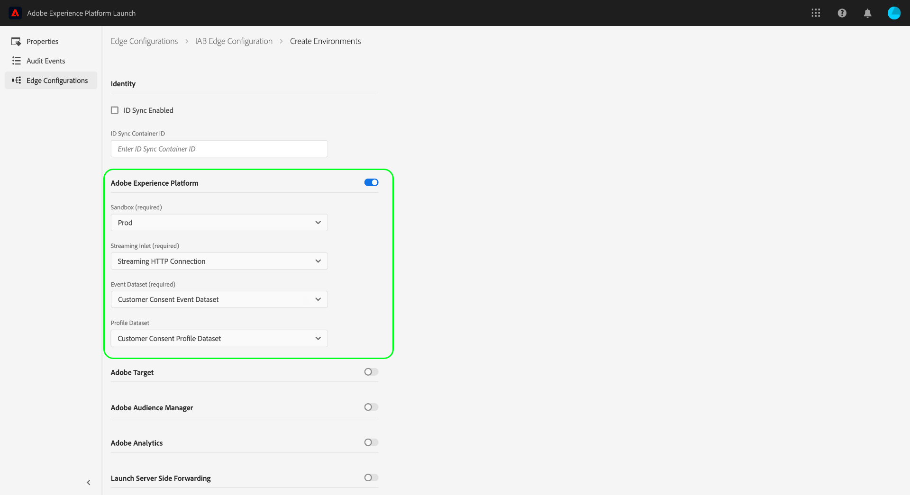

# Compatibilidad con IAB TCF 2.0 en Experience Platform

El [!DNL Transparency & Consent Framework] (TCF), tal como se describe en la [!DNL Interactive Advertising Bureau] (IAB) es un marco técnico de estándares abiertos destinado a permitir a las organizaciones obtener, registrar y actualizar el consentimiento del consumidor para el procesamiento de sus datos personales, de conformidad con el [!DNL General Data Protection Regulation] (RGPD). La segunda iteración del marco, TCF 2.0, concede más flexibilidad para la forma en que los consumidores pueden proporcionar o retener el consentimiento, incluido si los proveedores pueden utilizar determinadas características del procesamiento de datos, como la geolocalización precisa, y cómo pueden hacerlo.

>[!NOTE]
>
>Puede encontrar más información sobre TCF 2.0 en la [Sitio web de IAB Europe](https://iabeurope.eu/tcf-2-0/), incluidos los materiales de apoyo y las especificaciones técnicas.

Adobe Experience Platform forma parte del grupo registrado [Lista de proveedores de IAB TCF 2.0](https://iabeurope.eu/vendor-list-tcf-v2-0/), en el ID **565**. En cumplimiento con los requisitos de TCF 2.0, Platform le permite recopilar datos de consentimiento del cliente e integrarlos en sus perfiles de cliente almacenados. Estos datos de consentimiento se pueden tener en cuenta para determinar si los perfiles se incluyen en los segmentos de audiencia exportados, según su caso de uso.

>[!IMPORTANT]
>
>Platform solo puede cumplir con la versión 2.0 del TCF (o posterior). Las versiones anteriores de TCF no son compatibles.

Este documento proporciona información general sobre cómo configurar las operaciones de datos y los esquemas de perfil para aceptar los datos de consentimiento del cliente generados por la CMP y cómo Platform transmite las opciones de consentimiento del usuario al exportar segmentos.

## Requisitos previos

Para seguir esta guía, debe utilizar una plataforma de administración de consentimiento (CMP), ya sea comercial o propia, integrada y compatible con el TCF de IAB. Consulte la [lista de CMP compatibles](https://iabeurope.eu/cmp-list/) para obtener más información.

>[!IMPORTANT]
>
>Si el ID de la CMP no es válido, Platform seguirá procesando los datos tal cual. Para aplicar TCF 2.0, debe confirmar que la CMP tiene un ID válido registrado con IAB TCF 2.0 antes de enviar datos a Platform.

Esta guía también requiere una comprensión práctica de los siguientes servicios de Platform:

* [Modelo de datos de experiencia (XDM)](../../../../xdm/home.md): El marco estandarizado mediante el cual Experience Platform organiza los datos de experiencia del cliente.
* [Servicio de identidad de Adobe Experience Platform](../../../../identity-service/home.md): resuelve el desafío fundamental que plantea la fragmentación de los datos de experiencia del cliente al unir identidades entre dispositivos y sistemas.
* [Perfil del cliente en tiempo real](../../../../profile/home.md): Aprovecha [!DNL Identity Service] para crear perfiles detallados de los clientes a partir de los conjuntos de datos en tiempo real. [!DNL Real-Time Customer Profile] extrae datos del lago de datos y conserva los perfiles de los clientes en su propio almacén de datos independiente.
* [SDK web de Adobe Experience Platform](../../../../edge/home.md): Una biblioteca JavaScript del lado del cliente que le permite integrar varios servicios de Platform en su sitio web del lado del cliente.
   * [Comandos de consentimiento de SDK](../../../../edge/consent/supporting-consent.md): Información general sobre un caso de uso de los comandos de SDK relacionados con el consentimiento que se muestran en esta guía.
* [Servicio de segmentación de Adobe Experience Platform](../../../../segmentation/home.md): le permite dividir [!DNL Real-Time Customer Profile] datos en grupos de individuos que comparten características similares y que responderán de manera similar a las estrategias de marketing.

Además de los servicios de Platform enumerados arriba, también debe estar familiarizado con [destinos](../../../../data-governance/home.md) y su papel en el ecosistema de Platform.

## Resumen del flujo de consentimiento del cliente {#summary}

Las secciones siguientes describen cómo se recopilan y aplican los datos de consentimiento después de configurar correctamente el sistema.

### Recopilación de datos de consentimiento

Platform le permite recopilar datos de consentimiento del cliente mediante el siguiente proceso:

1. Un cliente proporciona sus preferencias de consentimiento para la recopilación de datos a través de un cuadro de diálogo en su sitio web.
1. Su CMP detecta el cambio de preferencia de consentimiento y genera los datos de consentimiento TCF en consecuencia.
1. Mediante el SDK web de Platform, los datos de consentimiento generados (devueltos por CMP) se envían a Adobe Experience Platform.
1. Los datos de consentimiento recopilados se incorporan a una [!DNL Profile]Conjunto de datos habilitado para el que el esquema contiene campos de consentimiento TCF.

Además de los comandos del SDK activados por los vínculos de cambio de consentimiento de CMP, los datos de consentimiento también pueden fluir a Experience Platform a través de cualquier dato XDM generado por el cliente que se cargue directamente en un [!DNL Profile]Conjunto de datos habilitado para.

Cualquier segmento compartido con Platform por Adobe Audience Manager (a través del [!DNL Audience Manager] conector de origen o de otro tipo) también pueden contener datos de consentimiento, siempre que se hayan aplicado los campos correspondientes a esos segmentos mediante [!DNL Experience Cloud Identity Service]. Para obtener más información sobre la recopilación de datos de consentimiento en [!DNL Audience Manager], consulte el documento en la [Complemento de Adobe Audience Manager para IAB TCF](https://experienceleague.adobe.com/docs/audience-manager/user-guide/overview/data-privacy/consent-management/aam-iab-plugin.html?lang=es).

### Aplicación del consentimiento descendente

Una vez que los datos de consentimiento de TCF se han introducido correctamente, los siguientes procesos tienen lugar en los servicios de Platform secundarios:

1. [!DNL Real-Time Customer Profile] actualiza los datos de consentimiento almacenados para el perfil de ese cliente.
1. Platform procesa los ID de cliente solo si se proporciona el permiso de proveedor para Platform (565) para cada ID de un clúster.
1. Al exportar segmentos a destinos pertenecientes a miembros de la lista de proveedores TCF 2.0, Platform solo incluye perfiles si los permisos de proveedor para ambas Platform (565) *y* los destinos individuales se proporcionan para cada ID de un clúster.

El resto de las secciones de este documento proporcionan directrices sobre cómo configurar Platform y sus operaciones de datos para cumplir los requisitos de recopilación y aplicación descritos anteriormente.

## Determine cómo generar datos de consentimiento de cliente dentro de su CMP {#consent-data}

Dado que cada sistema CMP es único, debe determinar la mejor manera de permitir a los clientes proporcionar consentimiento a medida que interactúan con el servicio. Una forma común de conseguirlo es mediante el uso de un cuadro de diálogo de consentimiento de cookies, similar al siguiente ejemplo:


Este cuadro de diálogo debe permitir al cliente adherirse o excluirse de lo siguiente:

| Opción de consentimiento | Descripción |
| --- | --- |
| **Finalidades** | Los objetivos definen para qué fines técnicos de publicidad una marca puede utilizar los datos de un cliente. Se deben optar por los siguientes fines para que Platform procese los ID de cliente: <ul><li>**Objetivo 1**: Almacenar o acceder a información en un dispositivo</li><li>**Objetivo 10**: Desarrolle y mejore productos</li></ul> |
| **Permisos de proveedor** | Además de los fines técnicos de la publicidad, el cuadro de diálogo también debe permitir que el cliente decida si quiere o no que sus datos sean utilizados por proveedores específicos, incluido Adobe Experience Platform (565). |

### Cadenas de consentimiento {#consent-strings}

Independientemente del método que utilice para recopilar los datos, el objetivo es generar un valor de cadena basado en las opciones de consentimiento elegidas por el cliente, denominado cadena de consentimiento.

En la especificación del TCF, las cadenas de consentimiento se utilizan para codificar detalles relevantes sobre la configuración de consentimiento de un cliente, en términos de propósitos de marketing específicos definidos por políticas y proveedores. Platform utiliza estas cadenas para almacenar la configuración de consentimiento de cada cliente y, por lo tanto, se debe generar una nueva cadena de consentimiento cada vez que cambia dicha configuración.

Las cadenas de consentimiento solo las puede crear una CMP registrada en el TCF de IAB. Para obtener más información sobre cómo generar cadenas de consentimiento utilizando su CMP particular, consulte [guía de formato de cadena de consentimiento](https://github.com/InteractiveAdvertisingBureau/GDPR-Transparency-and-Consent-Framework/blob/master/TCFv2/IAB%20Tech%20Lab%20-%20Consent%20string%20and%20vendor%20list%20formats%20v2.md) en el repositorio de GitHub de TCF de IAB.

## Creación de conjuntos de datos con campos de consentimiento TCF {#datasets}

Los datos de consentimiento del cliente deben enviarse a conjuntos de datos cuyos esquemas contengan campos de consentimiento TCF. Consulte el tutorial sobre [creación de conjuntos de datos para capturar el consentimiento TCF 2.0](./dataset.md) para saber cómo crear el conjunto de datos de perfil necesario (y un conjunto de datos de evento de experiencia opcional) antes de continuar con esta guía.

## Actualizar [!DNL Profile] combinar directivas para incluir datos de consentimiento {#merge-policies}

Una vez que haya creado una [!DNL Profile]Conjunto de datos habilitado para para recopilar datos de consentimiento, debe asegurarse de que las políticas de combinación se hayan configurado para incluir siempre campos de consentimiento TCF en los perfiles de cliente. Esto implica establecer la prioridad del conjunto de datos de modo que el conjunto de datos de consentimiento tenga prioridad sobre otros conjuntos de datos que puedan entrar en conflicto.

Para obtener más información sobre cómo trabajar con políticas de combinación, consulte la [resumen de políticas de combinación](../../../../profile/merge-policies/overview.md). Al configurar las políticas de combinación, debe asegurarse de que los segmentos incluyan todos los atributos de consentimiento requeridos proporcionados por el [Grupo de campos del esquema de privacidad XDM](./dataset.md#privacy-field-group), tal como se describe en la guía sobre preparación de conjuntos de datos.

## Integración del SDK web de Experience Platform para recopilar datos de consentimiento del cliente {#sdk}

>[!NOTE]
>
>Se requiere el uso del SDK web de Experience Platform para procesar los datos de consentimiento directamente en Adobe Experience Platform. [!DNL Experience Cloud Identity Service] no es compatible actualmente.
>
>[!DNL Experience Cloud Identity Service] Sin embargo, sigue siendo compatible con el procesamiento de consentimientos en Adobe Audience Manager, y la conformidad con TCF 2.0 solo requiere que la biblioteca se actualice a [versión 5.0](https://github.com/Adobe-Marketing-Cloud/id-service/releases).

Una vez configurada la CMP para generar cadenas de consentimiento, debe integrar el SDK web de Experience Platform para recopilar esas cadenas y enviarlas a Platform. El SDK de Platform proporciona dos comandos que se pueden utilizar para enviar datos de consentimiento TCF a Platform (explicados en las subsecciones siguientes) y debe utilizarse cuando un cliente proporciona información de consentimiento por primera vez y en cualquier momento en el que el consentimiento cambie a partir de entonces.

**El SDK no interactúa con ninguna CMP predeterminada**. Depende de usted determinar cómo integrar el SDK en su sitio web, escuchar los cambios de consentimiento en la CMP y llamar al comando correspondiente.

### Creación de una nueva secuencia de datos

Para que el SDK envíe datos a Experience Platform, primero debe crear un nuevo conjunto de datos para Platform. Los pasos específicos para crear un nuevo conjunto de datos se proporcionan en la [Documentación del SDK](../../../../datastreams/overview.md).

Después de proporcionar un nombre único para el conjunto de datos, seleccione el botón de alternancia situado junto a **[!UICONTROL Adobe Experience Platform]**. A continuación, utilice los siguientes valores para completar el resto del formulario:

| Campo de secuencia de datos | Valor |
| --- | --- |
| [!UICONTROL Zona protegida] | El nombre de la plataforma [espacio aislado](../../../../sandboxes/home.md) que contiene la conexión de flujo continuo y los conjuntos de datos necesarios para configurar el conjunto de datos. |
| [!UICONTROL Entrada de flujo] | Una conexión de flujo continuo válida para el Experience Platform. Consulte el tutorial sobre [creación de una conexión de flujo continuo](../../../../ingestion/tutorials/create-streaming-connection-ui.md) si no tiene una entrada de flujo continuo existente. |
| [!UICONTROL Conjunto de datos del evento] | Seleccione el [!DNL XDM ExperienceEvent] conjunto de datos creado en [paso anterior](#datasets). Si ha incluido la variable [[!UICONTROL Consentimiento de IAB TCF 2.0] grupo de campos](../../../../xdm/field-groups/event/iab.md) en el esquema de este conjunto de datos, puede realizar un seguimiento de los eventos de cambio de consentimiento a lo largo del tiempo mediante [`sendEvent`](#sendEvent) , almacenando esos datos en este conjunto de datos. Tenga en cuenta que los valores de consentimiento almacenados en este conjunto de datos son **no** se utiliza en flujos de trabajo de aplicación automáticos. |
| [!UICONTROL Conjunto de datos del perfil] | Seleccione el [!DNL XDM Individual Profile] conjunto de datos creado en [paso anterior](#datasets). Al responder a los vínculos de cambio de consentimiento de CMP mediante [`setConsent`](#setConsent) , los datos recopilados se almacenarán en este conjunto de datos. Dado que este conjunto de datos tiene un perfil habilitado, los valores de consentimiento almacenados en este conjunto de datos se respetan durante los flujos de trabajo de aplicación automáticos. |



Cuando termine, seleccione **[!UICONTROL Guardar]** en la parte inferior de la pantalla y siga las indicaciones adicionales para completar la configuración.

### Realizar comandos de cambio de consentimiento

Una vez creado el conjunto de datos descrito en la sección anterior, puede empezar a utilizar comandos del SDK para enviar datos de consentimiento a Platform. Las secciones siguientes proporcionan ejemplos de cómo se puede utilizar cada comando de SDK en diferentes situaciones.

>[!NOTE]
>
>Para obtener una introducción a la sintaxis común de todos los comandos del SDK de Platform, consulte el documento sobre [ejecutar comandos](../../../../edge/fundamentals/executing-commands.md).

#### Uso de los vínculos de cambio de consentimiento de CMP {#setConsent}

Muchas CMP proporcionan vínculos predeterminados que escuchan eventos de cambio de consentimiento. Cuando se producen estos eventos, puede utilizar la variable `setConsent` para actualizar los datos de consentimiento de ese cliente.

El `setConsent` El comando espera dos argumentos: (1) una cadena que indica el tipo de comando (en este caso, &quot;setConsent&quot;) y (2) una carga útil que contiene un `consent` matriz, que debe contener al menos un objeto que proporcione los campos de consentimiento requeridos, como se muestra a continuación:

```js
alloy("setConsent", {
  consent: [{
    standard: "IAB TCF",
    version: "2.0",
    value: "CLcVDxRMWfGmWAVAHCENAXCkAKDAADnAABRgA5mdfCKZuYJez-NQm0TBMYA4oCAAGQYIAAAAAAEAIAEgAA.argAC0gAAAAAAAAAAAA",
    gdprApplies: "true"
  }]
});
```

| Propiedad de carga útil | Descripción |
| --- | --- |
| `standard` | El estándar de consentimiento que se está utilizando. Este valor debe establecerse en `IAB` para el procesamiento de consentimiento de TCF 2.0. |
| `version` | El número de versión del estándar de consentimiento indicado en `standard`. Este valor debe establecerse en `2.0` para el procesamiento de consentimiento de TCF 2.0. |
| `value` | Cadena de consentimiento codificada en base 64 generada por CMP. |
| `gdprApplies` | Un valor booleano que indica si el RGPD se aplica al cliente que ha iniciado sesión actualmente. Para que TCF 2.0 se aplique a este cliente, el valor debe establecerse en `true`. El valor predeterminado es `true` si no está definido. |

El `setConsent` El comando debe utilizarse como parte de un vínculo CMP que detecte los cambios en la configuración de consentimiento. El siguiente código JavaScript proporciona un ejemplo de cómo se puede usar la variable `setConsent` se puede utilizar para el de OneTrust `OnConsentChanged` gancho:

```js
OneTrust.OnConsentChanged(function () {
  // Retrieve the TCF 2.0 consent data generated by the CMP, and pass it to Alloy. 
  __tcfapi("getTCData", 2, function (data, success) {
    if (success) {
      var tcString = data.tcString;
      var gdpr = data.gdprApplies;

      alloy("setConsent", {
        consent: [{
          standard: "IAB TCF",
          version: "2.0",
          value: tcString,
          gdprApplies: gdpr
        }]
      });
    }
  });
});
```

#### Uso de eventos {#sendEvent}

También puede recopilar datos de consentimiento TCF 2.0 en cada evento activado en Platform mediante el `sendEvent` comando.

>[!NOTE]
>
>Para utilizar este método, debe haber agregado el grupo de campos Privacidad de Experience Event a su [!DNL Profile]-enabled [!DNL XDM ExperienceEvent] esquema. Consulte la sección sobre [actualización del esquema de ExperienceEvent](./dataset.md#event-schema) en la guía de preparación del conjunto de datos para ver los pasos sobre cómo configurarlo.

El `sendEvent` El comando debe utilizarse como llamada de retorno en los detectores de eventos adecuados del sitio web. El comando espera dos argumentos: (1) una cadena que indica el tipo de comando (en este caso, `sendEvent`) y (2) una carga útil que contiene un `xdm` que proporciona los campos de consentimiento requeridos como JSON:

```js
alloy("sendEvent", {
  xdm: {
    "consentStrings": [{
      "consentStandard": "IAB TCF",
      "consentStandardVersion": "2.0",
      "consentStringValue": "CLcVDxRMWfGmWAVAHCENAXCkAKDAADnAABRgA5mdfCKZuYJez-NQm0TBMYA4oCAAGQYIAAAAAAEAIAEgAA.argAC0gAAAAAAAAAAAA",
      "gdprApplies": true
    }]
  }
});
```

| Propiedad de carga útil | Descripción |
| --- | --- |
| `xdm.consentStrings` | Matriz que debe contener al menos un objeto que proporcione los campos de consentimiento requeridos. |
| `consentStandard` | El estándar de consentimiento que se está utilizando. Este valor debe establecerse en `IAB` para el procesamiento de consentimiento de TCF 2.0. |
| `consentStandardVersion` | El número de versión del estándar de consentimiento indicado en `standard`. Este valor debe establecerse en `2.0` para el procesamiento de consentimiento de TCF 2.0. |
| `consentStringValue` | Cadena de consentimiento codificada en base 64 generada por CMP. |
| `gdprApplies` | Un valor booleano que indica si el RGPD se aplica al cliente que ha iniciado sesión actualmente. Para que TCF 2.0 se aplique a este cliente, el valor debe establecerse en `true`. El valor predeterminado es `true` si no está definido. |

### Gestión de respuestas del SDK

Todo [!DNL Platform SDK] los comandos devuelven promesas que indican si la llamada se realizó correctamente o no. A continuación, puede utilizar estas respuestas para lógicas adicionales, como mostrar mensajes de confirmación al cliente. Consulte la sección sobre [éxito o fracaso de la gestión](../../../../edge/fundamentals/executing-commands.md#handling-success-or-failure) en la guía sobre la ejecución de comandos del SDK para ejemplos específicos.

## Exportar segmentos {#export}

>[!NOTE]
>
>Antes de empezar a exportar segmentos, debe asegurarse de que los segmentos incluyan todos los campos de consentimiento requeridos. Consulte la sección sobre [configuración de políticas de combinación](#merge-policies) para obtener más información.

Una vez que haya recopilado datos de consentimiento de clientes y haya creado segmentos de audiencia que contengan los atributos de consentimiento necesarios, puede aplicar la conformidad con TCF 2.0 al exportar esos segmentos a destinos descendentes.

Siempre que la configuración de consentimiento `gdprApplies` se establece en `true` para un conjunto de perfiles de clientes, cualquier dato de esos perfiles que se exporte a destinos de flujo descendente se filtrará según las preferencias de consentimiento TCF para cada perfil. Cualquier perfil que no cumpla las preferencias de consentimiento requeridas se omitirá durante el proceso de exportación.

Los clientes deben aceptar los siguientes propósitos (descritos por [Políticas de TCF 2.0](https://iabeurope.eu/iab-europe-transparency-consent-framework-policies/#Appendix_A_Purposes_and_Features_Definitions)) para que sus perfiles se incluyan en los segmentos exportados a destinos:

* **Objetivo 1**: Almacenar o acceder a información en un dispositivo
* **Objetivo 10**: Desarrolle y mejore productos

TCF 2.0 también requiere que el origen de los datos compruebe el permiso del proveedor de destino antes de enviar datos a ese destino. De este modo, Platform comprueba si el permiso de proveedor del destino está activado para todos los ID del clúster antes de incluir los datos enlazados a dicho destino.

>[!NOTE]
>
>Cualquier segmento que se comparta con Adobe Audience Manager contendrá los mismos valores de consentimiento TCF 2.0 que sus equivalentes de Platform. Desde [!DNL Audience Manager] comparte el mismo ID de proveedor que Platform (565), y se requieren los mismos propósitos y permisos de proveedor. Consulte el documento en la [Complemento de Adobe Audience Manager para IAB TCF](https://experienceleague.adobe.com/docs/audience-manager/user-guide/overview/data-privacy/consent-management/aam-iab-plugin.html?lang=es) para obtener más información.

## Prueba de la implementación {#test-implementation}

Una vez configurada la implementación de TCF 2.0 y exportados los segmentos a destinos, los datos que no cumplan los requisitos de consentimiento no se exportarán. Sin embargo, para ver si los perfiles de cliente correctos se filtraron durante la exportación, debe comprobar manualmente los almacenes de datos de sus destinos para ver si el consentimiento se aplicó correctamente.

Es importante tener en cuenta que si hay varios ID que conforman un clúster y se aplica TCF 2.0, todo el clúster se excluirá si incluso un único ID no contiene los propósitos y permisos de proveedor correctos.

## Pasos siguientes

Este documento abarcaba el proceso de configuración de las operaciones de datos de Platform para que cumplieran con las obligaciones comerciales descritas en TCF 2.0. Consulte la información general sobre [gobernanza, privacidad y seguridad](../../overview.md) para obtener más información sobre las funciones relacionadas con la privacidad de Platform.
