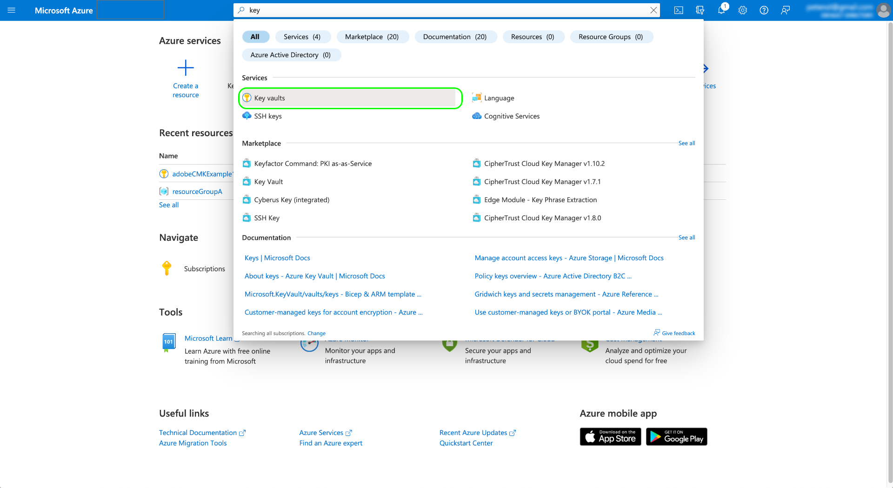
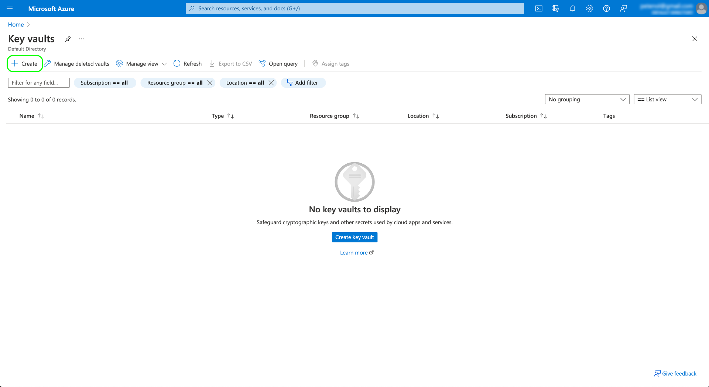
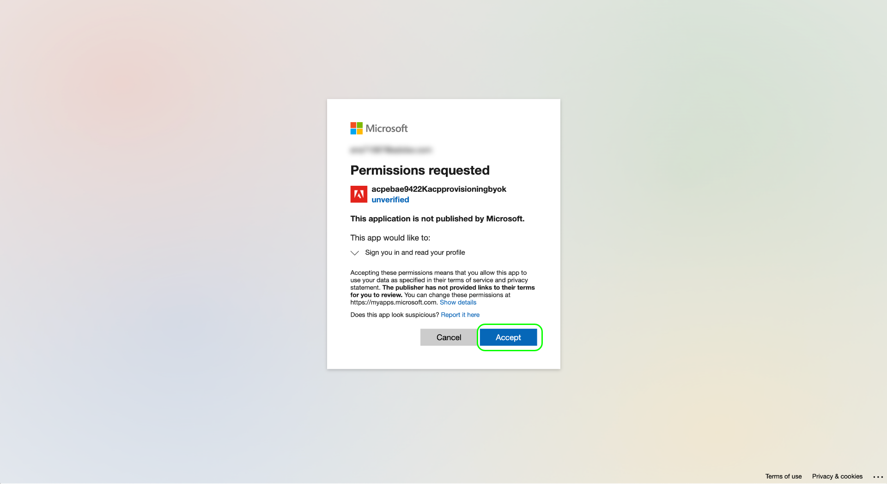
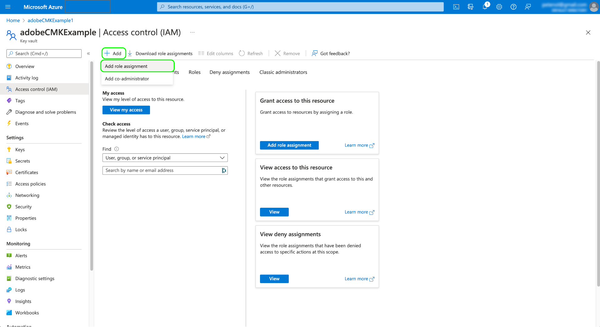
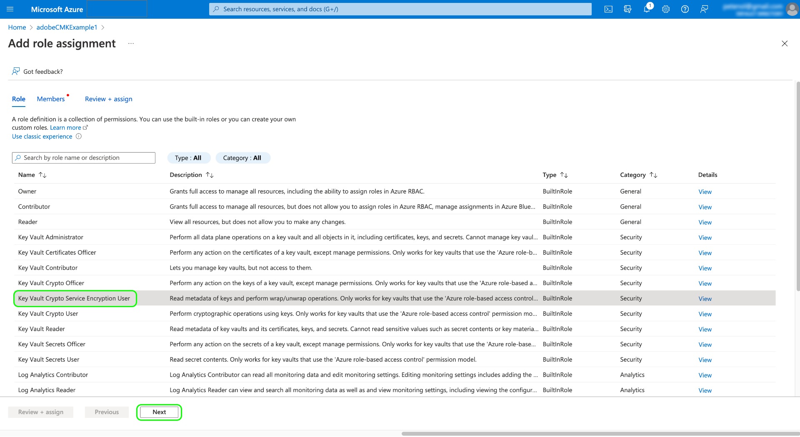

# Claves administradas por el cliente en Adobe Experience Platform

Los datos almacenados en Adobe Experience Platform se cifran en reposo mediante claves de nivel de sistema. Si utiliza una aplicación basada en Platform, puede optar por utilizar sus propias claves de cifrado, lo que le proporciona el bueno control sobre la seguridad de los datos.

>[!NOTE]
>
>Los datos del lago de datos de Adobe Experience Platform y del almacén de perfiles (CosmosDB) se cifran mediante CMK.

Este documento cubre el proceso para habilitar la función de claves administradas por el cliente (CMK) en Platform.

## Requisitos previos

Para habilitar CMK, su [!DNL Azure] Key Vault debe configurarse con la siguiente configuración:

* [Habilitar protección contra purgas](https://learn.microsoft.com/en-us/azure/key-vault/general/soft-delete-overview#purge-protection)
* [Habilitar eliminación suave](https://learn.microsoft.com/en-us/azure/key-vault/general/soft-delete-overview)
* [Configuración del acceso mediante [!DNL Azure] control de acceso basado en roles](https://learn.microsoft.com/en-us/azure/role-based-access-control/)

## Resumen del proceso

CMK está incluido en las ofertas Healthcare Shield y Privacy and Security Shield desde el Adobe. Una vez que su organización haya adquirido una licencia para una de estas ofertas, puede iniciar un proceso único para configurar la función.

>[!WARNING]
>
>Después de configurar CMK, no puede volver a las claves administradas por el sistema. Usted es responsable de administrar sus claves de forma segura y de proporcionar acceso a su aplicación Key Vault, Key y CMK dentro de [!DNL Azure] para evitar la pérdida de acceso a los datos.

El proceso es el siguiente:

1. [Configuración de un [!DNL Azure] Key Vault](#create-key-vault) en función de las políticas de su organización, [generar una clave de cifrado](#generate-a-key) que finalmente se compartirán con el Adobe.
1. Utilice llamadas API para [configuración de la aplicación CMK](#register-app) con su [!DNL Azure] inquilino.
1. Utilice llamadas API para [enviar el ID de clave de cifrado al Adobe](#send-to-adobe) e inicie el proceso de habilitación de la función.
1. [Comprobar el estado de la configuración](#check-status) para comprobar si CMK está habilitado.

Una vez completado el proceso de configuración, todos los datos incorporados en Platform en todas las zonas protegidas se cifrarán con su [!DNL Azure] configuración de clave. Para usar CMK, aprovechará [!DNL Microsoft Azure] funcionalidad que puede formar parte de su [programa de vista previa pública](https://azure.microsoft.com/en-ca/support/legal/preview-supplemental-terms/).

## Configuración de un [!DNL Azure] Key Vault {#create-key-vault}

CMK solo admite claves de un [!DNL Microsoft Azure] Key Vault. Para empezar, debe trabajar con [!DNL Azure] para crear una nueva cuenta empresarial o utilice una cuenta empresarial existente y siga los pasos a continuación para crear el almacén de claves.

>[!IMPORTANT]
>
>Solo los niveles de servicio Premium y Standard para [!DNL Azure] Se admiten los Key Vault. [!DNL Azure Managed HSM], [!DNL Azure Dedicated HSM] y [!DNL Azure Payments HSM] no son compatibles. Consulte la [[!DNL Azure] documentación](https://learn.microsoft.com/en-us/azure/security/fundamentals/key-management#azure-key-management-services) para obtener más información sobre los servicios de administración de claves ofrecidos.

>[!NOTE]
>
>La documentación siguiente solo cubre los pasos básicos para crear el almacén de claves. Fuera de esta guía, debe configurar el almacén de claves según las políticas de su organización.

Inicie sesión en [!DNL Azure] y utilice la barra de búsqueda para localizar **[!DNL Key vaults]** en la lista de servicios.



El **[!DNL Key vaults]** después de seleccionar el servicio. Desde aquí, seleccione **[!DNL Create]**.



Mediante el formulario proporcionado, rellene los detalles básicos del almacén de claves, incluido un nombre y un grupo de recursos asignado.

>[!WARNING]
>
>Aunque la mayoría de las opciones se pueden dejar como valores predeterminados, **asegúrese de activar las opciones de protección de eliminación suave y depuración**. Si no activa estas funciones, podría arriesgarse a perder el acceso a los datos si se elimina el almacén de claves.
>
>

A partir de aquí, siga con el flujo de trabajo de creación de almacén de claves y configure las distintas opciones según las políticas de su organización.

Una vez que llegue al **[!DNL Review + create]** paso, puede revisar los detalles del almacén de claves mientras se valida. Una vez validada, seleccione **[!DNL Create]** para completar el proceso.


### Configurar opciones de red

Si el almacén de claves está configurado para restringir el acceso público a determinadas redes virtuales o deshabilitar por completo el acceso público, debe conceder a Microsoft una excepción de cortafuegos.

Seleccionar **[!DNL Networking]** en el panel de navegación izquierdo. En **[!DNL Firewalls and virtual networks]**, seleccione la casilla de verificación **[!DNL Allow trusted Microsoft services to bypass this firewall]**, luego seleccione **[!DNL Apply]**.


### Generar una clave {#generate-a-key}

Una vez creado un almacén de claves, puede generar una clave nueva. Vaya a **[!DNL Keys]** y seleccione **[!DNL Generate/Import]**.


Utilice el formulario proporcionado para proporcionar un nombre para la clave y seleccione **RSA** para el tipo de clave. Como mínimo, la variable **[!DNL RSA key size]** debe ser al menos **3072** bits según lo requerido por [!DNL Cosmos DB]. [!DNL Azure Data Lake Storage] también es compatible con RSA 3027.

>[!NOTE]
>
>Recuerde el nombre que proporcione para la clave, ya que se utilizará en el paso posterior cuando [envío de la clave al Adobe](#send-to-adobe).

Utilice los controles restantes para configurar la clave que desee generar o importar. Cuando termine, seleccione **[!DNL Create]**.


La clave configurada aparece en la lista de claves del almacén.


## Configuración de la aplicación CMK {#register-app}

Una vez configurado el almacén de claves, el siguiente paso es registrarse en la aplicación CMK que se vinculará a su [!DNL Azure] inquilino.

### Primeros pasos

El registro de la aplicación CMK requiere que realice llamadas a las API de Platform. Para obtener más información sobre cómo recopilar los encabezados de autenticación necesarios para realizar estas llamadas, consulte la [Guía de autenticación de Platform API](../../landing/api-authentication.md).

Mientras que la guía de autenticación proporciona instrucciones sobre cómo generar su propio valor único para el requerido `x-api-key` encabezado de solicitud, todas las operaciones de API de esta guía utilizan el valor estático `acp_provisioning` en su lugar. Debe seguir proporcionando sus propios valores para `{ACCESS_TOKEN}` y `{ORG_ID}`, sin embargo.

En todas las llamadas API que se muestran en esta guía, `platform.adobe.io` se utiliza como ruta raíz, que toma como valor predeterminado la región VA7. Si su organización utiliza una región diferente, `platform` debe ir seguido de un guión y del código de región asignado a su organización: `nld2` para NLD2 o `aus5` para AUS5 (por ejemplo: `platform-aus5.adobe.io`). Si no conoce la región de su organización, póngase en contacto con el administrador del sistema.

### Buscar una URL de autenticación

Para iniciar el proceso de registro, realice una solicitud de GET al extremo de registro de la aplicación para recuperar la URL de autenticación necesaria para su organización.

**Solicitud**

```shell
curl -X GET \
  https://platform.adobe.io/data/infrastructure/manager/byok/app-registration \ 
  -H 'Authorization: Bearer {ACCESS_TOKEN}' \
  -H 'x-api-key: acp_provisioning' \
  -H 'x-gw-ims-org-id: {ORG_ID}'
```

**Respuesta**

Una respuesta correcta devuelve un `applicationRedirectUrl` , que contiene la dirección URL de autenticación.

```json
{
    "id": "byok",
    "name": "acpebae9422Caepcmkmultitenantapp",
    "applicationUri": "https://adobe.com/acpebae9422Caepcmkmultitenantapp",
    "applicationId": "e463a445-c6ac-4ca2-b36a-b5146fcf6a52",
    "applicationRedirectUrl": "https://login.microsoftonline.com/common/oauth2/authorize?response_type=code&client_id=e463a445-c6ac-4ca2-b36a-b5146fcf6a52&redirect_uri=https://adobe.com/acpebae9422Caepcmkmultitenantapp&scope=user.read"
}
```

Copie y pegue `applicationRedirectUrl` Dirección en un explorador para abrir un cuadro de diálogo de autenticación. Seleccionar **[!DNL Accept]** para agregar la entidad de seguridad del servicio de aplicaciones CMK a su [!DNL Azure] inquilino.



### Asignar la aplicación CMK a un rol {#assign-to-role}

Después de completar el proceso de autenticación, vuelva a su [!DNL Azure] Key Vault y seleccione **[!DNL Access control]** en el panel de navegación izquierdo. Desde aquí, seleccione **[!DNL Add]** seguido de **[!DNL Add role assignment]**.



La siguiente pantalla le pedirá que elija una función para esta asignación. Seleccionar **[!DNL Key Vault Crypto Service Encryption User]** antes de seleccionar **[!DNL Next]** para continuar.



En la pantalla siguiente, elija **[!DNL Select members]** para abrir un cuadro de diálogo en el carril derecho. Utilice la barra de búsqueda para localizar la entidad de seguridad de servicio de la aplicación CMK y seleccionarla en la lista. Cuando termine, seleccione **[!DNL Save]**.

>[!NOTE]
>
>Si no encuentra su aplicación en la lista, no se ha aceptado su entidad de servicio en su inquilino. Trabaje con su [!DNL Azure] administrador o representante para asegurarse de que tiene los privilegios correctos.

## Habilitar la configuración de clave de cifrado en el Experience Platform {#send-to-adobe}

Después de instalar la aplicación CMK en [!DNL Azure], puede enviar su identificador de clave de cifrado al Adobe. Seleccionar **[!DNL Keys]** en el panel de navegación izquierdo, seguido del nombre de la clave que desea enviar.


Seleccione la última versión de la clave y aparecerá su página de detalles. Desde aquí puede configurar de forma opcional las operaciones permitidas para la clave. Como mínimo, la clave debe tener el **[!DNL Wrap Key]** y **[!DNL Unwrap Key]** permisos.

El **[!UICONTROL Identificador de clave]** El campo muestra el identificador URI de la clave. Copie este valor de URI para utilizarlo en el siguiente paso.


Una vez que haya obtenido el URI del almacén de claves, puede enviarlo mediante una solicitud del POST al punto de conexión de configuración CMK.

>[!NOTE]
>
>Solo el almacén de claves y el nombre de clave se almacenan con el Adobe, no la versión de la clave.

**Solicitud**

```shell
curl -X POST \
  https://platform.adobe.io/data/infrastructure/manager/customer/config \ 
  -H 'Authorization: Bearer {ACCESS_TOKEN}' \
  -H 'x-api-key: acp_provisioning' \
  -H 'x-gw-ims-org-id: {ORG_ID}' \
  -d '{
        "name": "Config1",
        "type": "BYOK_CONFIG",
        "imsOrgId": "{ORG_ID}",
        "configData": {
          "providerType": "AZURE_KEYVAULT",
          "keyVaultKeyIdentifier": "https://adobecmkexample.vault.azure.net/keys/adobeCMK-key/7c1d50lo28234cc895534c00d7eb4eb4"
        }
      }'
```

| Propiedad | Descripción |
| --- | --- |
| `name` | Un nombre para la configuración. Asegúrese de recordar este valor, ya que será necesario comprobar el estado de la configuración a las [etapa posterior](#check-status). El valor distingue entre mayúsculas y minúsculas. |
| `type` | El tipo de configuración. Debe definirse en `BYOK_CONFIG`. |
| `imsOrgId` | Su ID de organización. Debe ser el mismo valor que se proporciona en la variable `x-gw-ims-org-id` encabezado. |
| `configData` | Contiene los siguientes detalles sobre la configuración:<ul><li>`providerType`: Debe definirse en `AZURE_KEYVAULT`.</li><li>`keyVaultKeyIdentifier`: URI de almacén de claves que ha copiado [anterior](#send-to-adobe).</li></ul> |

**Respuesta**

Una respuesta correcta devuelve los detalles del trabajo de configuración.

```json
{
  "id": "4df7886b-a122-4391-880b-47888d5c5b92",
  "config": {
    "configData": {
      "keyVaultUri": "https://adobecmkexample.vault.azure.net",
      "keyVaultKeyIdentifier": "https://adobecmkexample.vault.azure.net/keys/adobeCMK-key/7c1d50lo28234cc895534c00d7eb4eb4",
      "keyVersion": "7c1d50lo28234cc895534c00d7eb4eb4",
      "keyName": "Config1",
      "providerType": "AZURE_KEYVAULT"
    },
    "name": "acpcf978863Aaepcmkmultitenantapp",
    "type": "BYOK_CONFIG",
    "imsOrgId": "{IMS_ORG}",
    "status": "NEW"
  },
  "status": "CREATED"
}
```

El trabajo debe completar el procesamiento en unos minutos.

## Verificar el estado de la configuración {#check-status}

Para comprobar el estado de la solicitud de configuración, puede realizar una solicitud de GET.

**Solicitud**

Debe adjuntar el `name` de la configuración que desea comprobar en la ruta (`config1` en el ejemplo siguiente) e incluya un `configType` parámetro de consulta establecido en `BYOK_CONFIG`.

```shell
curl -X GET \
  https://platform.adobe.io/data/infrastructure/manager/customer/config/config1?configType=BYOK_CONFIG \ 
  -H 'Authorization: Bearer {ACCESS_TOKEN}' \
  -H 'x-api-key: acp_provisioning' \
  -H 'x-gw-ims-org-id: {ORG_ID}'
```

**Respuesta**

Una respuesta correcta devuelve el estado del trabajo.

```json
{
  "name": "acpcf978863Aaepcmkmultitenantapp",
  "type": "BYOK_CONFIG",
  "status": "COMPLETED",
  "configData": {
    "keyVaultUri": "https://adobecmkexample.vault.azure.net",
    "keyVaultKeyIdentifier": "https://adobecmkexample.vault.azure.net/keys/adobeCMK-key/7c1d50lo28234cc895534c00d7eb4eb4",
    "keyVersion": "7c1d50lo28234cc895534c00d7eb4eb4",
    "keyName": "Config1",
    "providerType": "AZURE_KEYVAULT"
  },
  "imsOrgId": "{IMS_ORG}",
  "subscriptionId": "cf978863-7325-47b1-8fd9-554b9fdb6c36",
  "id": "4df7886b-a122-4391-880b-47888d5c5b92",
  "rowType": "BYOK_KEY"
}
```

El `status` puede tener uno de los cuatro valores con los significados siguientes:

1. `RUNNING`: valida que Platform tiene la capacidad de acceder a la clave y al almacén de claves.
1. `UPDATE_EXISTING_RESOURCES`: el sistema está agregando el almacén de claves y el nombre de claves a los almacenes de datos en todos los entornos limitados de su organización.
1. `COMPLETED`: el almacén de claves y el nombre de claves se han añadido a los almacenes de datos.
1. `FAILED`: Se ha producido un problema, relacionado principalmente con la clave, el almacén de claves o la configuración de aplicaciones de varios inquilinos.

## Pasos siguientes

Al completar los pasos anteriores, ha habilitado correctamente CMK para su organización. Los datos que se incorporan a Platform ahora se cifrarán y descifrarán con las claves de [!DNL Azure] Key Vault. Si desea revocar el acceso de Platform a sus datos, puede quitar el rol de usuario asociado a la aplicación del almacén de claves en [!DNL Azure].

Después de deshabilitar el acceso a la aplicación, los datos pueden tardar entre unos minutos y 24 horas en no ser accesibles en Platform. El mismo retraso de tiempo se aplica a los datos que vuelven a estar disponibles cuando se vuelve a habilitar el acceso a la aplicación.

>[!WARNING]
>
>Una vez que la aplicación Key Vault, Key o CMK esté deshabilitada y ya no se pueda acceder a los datos en Platform, ya no será posible realizar ninguna operación descendente relacionada con esos datos. Asegúrese de comprender el impacto descendente de la revocación del acceso de Platform a los datos antes de realizar cambios en la configuración.
