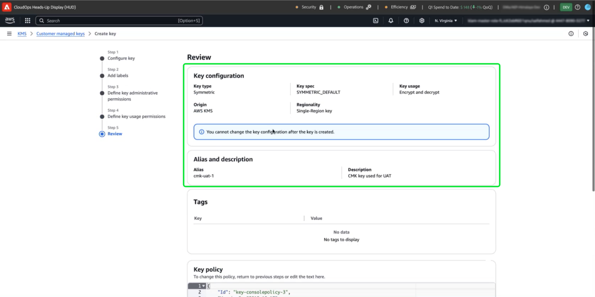

# Configuración de AWS KMS para claves administradas por el cliente

>[!AVAILABILITY]
>
>Este documento se aplica a las implementaciones de Experience Platform que se ejecutan en Amazon Web Service (AWS). Un Experience Platform que se ejecuta en AWS está disponible actualmente para un número limitado de clientes. Para obtener más información acerca de la infraestructura de Experience Platform compatible, consulte la [descripción general de la nube múltiple de Experience Platform](https://experienceleague.adobe.com/en/docs/experience-platform/landing/multi-cloud).
>
>Las [claves gestionadas por el cliente](../overview.md) (CMK) en AWS son compatibles con Privacy Shield y Security Shield, pero no están disponibles para Healthcare Shield. CMK en Azure es compatible tanto con Privacy Shield como con Security Shield, así como con Healthcare Shield.

Utilice esta guía para proteger los datos con el servicio de administración de claves (KMS) de Amazon Web Service (AWS) mediante la creación, administración y control de claves de cifrado para Adobe Experience Platform. Esta integración simplifica el cumplimiento normativo, optimiza las operaciones mediante la automatización y elimina la necesidad de mantener su propia infraestructura de administración de claves.

Para obtener instrucciones específicas del Customer Journey Analytics, consulte la [documentación de Customer Journey Analytics CMK](https://experienceleague.adobe.com/en/docs/analytics-platform/using/cja-privacy/cmk)

>[!IMPORTANT]
>
>Adobe Experience Platform cifra los datos en reposo de forma predeterminada mediante claves administradas por el sistema. Al habilitar las claves administradas por el cliente (CMK), obtiene el control total de su seguridad de datos. Sin embargo, este cambio es irreversible. Una vez habilitado CMK, no puede volver a las claves administradas por el sistema. Usted es responsable de administrar de forma segura sus claves para garantizar un acceso ininterrumpido a sus datos y evitar posibles inaccesos.

Utilice AWS KMS para mejorar la seguridad de los datos con la administración integrada de claves de cifrado para Adobe Experience Platform. Siga esta guía para crear y administrar claves de cifrado, lo que garantiza que los datos permanezcan protegidos.

## Requisitos previos {#prerequisites}

Antes de continuar con este documento, debe comprender bien los siguientes conceptos y capacidades clave:

- **Servicio de administración de claves de AWS (KMS)**: Conozca los aspectos básicos del KMS de AWS, incluyendo cómo crear, administrar y rotar claves de cifrado. Consulte la [documentación oficial de KMS](https://docs.aws.amazon.com/kms/) para obtener más información.
- **Directivas de administración de identidad y acceso (IAM) en AWS**: IAM es un servicio que le permite administrar el acceso a los servicios y recursos de AWS de forma segura. Utilice IAM para:
   - Defina qué usuarios, grupos y funciones tienen acceso a recursos específicos.
   - Especifique qué acciones se permiten o deniegan a los usuarios.
   - Implemente un control de acceso específico asignando permisos mediante directivas de IAM.
Consulte la [documentación oficial de directivas de IAM para AWS KMS](https://docs.aws.amazon.com/kms/latest/developerguide/iam-policies.html) para obtener más información.
- **Seguridad de datos en Experience Platform**: Descubra cómo Platform garantiza la seguridad de los datos e integra servicios externos como AWS KMS para el cifrado. Platform protege los datos con HTTPS TLS v1.2 para el tránsito, el cifrado del proveedor de la nube en reposo, el almacenamiento aislado y las opciones de autenticación y cifrado personalizables. Consulte [información general sobre administración, privacidad y seguridad](../overview.md) o el documento sobre el [cifrado de datos en Platform](../../encryption.md) para obtener más información sobre cómo se mantienen seguros sus datos.
- **Consola de administración de AWS**: Un concentrador central donde puede acceder y administrar todos los servicios de AWS desde una aplicación basada en web. Utilice la barra de búsqueda para buscar herramientas rápidamente, comprobar las notificaciones, administrar la cuenta y la facturación, y personalizar la configuración. Consulte la [documentación oficial de AWS management console](https://docs.aws.amazon.com/awsconsolehelpdocs/latest/gsg/what-is.html) para obtener más información.

## Introducción  {#get-started}

Esta guía requiere que ya tenga acceso a una cuenta de Amazon Web Service y a la consola de administración. Siga los pasos a continuación para empezar:

### Seleccione una región compatible {#select-supported-region}

AWS KMS está disponible en regiones específicas. Asegúrese de que está operando en una región en la que KMS sea compatible. Puede ver una lista completa de las regiones compatibles en la [lista de cuotas y extremos de AWS KMS](https://aws.amazon.com/about-aws/global-infrastructure/regional-product-services/).

Asegúrese de que la clave de cifrado KMS de AWS esté en la misma región que la instancia de Adobe Experience Platform para mantener el cumplimiento con los requisitos de residencia de datos, optimizar el rendimiento y evitar costes adicionales entre regiones. Las regiones mal alineadas pueden provocar inaccesibilidad de los datos y errores de integración.

### Verificar permisos {#verify-permissions}

Asegúrese de que dispone de los permisos necesarios de AWS Identity and Access Management (IAM) para crear, administrar y utilizar claves de cifrado en KMS. Para comprobar los permisos:

1. Acceda al [simulador de directivas de IAM](https://policysim.aws.amazon.com/).
2. Seleccione su cuenta de usuario o función.
3. Simular acciones de KMS como `kms:CreateKey` o `kms:Encrypt`.

Si la simulación devuelve un error o no está seguro de los permisos, póngase en contacto con el administrador de AWS para obtener ayuda.

### Compruebe la configuración de su cuenta de AWS

Confirme que su cuenta de AWS está habilitada para utilizar los servicios KMS de AWS. La mayoría de las cuentas tienen el acceso a KMS habilitado de manera predeterminada, pero puede revisar la configuración de la cuenta si visita [AWS Management Console](https://aws.amazon.com/console/). Para obtener más información, consulte la [Guía para desarrolladores de AWS Key Management Service](https://docs.aws.amazon.com/kms/latest/developerguide/overview.html).

### Vaya a AWS KMS para comenzar la configuración de claves

Para comenzar a configurar y administrar la clave de cifrado, inicie sesión en su cuenta de AWS y vaya al Servicio de administración de claves de AWS (KMS). En la consola de administración de AWS y seleccione **Servicio de administración de claves (KMS)** en el menú de servicios.

## Crear una clave nueva {#create-a-key}

>[!IMPORTANT]
>
>Asegúrese de que el almacenamiento, el acceso y la disponibilidad de las claves de cifrado sean seguros. Usted es responsable de administrar las claves y evitar interrupciones en las operaciones de Platform.

En el área de trabajo [!DNL Key Management Service (KMS)], seleccione **[!DNL Create a key]**.

## Configuración de las claves {#configure-key}

Aparece el flujo de trabajo [!DNL Configure Key]. De manera predeterminada, el tipo de clave está establecido en **[!DNL Symmetric]** y el uso de la clave está establecido en **[!DNL Encrypt and Decrypt]**. Asegúrese de que estas opciones estén seleccionadas antes de continuar.

Expanda el menú desplegable **[!DNL Advanced options]**. Se recomienda utilizar la opción **[!DNL KMS]**, que permite a AWS crear y administrar el material clave. La opción **[!DNL KMS]** está seleccionada de manera predeterminada.

>[!NOTE]
>
>Si ya tiene una clave, puede importar material de claves externas o utilizar el almacén de claves [!DNL CloudHSM] de AWS. Estas opciones no se tratan en el ámbito de este documento.

A continuación, seleccione la configuración [!DNL Regionality], que especifica el ámbito de región de la clave. Seleccione **[!DNL Single-Region key]**, seguido de **[!DNL Next]** para continuar con el paso dos.

>[!IMPORTANT]
>
>AWS aplica restricciones de región para las claves KMS. Esta restricción de región significa que la clave debe estar en la misma región que la cuenta de Adobe. El Adobe solo puede acceder a las claves KMS ubicadas dentro de la región de la cuenta. Asegúrese de que la región que seleccione coincida con la región de la cuenta de un solo inquilino de Adobe.

## Etiquetado de la clave {#add-labels-and-tags-to-key}

Aparecerá la segunda fase [!DNL Add labels] del flujo de trabajo. Aquí puede configurar los campos [!DNL Alias] y [!DNL Tags] para que le ayuden a administrar y localizar la clave de cifrado desde la consola KMS de AWS.

Escriba una etiqueta descriptiva para la clave en el campo de entrada **[!DNL Alias]**. El alias actúa como un identificador fácil de usar para localizar rápidamente la clave mediante la barra de búsqueda de la consola de AWS KMS. Para evitar confusiones, elija un nombre significativo que refleje el propósito de la clave, como &quot;Adobe-Plataforma-Clave&quot; o &quot;Cliente-Cifrado-Clave&quot;. También puede incluir una descripción de la clave si el alias de la clave no es suficiente para describir su propósito.

Por último, agregue pares de clave-valor en la sección [!DNL Tags] para asignar metadatos a la clave. Este paso es opcional, pero debe agregar etiquetas para categorizar y filtrar los recursos de AWS para facilitar la administración. Por ejemplo, si su organización utiliza varios recursos relacionados con el Adobe, puede etiquetarlos con &quot;Adobe&quot; o &quot;Experience Platform&quot;. Este paso adicional simplifica la búsqueda y administración de todos los recursos asociados en AWS Management Console. Seleccione **[!DNL Add tag]** para iniciar el proceso.

<!-- I do not have an AWS account with which to document the Add tag process as yet. -->

Cuando esté satisfecho con la configuración, seleccione **[!DNL Next]** para continuar con el flujo de trabajo.

## Definición de permisos administrativos clave {#define-key-admins}

Aparece el tercer paso del flujo de trabajo de creación de claves. Para garantizar un acceso seguro y controlado, puede elegir cuál de los usuarios y funciones de IAM puede administrar la clave. Hay dos opciones en este momento: [!DNL Key administrators] y [!DNL Key deletion]. En la sección **[!DNL Key administrators]**, seleccione una o varias casillas de verificación junto al nombre de cualquier usuario o función a la que desee conceder permisos de administrador para esta clave.

>[!NOTE]
>
>No puede crear administradores en esta fase del flujo de trabajo.

En la sección **[!DNL Key deletion]**, active la casilla de verificación para permitir que los administradores de claves tengan derecho a eliminar esta clave. Si no marca la casilla de verificación, los usuarios administrativos no pueden realizar esa operación.

Seleccione **[!DNL Next]** para continuar el flujo de trabajo.

## Concesión de acceso a usuarios clave {#assign-key-users}

En el paso cuatro del flujo de trabajo, puede [!DNL Define key usage permissions]. En la lista **[!DNL Key users]**, active las casillas de verificación de todos los usuarios y roles de IAM para los que desee tener permiso para utilizar esta clave.

Desde esta vista, también puede [!DNL Add another AWS account]; sin embargo, no se recomienda agregar otras cuentas de AWS. Añadir otra cuenta puede introducir riesgos y complicar la administración de permisos para operaciones de cifrado y descifrado. Al mantener la clave asociada a una sola cuenta de AWS, Adobe garantiza una integración segura con el KMS de AWS, minimizando los riesgos y garantizando un funcionamiento fiable.

Seleccione **[!DNL Next]** para continuar el flujo de trabajo.

## Revisar configuración de clave {#review}

Aparecerá la fase de revisión de la configuración de la clave. Compruebe los detalles de clave en las secciones [!DNL Key configuration] y [!DNL Alias and description].

>[!NOTE]
>
>Asegúrese de que la región clave sea la misma que la cuenta de AWS.

Seleccione **[!DNL Confirm]** para completar el proceso. Volverá al espacio de trabajo Claves gestionadas por el cliente de KMS que enumera todas las claves disponibles.

## Pasos siguientes

Una vez configurado el KMS de AWS, proceda a configurar la integración mediante la interfaz de usuario de [!UICONTROL Configuración de cifrado de plataforma] o la API de Adobe Experience Platform. Para continuar con el proceso único de configuración de la función Claves administradas por el cliente, continúa con la [guía de configuración de la interfaz de usuario](./ui-set-up.md).
