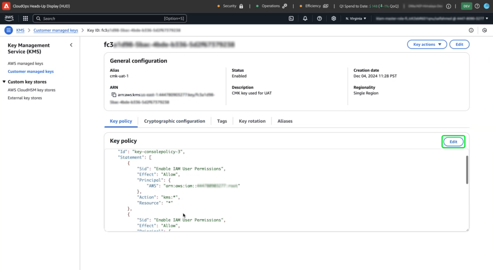

# Configuración de claves gestionadas por el cliente con AWS mediante la interfaz de usuario de Platform

Utilice esta guía para habilitar las claves administradas por el cliente (CMK) para instancias de Platform alojadas en AWS a través de la IU de Platform.

>[!IMPORTANT]
>
>Antes de continuar con esta guía, asegúrese de completar la configuración detallada en el documento [&#39;Configuración de AWS KMS para CMK&#39;](./configure-kms.md).

## Actualice la directiva de clave de AWS para integrar la clave con Experience Platform

Para integrar su clave de AWS con Experience Platform, debe editar el JSON en la sección **[!DNL Key Policy]** del espacio de trabajo de KMS. Una directiva de clave predeterminada tiene un aspecto similar al JSON siguiente.

<!-- The AWS ID below is fake. Q) Can I refer to it simply as AWS_ACCOUNT_ID ? Is that suitable? -->

```JSON
{
  "Id": "key-consolepolicy-3",
  "Version": "2012-10-17",
  "Statement": [
    {
      "Sid": "Enable IAM User Permissions",
      "Effect": "Allow",
      "Principal": {
        "AWS": "arn:aws:iam::123464903283:root" // this is a mock AWS Principal ID, your ID will differ
      },
      "Action": "kms:*",
      "Resource": "*"
    }
  ]
}
```

En el ejemplo anterior, todos los recursos (`"Resource": "*"`) de la misma cuenta (`Principal.AWS`) pueden tener acceso a la clave. Esta directiva permite a los servicios de la cuenta realizar operaciones de cifrado y descifrado, restringidas a la cuenta especificada. Para conceder a la cuenta de un solo inquilino de Platform acceso a esta clave, agregue nuevas instrucciones a la directiva predeterminada de AWS. Puede obtener la política JSON necesaria de la interfaz de usuario de Platform y aplicarla a la clave KMS de AWS para establecer una conexión segura con Adobe Experience Platform.

En la IU de Platform, ve a la sección **[!UICONTROL Administración]** en el carril de navegación izquierdo y selecciona **[!UICONTROL Cifrado]**. En el área de trabajo [!UICONTROL Configuración de cifrado], seleccione **[!UICONTROL Configurar]** en la tarjeta [!UICONTROL Claves administradas por el cliente].


Aparece la configuración [!UICONTROL Claves administradas por el cliente]. Copie el objeto `statement` de la directiva CMK KMS mostrada en [!UICONTROL Claves administradas por el cliente] [!UICONTROL Configuración de cifrado].

<!-- Select the copy icon () to copy the CMK KMS policy to your clipboard. A green pop-up notification confirms that the policy was copied.  -->

<!-- I cannot add the 'and the copy icon highlighted.' to the alt text below as i do not have access to this UI. -->


<!-- This part of the workflow was in contention at the time of the demo.  -->

A continuación, vuelva a AWS KMS Workspace y actualice la directiva clave que se muestra a continuación.


Agregue a la directiva predeterminada las cuatro instrucciones del área de trabajo [!UICONTROL Configuración de cifrado de plataforma], tal como se ve a continuación: `Enable IAM User Permissions`, `CJA Flow IAM User Permissions`, `CJA Integrity IAM User Permissions`, `CJA Oberon IAM User Permissions`.

```json
{
    "Version": "2012-10-17",
    "Id": "key-consolepolicy",
    "Statement": [
        {
            "Sid": "Enable IAM User Permissions",
            "Effect": "Allow",
            "Principal": {
                "AWS": "arn:aws:iam::975049898882:root" // this is a mock AWS Principal ID, your ID will differ
            },
            "Action": [
                "kms:Decrypt",
                "kms:Encrypt",
                "kms:ReEncrypt*",
                "kms:GenerateDataKey*",
                "kms:DescribeKey",
                "kms:CreateGrant"
            ],
            "Resource": "*",
            "Condition": {
                "StringEquals": {
                    "aws:PrincipalAccount": "975049898882" // this is a mock AWS Principal ID, your ID will differ
                }
            }
        },
        {
            "Sid": "CJA Flow IAM User Permissions",
            "Effect": "Allow",
            "Principal": {
                "AWS": "arn:aws:iam::767397686373:root"
            },
            "Action": [
                "kms:Decrypt",
                "kms:Encrypt",
                "kms:ReEncrypt*",
                "kms:GenerateDataKey*",
                "kms:DescribeKey",
                "kms:CreateGrant"
            ],
            "Resource": "*",
            "Condition": {
                "StringEquals": {
                    "aws:PrincipalAccount": "767397686373"
                }
            }
        },
        {
            "Sid": "CJA Integrity IAM User Permissions",
            "Effect": "Allow",
            "Principal": {
                "AWS": "arn:aws:iam::730335345392:root"
            },
            "Action": [
                "kms:Decrypt",
                "kms:Encrypt",
                "kms:ReEncrypt*",
                "kms:GenerateDataKey*",
                "kms:DescribeKey",
                "kms:CreateGrant"
            ],
            "Resource": "*",
            "Condition": {
                "StringEquals": {
                    "aws:PrincipalAccount": "730335345392"
                }
            }
        },
        {
            "Sid": "CJA Oberon IAM User Permissions",
            "Effect": "Allow",
            "Principal": {
                "AWS": "arn:aws:iam::891377157113:root"
            },
            "Action": [
                "kms:Decrypt",
                "kms:Encrypt",
                "kms:ReEncrypt*",
                "kms:GenerateDataKey*",
                "kms:DescribeKey",
                "kms:CreateGrant"
            ],
            "Resource": "*",
            "Condition": {
                "StringEquals": {
                    "aws:PrincipalAccount": "891377157113"
                }
            }
        }
    ]
}
```

Seleccione **[!DNL Finish]** para confirmar la directiva actualizada y crear la clave. La configuración ahora incluye cinco instrucciones, lo que permite que su cuenta de AWS se comunique con Adobe Experience Platform. Los cambios entrarán en vigor inmediatamente.

Aparece el área de trabajo [!DNL Customer Managed Keys] actualizado de AWS [!DNL Key Management Service].

### Añadir detalles de la clave de cifrado de AWS a Platform

A continuación, para habilitar el cifrado, agregue el Nombre de recurso de Amazon (ARN) de la clave a la plataforma [!UICONTROL Configuración de claves administradas por el cliente]. En la sección [!DNL Customer Managed Keys] de AWS, seleccione el alias de su nueva clave en la lista de [!DNL Key Management Service].


Se muestran los detalles de la clave. Todo en AWS tiene un Nombre de recurso de Amazon (ARN) que
es un identificador único que se utiliza para especificar recursos en los servicios de AWS. Sigue un formato estándar: `arn:partition:service:region:account-id:resource`.

Seleccione el icono de copiar para copiar su ARN. Aparecerá un cuadro de diálogo de confirmación.


Ahora, vuelva a la interfaz de usuario de la plataforma [!UICONTROL Configuración de claves administradas por el cliente]. En la sección **[!UICONTROL Agregar detalles de clave de cifrado de AWS]**, agregue un **[!UICONTROL nombre de configuración]** y la clave **[!UICONTROL KMS ARN]** que copió de la interfaz de usuario de AWS.


A continuación, seleccione **[!UICONTROL SAVE]** para enviar el nombre de la configuración, el ARN de la clave KMS e iniciar la validación de la clave.


Ha vuelto al espacio de trabajo [!UICONTROL Configuraciones de cifrado]. El estado de la configuración de cifrado se muestra en la parte inferior de la tarjeta **[!UICONTROL Claves administradas por el cliente]**.


Una vez validada la clave, los identificadores de almacén de claves se añaden al lago de datos y a los almacenes de datos de perfil para todos los entornos limitados.

>[!NOTE]
>
>La duración del proceso depende del tamaño de los datos. Normalmente, el proceso se completa en menos de 24 horas. Cada zona protegida se actualiza normalmente en dos o tres minutos.

## Revocación de claves {#key-revocation}

>[!IMPORTANT]
>
>Comprenda las implicaciones de la revocación de claves en las aplicaciones de flujo descendente antes de revocar cualquier acceso.

Las siguientes son consideraciones clave para la revocación de claves:

- Si se revoca o deshabilita la clave, los datos de Platform no serán accesibles. Esta acción es irreversible y debe realizarse con precaución.
- Tenga en cuenta las escalas de tiempo de propagación cuando se revoque el acceso a las claves de cifrado. Los almacenes de datos primarios se vuelven inaccesibles en unos minutos a 24 horas. No se puede acceder a los almacenes de datos en caché o transitorios en un plazo de siete días.

Para revocar una clave, vaya al espacio de trabajo de AWS KMS. La sección **[!DNL Customer managed keys]** muestra todas las claves disponibles para su cuenta de AWS. Seleccione el alias de la clave en la lista.


Se muestran los detalles de la clave. Para deshabilitar la clave, seleccione **[!DNL Key actions]** y luego **[!DNL Disable]** en el menú desplegable.


Aparecerá un cuadro de diálogo de confirmación. Seleccione **[!DNL Disable key]** para confirmar su elección. El impacto de deshabilitar la clave debe reflejarse en las aplicaciones de Platform y en la interfaz de usuario en un plazo aproximado de cinco minutos.

>[!NOTE]
>
>Una vez deshabilitada la clave, puede volver a habilitarla utilizando el mismo método descrito anteriormente si lo necesita. Esta opción está disponible en el menú desplegable **[!DNL Key actions]**.


Alternativamente, si la clave se utiliza en otros servicios, puede quitar el acceso de Experience Platform directamente desde la directiva de claves. Seleccione **[!UICONTROL Editar]** en la sección **[!DNL Key Policy]**.



Aparecerá la página **[!DNL Edit key policy]**. Resalte y elimine la declaración de directiva, copiada de la interfaz de usuario de Platform, para eliminar los permisos de la aplicación Claves administradas por el cliente. A continuación, seleccione **[!DNL Save changes]** para completar el proceso.


## Rotación de clave {#key-rotation}

AWS ofrece rotación de claves automática y bajo demanda. Para reducir el riesgo de que se comprometan las claves o se cumplan los requisitos de cumplimiento de seguridad, puede generar automáticamente nuevas claves de cifrado bajo demanda o a intervalos regulares. Programe la rotación automática de claves para limitar la duración de una clave y asegurarse de que, si una clave está en peligro, no se pueda utilizar después de la rotación. Aunque los algoritmos de cifrado modernos son muy seguros, la rotación de claves es una medida importante del cumplimiento de la seguridad y demuestra el cumplimiento de las prácticas recomendadas de seguridad.

### Rotación automática de clave {#automatic-key-rotation}

La rotación automática de claves está desactivada de forma predeterminada. Para programar la rotación automática de claves desde el espacio de trabajo de KMS, seleccione la ficha **[!DNL Key rotation]**, seguida de **[!DNL Edit]** en **[!DNL Automatic key rotation section]**.


Aparece el área de trabajo **[!DNL Edit automatic key rotation]**. Aquí, seleccione el botón de opción para activar o desactivar la rotación automática de claves. A continuación, utilice el campo de entrada de texto o el menú desplegable para elegir un periodo de tiempo para la rotación de clave. Seleccione **[!DNL Save]** para confirmar la configuración y volver al área de trabajo de detalles clave.

>[!NOTE]
>
>El período mínimo de rotación de clave es de 90 días y el máximo es de 2560 días.


### Rotación de clave bajo demanda {#on-demand-key-rotation}

Seleccione **[!DNL Rotate Now]** para realizar una rotación de clave inmediata si la clave actual se ve comprometida. AWS limita esta función a 10 rotaciones. Para realizar un mantenimiento regular, programe rotaciones automáticas de claves en su lugar.


## Pasos siguientes

Después de leer este documento, ha aprendido a crear, configurar y administrar claves de cifrado en AWS KMS para Adobe Experience Platform. A continuación, revise las políticas de seguridad y cumplimiento de normas de su organización para implementar las prácticas recomendadas, como programar las rotaciones de claves y garantizar un almacenamiento de claves seguro.
