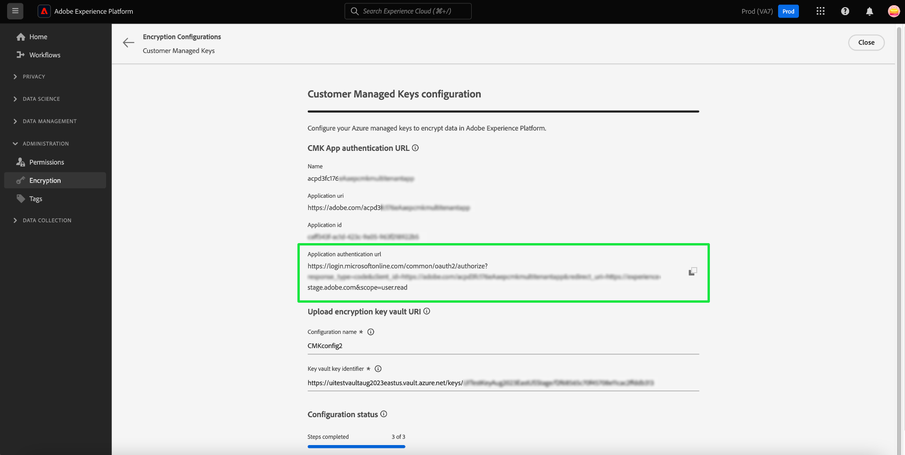

# Configurar las claves administradas por el cliente mediante la IU de Platform

Este documento cubre el proceso para habilitar la función de claves administradas por el cliente (CMK) en Platform mediante la interfaz de usuario de. Para obtener instrucciones sobre cómo completar este proceso mediante la API, consulte el [documento de configuración de API CMK](./api-set-up.md).

## Requisitos previos

Para ver y visitar la sección [!UICONTROL Cifrado] en Adobe Experience Platform, debe haber creado una función y asignado el permiso [!UICONTROL Administrar clave administrada por el cliente] a esa función. Cualquier usuario que tenga el permiso [!UICONTROL Administrar clave administrada por el cliente] puede habilitar CMK para su organización.

Para obtener más información sobre la asignación de funciones y permisos en Experience Platform, consulte la [documentación sobre la configuración de permisos](https://experienceleague.adobe.com/docs/platform-learn/getting-started-for-data-architects-and-data-engineers/configure-permissions.html).

Para habilitar CMK, [[!DNL Azure] Key Vault debe estar configurado](./azure-key-vault-config.md) con la siguiente configuración:

* [Habilitar protección contra purgas](https://learn.microsoft.com/en-us/azure/key-vault/general/soft-delete-overview#purge-protection)
* [Habilitar eliminación suave](https://learn.microsoft.com/en-us/azure/key-vault/general/soft-delete-overview)
* [Configurar el acceso mediante [!DNL Azure] control de acceso basado en roles](https://learn.microsoft.com/en-us/azure/role-based-access-control/)
* [Configurar un  [!DNL Azure] depósito de claves](./azure-key-vault-config.md)

## Configuración de la aplicación CMK {#register-app}

Una vez configurado el almacén de claves, el siguiente paso es registrar la aplicación CMK que se vinculará al inquilino de [!DNL Azure].

### Introducción

Para ver el panel de [!UICONTROL Configuraciones de cifrado], seleccione **[!UICONTROL Cifrado]** en el encabezado de [!UICONTROL Administración] de la barra lateral de navegación izquierda.

Seleccione **[!UICONTROL Configurar]** para abrir la vista de [!UICONTROL configuración de claves administradas por el cliente]. Este espacio de trabajo contiene todos los valores necesarios para completar los pasos que se describen a continuación y realizar la integración con el almacén de claves de Azure.

### Copiar URL de autenticación {#copy-authentication-url}

Para iniciar el proceso de registro, copie la URL de autenticación de la aplicación para su organización de la vista [!UICONTROL Configuración de claves administradas por el cliente] y péguela en el entorno [!DNL Azure] **[!DNL Key Vault Crypto Service Encryption User]**. En la siguiente sección se proporcionan detalles sobre cómo [asignar un rol](#assign-to-role).

Seleccione el icono de copia () por la [!UICONTROL URL de autenticación de aplicación].

]

Copie y pegue la [!UICONTROL URL de autenticación de aplicación] en un explorador para abrir un cuadro de diálogo de autenticación. Seleccione **[!DNL Accept]** para agregar la entidad de seguridad del servicio de aplicaciones CMK a su inquilino [!DNL Azure]. Al confirmar la autenticación, se le redirige a la página de aterrizaje del Experience Cloud.

![Cuadro de diálogo de solicitud de permiso de Microsoft con [!UICONTROL Aceptar] resaltado.](../../images/governance-privacy-security/customer-managed-keys/app-permission.png)

>[!IMPORTANT]
>
>Si tiene varias suscripciones de [!DNL Microsoft Azure], podría conectar la instancia de Platform al almacén de claves incorrecto. En este caso, debe intercambiar la sección `common` del nombre de URL de autenticación de la aplicación por el ID de directorio CMK. Copie el Id. de directorio CMK de la página Configuración de portal, directorios y suscripciones de la aplicación [!DNL Microsoft Azure] ![La página Configuración de portal de aplicaciones, directorios y suscripciones de la aplicación [!DNL Microsoft Azure] con el Id. de directorio resaltado.](../../images/governance-privacy-security/customer-managed-keys/directory-id.png) A continuación, péguelo en la barra de direcciones del explorador. 

### Asignar la aplicación CMK a un rol {#assign-to-role}

Después de completar el proceso de autenticación, vuelva a su [!DNL Azure] Key Vault y seleccione **[!DNL Access control]** en el panel de navegación izquierdo. Desde aquí, seleccione **[!DNL Add]** seguido de **[!DNL Add role assignment]**.

![Se resaltó el panel [!DNL Microsoft Azure] con [!DNL Add] y [!DNL Add role assignment].](../../images/governance-privacy-security/customer-managed-keys/add-role-assignment.png)

La siguiente pantalla le pedirá que elija una función para esta asignación. Seleccione **[!DNL Key Vault Crypto Service Encryption User]** antes de seleccionar **[!DNL Next]** para continuar.

>[!NOTE]
>
>Si tiene el nivel [!DNL Managed-HSM Key Vault], debe seleccionar el rol de usuario **[!DNL Managed HSM Crypto Service Encryption User]**.

![El panel [!DNL Microsoft Azure] con [!DNL Key Vault Crypto Service Encryption User] resaltado.](../../images/governance-privacy-security/customer-managed-keys/select-role.png)

En la siguiente pantalla, elija **[!DNL Select members]** para abrir un cuadro de diálogo en el carril derecho. Utilice la barra de búsqueda para localizar la entidad de seguridad de servicio de la aplicación CMK y seleccionarla en la lista. Cuando termine, seleccione **[!DNL Save]**.

>[!NOTE]
>
>Si no encuentra su aplicación en la lista, no se ha aceptado su entidad de servicio en su inquilino. Para asegurarse de que tiene los privilegios correctos, trabaje con su administrador o representante de [!DNL Azure].

Puede comprobar la aplicación comparando la [!UICONTROL ID de aplicación] proporcionada en la vista de [!UICONTROL configuración de claves administradas por el cliente] con la [!DNL Application ID] proporcionada en la descripción general de la aplicación [!DNL Microsoft Azure].

![Vista de la configuración de claves administradas por el cliente [!UICONTROL con el identificador de aplicación [!UICONTROL resaltado].](../../images/governance-privacy-security/customer-managed-keys/application-id.png)]

Todos los detalles necesarios para verificar las herramientas de Azure se incluyen en la interfaz de usuario de Platform. Este nivel de granularidad se proporciona ya que muchos usuarios desean utilizar otras herramientas de Azure para mejorar su capacidad de monitorizar y registrar el acceso de estas aplicaciones a su almacén de claves. Comprender estos identificadores es fundamental para ese fin y para ayudar a los servicios de Adobe a acceder a la clave.

## Habilitar la configuración de clave de cifrado en el Experience Platform {#send-to-adobe}

Después de instalar la aplicación CMK en [!DNL Azure], puede enviar su identificador de clave de cifrado al Adobe. Seleccione **[!DNL Keys]** en el panel de navegación izquierdo, seguido del nombre de la clave que desea enviar.

![Panel de Microsoft Azure con el objeto [!DNL Keys] y el nombre de clave resaltados.](../../images/governance-privacy-security/customer-managed-keys/select-key.png)

Seleccione la última versión de la clave y aparecerá su página de detalles. Desde aquí puede configurar de forma opcional las operaciones permitidas para la clave.

>[!IMPORTANT]
>
>Las operaciones mínimas requeridas que se permitirán para la clave son los permisos **[!DNL Wrap Key]** y **[!DNL Unwrap Key]**. Puede incluir [!DNL Encrypt], [!DNL Decrypt], [!DNL Sign] y [!DNL Verify], si lo desea.

El campo **[!UICONTROL Identificador de clave]** muestra el identificador URI de la clave. Copie este valor de URI para utilizarlo en el siguiente paso.

![Los detalles de la clave del panel de Microsoft Azure con las secciones [!DNL Permitted operations] y URL de la clave de copia resaltadas.](../../images/governance-privacy-security/customer-managed-keys/copy-key-url.png)

Una vez que haya obtenido [!DNL Key vault URI], vuelva a la vista [!UICONTROL Configuración de claves administradas por el cliente] e introduzca un **[!UICONTROL nombre de configuración]** descriptivo. A continuación, agregue el(la) [!DNL Key Identifier] tomado(a) de la página de detalles de la clave de Azure al **[!UICONTROL identificador de clave de almacén de claves]** y seleccione **[!UICONTROL Guardar]**.

![Se han resaltado las secciones [!UICONTROL Configuración de claves administradas por el cliente] con [!UICONTROL Nombre de configuración] y [!UICONTROL Identificador de clave de almacén de claves].](../../images/governance-privacy-security/customer-managed-keys/configuration-name.png)

Ha vuelto al [!UICONTROL tablero de configuraciones de cifrado]. El estado de la configuración de [!UICONTROL Claves administradas por el cliente] se muestra como [!UICONTROL Procesando].

![El panel de [!UICONTROL configuraciones de cifrado] con [!UICONTROL procesamiento] resaltado en la tarjeta [!UICONTROL Claves administradas por el cliente].](../../images/governance-privacy-security/customer-managed-keys/processing.png)

## Verificar el estado de la configuración {#check-status}

Conceda una cantidad de tiempo considerable para el procesamiento. Para comprobar el estado de la configuración, vuelva a la vista [!UICONTROL Configuración de claves gestionadas por el cliente] y desplácese hacia abajo hasta [!UICONTROL Estado de configuración]. La barra de progreso ha avanzado hasta el paso uno de tres y explica que el sistema está validando que Platform tiene acceso a la clave y al almacén de claves.

Hay cuatro estados potenciales de la configuración de CMK. Son las siguientes:

* Paso 1: Valida que Platform tenga la capacidad de acceder a la clave y al almacén de claves.
* Paso 2: El almacén de claves y el nombre de clave están en proceso de añadirse a todos los almacenes de datos de su organización.
* Paso 3: El almacén de claves y el nombre de clave se han añadido correctamente a los almacenes de datos.
* `FAILED`: se produjo un problema, principalmente relacionado con la clave, el almacén de claves o la configuración de la aplicación de varios inquilinos.

## Pasos siguientes

Al completar los pasos anteriores, ha habilitado correctamente CMK para su organización. Los datos que se incorporan a los almacenes de datos principales ahora se cifrarán y descifrarán con las claves de su almacén de claves [!DNL Azure].
