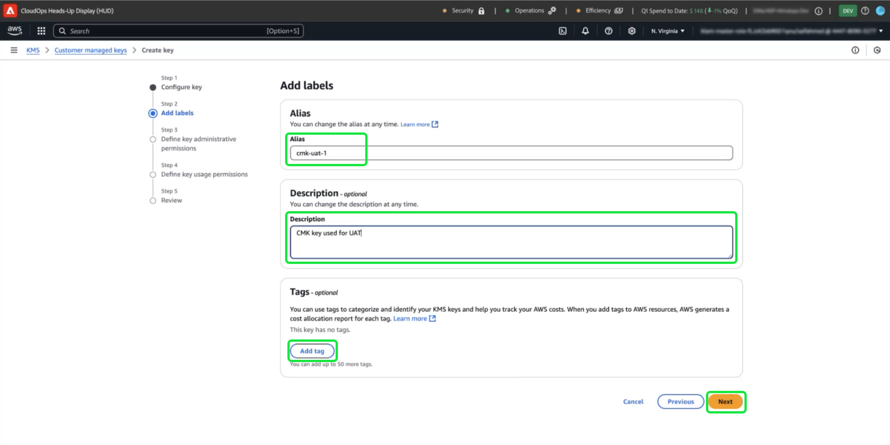

# Cómo utilizar el servicio Amazon Web Service Key Management para el cifrado de datos de Adobe Experience Platform

>[!AVAILABILITY]
>
>Este documento se aplica a las implementaciones de Experience Platform que se ejecutan en Amazon Web Service (AWS). Un Experience Platform que se ejecuta en AWS está disponible actualmente para un número limitado de clientes. Para obtener más información acerca de la infraestructura de Experience Platform compatible, consulte la [descripción general de la nube múltiple de Experience Platform](https://experienceleague.adobe.com/en/docs/experience-platform/landing/multi-cloud).
>
>Las [claves gestionadas por el cliente](../customer-managed-keys/overview.md) (CMK) en AWS son compatibles con Privacy Shield y Security Shield, pero no están disponibles para Healthcare Shield. CMK en Azure es compatible tanto con Privacy Shield como con Security Shield, así como con Healthcare Shield.

Utilice esta guía para proteger los datos con el servicio de administración de claves (KMS) de Amazon Web Service (AWS) mediante la creación, administración y control de claves de cifrado para Adobe Experience Platform. Esta integración simplifica el cumplimiento normativo, optimiza las operaciones mediante la automatización y elimina la necesidad de mantener su propia infraestructura de administración de claves.

Para obtener instrucciones específicas del Customer Journey Analytics, consulte la [documentación de Customer Journey Analytics CMK](https://experienceleague.adobe.com/en/docs/analytics-platform/using/cja-privacy/cmk)

>[!IMPORTANT]
>
>Adobe Experience Platform cifra los datos en reposo de forma predeterminada mediante claves administradas por el sistema. Al habilitar las claves administradas por el cliente (CMK), obtiene el control total de su seguridad de datos. Sin embargo, este cambio es irreversible. Una vez habilitado CMK, no puede volver a las claves administradas por el sistema. Usted es responsable de administrar de forma segura sus claves para garantizar un acceso ininterrumpido a sus datos y evitar posibles inaccesos.

Esta guía detalla el proceso para crear y administrar claves de cifrado en AWS KMS para proteger los datos en Experience Platform.

## Requisitos previos {#prerequisites}

Antes de continuar con este documento, debe comprender bien los siguientes conceptos y capacidades clave:

- **Servicio de administración de claves de AWS (KMS)**: Conozca los aspectos básicos del KMS de AWS, incluyendo cómo crear, administrar y rotar claves de cifrado. Consulte la [documentación oficial de KMS](https://docs.aws.amazon.com/kms/) para obtener más información.
- **Directivas de administración de identidad y acceso (IAM) en AWS**: IAM es un servicio que le permite administrar el acceso a los servicios y recursos de AWS de forma segura. Utilice IAM para:
   - Defina qué usuarios, grupos y funciones tienen acceso a recursos específicos.
   - Especifique qué acciones se permiten o deniegan a los usuarios.
   - Implemente un control de acceso específico asignando permisos mediante directivas de IAM.
Consulte la [documentación oficial de directivas de IAM para AWS KMS](https://docs.aws.amazon.com/kms/latest/developerguide/iam-policies.html) para obtener más información.
- **Seguridad de datos en Experience Platform**: Descubra cómo Platform garantiza la seguridad de los datos e integra servicios externos como AWS KMS para el cifrado. Platform protege los datos con HTTPS TLS v1.2 para el tránsito, el cifrado del proveedor de la nube en reposo, el almacenamiento aislado y las opciones de autenticación y cifrado personalizables. Consulte [información general sobre administración, privacidad y seguridad](../overview.md) o el documento sobre el [cifrado de datos en Platform](../encryption.md) para obtener más información sobre cómo se mantienen seguros sus datos.
- **Consola de administración de AWS**: Un concentrador central donde puede acceder y administrar todos los servicios de AWS desde una aplicación basada en web. Utilice la barra de búsqueda para buscar herramientas rápidamente, comprobar las notificaciones, administrar la cuenta y la facturación, y personalizar la configuración. Consulte la [documentación oficial de AWS management console](https://docs.aws.amazon.com/awsconsolehelpdocs/latest/gsg/what-is.html) para obtener más información.

## Introducción  {#get-started}

Esta guía requiere que ya tenga acceso a una cuenta de Amazon Web Service y a la consola de administración. Siga los pasos a continuación para empezar:

1. **Compruebe los permisos**: Asegúrese de que dispone de los permisos necesarios de AWS Identity and Access Management (IAM) para crear, administrar y utilizar claves de cifrado en KMS. Para comprobar los permisos:
   1. Acceda al [simulador de directivas de IAM](https://policysim.aws.amazon.com/).
   1. Seleccione su cuenta de usuario o función.
   1. Simular acciones de KMS como `kms:CreateKey` o `kms:Encrypt`.
Si la simulación devuelve un error o no está seguro de los permisos, póngase en contacto con el administrador de AWS para obtener ayuda.

1. **Compruebe la configuración de su cuenta de AWS**: confirme que su cuenta de AWS está habilitada para usar los servicios KMS de AWS. La mayoría de las cuentas tienen el acceso a KMS habilitado de manera predeterminada, pero puede revisar la configuración de la cuenta si visita [AWS Management Console](https://aws.amazon.com/console/). Para obtener más información, consulte la [Guía para desarrolladores de AWS Key Management Service](https://docs.aws.amazon.com/kms/latest/developerguide/overview.html).

1. **Seleccione una región compatible**: AWS KMS está disponible en regiones específicas. Asegúrese de que está operando en una región en la que KMS sea compatible. Puede ver una lista completa de las regiones compatibles en la [lista de cuotas y extremos de AWS KMS](https://aws.amazon.com/about-aws/global-infrastructure/regional-product-services/).

### Vaya a AWS KMS para comenzar la configuración de claves

>[!IMPORTANT]
>
>Asegúrese de que el almacenamiento, el acceso y la disponibilidad de las claves de cifrado sean seguros. Usted es responsable de administrar las claves y evitar interrupciones en las operaciones de Platform.

Para comenzar a configurar y administrar la clave de cifrado, inicie sesión en su cuenta de AWS y vaya al Servicio de administración de claves de AWS (KMS). En la consola de administración de AWS y seleccione **Servicio de administración de claves (KMS)** en el menú de servicios.


## Crear una clave nueva {#create-a-key}

Aparece el área de trabajo [!DNL Key Management Service (KMS)]. Seleccione **[!DNL Create a key]**.


## Configuración de las claves {#configure-key}

Aparece el flujo de trabajo [!DNL Configure Key]. De manera predeterminada, el tipo de clave está establecido en **[!DNL Symmetric]** y el uso de la clave está establecido en **[!DNL Encrypt and Decrypt]**. Asegúrese de que estas opciones estén seleccionadas antes de continuar.


Expanda el menú desplegable **[!DNL Advanced options]**. Se recomienda utilizar la opción **[!DNL KMS]**, que permite a AWS crear y administrar el material clave. La opción **[!DNL KMS]** está seleccionada de manera predeterminada.

>[!NOTE]
>
>Si ya tiene una clave, puede importar material de claves externas o utilizar el almacén de claves [!DNL CloudHSM] de AWS. Estas opciones no se tratan en el ámbito de este documento.

A continuación, seleccione la configuración [!DNL Regionality], que especifica el ámbito de región de la clave. Seleccione **[!DNL Single-Region key]**, seguido de **[!DNL Next]** para continuar con el paso dos.

>[!IMPORTANT]
>
>AWS aplica restricciones de región para las claves KMS. Esta restricción de región significa que la clave debe estar en la misma región que la cuenta de Adobe. El Adobe solo puede acceder a las claves KMS ubicadas dentro de la región de la cuenta. Asegúrese de que la región que seleccione coincida con la región de la cuenta de un solo inquilino de Adobe.


## Etiquetado de la clave {#add-labels-and-tags-to-key}

Aparecerá la segunda fase [!DNL Add labels] del flujo de trabajo. Aquí puede configurar los campos [!DNL Alias] y [!DNL Tags] para que le ayuden a administrar y localizar la clave de cifrado desde la consola KMS de AWS.

Escriba una etiqueta descriptiva para la clave en el campo de entrada **[!DNL Alias]**. El alias actúa como un identificador fácil de usar para localizar rápidamente la clave mediante la barra de búsqueda de la consola de AWS KMS. Para evitar confusiones, elija un nombre significativo que refleje el propósito de la clave, como &quot;Adobe-Plataforma-Clave&quot; o &quot;Cliente-Cifrado-Clave&quot;. También puede incluir una descripción de la clave si el alias de la clave no es suficiente para describir su propósito.

Por último, agregue pares de clave-valor en la sección [!DNL Tags] para asignar metadatos a la clave. Este paso es opcional, pero debe agregar etiquetas para categorizar y filtrar los recursos de AWS para facilitar la administración. Por ejemplo, si su organización utiliza varios recursos relacionados con el Adobe, puede etiquetarlos con &quot;Adobe&quot; o &quot;Experience Platform&quot;. Este paso adicional simplifica la búsqueda y administración de todos los recursos asociados en AWS Management Console. Seleccione **[!DNL Add tag]** para iniciar el proceso.

<!-- I do not have an AWS account with which to document the Add tag process as yet. -->

Cuando esté satisfecho con la configuración, seleccione **[!DNL Next]** para continuar con el flujo de trabajo.



## Definición de permisos administrativos clave {#define-key-admins}

Aparece el tercer paso del flujo de trabajo de creación de claves. Para garantizar un acceso seguro y controlado, puede elegir cuál de los usuarios y funciones de IAM puede administrar la clave. Hay dos opciones en este momento: [!DNL Key administrators] y [!DNL Key deletion]. En la sección **[!DNL Key administrators]**, seleccione una o varias casillas de verificación junto al nombre de cualquier usuario o función a la que desee conceder permisos de administrador para esta clave.

>[!NOTE]
>
>No puede crear administradores en esta fase del flujo de trabajo.

En la sección **[!DNL Key deletion]**, active la casilla de verificación para permitir que los administradores de claves tengan derecho a eliminar esta clave. Si no marca la casilla de verificación, los usuarios administrativos no pueden realizar esa operación.

Seleccione **[!DNL Next]** para continuar el flujo de trabajo.


## Concesión de acceso a usuarios clave {#assign-key-users}

En el paso cuatro del flujo de trabajo, puede [!DNL Define key usage permissions]. En la lista **[!DNL Key users]**, active las casillas de verificación de todos los usuarios y roles de IAM para los que desee tener permiso para utilizar esta clave.

Desde esta vista, también puede [!DNL Add another AWS account]; sin embargo, no se recomienda agregar otras cuentas de AWS. Añadir otra cuenta puede introducir riesgos y complicar la administración de permisos para operaciones de cifrado y descifrado. Al mantener la clave asociada a una sola cuenta de AWS, Adobe garantiza una integración segura con el KMS de AWS, minimizando los riesgos y garantizando un funcionamiento fiable.

Seleccione **[!DNL Next]** para continuar el flujo de trabajo.


## Revisar configuración de clave {#review}

Aparecerá la fase de revisión de la configuración de la clave. Compruebe los detalles de clave en las secciones [!DNL Key configuration] y [!DNL Alias and description].

>[!NOTE]
>
>Asegúrese de que la región clave sea la misma que la cuenta de AWS.


### Actualizar la directiva clave para integrar la clave con el Experience Platform

A continuación, edite el JSON en la sección **[!DNL Key Policy]** para integrar la clave con el Experience Platform. Una directiva de clave predeterminada tiene un aspecto similar al JSON siguiente.

<!-- The AWS ID below is fake. Q) Can I refer to it simply as AWS_ACCOUNT_ID ? Is that suitable? -->

```JSON
{
  "Id": "key-consolepolicy-3",
  "Version": "2012-10-17",
  "Statement": [
    {
      "Sid": "Enable IAM User Permissions",
      "Effect": "Allow",
      "Principal": {
        "AWS": "arn:aws:iam::123464903283:root" // this is a mock AWS Principal ID, your ID will differ
      },
      "Action": "kms:*",
      "Resource": "*"
    }
  ]
}
```

En el ejemplo anterior, todos los recursos (`"Resource": "*"`) de la misma cuenta (`Principal.AWS`) pueden tener acceso a esta clave. La directiva permite que otros servicios de la misma cuenta utilicen la clave para realizar el cifrado y el descifrado. Los servicios solo tienen permiso para esta cuenta.

A continuación, conceda a su cuenta de inquilino único de Platform acceso a esta clave añadiendo nuevas instrucciones a esta directiva. Puede obtener la política JSON de la interfaz de usuario de Platform y aplicarla a la clave KMS de AWS para vincularla a la plataforma de forma segura.

Vaya a la IU de Platform. En la sección **[!UICONTROL Administración]** del carril de navegación izquierdo, seleccione **[!UICONTROL Cifrado]**. Aparece el área de trabajo [!UICONTROL Configuración de cifrado]. A continuación, seleccione **[!UICONTROL Configurar]** en la tarjeta [!UICONTROL Claves administradas por el cliente].


Aparece la configuración [!UICONTROL Claves administradas por el cliente]. Seleccione el icono de copia () para copiar la directiva CMK KMS en el portapapeles. Una notificación emergente verde confirma que la directiva se ha copiado.


<!-- This part of the workflow was in contention at the time of the demo.  -->

A continuación, vuelva a AWS KMS Workspace y actualice la directiva clave que se muestra a continuación.


Agregue a la directiva predeterminada las cuatro instrucciones del área de trabajo [!UICONTROL Configuración de cifrado de plataforma], tal como se ve a continuación: `Enable IAM User Permissions`, `CJA Flow IAM User Permissions`, `CJA Integrity IAM User Permissions`, `CJA Oberon IAM User Permissions`.

```json
{
    "Version": "2012-10-17",
    "Id": "key-consolepolicy",
    "Statement": [
        {
            "Sid": "Enable IAM User Permissions",
            "Effect": "Allow",
            "Principal": {
                "AWS": "arn:aws:iam::975049898882:root" // this is a mock AWS Principal ID, your ID will differ
            },
            "Action": [
                "kms:Decrypt",
                "kms:Encrypt",
                "kms:ReEncrypt*",
                "kms:GenerateDataKey*",
                "kms:DescribeKey",
                "kms:CreateGrant"
            ],
            "Resource": "*",
            "Condition": {
                "StringEquals": {
                    "aws:PrincipalAccount": "975049898882" // this is a mock AWS Principal ID, your ID will differ
                }
            }
        },
        {
            "Sid": "CJA Flow IAM User Permissions",
            "Effect": "Allow",
            "Principal": {
                "AWS": "arn:aws:iam::767397686373:root"
            },
            "Action": [
                "kms:Decrypt",
                "kms:Encrypt",
                "kms:ReEncrypt*",
                "kms:GenerateDataKey*",
                "kms:DescribeKey",
                "kms:CreateGrant"
            ],
            "Resource": "*",
            "Condition": {
                "StringEquals": {
                    "aws:PrincipalAccount": "767397686373"
                }
            }
        },
        {
            "Sid": "CJA Integrity IAM User Permissions",
            "Effect": "Allow",
            "Principal": {
                "AWS": "arn:aws:iam::730335345392:root"
            },
            "Action": [
                "kms:Decrypt",
                "kms:Encrypt",
                "kms:ReEncrypt*",
                "kms:GenerateDataKey*",
                "kms:DescribeKey",
                "kms:CreateGrant"
            ],
            "Resource": "*",
            "Condition": {
                "StringEquals": {
                    "aws:PrincipalAccount": "730335345392"
                }
            }
        },
        {
            "Sid": "CJA Oberon IAM User Permissions",
            "Effect": "Allow",
            "Principal": {
                "AWS": "arn:aws:iam::891377157113:root"
            },
            "Action": [
                "kms:Decrypt",
                "kms:Encrypt",
                "kms:ReEncrypt*",
                "kms:GenerateDataKey*",
                "kms:DescribeKey",
                "kms:CreateGrant"
            ],
            "Resource": "*",
            "Condition": {
                "StringEquals": {
                    "aws:PrincipalAccount": "891377157113"
                }
            }
        }
    ]
}
```


Seleccione **[!DNL Finish]** para confirmar los detalles de la clave con la directiva actualizada y crear la clave. La clave y la directiva ahora se han configurado con un total de cinco instrucciones para permitir que su cuenta de AWS se comunique con su cuenta de Experience Platform. El efecto es instantáneo.

Aparece el área de trabajo [!DNL Customer managed keys] actualizado de AWS [!DNL Key Management Service].

### Añadir detalles de la clave de cifrado de AWS a Platform

A continuación, para habilitar el cifrado, agregue el Nombre de recurso de Amazon (ARN) de la clave a la plataforma [!UICONTROL Configuración de claves administradas por el cliente]. En la sección [!DNL Customer Managed Keys] de AWS, seleccione el alias de su nueva clave en la lista de [!DNL Key Management Service].


Se muestran los detalles de la clave. Todo en AWS tiene un Nombre de recurso de Amazon (ARN) que
es un identificador único que se utiliza para especificar recursos en los servicios de AWS. Sigue un formato estándar: `arn:partition:service:region:account-id:resource`.

Seleccione el icono de copiar para copiar su ARN. Aparecerá un cuadro de diálogo de confirmación.


Ahora, vuelva a la interfaz de usuario de la plataforma [!UICONTROL Configuración de claves administradas por el cliente]. En la sección **[!UICONTROL Agregar detalles de clave de cifrado de AWS]**, agregue un **[!UICONTROL nombre de configuración]** y la clave **[!UICONTROL KMS ARN]** que copió de la interfaz de usuario de AWS.


A continuación, seleccione **[!UICONTROL SAVE]** para enviar el nombre de la configuración, el ARN de la clave KMS e iniciar la validación de la clave.


Ha vuelto al espacio de trabajo [!UICONTROL Configuraciones de cifrado]. El estado de la configuración de cifrado se muestra en la parte inferior de la tarjeta **[!UICONTROL Claves administradas por el cliente]**.


Una vez validada la clave, los identificadores de almacén de claves se añaden al lago de datos y a los almacenes de datos de perfil para todos los entornos limitados.

>[!NOTE]
>
>La duración del proceso depende del tamaño de los datos. Normalmente, el proceso se completa en menos de 24 horas. Cada zona protegida se actualiza normalmente en dos o tres minutos.

## Revocación de claves {#key-revocation}

>[!IMPORTANT]
>
>Comprenda las implicaciones de la revocación de claves en las aplicaciones de flujo descendente antes de revocar cualquier acceso.

Las siguientes son consideraciones clave para la revocación de claves:

- Si se revoca o deshabilita la clave, los datos de Platform no serán accesibles. Esta acción es irreversible y debe realizarse con precaución.
- Tenga en cuenta las escalas de tiempo de propagación cuando se revoque el acceso a las claves de cifrado. Los almacenes de datos primarios se vuelven inaccesibles en unos minutos a 24 horas. No se puede acceder a los almacenes de datos en caché o transitorios en un plazo de siete días.

Para revocar una clave, vaya al espacio de trabajo de AWS KMS. La sección **[!DNL Customer managed keys]** muestra todas las claves disponibles para su cuenta de AWS. Seleccione el alias de la clave en la lista.


Se muestran los detalles de la clave. Para deshabilitar la clave, seleccione **[!DNL Key actions]** y luego **[!DNL Disable]** en el menú desplegable.


Aparecerá un cuadro de diálogo de confirmación. Seleccione **[!DNL Disable key]** para confirmar su elección. El impacto de deshabilitar la clave debe reflejarse en las aplicaciones de Platform y en la interfaz de usuario en un plazo aproximado de cinco minutos.

>[!NOTE]
>
>Una vez deshabilitada la clave, puede volver a habilitarla utilizando el mismo método descrito anteriormente si lo necesita. Esta opción está disponible en el menú desplegable **[!DNL Key actions]**.


Alternativamente, si la clave se utiliza en otros servicios, puede quitar el acceso de Experience Platform directamente desde la directiva de claves. Seleccione **[!UICONTROL Editar]** en la sección **[!DNL Key Policy]**.


Aparecerá la página **[!DNL Edit key policy]**. Resalte y elimine la declaración de directiva, copiada de la interfaz de usuario de Platform, para eliminar los permisos de la aplicación Claves administradas por el cliente. A continuación, seleccione **[!DNL Save changes]** para completar el proceso.


## Rotación de clave {#key-rotation}

AWS ofrece rotación de claves automática y bajo demanda. Para reducir el riesgo de que se comprometan las claves o se cumplan los requisitos de cumplimiento de seguridad, puede generar automáticamente nuevas claves de cifrado bajo demanda o a intervalos regulares. Programe la rotación automática de claves para limitar la duración de una clave y asegurarse de que, si una clave está en peligro, no se pueda utilizar después de la rotación. Aunque los algoritmos de cifrado modernos son muy seguros, la rotación de claves es una medida importante del cumplimiento de la seguridad y demuestra el cumplimiento de las prácticas recomendadas de seguridad.

### Rotación automática de clave {#automatic-key-rotation}

La rotación automática de claves está desactivada de forma predeterminada. Para programar la rotación automática de claves desde el espacio de trabajo de KMS, seleccione la ficha **[!DNL Key rotation]**, seguida de **[!DNL Edit]** en **[!DNL Automatic key rotation section]**.


Aparece el área de trabajo **[!DNL Edit automatic key rotation]**. Aquí, seleccione el botón de opción para activar o desactivar la rotación automática de claves. A continuación, utilice el campo de entrada de texto o el menú desplegable para elegir un periodo de tiempo para la rotación de clave. Seleccione **[!DNL Save]** para confirmar la configuración y volver al área de trabajo de detalles clave.

>[!NOTE]
>
>El período mínimo de rotación de clave es de 90 días y el máximo es de 2560 días.


### Rotación de clave bajo demanda {#on-demand-key-rotation}

Si la clave actual está en peligro, seleccione **[!DNL Rotate Now]** para girarla inmediatamente. AWS solo permite 10 rotaciones bajo demanda. Utilice una rotación de clave programada a menos que la seguridad ya se haya visto comprometida.


## Pasos siguientes

Después de leer este documento, ha aprendido a crear, configurar y administrar claves de cifrado en AWS KMS para usarlas con Adobe Experience Platform. Como paso siguiente, considere la posibilidad de revisar las políticas de seguridad y cumplimiento de normas de su organización para garantizar prácticas de administración de claves adecuadas, como la rotación de claves programada y el almacenamiento seguro de claves.
