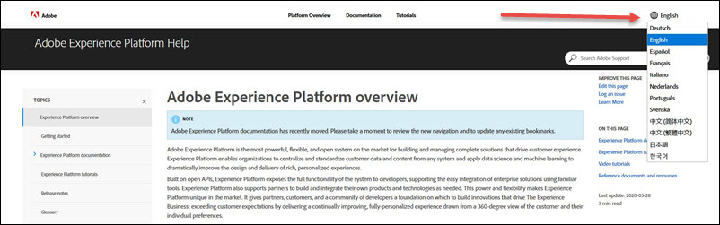

# Información general de Adobe Experience Platform

>[!NOTE]
>
>La documentación de Adobe Experience Platform se ha trasladado recientemente. Tómese un momento para revisar la nueva navegación y actualizar los marcadores existentes.

Adobe Experience Platform es el sistema más potente, flexible y abierto del mercado para crear y administrar soluciones completas que impulsan la experiencia del cliente. [!DNL Experience Platform] les permite a las organizaciones centralizar y estandarizar los datos y el contenido de los clientes de cualquier sistema y aplicar la ciencia de datos y el aprendizaje automático para mejorar en gran medida el diseño y el envío de las experiencias personalizadas enriquecidas.

Basado en API abiertas, [!DNL Experience Platform] expone toda la funcionalidad del sistema a los desarrolladores, lo que permite la fácil integración de soluciones empresariales mediante herramientas conocidas. [!DNL Experience Platform] también ayuda a los asociados a crear e integrar sus propios productos y tecnologías según sea necesario. Este poder y flexibilidad hacen [!DNL Experience Platform] único en el mercado. Ofrece a los socios, clientes y una comunidad de desarrolladores una base sobre la cual construir innovaciones que impulsen el negocio de la experiencia: superar las expectativas de los clientes al ofrecer una experiencia continuamente mejorada y totalmente personalizada, extraída de una vista de 360 grados del cliente y sus preferencias individuales.

En los siguientes vídeos se describe cómo [!DNL Experience Platform] se crean experiencias en tiempo real, importantes y enriquecidas, primero desde la perspectiva del cliente y después desde una perspectiva técnica en segundo plano.

**Perspectiva del cliente:**

>[!VIDEO](https://video.tv.adobe.com/v/27361?quality=12&learn=on)

**Entre bastidores:**

>[!VIDEO](https://video.tv.adobe.com/v/28144?quality=12&learn=on)

## Compatibilidad con navegadores

El Adobe Experience Platform está diseñado para funcionar de forma óptima en las **últimas versiones** de Google Chrome, Safari, Firefox y Microsoft Edge. Es posible que tenga problemas al utilizar determinadas funciones en versiones anteriores de los navegadores.

| Sistema operativo | Navegadores admitidos |
|---|---|
| **Mac OS X** | Google Chrome, Safari, Firefox |
| **Windows 10** | Google Chrome, Microsoft Edge, Firefox |
| **Windows 7** | Google Chrome, Firefox |

Estos sistemas operativos y navegadores no son compatibles:

* Windows 8
* Internet Explorer 10
* Opera

## Compatibilidad con idiomas

La interfaz de usuario y la documentación de Adobe Experience Platform están disponibles en varios idiomas.

### Idiomas de la interfaz de usuario

La interfaz de usuario de Adobe Experience Platform está disponible actualmente en los siguientes idiomas:

* Inglés
* Francés
* Alemán
* Japonés

El idioma predeterminado de la interfaz de usuario está determinado por la región especificada en el perfil del usuario. Para cambiar el idioma:

>[!NOTE]
>
> La selección de una región determina el idioma y el contenido en Adobe.com.

1. Haga clic en el idioma actual en el pie de página de la [!DNL Experience Platform] interfaz.
2. En la configuración de perfil, haga clic en **[!UICONTROL Cambiar región]**.
3. Seleccione su región.

### Idiomas de documentación

La documentación de Adobe Experience Platform está disponible en varios idiomas. Para cambiar el idioma, haga clic en la lista desplegable de idioma y seleccione el idioma que desee.

## [!DNL Experience Platform] documentación

[!DNL Experience Platform] la documentación se proporciona en múltiples formatos para una variedad de funciones y servicios. Para obtener más información sobre los tipos de documentación disponibles, así como para leer breves descripciones de cada uno de los [!DNL Platform] servicios, visite la información general [de la documentación del](documentation/overview.md)Experience Platform. O bien, para empezar a aprender más sobre un [!DNL Platform] servicio específico de inmediato, seleccione una guía de la lista alfabética en el panel de navegación izquierdo.

### Documentación para los servicios de aplicaciones creados sobre [!DNL Experience Platform]

Además de los servicios de navegación de la izquierda, Adobe ha creado otros servicios de aplicaciones sobre Experience Platform. Puede encontrar la documentación de estos servicios en sus propios repositorios de documentación, a continuación:

* [[!Customer Journey Analytics DNL]](https://docs.adobe.com/content/help/es-ES/analytics-platform/using/cja-landing.html)
* [[!Journey Orchestration DNL]](https://docs.adobe.com/content/help/es-ES/journeys/using/journey-orchestration-home.html)

>[!NOTE]
>
>A partir de mayo de 2020, Adobe está publicando actualizaciones en el dominio y la barra de encabezado para unificar y mejorar su experiencia en todas las aplicaciones Experience Cloud. Esto incluye un nuevo menú Ayuda. El nuevo menú Ayuda incluye lo siguiente:
>
>* Vínculos a artículos destacados
>* Recomendaciones de documentación relacionadas con el contexto
>* La capacidad de proporcionar comentarios sobre los problemas [!DNL Experience Platform] y de informes
>* Se mejoraron los resultados de búsqueda que también incluyen resultados de foros de la comunidad y contenido de vídeo.

>
> 
De vez en cuando, puede recibir una encuesta para recibir comentarios adicionales.
>
>Este despliegue es gradual, por lo que es posible que no vea los cambios inmediatamente. Puede realizar la vista de la experiencia actualizada en cualquier momento en [https://experience.adobe.com/platform](https://experience.adobe.com/platform).

## [!DNL Experience Platform] tutoriales

Empiece con [!DNL Platform] rapidez y facilidad siguiendo los tutoriales paso a paso de todo, desde la preparación de los datos para la ingesta hasta algoritmos avanzados de aprendizaje automático. Estos tutoriales se han diseñado para complementar la información que se encuentra en la documentación, de modo que para obtener los mejores resultados, mantenga los documentos disponibles mientras completa los tutoriales. [!DNL Experience Platform] Visite los tutoriales del [Experience Platform](../tutorials/home.md) para empezar.

## Tutoriales de vídeo

Vea [los tutoriales](https://docs.adobe.com/content/help/en/platform-learn/tutorials/overview.html) en vídeo para una amplia variedad de [!DNL Experience Platform] temas.

Para un rápido recorrido por la interfaz de [!DNL Experience Platform's] usuario, vea el siguiente vídeo:

>[!VIDEO](https://video.tv.adobe.com/v/32792?quality=12&learn=on)

## Documentos y recursos de referencia

* [**Notas**](../release-notes/latest/latest.md)  de la versiónBuscar información sobre la versión más reciente y revisar las versiones anteriores [!DNL Experience Platform] .

* [**Glosario**](glossary.md)  Revise la terminología de Adobe Experience Platform.

* [**Guía**](troubleshooting.md)  de solución de problemasEncuentre soluciones para errores comunes y respuestas a preguntas más frecuentes.

* [**Conceptos básicos**](api-fundamentals.md)  de APIsAprenda los conceptos básicos del trabajo con [!DNL Platform] las APIs.

* [**Referencia**](https://www.adobe.io/apis/experienceplatform/home/api-reference.html) de API a las API de [!DNL Experience Platform] Discover, incluidos encabezados, parámetros, solicitudes de muestra y respuestas. *Estos documentos están alojados en E/S de Adobe.*

## Recursos de vídeo de integración de Adobe Experience Platform

[!DNL Experience Platform] utiliza los servicios de aplicación y [!DNL Intelligent Services] integrados sobre [!DNL Experience Platform], para obtener más información, vea el siguiente vídeo:

>[!VIDEO](https://video.tv.adobe.com/v/32554?quality=12&learn=on)

Una de las ventajas clave que ofrece Adobe Experience Platform es su capacidad de integrarse con otros servicios de Adobe existentes. El siguiente vídeo ofrece información general sobre cómo se integran [!DNL Experience Platform] los servicios con [!DNL Experience Cloud] aplicaciones y capacidades como Adobe Analytics, Adobe Target, Adobe Campaign, Adobe Experience Manager [!DNL Customer Attributes], [!DNL Audience Library], y [!DNL Experience Platform Launch].

>[!VIDEO](https://video.tv.adobe.com/v/32553?quality=12&learn=on)

Para obtener información adicional sobre la arquitectura que alimenta a Adobe Experience Platform, vea el siguiente vídeo:

>[!VIDEO](https://video.tv.adobe.com/v/32456?quality=12&learn=on)

### [!DNL Experience Platform] capacidades y casos de uso

Los siguientes vídeos describen las funciones clave y los casos de uso de [!DNL Experience Platform]:

**Competencias:**

>[!VIDEO](https://video.tv.adobe.com/v/32502?quality=12&learn=on)

**Casos de uso:**

>[!VIDEO](https://video.tv.adobe.com/v/32806?quality=12&learn=on)

<!-- 
## What's New

* **[Privacy management](https://helpx.adobe.com/campaign/kb/campaign-privacy.html)** 
Learn about the tools provided by Adobe Campaign to help you with your Privacy compliance.

* **[Delivery best pratices](https://helpx.adobe.com/campaign/kb/delivery-best-practices.html)** 
Learn more on best practices related to delivery design and sending.

* **[Email designer](designing/using/designing-content-in-adobe-campaign.md)** 
Consult the reorganized Email Designer documentation.

* **[Campaign Standard Mobile guide](https://helpx.adobe.com/campaign/kb/acs-mobile.html)** 
Learn more about general guidelines for mobile deliveries.

[Click here for more updates](rn/using/documentation-updates.md)

## Top pages

 <table>
<tr>
  <td valign="top">
    
    

    <a href="administration/using/about-access-management.md"><strong>Roles and security groups</strong></a>
    

    <em>Learn how to define permissions and assign roles to Campaign users.</em>
     
  </td>
  <td valign="top">
    
    

    <a href="designing/using/designing-content-in-adobe-campaign.md"><strong>Design an email</strong></a>
    

    <em>Learn how to use the Email Designer to create responsive and personalized emails</em>
     
  </td>
  <td valign="top">
       
    

    <strong>Resources for developers</strong>
    

    
<em><a href="api/using/about-campaign-standard-apis.md">Adobe Campaign API</a></em>

    
<em><a href="integrating/using/about-adobe-experience-cloud-triggers.md">Adobe Experience Cloud Triggers</a></em>

     
  </td>
</tr>
</table>

## Additional Resources

* [Release notes](rn/using/release-notes.md)

* [Control Panel](https://docs.adobe.com/content/help/en/control-panel/using/control-panel-home.html)

* [How-to videos](https://docs.adobe.com/content/help/en/campaign-learn/campaign-standard-tutorials/overview.html)

* [Release Planning guide](https://helpx.adobe.com/campaign/kb/acs-release-planning.html)

* [Deprecated and Removed Features](https://helpx.adobe.com/campaign/kb/acs-deprecated-and-removed-features.html)

* [Technical notes](https://helpx.adobe.com/campaign/kb/acs-article-list.html)

* [Adobe Campaign Standard Implementation guide](https://helpx.adobe.com/campaign/kb/campaign-standard-implementation-guide.html)
 -->
