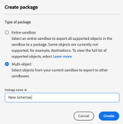
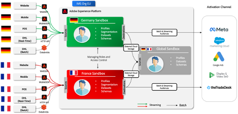
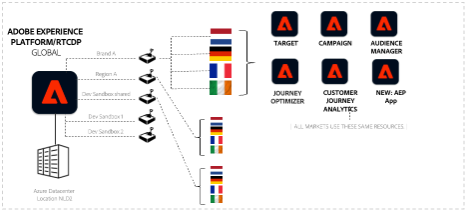

# Adobe Experience Platform para empresas de varias regiones y marcas

## Introducción

Adobe Experience Platform está a la vanguardia de las soluciones transformadoras, lo que le permite aprovechar todo el potencial de los datos y el contenido de sus clientes. Con Experience Platform, puede centralizar y estandarizar datos de diversos sistemas y aplicar el poder de la ciencia de datos y el aprendizaje automático. El resultado es una creación y un envío mejorados de experiencias personalizadas que interesan a sus consumidores.

Experience Platform le permite representar la estructura y controlar los datos de su empresa para implementaciones escalables y flexibles. La implementación de aplicaciones de Platform es un recorrido significativo que requiere planificación estratégica y consideraciones cuidadosas, especialmente si trabaja en dominios globales, regionales y específicos de la marca o en una combinación de todos estos aspectos.

Este documento técnico sirve como referencia y ofrece un punto de vista del producto y un conjunto de directrices. Su objetivo principal es potenciar a usted y a sus equipos de implementación con las herramientas y las perspectivas necesarias para navegar de forma eficaz por las complejidades de Experience Platform. Al proporcionar un marco estructurado para evaluar sus requisitos específicos, consideraciones y casos de uso reales, le proporciona los conocimientos necesarios para desbloquear todo el potencial de Experience Platform y las aplicaciones basadas en plataformas. Al leer las secciones siguientes, encontrará perspectivas y recomendaciones inestimables para optimizar el proceso de implementación y aumentar la capacidad de su organización para ofrecer experiencias excepcionales a su audiencia, a la vez que proporciona la gobernanza y los controles para mantener la privacidad y el cumplimiento.


## Explicación de la empresa de varias marcas y regiones

Si gestiona una empresa con varias marcas y regiones, es probable que tenga requisitos de administración de datos únicos para Experience Platform. Comprender sus distintos requisitos es crucial para adaptar la implementación de Experience Platform a sus necesidades específicas.

Al explorar las opciones de implementación, debe comprender y tener en cuenta los perfiles que interactuarán con Experience Platform y las aplicaciones basadas en plataformas. El diseño de su experiencia en función de sus funciones e intereses garantiza una implementación exitosa. Estas son tres personas clave que debe tener en cuenta a la hora de explorar las opciones:

**Mary, la especialista en mercadotecnia:**

- Enfoque: adquisición de clientes y personalización de experiencias a escala.
- Objetivos: Crear perfiles completos, mejorar la eficacia de los medios.

**Ted, el técnico**

- Enfoque: Administración de datos organizativos.
- Objetivos: Garantizar el cumplimiento, administrar los silos de datos y dar servicio a varias líneas de negocio.

**Dan, el arquitecto de datos**

- Enfoque: precisión y calidad de los datos.
- Objetivos: Garantizar la privacidad y confianza de los datos, diseñar esquemas y modelos de datos y administrar fuentes de datos.

### &#x200B;1. Una empresa que opera con aislamiento de datos limitado

Un principio arquitectónico clave en Experience Platform es aquel en el que los datos del cliente están restringidos a una zona protegida de producción específica en función de las políticas y los requisitos de gobernanza.

Si su organización necesita un entorno de datos único para operar su experiencia de marketing a escala, es posible que prefiera consolidar todos los datos en un único entorno limitado de Experience Platform con requisitos mínimos de aislamiento de datos. Dentro de esta configuración, los datos se incorporan en una zona protegida y todas las identidades relacionadas se representan como un único perfil unificado, ya se identifiquen con un seudónimo o una identidad conocida. Esto significa que sus especialistas en marketing pueden acceder a todos los atributos de perfil y a los datos de evento de experiencia dentro de Experience Platform en toda su empresa. Pueden utilizar estos datos con aplicaciones basadas en plataformas para crear audiencias y recorridos con una necesidad mínima de restringir el uso de todos los datos por parte de los especialistas en marketing, independientemente de la marca o región. Este método facilita la segmentación y la activación de audiencias sin problemas en los destinos admitidos por las aplicaciones de Experience Platform. Esta estrategia funciona bien si su objetivo es aprovechar toda la base de clientes, independientemente de las diferencias regionales o específicas de la marca, para realizar esfuerzos de marketing unificados y coherentes.


#### Cómo funciona esto

Empecemos por planificar su implementación y configurar su entorno de nivel superior. A continuación, decidirá la cantidad de zonas protegidas, funciones y permisos necesarios para utilizar Experience Platform y las aplicaciones basadas en plataformas de forma óptima para su empresa.

##### Configuración general de la implementación

- Configure las zonas protegidas para permitir la creación de perfiles de cliente unificados.
- Configure funciones y controles de acceso para administrar los entornos limitados y el acceso a la funcionalidad para cada perfil.
- Administre el ciclo vital de desarrollo con una zona protegida de desarrollo y herramientas para zonas protegidas.

**Zonas protegidas**

Los zonas protegidas son particiones virtuales en una sola instancia de Experience Platform, lo que permite una integración perfecta con el proceso de desarrollo de sus aplicaciones de experiencia digital. Todo el contenido y las acciones realizadas en un entorno limitado se limitan a dicho entorno limitado y no afectan a ningún otro, incluidos los datos y el acceso a los datos. Existen dos tipos de zonas protegidas compatibles con Experience Platform:

- **Zona protegida de producción**: Una zona protegida de producción está pensada para utilizarse con perfiles en su entorno de producción. Experience Platform le permite crear varios entornos limitados de producción para proporcionar la funcionalidad de datos adecuada y, al mismo tiempo, mantener el aislamiento operativo.

- **Entorno aislado de desarrollo**: un entorno aislado de desarrollo se puede usar exclusivamente para desarrollo y pruebas con perfiles que no sean de producción.

Puede crear varios entornos limitados de cualquier tipo y, para este tipo de empresa, utilizaremos un entorno limitado de producción y uno de desarrollo para ilustrar cómo ejecutar y operar este tipo de empresa.


En el entorno limitado de producción, esperamos que introduzca su perfil de producción y los datos del evento de experiencia para crear un perfil unificado para sus actividades de marketing. Para obtener más información sobre cómo combinar datos conocidos y anónimos de varias fuentes empresariales para crear perfiles de clientes que se puedan usar para ofrecer experiencias de cliente personalizadas en todos los canales y dispositivos en tiempo real, consulte la [documentación de Adobe Real-Time Customer Data Platform](https://experienceleague.adobe.com/es/docs/experience-platform/rtcdp/home).

**Controles de acceso**

Puede definir controles de acceso con funciones y permisos para controlar el acceso a los recursos de la aplicación en función del usuario y de su funcionalidad requerida. Además, tiene la opción de limitar el acceso a campos específicos de los datos de perfil. Piense en este paso en profundidad para gobernar mejor el uso de Experience Platform, las aplicaciones basadas en plataformas y los datos de clientes.

Considere la posibilidad de un ingeniero de datos que puede no necesitar acceso a todas las funcionalidades de las aplicaciones basadas en plataformas y de Experience Platform. Normalmente son responsables de la creación de definiciones de datos (esquemas), la configuración de fuentes de datos para la ingesta de datos y la creación de conjuntos de datos. Sin embargo, es posible que no sean la misma persona que crea y activa audiencias para experiencias de cliente personalizadas. Para este usuario, cree una función, añada los permisos adecuados y conceda acceso solo a la funcionalidad requerida. Por el contrario, un experto en marketing no estaría creando esquemas e ingiriendo datos, sino centrándose en la creación y activación de audiencias para permitir experiencias personalizadas con los clientes.

Si lo desea, puede añadir controles de acceso granulares para limitar el acceso a campos específicos del perfil unificado del cliente con control de acceso basado en atributos o capacidad de control de acceso de nivel de campo. Son mecanismos de gobernanza en Experience Platform que le permiten restringir el acceso a los atributos de datos en función de etiquetas predefinidas. Con el control de acceso a nivel de campo, los datos de identificación personal se pueden controlar y el acceso está restringido en todos los flujos de trabajo de Experience Platform y de la aplicación. Para obtener más información sobre las capacidades de control de acceso, consulte la [documentación de control de acceso](https://experienceleague.adobe.com/en/docs/experience-platform/access-control/home).


**Ciclo de vida de desarrollo con zonas protegidas de desarrollo**

Una zona protegida de desarrollo se comporta del mismo modo que una zona protegida de producción en todos los aspectos funcionales. Es diferente en que tendrá algunas protecciones contractuales para mantenerlo dentro de los límites de su licencia. Está diseñado exclusivamente para desarrollo y pruebas con perfiles que no sean de producción, y admite hasta el 10 % de la asignación de perfiles con licencia (medida acumulativamente en todos los entornos limitados de desarrollo autorizados). Para obtener detalles y protecciones adicionales, consulte la [documentación de información general sobre las zonas protegidas](https://experienceleague.adobe.com/es/docs/experience-platform/sandbox/home) y la [página de descripciones de productos](https://helpx.adobe.com/legal/product-descriptions.html?lang=es) para obtener detalles sobre las autorizaciones.

Puede tener varios entornos limitados de desarrollo (hasta 4 en este ejemplo empresarial, ya que estamos utilizando un entorno limitado de producción) para el ciclo de vida de desarrollo y prueba.

**Exportación e importación de paquetes con herramientas para zonas protegidas**

La función de herramientas de zona protegida permite a los usuarios con los permisos adecuados empaquetar su trabajo desde una zona protegida de desarrollo y exportarlo a un repositorio. Este repositorio es accesible para otros usuarios, que pueden importar estos paquetes en sus zonas protegidas designadas. Esta capacidad garantiza configuraciones coherentes en todas las zonas protegidas, lo que facilita procesos de exportación e importación sin problemas.

El uso de herramientas de zona protegida mejora significativamente la precisión de la configuración y reduce el tiempo necesario para la implementación. Permite el movimiento eficiente de configuraciones exitosas entre diferentes entornos limitados.

Con la función de herramientas de zona protegida, puede seleccionar varios objetos y exportarlos a un paquete. Un paquete puede incluir un solo objeto o varios, pero todos los objetos deben proceder de la misma zona protegida.

**Automatización de espacio aislado mediante API**

Tiene la opción de utilizar las API de Experience Platform para automatizar implementaciones y tareas de configuración de zonas protegidas. Las API permiten un control programable de las tareas repetitivas, como exportar, importar o modificar las configuraciones de la zona protegida, lo que proporciona flexibilidad si prefiere flujos de trabajo automatizados.

Para obtener más información sobre las herramientas de zonas protegidas, consulte la [documentación de herramientas de zonas protegidas](https://experienceleague.adobe.com/en/docs/experience-platform/sandbox/ui/sandbox-tooling).

|  |  |
| --- | --- |

### &#x200B;2. Aislamiento de datos específico de la región o marca

Si necesita un aislamiento completo (por ejemplo, regional o basado en marca), puede operar bajo estrictas políticas de acceso a datos o requisitos legales que restrinjan el acceso de sus equipos de marca a datos específicos de sus respectivas regiones o marcas. Los patrones de acceso se definen en función de la región o los datos específicos de la marca, lo que garantiza el cumplimiento de los protocolos internos, reglamentarios y de control de datos. Este enfoque es crucial si opera en industrias altamente reguladas (por ejemplo, manejo de datos PII) o si necesita mantener datos distintos y segmentados para diferentes regiones geográficas o identidades de marca.


#### Cómo funciona esto

Empecemos por planificar la implementación, configurar el entorno de nivel superior y decidir la cantidad de zonas protegidas, funciones y permisos necesarios para utilizar Experience Platform y las aplicaciones basadas en plataformas de forma óptima para su empresa.

##### Configuración general de la implementación de varias zonas protegidas

- Configure varias zonas protegidas de producción para permitir la creación de perfiles de cliente unificados en cada zona protegida.

- Configure funciones y controles de acceso para administrar los entornos limitados y el acceso a la funcionalidad para cada perfil.

- Administre el ciclo vital de desarrollo con las herramientas de zona protegida.

- Creación de informes y activación globales (agregación de datos de varios entornos limitados para obtener perspectivas entre organizaciones con Customer Journey Analytics).

**Zonas protegidas**

A diferencia de una configuración con una sola zona protegida de producción, puede requerir un enfoque más complejo si necesita un aislamiento completo de los datos y los flujos de trabajo. Aquí es donde entran en juego múltiples zonas protegidas de producción, cada una de las cuales representa una unidad de aislamiento adaptada a sus necesidades específicas.

Como se ha mencionado, cada zona protegida es una partición virtual dentro de una sola instancia de plataforma. Estos entornos limitados le permiten administrar los datos, flujos de trabajo y procesos en un entorno controlado que no interfiere con otros entornos limitados. Aunque los entornos limitados de desarrollo están pensados para actividades de prueba y desarrollo con perfiles que no son de producción, los entornos limitados de producción son la columna vertebral de las operaciones activas y admiten la ingesta de datos de producción reales para actividades de marketing en el mundo real.

Ventajas clave del aislamiento limpio en zonas protegidas de producción:

1. **Gobernanza y cumplimiento de los datos:** Si opera en industrias o regiones reguladas con leyes estrictas de privacidad de datos, debe asegurarse de que los datos de una región o marca permanezcan aislados. Varias zonas protegidas de producción le permiten cumplir con los requisitos de gobernanza o los estándares específicos del sector, asegurándose de que solo se pueda acceder a los datos dentro de la zona protegida adecuada.

2. **Eficiencia operativa:** Al aislar los datos y los flujos de trabajo, puede administrar sus operaciones de manera más eficiente. Sus equipos responsables de diferentes regiones o marcas pueden trabajar de forma independiente dentro de sus zonas protegidas dedicadas sin preocuparse por fugas de datos accidentales o acceso no autorizado.

3. **Flujos de trabajo personalizados:** Puede adaptar cada zona protegida de producción a las necesidades específicas de su región o a la marca que representa. Esto le permite implementar flujos de trabajo, modelos de datos y estrategias de marketing personalizados y optimizados para ese segmento.

4. **Escalabilidad:** A medida que crezca, podrá crear fácilmente zonas protegidas de producción adicionales para acomodar nuevas regiones o marcas. Esta escalabilidad garantiza que la plataforma se pueda adaptar a sus necesidades en evolución sin poner en riesgo la integridad o el rendimiento de los datos.

5. **Control mejorado:** Con varias zonas protegidas de producción, los administradores tienen un control preciso sobre los permisos de acceso, la ingesta de datos y la ejecución del flujo de trabajo. Esto le permite adoptar un enfoque más seguro y organizado para gestionar operaciones complejas en su empresa global.

**Controles de acceso**

En el contexto de varios entornos limitados de producción, los controles de acceso siguen siendo un componente crítico de la administración de datos y flujos de trabajo en Experience Platform. Sin embargo, la complejidad aumenta a medida que los administradores deben asegurarse de que los usuarios solo puedan acceder a los entornos limitados relevantes para sus funciones, al tiempo que siguen habilitando operaciones entre entornos limitados para los usuarios que lo necesiten, como los equipos de marketing que abarcan varias regiones o los ingenieros de datos responsables de la ingesta global de datos y el modelado de datos.

**Definición de funciones y permisos en zonas protegidas:**

Al igual que en el escenario de zona protegida de producción única, puede definir políticas de control de acceso con funciones y permisos adaptados a las necesidades de diferentes personas. Sin embargo, debe tener en cuenta cómo se amplían estas funciones en diferentes entornos limitados de un entorno de varios entornos limitados.

Por ejemplo:

- **Especialistas en marketing regional:** Si sus especialistas en marketing operan en varias regiones, es posible que sus funciones tengan que abarcar más de una zona protegida. Puede concederles los permisos necesarios para acceder a los recursos de varios entornos limitados, asegurándose al mismo tiempo de que su acceso siga limitado a los datos y flujos de trabajo adecuados dentro de cada entorno limitado.

- **Ingenieros de datos:** Es posible que los ingenieros de datos responsables de crear modelos de datos, definir esquemas y administrar la ingesta de datos necesiten acceso a todas las zonas protegidas. Puede diseñar sus funciones para que puedan operar en toda la plataforma y, al mismo tiempo, limitar su acceso solo a las funcionalidades y los datos relevantes para sus tareas. Por ejemplo, el ingeniero de datos que trabaja en modelos de datos para Europa y América del Norte podría acceder a los entornos limitados de producción de estas regiones con permiso para modificar esquemas e introducir datos. Sin embargo, no tendrían la capacidad de acceder a funciones de marketing como crear y activar audiencias.

**Consideraciones granulares de control de acceso:**

En un entorno de zona protegida múltiple, el control de acceso granular se vuelve aún más crítico. El control de acceso basado en atributos (control de acceso de nivel de campo/control de acceso de nivel de objeto) le permite restringir aún más el acceso a campos de datos específicos dentro de perfiles o determinadas audiencias, lo que garantiza que la información confidencial o de identificación personal (PII) esté protegida en todos los entornos limitados. Por ejemplo:

- Puede restringir el acceso a ciertos campos de datos dentro de una zona protegida solo a los usuarios de esa región. Esto garantiza que la PII o los datos confidenciales solo sean visibles para quienes los necesitan, lo que se ajusta a las normas de privacidad y a las políticas de gobernanza interna.

- Para los usuarios con acceso entre zonas protegidas, el control de acceso basado en atributos garantiza que, aunque tengan acceso a varias zonas protegidas, su visibilidad de los datos confidenciales esté limitada por su función y por una base de necesidad de conocer.

Ventajas de los controles de acceso basados en funciones y en atributos:

1. Al controlar el acceso en función de las funciones y los atributos, puede reducir significativamente el riesgo de acceso no autorizado a los datos, asegurándose de que solo aquellos con los permisos adecuados puedan ver o manipular la información confidencial.

2. Las funciones y los permisos claros y bien definidos optimizan las operaciones, ya que cada persona tiene acceso a la funcionalidad y los datos que necesita sin necesidad de desorden ni riesgo innecesarios. Esta claridad admite flujos de trabajo eficientes y reduce la fricción.

3. A medida que su empresa crece y evoluciona, los controles de acceso se pueden ajustar para adaptarse a nuevas regiones, marcas o funciones. La flexibilidad para modificar el acceso sin interrumpir los flujos de trabajo existentes es crucial para escalar las operaciones.

4. Los administradores pueden mantener un control centralizado de todos los entornos limitados, lo que garantiza la coherencia en la forma en que se aplican los controles de acceso en la empresa y, al mismo tiempo, permite la personalización de diferentes regiones o marcas.

**Ciclo de vida de desarrollo con zonas protegidas de desarrollo**

La administración del ciclo de vida de desarrollo en varias regiones y marcas de Experience Platform requiere un enfoque sólido que garantice la coherencia, la eficacia y la escalabilidad. Los entornos limitados de desarrollo admiten el ciclo vital de desarrollo en un entorno complejo con numerosos entornos limitados de producción. Se mejoran mediante la función de herramientas de zona protegida, que permite compartir e implementar una configuración sin problemas en diferentes entornos.

Los entornos limitados de desarrollo desempeñan un papel crucial en el ciclo vital de desarrollo. Estos entornos limitados proporcionan un entorno aislado en el que los desarrolladores y los ingenieros de datos pueden crear, probar e iterar en configuraciones sin afectar a los datos de producción. Aunque funcionalmente son similares a los entornos limitados de producción, estos difieren porque están pensados para pruebas con perfiles que no son de producción y se rigen por límites contractuales, como admitir hasta el 10 % de la asignación de perfiles con licencia en todos los entornos limitados de desarrollo autorizados.

Puede crear varios entornos limitados de desarrollo para admitir equipos o regiones diferentes. Esto permite a cada uno de los equipos experimentar con flujos de trabajo específicos de su región o marca, lo que garantiza que los entornos de producción permanezcan estables y seguros durante el desarrollo. Si tiene muchas zonas protegidas de producción, recomendamos utilizar un grupo de zonas protegidas de desarrollo para admitir varias regiones/marcas.

**Exportación e importación de paquetes con herramientas para zonas protegidas**

La función de herramientas de zona protegida es una herramienta potente si administra varias zonas protegidas. Permite a los desarrolladores, ingenieros de datos y especialistas en marketing empaquetar su trabajo en un entorno limitado de desarrollo, incluidos esquemas, modelos de datos y otras configuraciones, y luego exportarlos a un repositorio. Desde allí, otros usuarios pueden acceder a estos paquetes e importarlos en sus zonas protegidas designadas, lo que facilita el uso compartido y la implementación sin problemas de configuraciones exitosas en toda la empresa.

Por ejemplo, el ingeniero de datos que trabaja en un entorno limitado de desarrollo para la región de América del Norte puede crear un esquema y empaquetarlo con todas sus dependencias. Otro ingeniero de datos de una región diferente, como Europa, puede acceder a este paquete e importarlo en su zona protegida regional. Este proceso garantiza la coherencia en el modelado y la configuración de los datos de toda la empresa, lo que reduce el riesgo de errores y mejora la eficacia operativa.

Ventajas de las herramientas de zona protegida en un entorno de zona protegida múltiple:

1. Las herramientas de zonas protegidas optimizan el ciclo vital de desarrollo al permitir que las configuraciones exitosas se compartan fácilmente en varias zonas protegidas. Esto reduce la duplicación de esfuerzos y garantiza que las prácticas recomendadas se implementen de forma coherente en todas las regiones o marcas.

2. La capacidad de exportar e importar paquetes en diferentes zonas protegidas mejora la interoperabilidad dentro de la empresa. Los equipos de diferentes regiones pueden colaborar de forma más eficaz, lo que garantiza que sus configuraciones se alineen con los objetivos empresariales generales y que, al mismo tiempo, se ajusten a los requisitos regionales o específicos de la marca.

3. A medida que las empresas crecen y añaden más zonas protegidas para dar cabida a nuevas regiones o marcas, las herramientas de zonas protegidas proporcionan la escalabilidad necesaria para administrar estos entornos de forma eficaz. Las nuevas zonas protegidas se pueden configurar rápidamente con los paquetes existentes, lo que acelera el proceso de incorporación y reduce el tiempo necesario para activarse.

4. Mediante el empaquetado de configuraciones y dependencias en una zona protegida de desarrollo y su posterior implementación en zonas protegidas de producción, las empresas pueden garantizar que sus configuraciones sean precisas y coherentes en todos los aspectos. Esto reduce la probabilidad de errores y mejora la fiabilidad general de la plataforma.

5. Con las herramientas de zonas protegidas, la transición del desarrollo a la producción es suave y controlada. Una vez que las configuraciones se han probado y validado en un entorno limitado de desarrollo, se pueden exportar e importar en un entorno limitado de producción con la confianza de que funcionarán según lo esperado.

**Activación y creación de informes globales**

Esto implica agregar datos de varios entornos limitados para obtener perspectivas entre organizaciones, lo que a menudo requiere un entorno limitado de informes dedicado para la integración con Customer Journey Analytics.

Si bien el enfoque de zona protegida de producción múltiple ofrece claramente beneficios de aislamiento para las operaciones regionales y específicas de la marca, también presenta desafíos que requieren soluciones creativas. Un desafío clave es la capacidad de analizar los datos en entornos limitados para fines de creación de informes globales y campañas globales. Las empresas a menudo necesitan comprender el recorrido del cliente a nivel global, lo que implica la integración de datos de varios entornos limitados y la habilitación de esfuerzos de marketing entre entornos limitados. A continuación, esbozamos enfoques para abordar estos desafíos.

**Informes globales entre zonas protegidas**

Cuando una empresa opera con varias zonas protegidas de producción, cada una de las cuales representa una región o marca, el análisis de los datos de los clientes en todas las zonas protegidas se vuelve complejo. Por ejemplo, para crear una vista unificada del recorrido del cliente en diferentes marcas es necesario consolidar los datos de estos entornos aislados.

**Zona protegida global dedicada**



Esta zona protegida actúa como un repositorio central en el que se consolidan los datos de zonas protegidas individuales regionales o específicos de la marca. Una solución común es utilizar el servicio de consulta en cada zona protegida para extraer datos de clientes relevantes. Esto puede incluir perfiles y eventos de experiencia que deben analizarse en diferentes regiones o marcas. Una vez que se preparan los datos de cada simulador para pruebas, se incorporan al simulador para informes globales para su análisis y la creación de audiencias.

Utilice Customer Journey Analytics para realizar análisis de mercado cruzado y entre marcas en los datos agregados en el entorno limitado global para obtener una vista completa de las interacciones de los clientes en todas las marcas y regiones. Esto les permite generar perspectivas valiosas, como la identificación de clientes que interactúan con varias marcas y crean audiencias entre marcas o entre regiones. Estas perspectivas se pueden utilizar para varios fines, como activar estrategias de marketing, personalizar las experiencias de los clientes e impulsar el crecimiento empresarial.

**Uso compartido de audiencias**

El entorno limitado global también permite a los equipos de marketing global definir y administrar audiencias a una escala más amplia. Con las herramientas de zona protegida, estas audiencias globales (solo definiciones, no datos) se pueden exportar desde la zona protegida global a zonas protegidas individuales o regionales, lo que permite a los equipos de marketing local evaluarlas y activarlas en sus respectivos mercados.

Además, puede utilizar Coincidencia de segmentos de Experience Platform, una función de Platform que permite compartir segmentos en zonas protegidas cruzadas (audiencia cualificada) entre diferentes unidades organizativas o entidades comerciales.

Este servicio de uso compartido de segmentos permite que dos o más usuarios intercambien datos de segmentos de una manera segura, controlada y compatible con la privacidad.

Para obtener más información sobre la función Coincidencia de segmentos, consulte la [documentación sobre Coincidencia de segmentos](https://experienceleague.adobe.com/en/docs/experience-platform/segmentation/ui/segment-match/overview).

### 3. Una combinación de enfoques para operaciones globales, regionales y específicas de la marca

Muchas empresas con varias marcas operan a escala global y, como tales, a menudo buscan una combinación de enfoques de administración de datos unificados y aislados. En este escenario, buscan separar los datos de varias regiones o países. Las marcas dentro de la organización pueden esperar operar exclusivamente en los datos asociados con su marca específica, todo dentro de los mismos límites de datos de una geografía o país. Este enfoque permite una gestión centralizada de los datos regionales o nacionales, al tiempo que facilita las operaciones de datos y marketing específicas de la marca. Es un modelo que combina las ventajas de la administración unificada de datos con la necesidad de aislamiento específico de la marca y la región.

Experience Platform, consciente de estos requisitos variables, puede configurarse para proporcionarle una solución de administración de datos flexible y altamente adaptable, que garantice que las empresas de varias marcas y regiones puedan representar su negocio dentro de la plataforma de forma eficaz. Tanto si el objetivo es maximizar los datos colectivos de los clientes, mantener un aislamiento estricto de los datos o lograr un equilibrio entre los dos, Experience Platform está equipado para satisfacer las diversas necesidades de su empresa.



#### Cómo funciona esto

Empecemos por planificar la implementación, configurar el entorno de nivel superior y decidir la cantidad de zonas protegidas, funciones y permisos necesarios para utilizar Experience Platform y las aplicaciones basadas en plataformas de forma óptima para esta empresa.

##### Configuración general de esta empresa

- Configure varias zonas protegidas de producción para permitir la creación de los perfiles de cliente unificados.

- Configure funciones y controles de acceso para administrar los entornos limitados y el acceso a la funcionalidad para cada perfil.

- Configurar el control de acceso basado en atributos: control de acceso de nivel de campo/control de acceso de nivel de objeto para controles granulares sobre atributos de perfil y audiencias.

- Administre el ciclo vital de desarrollo con las herramientas de los entornos limitados y los entornos limitados de desarrollo.

- Informes globales.

**Zonas protegidas**

Configure una zona protegida por marca o región. Consulte las secciones anteriores para crear varias zonas protegidas de producción.

**Controles de acceso**

Roles y permisos de usuario:

- Cree la función &quot;**Marketing—Global**&quot; y conceda permiso para crear, ver y administrar audiencias. Además, esta función obtendrá permiso para ver todos los datos de clientes.

- Cree funciones y conceda acceso solo a determinadas funciones para el usuario adecuado. Por ejemplo, los roles de usuario &quot;**Marketing-Germany**&quot; y &quot;**Marketing-France**&quot; solo obtendrían permiso para crear, ver y administrar audiencias en datos de país habilitados mediante una combinación de control de acceso de nivel de campo, control de acceso de nivel de objeto y audiencias predeterminadas.

- Cree la función &quot;**Technologist—Global**&quot; y conceda los permisos adecuados para crear y administrar esquemas, conjuntos de datos, directivas, orígenes, etc. Esta función sería responsable de toda la administración y configuraciones necesarias.

###### Diseño de esquemas y control de acceso basado en atributos: control de acceso de nivel de campo

**Modelo de datos de experiencia (XDM)**

Un esquema de datos estandarizado en Experience Platform que garantiza una estructura de datos coherente y la interoperabilidad entre todas las aplicaciones basadas en plataformas.

**Control de acceso basado en atributos: control de acceso de nivel de campo y opción de modelado de datos:**

- Cree un modelo de datos para incluir campos XDM específicos del inquilino (PII) que deban restringirse para cada país.

- Cree y aplique etiquetas de país a los campos XDM. Etiquetas = Alemania, Francia, Irlanda, Países Bajos, etc.

- Agregue etiquetas a la función adecuada. Por ejemplo, agregue la etiqueta Alemania a la función &quot;Experto en marketing-Alemania&quot;.

Esquema de perfil individual de XDM:

```
\- PII
\- Germany
    \- name --> Label: "Germany"
    \- email --> Label: "Germany"
    \- birthdate --> Label: "Germany"

\- France
    \- name --> Label: "France"
    \- email --> Label: "France"
    \- birthdate --> Label: "France"

\- Netherland
    \- name --> Label: "Netherland", "Germany"
    \- email --> Label: "Netherland", "Germany"
    \- birthdate --> Label: "Netherland", "Germany"

\- Loyalty
    \- member
    \- registrationDate
```

###### Audiencias: Utilice el control de acceso basado en atributos: Control de acceso de nivel de objeto para controlar el acceso a audiencias específicas de marca/país

**Control de acceso basado en atributos: control de acceso de nivel de objeto para audiencias:**

- Cree audiencias y controle quién puede verlas.

- Cree y aplique etiquetas de país a las audiencias. Etiquetas = Alemania, Francia, Irlanda, Países Bajos, etc.

- Agregue etiquetas a la función adecuada. Por ejemplo, agregue la etiqueta &quot;Alemania&quot; a la función &quot;Experto en marketing-Alemania&quot;.


###### Incluya una audiencia predeterminada al crear audiencias específicas de marca o país

**Audiencia predeterminada: alternativa al control de acceso de nivel de fila:**

- Actualmente, el generador de audiencias le permite incluir audiencias existentes como componentes básicos en el proceso de creación de audiencias.

- El resultado se derivaría de la audiencia, seguido de atributos y eventos.

- No existe ningún mecanismo para añadir automáticamente una o más audiencias en el momento de la composición.


###### Activación y filtrado de perfiles de marca/país

**Opción de directiva de consentimiento personalizado:**

Esto le permite controlar o filtrar perfiles en el momento de la activación:

- Crear una acción de marketing.

- Cree un destino y asocie la acción de marketing.

- Crear una directiva de consentimiento personalizada.

>[!NOTE]
>
> Se requiere el SKU de Privacy and Security Shield para crear directivas de consentimiento.


Complejidad de la directiva de consentimiento y activación de varias marcas:

La administración de la activación de audiencias en varias marcas requiere un control detallado de las políticas de consentimiento, lo que garantiza que se cumplan los requisitos únicos de cada marca. Además, Adobe Privacy and Security Shield (una función de conformidad de Experience Platform que aplica políticas de protección de datos y garantiza la alineación normativa en varios canales de activación) puede imponer limitaciones específicas sobre cómo se aplican las políticas de consentimiento en los distintos canales de activación. Debe evaluar estas consideraciones cuidadosamente e implementar marcos de gobernanza para mantener el cumplimiento y la eficiencia operativa.

También debe navegar cuidadosamente por las complejidades en torno a las configuraciones de políticas de consentimiento y las activaciones específicas del canal. La definición explícita de políticas de consentimiento para cada región o marca y la administración coherente de estas configuraciones es crucial para el cumplimiento y la eficacia operativa.

## Consideraciones generales

En algunos casos, puede optar por implementar Experience Platform y aplicaciones basadas en plataformas en varios ID de organización en lugar de utilizar un único ID de organización con muchos entornos limitados. Este enfoque puede proporcionar beneficios en términos de residencia de datos, seguridad y administración, pero también introduce complejidad. Estas son las consideraciones clave para determinar cuándo puede ser adecuado un enfoque de varias organizaciones.

### Qué es un ID de organización

- Un ID de organización es la implementación de Adobe del protocolo Federated ID y OAuth 2.0.

- Un ID de organización es una recopilación de todas las aplicaciones, usuarios y permisos a los que una organización tiene derechos en sus condiciones contractuales de Adobe.

- Las cuentas de usuario y los permisos se administran mediante el Admin Console de cada organización.

- Los ID de organización también rigen la forma en que las soluciones de Adobe interactúan entre sí. Las soluciones dentro de la misma organización pueden tener interoperabilidad.

- En general, el ID de organización de se implementa en una sola región geográfica.


**ID de varias organizaciones: beneficios y consideraciones&#x200B;**

| Ventajas | Consideraciones |
| -------- | -------------- |
| A continuación se muestra una lista de ventajas de tener varios ID de organización: <ul><li>Flexibilidad para almacenar datos en determinadas regiones globales.</li><li>&#x200B;Separe los inicios de sesión de los usuarios por instancia; es decir, Wholefoods no puede iniciar sesión en Audible&#x200B;.</li><li>Puntos finales de API dedicados que permiten a cada empresa/mercado crear conexiones personalizadas según sea necesario en su propio entorno&#x200B;.</li><li>Cada unidad comercial tendría sus propias claves administradas por el cliente&#x200B;.</li><li>Las solicitudes de RGPD se pueden realizar por unidad de negocio&#x200B;.</li><li>Almacenamiento y computación completamente aislados entre unidades de negocio&#x200B;.</li><li>Alivia algunos límites o protecciones de rendimiento a nivel de organización&#x200B;.</li><li>Más flexibilidad con el aprovisionamiento y la mezcla de SKU entre unidades empresariales. Por ejemplo, una organización puede tener un SKU de Adobe Journey Optimizer diferente a otra organización.</li></ul> | A continuación se indican aspectos que se deben tener en cuenta al tener varios ID de organización: <ul><li>Varios ID de organización para administrar, en lugar de uno&#x200B;.</li><li>Varias instancias/entornos independientes para administrar (integraciones, cargas de datos, etc.).</li><li>&#x200B;Los ECID serán únicos por organización, lo que dificulta la coincidencia de datos entre unidades de negocio&#x200B;.</li><li>Necesitaría migrar/volver a implementar Analytics y Target por organización; pierda el resumen global (si se está utilizando actualmente).&#x200B;</li><li>Se requiere más organización para realizar solicitudes de RGPD entre unidades empresariales&#x200B;.</li><li>Algunas integraciones de aplicaciones basadas en Experience Platform almacenan metadatos a nivel de organización. No todo está &quot;aislado&quot; por zonas protegidas&#x200B;</li><li>El ID de organización está anclado a una región. La ubicación de alojamiento de Adobe AWS actualmente solo está en EE. UU. Adobe no admite la migración de una región de alojamiento a otra&#x200B;</li><li>Edge no tiene en cuenta la zona protegida (para el reenvío de eventos).</li></ul> |

**ID único de organización: beneficios y consideraciones**


| Ventajas | Consideraciones |
| -------- | -------------- |
| A continuación se muestra una lista de ventajas de tener un único ID de organización: <ul><li>Aprovisionar zonas protegidas individuales para crear una separación lógica entre las unidades de negocio dentro de una región implementada</li><li>ID de organización único para que el departamento de TI lo administre para los usuarios, el aprovisionamiento, etc.</li><li>No hay migración de etiquetas de Adobe, Target, Analytics y mucho más si se quedan en el mismo ID de organización.</li><li>No se requiere restablecimiento para los ECID existentes: evita el &quot;acantilado&quot; en los datos de Adobe Analytics.</li><li>Inicio de sesión único para recursos de marketing global.</li><li>Derechos de acceso del usuario para controlar quién tiene acceso a qué zonas protegidas, con niveles adecuados de control de acceso basado en funciones.</li><li>Aproveche las instancias de Global Analytics y Target y los datos del grupo de informes.</li></ul> | A continuación se indican aspectos que se deben tener en cuenta al tener un solo ID de organización: <ul><li>Los datos se almacenan en una sola región.</li><li>Posible necesidad de consolidar datos en un único ID de organización.</li><li>Todas las unidades de negocio compartirían la misma infraestructura entre aplicaciones (Experience Platform principal, Real-Time CDP, Adobe Journey Optimizer, Customer Journey Analytics).</li><li>Protecciones: algunas son globales por organización, como la segmentación de streaming, que tiene 1500 RPS.</li><li>Las solicitudes de RGPD operan en el nivel de organización y no se pueden dirigir a zonas protegidas específicas.</li><li>Las claves administradas por el cliente se establecen en el nivel de ID de organización. Todos los entornos limitados de unidades empresariales compartirían la misma clave de cifrado con este método.</li><li>Necesitará claridad sobre las licencias empresariales en DX y CC para garantizar que las aplicaciones se aprovisionan en los ID de organización correctos.</ul></li> |

**Ventajas y consideraciones**

Varios ID de organización rigen el acceso de los usuarios, los derechos y la segregación de datos a nivel de organización en comparación con un único ID de organización, que rige a nivel de zona protegida.

| Escenario/requisito | ID de varias organizaciones | Varias zonas protegidas (un solo ID de organización) |
| ----------------------------------- | --------------------------------------------------- | ----------------------------------------------- |
| Residencia de datos | Aislamiento completo e ID de organización específicos de la región | Implementación de una sola región |
| Gobernanza y aislamiento de datos | Separación y aislamiento completos | Aislamiento operativo, ID de organización compartido |
| Administración del cumplimiento (por ejemplo, RGPD) | Solicitudes independientes por ID de organización | La solicitud única se aplica a todos los entornos limitados |
| Coste de infraestructura y licencias | Potencialmente superior debido a la configuración duplicada | Normalmente inferior con administración centralizada |
| Creación de informes y activación globales | Desafiante debido a entornos aislados | Informes y activación entre regiones más sencillos |
| Complejidad administrativa | Mayor debido a varios ID de organización aislados | Administración centralizada y más baja |

## Conclusión resumida

Experience Platform proporciona a las empresas un marco sólido para centralizar, gobernar y activar los datos de los clientes en modelos empresariales de varias marcas y regiones. En este documento técnico se han explorado las estrategias de implementación clave, los modelos de gobernanza y las prácticas recomendadas para optimizar la implementación de Experience Platform para organizaciones con diferentes necesidades operativas y de aislamiento de datos.

## Puntos clave

1. **Modelos de implementación flexibles**

   - Las empresas pueden elegir entre **enfoques de zona protegida única, zona protegida múltiple o híbridos** según sus requisitos operacionales, de cumplimiento normativo y de gobernanza.

   - **Las organizaciones globales** pueden requerir varias zonas protegidas de producción para cumplir con los requisitos de gobernanza y, al mismo tiempo, mantener la eficiencia operativa.

2. **Control de acceso y gobernanza de datos**

   - **El control de acceso basado en atributos, el control de acceso de nivel de campo y el control de acceso de nivel de objeto** permiten un control preciso del acceso a datos.

   - Debe definir **funciones y permisos claros** para diferentes personalidades (por ejemplo, especialistas en marketing, arquitectos de datos y equipos de TI) para garantizar un uso de datos adecuado.

3. **Automatización y herramientas de espacio aislado**

   - **Las herramientas de espacio aislado** simplifican la administración de la configuración, lo que permite a los equipos exportar e importar la configuración de manera eficiente.

   - La **automatización basada en API** es una opción disponible para las empresas que buscan optimizar las implementaciones y el control de las zonas protegidas a escala.

4. **Estrategias globales de creación de informes y activación**

   - Las empresas que aprovechan **Customer Journey Analytics** deben considerar la sincronización de datos y las implicaciones comerciales al consolidar los informes globales.

   - **Coincidencia de segmentos** proporciona un mecanismo compatible con la privacidad para el uso compartido de audiencias en zonas protegidas múltiples, lo que garantiza activaciones de marketing sin problemas.

5. **ID de varias organizaciones frente a consideraciones de varias zonas protegidas**

   - Debe evaluar cuidadosamente si implementar **varios ID de organización o varios entornos limitados** en función de la residencia de datos, el cumplimiento y las necesidades operacionales.

   - **ID de organización** ofrecen aislamiento total&#x200B;**, mientras que las configuraciones de varias zonas protegidas proporcionan flexibilidad operativa dentro de un marco de gobernanza compartido**.

## Pensamientos finales

A medida que las empresas escalan sus capacidades de experiencia digital, Experience Platform sirve como plataforma fundamental para impulsar el marketing basado en datos, el conocimiento del cliente y las activaciones en canales múltiples. Una implementación exitosa requiere una planificación cuidadosa del control de **espacio aislado, las políticas de cumplimiento y los flujos de trabajo operativos** para garantizar la eficiencia y escalabilidad a largo plazo.

Si aprovecha las prácticas recomendadas descritas en este documento técnico, puede **optimizar Experience Platform para operaciones de varias marcas y regiones**, lo que garantiza una administración de datos, conformidad y experiencias de cliente personalizadas a escala sin problemas.

## Confirmación

Este documento técnico se desarrolló con perspectivas y comentarios de expertos en la materia de varios equipos, lo que garantiza precisión, claridad y orientación práctica. Agradecemos a todos los colegas sus valiosas aportaciones y su examen. Su experiencia ha ayudado a perfeccionar este documento para servir mejor a las empresas que implementan Adobe Experience Platform en entornos de varias marcas y regiones.
