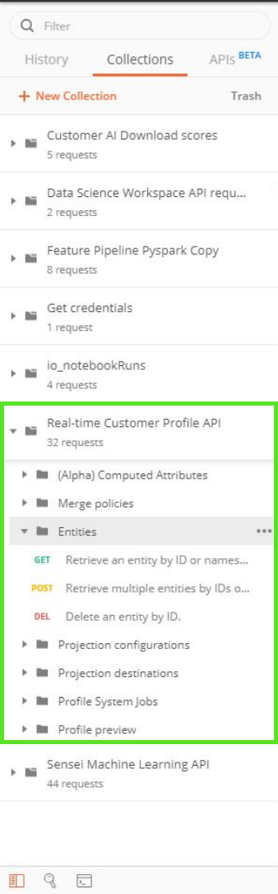

# Postman en Adobe Experience Platform

Postman es una plataforma de colaboración para el desarrollo de API que le permite configurar entornos con variables preestablecidas, compartir colecciones de API, optimizar solicitudes de CRUD y mucho más. La mayoría de los servicios de API de Platform tienen colecciones de Postman que se pueden utilizar para ayudar a realizar llamadas de API.

## Cómo configurar un entorno de Postman para Experience Platform

La siguiente guía de vídeo describe la creación y configuración de su entorno de Postman. Un entorno de Postman contiene todos los encabezados necesarios para realizar llamadas de API a las distintas colecciones que se proporcionan a continuación. Una vez configurada, cada vez que caduca un valor (como un `ACCESS_TOKEN`) puede actualizar el valor actual en el entorno y este nuevo valor se utiliza en todas las colecciones.

>[!VIDEO](https://video.tv.adobe.com/v/28832)

## Colecciones de Postman {#collections}

Puede encontrar una carpeta que contenga todas las colecciones de Postman disponibles en, visitando la [Experience Platform Postman muestra el repositorio de GitHub](https://github.com/adobe/experience-platform-postman-samples/tree/master/apis/experience-platform). También puede encontrar un vínculo a la colección Postman en cada archivo swagger individual del [Documentación de referencia del API](https://www.adobe.com/go/platform-api-reference-en) en el Adobe I/O.

Para descargar una colección de Postman, seleccione **[!DNL Raw]** desde la página de GitHub para cargar el archivo JSON sin procesar en una nueva pestaña. A continuación, haga clic con el botón derecho y seleccione **[!DNL Save as]** para guardar el archivo en un destino local de su elección.

## Importar una colección de Postman {#import}

Para utilizar un [Colección Postman](#collections), debe tener un entorno configurado. Una vez que haya completado la configuración del entorno, seleccione **[!DNL Manage Environments]** en la esquina superior derecha.

Aparece una ventana emergente que muestra todos los entornos actuales. Para importar una colección, seleccione **[!DNL import]** .

Se le pedirá que elija un archivo para importar. Seleccione el archivo de recopilación de Postman que desea importar. Una vez seleccionada, la colección se rellena en el carril izquierdo bajo la pestaña Colecciones.

Cada colección tiene diferentes pares de clave-valor que pueden ser necesarios para realizar una operación CRUD correcta. Revise el perfil del servicio [Guía para desarrolladores de API](api-guide.md#api-guides) para obtener información sobre los valores necesarios, sugerencias y ver ejemplos.

Para obtener más información acerca de la interfaz de usuario de Postman y sus funciones disponibles, visite la [Documentación de Postman](https://learning.postman.com/docs/getting-started/navigating-postman/).

### Generación de un token de acceso con Postman para uso que no sea de producción

>[!WARNING]
>
>Como se indica en la colección Postman del servicio Identity Management (IMS), los métodos de generación indicados son adecuados para **uso sin producción**. La firma local carga una biblioteca JavaScript desde un host de terceros y la firma remota envía la clave privada a un servicio web que es propiedad de Adobe y que gestiona este. Aunque la Adobe de no almacena esta clave privada, las claves de producción nunca deben compartirse con nadie.

El siguiente vídeo utiliza el [Colección de Postman del servicio Identity Management (IMS)](https://github.com/adobe/experience-platform-postman-samples/blob/master/apis/ims/Identity%20Management%20Service.postman_collection.json) que se puede descargar del repositorio público de GitHub.

>[!VIDEO](https://video.tv.adobe.com/v/29698/?quality=12&learn=on)

## Pasos siguientes

Este documento presentaba entornos, colecciones y cómo importar colecciones de Postman. Ahora que Postman está listo, visite la [Guía de introducción a Platform](api-guide.md) para obtener información sobre los encabezados necesarios, ejemplos y una lista de [Guías de API](api-guide.md#api-guides) disponible para cada servicio de Platform.
