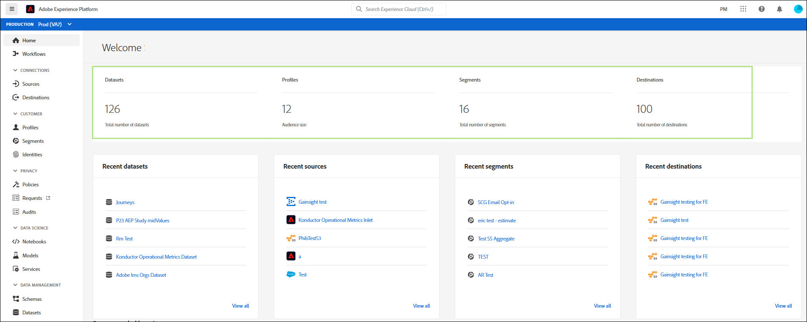
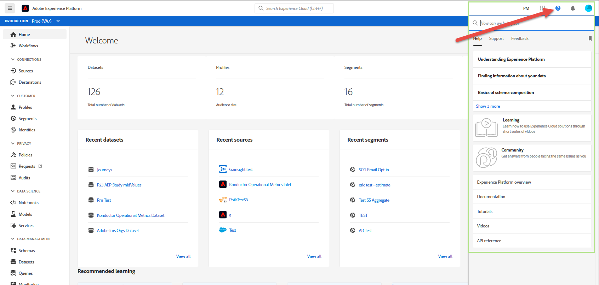

# Guía de la interfaz de usuario de Adobe Experience Platform

Esta guía sirve como introducción al uso de la interfaz de usuario (IU) de Adobe Experience Platform, explica para qué se utilizan los distintos componentes y proporciona vínculos a documentación adicional para obtener más información.

Para obtener más información sobre Adobe Experience Platform, lea la descripción general [del](./home.md)Experience Platform.

## Pantalla principal

Después de iniciar sesión en Adobe Experience Platform, llegará a la página [!UICONTROL principal] , que está compuesta por el panel de métricas, los datos recientes y las secciones de aprendizaje recomendadas.

### Panel de métricas

El panel de métricas proporciona tarjetas que le proporcionan información sobre conjuntos de datos, perfiles, segmentos y destinos dentro de su organización.

La sección **[!UICONTROL Conjuntos]** de datos muestra el número de conjuntos de datos dentro de la organización de IMS. Este número se actualiza cuando se crea un nuevo conjunto de datos. Encontrará más información sobre los conjuntos de datos en la descripción general [de](../catalog/datasets/overview.md)conjuntos de datos.

La sección **[!UICONTROL Perfiles]** muestra el número total de personas con perfiles dentro de la organización de IMS, excluyendo los fragmentos de perfil. Este número total de personas representa la audiencia direccionable total y se actualiza una vez cada 24 horas. Encontrará más información sobre perfiles en la descripción general [del Perfil del cliente en tiempo](../profile/home.md)real.

La sección **[!UICONTROL Segmentos]** muestra el número total de segmentos creados dentro de la organización de IMS. Este número se actualiza cuando se crea un nuevo segmento. Encontrará más información sobre los segmentos en la descripción general [del servicio](../segmentation/home.md)de segmentación.

La sección **[!UICONTROL Destinos]** muestra el número total de destinos creados para la organización de IMS. Este número se actualiza cuando se crea un nuevo destino. Encontrará más información sobre los destinos en la descripción general [de](../destinations/home.md)los destinos.

### Datos recientes

El panel de datos reciente proporciona información sobre conjuntos de datos, fuentes, segmentos y destinos creados recientemente.

La sección datasets **** recientes lista los cinco conjuntos de datos creados más recientemente dentro de la organización de IMS. Esta lista se actualiza cada vez que se crea un nuevo conjunto de datos. Puede seleccionar un conjunto de datos de la lista para obtener más información sobre el conjunto de datos especificado o seleccionar **[!UICONTROL Vista todo]** para ver una lista de todos los conjuntos de datos creados. Encontrará más información sobre los conjuntos de datos en la descripción general [de](../catalog/datasets/overview.md)conjuntos de datos.

La sección Fuentes **** recientes lista los cinco conectores de origen creados más recientemente en la organización de IMS. Esta lista se actualiza cada vez que se crea un nuevo conector de origen. Puede seleccionar una conexión de origen de la lista para vista más información sobre el conector especificado o seleccionar **[!UICONTROL Vista total]** para ver una lista de todas las conexiones de origen creadas. Puede encontrar más información sobre las fuentes en la descripción general [de](../sources/home.md)las fuentes.

La sección Segmentos **** recientes lista las cinco definiciones de segmentos creadas más recientemente dentro de la organización de IMS. Esta lista se actualiza cada vez que se crea una nueva definición de segmento. Puede seleccionar una definición de segmento de la lista para obtener más información sobre la definición de segmento especificada o seleccionar **[!UICONTROL Vista total]** para ver una lista de todas las definiciones de segmento creadas. Encontrará más información sobre los segmentos en la descripción general [del servicio](../segmentation/home.md)de segmentación.

La sección Destinos **** recientes lista los cinco destinos creados más recientemente en la organización de IMS. Esta lista se actualiza cada vez que se crea un nuevo destino. Puede seleccionar un destino de la lista a la vista para obtener más información sobre el destino especificado o seleccionar **[!UICONTROL Vista todo]** para ver una lista de todos los destinos creados. Encontrará más información sobre los destinos en la descripción general [de](../destinations/home.md)los destinos.

### Aprendizaje recomendado

La sección **[!UICONTROL Aprendizaje]** recomendado proporciona vínculos a documentación útil para empezar a usar Adobe Experience Platform.

## Barra de navegación superior

La barra de navegación superior de la interfaz de usuario de la plataforma muestra la organización de IMS en la que ha iniciado sesión y proporciona varios controles importantes.

En el lado izquierdo de la barra de navegación está el logotipo de Adobe Experience Platform. Si selecciona esta opción, volverá a la pantalla de inicio de la interfaz de usuario de la plataforma.

### Mezclador de organización IMS

El primer elemento de la parte derecha de la barra de navegación es el conmutador **de organización de** IMS.

Al seleccionar el conmutador, se abre un menú desplegable de las organizaciones de IMS a las que tiene acceso, si hay alguna disponible. Seleccione una opción de la lista para cambiar a esa organización de IMS.

### Cambiar aplicaciones

El siguiente elemento del lado derecho es el conmutador **de** aplicaciones, representado por el icono del conmutador  aplicaciones. Al seleccionar este icono, puede cambiar entre Experience Platform, Recursos, Exchange e Launch.

### Ayuda

A la derecha del conmutador de aplicaciones se encuentra el menú **de** ayuda y soporte, que se representa mediante el icono de  . Al seleccionar este icono, aparece un menú emergente que contiene varios recursos de ayuda y asistencia. La ficha **[!UICONTROL Ayuda]** muestra una lista de la documentación relevante de la página en la que se encuentra actualmente. La ficha **[!UICONTROL Asistencia]** le permite crear un ticket de asistencia técnica con el equipo de asistencia de Adobe. La ficha **[!UICONTROL Comentarios]** le permite enviar comentarios sobre la plataforma a Adobe.

### Notificaciones y anuncios

Después del menú de ayuda y asistencia técnica se encuentra la sección **de** notificaciones, que está representada por el icono de  . La ficha **[!UICONTROL Notificaciones]** muestra información importante sobre el producto y otras actualizaciones relevantes, mientras que la ficha **[!UICONTROL Anuncios]** muestra notificaciones sobre el mantenimiento del servicio.

### Perfil del usuario

El último elemento de la barra de navegación superior es la configuración **del** usuario, que se representa mediante el icono de configuración del  del usuario. Seleccione este icono para editar sus preferencias o cerrar sesión.

### Sandboxes

Inmediatamente debajo de la barra de navegación superior se encuentra la barra del simulador de pruebas. Esta barra muestra el simulador para pruebas que está utilizando actualmente para la plataforma. Encontrará más información sobre los entornos limitados en la descripción general [de los](../sandboxes/home.md)entornos limitados.

## Navegación izquierda {#left-nav}

La navegación de la parte izquierda de la pantalla lista todos los diferentes servicios admitidos en la interfaz de usuario de la plataforma.

>[!IMPORTANT]
>
>Es posible que algunas secciones de la barra de navegación izquierda no aparezcan o estén atenuadas. Esto se debe a que no tiene acceso a esas funciones. Si cree que debería tener acceso a estas secciones, póngase en contacto con el administrador del sistema.

La sección **[!UICONTROL Inicio]** permite volver a la página principal de la interfaz de usuario de la plataforma.

La sección **[!UICONTROL Flujos de trabajo]** muestra una lista de flujos de trabajo de varios pasos para realizar operaciones dentro de la plataforma. Encontrará más información sobre flujos de trabajo en la descripción general [de](./workflows.md)flujos de trabajo.

### [!UICONTROL Conexiones]

La sección **[!UICONTROL Fuentes]** le permite crear, actualizar y eliminar conexiones de origen, lo que le permite transferir datos de fuentes externas a la plataforma. Puede encontrar más información sobre las fuentes en la descripción general [de](../sources/home.md)las fuentes.

La sección **[!UICONTROL Destinos]** le permite crear, actualizar y eliminar destinos, lo que le permite exportar datos desde la plataforma a muchos destinos externos. Encontrará más información sobre los destinos en la descripción general [de](../destinations/home.md)los destinos.

### [!UICONTROL Cliente]

La sección **[!UICONTROL Perfiles]** permite examinar perfiles de clientes, métricas de perfiles de vista, crear y administrar políticas de combinación y esquemas de unión de vistas. Para obtener más información sobre el uso de la sección [!UICONTROL Perfiles] , lea la guía del [[!DNL Profile] usuario](../profile/ui/user-guide.md). Encontrará más información sobre el Perfil de clientes en tiempo real en la descripción general [del Perfil de clientes en tiempo](../profile/home.md)real.

La sección **[!UICONTROL Segmentos]** permite crear y administrar definiciones de segmentos. Para obtener más información sobre el uso de la sección [!UICONTROL Segmentos] , lea la guía [del usuario de](../segmentation/ui/overview.md)segmentación. Encontrará más información sobre el servicio de segmentación en la descripción general [del servicio](../segmentation/home.md)de segmentación.

La sección **[!UICONTROL Identidades]** permite crear y administrar Áreas de nombres de identidad. Para obtener más información sobre la sección [!UICONTROL Identidades] , incluida información sobre Áreas de nombres de identidad y cómo utilizar identidades en la interfaz de usuario de la plataforma, consulte la información general [de la Área de nombres de](../identity-service/namespaces.md)identidad.

### [!UICONTROL Privacidad]

La sección **[!UICONTROL Políticas]** permite crear y administrar políticas de uso de datos. Para obtener más información sobre el uso de la sección Directivas, lea la guía [del usuario de directivas de uso de](../data-governance/policies/user-guide.md)datos. Puede encontrar más información sobre las políticas de uso de datos en la descripción general [de las políticas de uso de](../data-governance/policies/overview.md)datos.

La sección **[!UICONTROL Solicitudes]** permite crear y administrar solicitudes de privacidad. Tenga en cuenta que debe estar incluido en la lista de permitidos para tener acceso a la interfaz de usuario del Privacy Service. Para obtener más información sobre el uso de la sección Solicitudes, lea la guía [del usuario del](../privacy-service/ui/user-guide.md)Privacy Service. Encontrará más información sobre Privacy Service en la descripción general del [Privacy Service](../privacy-service/home.md).

### [!UICONTROL Ciencia de datos]

La sección **[!UICONTROL Equipos portátiles]** proporciona acceso a JupyterLab, un entorno de desarrollo interactivo que le permite explorar, analizar y modelar sus datos. Para obtener más información sobre el uso de la sección Equipos portátiles, lea la guía [del usuario de](../data-science-workspace/jupyterlab/overview.md)JupyterLab. Encontrará más información sobre el espacio de trabajo de ciencias de la [información en la descripción general del espacio de trabajo de ciencias de la información](../data-science-workspace/home.md)

La sección **[!UICONTROL Modelos]** le permite aprovechar el aprendizaje automático y la inteligencia artificial para crear, desarrollar, entrenar y ajustar modelos para hacer predicciones. Encontrará más información sobre la sección Modelos en el tutorial sobre [formación y evaluación de un modelo](../data-science-workspace/models-recipes/train-evaluate-model-ui.md).

La sección **[!UICONTROL Servicios]** le permite administrar los modelos publicados para la formación y la puntuación programadas, o aprovechar los servicios inteligentes de Adobe, un conjunto de servicios de AI que ofrecen experiencias personalizadas en tiempo real. Encontrará más información sobre la sección Servicios en el tutorial Publicación de un modelo como servicio.

### [!UICONTROL Gestión de datos]

La sección **[!UICONTROL Esquemas]** permite crear y administrar esquemas del modelo de datos de experiencia (XDM). Para obtener más información sobre esquemas, lea el tutorial sobre la [creación de esquemas](../xdm/tutorials/create-schema-ui.md). Encontrará más información sobre XDM en la descripción general [del sistema](../xdm/home.md)XDM.

La sección **[!UICONTROL Conjuntos]** de datos permite crear y administrar conjuntos de datos. Encontrará más información sobre los conjuntos de datos en la guía [del usuario de](../catalog/datasets/user-guide.md)conjuntos de datos.

La sección **[!UICONTROL Consultas]** le permite crear y administrar consultas, registrar consultas SQL realizadas por el servicio de Consulta de Adobe Experience Platform y vista sus credenciales PostgreSQL. Puede encontrar más información sobre consultas en la guía [del usuario del servicio de](../query-service/ui/overview.md)Consulta.

La sección **[!UICONTROL Monitoreo]** le permite monitorear la ingestión por lotes y flujo continuo. Encontrará más información sobre la supervisión en la guía [del usuario de](../ingestion/quality/monitor-data-ingestion.md)supervisión de la ingestión de datos.

### [!UICONTROL Decisión]

Offer Decisioning es un servicio de aplicaciones integrado con Adobe Experience Platform. Le permite aprovechar al Experience Platform para ofrecer la mejor oferta y experiencia a sus clientes en todos los puntos de contacto en el momento adecuado. Para obtener más información sobre Offer Decisioning, incluido el trabajo con [!UICONTROL Ofertas] y [!UICONTROL Actividades] , visite la documentación [de](https://experienceleague.adobe.com/docs/offer-decisioning.html)Offer Decisioning.

### [!UICONTROL Administration]

La interfaz de usuario de la plataforma (IU) proporciona un panel mediante el cual puede realizar vistas de información importante sobre el uso de licencias de su organización, tal como se obtiene durante una instantánea diaria. Para acceder a esto, seleccione Uso **[!UICONTROL de]** licencia en la navegación. Para obtener más información sobre el panel de uso de la licencia, visite la guía del panel de uso de la [licencia](license-usage-dashboard.md).

>[!IMPORTANT]
>
>La funcionalidad de panel de uso de licencias está actualmente en alfa y no está disponible para todos los usuarios. La documentación y las funciones están sujetas a cambios.

## Pasos siguientes

Al leer esta guía, ahora se le ha presentado a la página de inicio y a los principales elementos de navegación de la interfaz de usuario de la plataforma. Para obtener información más detallada sobre cómo trabajar en la interfaz de usuario, consulte la documentación de cada servicio de plataforma individual. Los vínculos a esta documentación se proporcionan en la sección de navegación [de la](#left-nav) izquierda que se encuentra anteriormente en este documento.